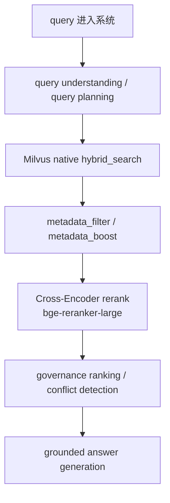

# `bge-reranker-large` 微调实施方案

## 1. 结论

如果当前项目只优先做一项模型微调工作，最值得先做的是：

**先微调 `bge-reranker-large`，不要先微调生成模型。**

原因是：

1. 当前项目已经有比较完整的召回链路；
2. 很多真实 badcase 属于“召回到了，但排序不准”；
3. reranker 微调的收益最容易通过 badcase 回放和 `/eval` 看到。

## 2. 当前项目里为什么优先微调 reranker

当前主链路可以简化成：



reranker 的职责是：

- 对召回后的候选做最后一轮语义判断；
- 决定哪些 chunk 值得进入最终上下文。

## 3. 训练目标

本轮微调目标不是“让模型更会聊天”，而是：

1. 提升正确 chunk 进入 top-3 / top-5 的概率；
2. 降低词面相似但不该排前的 chunk 排名；
3. 提升制度号、设备名、系统名、企业简称场景下的精排质量。

## 4. 数据格式

最推荐的数据格式是 triplet：

```json
{
  "query": "安环部在二矿用安生平台看隐患排查记录怎么查",
  "positive": "在安全生产管理平台中，隐患排查记录查询路径为：隐患治理 -> 排查记录 -> 条件筛选。",
  "negative": "安全环保部主要职责包括组织安全检查、环保监督、事故统计、制度宣贯和专项培训。",
  "negatives": [
    "准东二矿锅炉巡检 SOP 要求巡检前确认水位、压力和燃烧器状态。"
  ]
}
```

当前脚本支持：

- `negative`
- `negatives`

两种写法。

## 5. 样本来源优先级

从高到低建议这样准备：

1. 真实 `/eval` 和线上 badcase
2. 同文档错段落
3. 同业务域错文档
4. 随机负样本

## 6. 资源建议

| 场景 | CPU | RAM | GPU | 存储 |
| --- | --- | --- | --- | --- |
| 最低可跑 | 16 核 | 64GB | 1 x 24GB | 100GB+ |
| 推荐 | 24 核 | 128GB | 1 x 48GB | 500GB+ |

## 7. 训练脚本

训练脚本路径：

- `/Users/zhangzhijin/study/黑马学习/rag/RAG- project/enterprise-rag-platform/train/train_reranker.py`

最小运行样例：

```bash
cd /Users/zhangzhijin/study/黑马学习/rag/RAG-\ project/enterprise-rag-platform

conda run -n tmf_project python train/train_reranker.py \
  --train-path ./train/examples/reranker_train.sample.jsonl \
  --output-dir ./artifacts/reranker-finetuned-demo \
  --epochs 1 \
  --batch-size 2 \
  --max-length 256
```

真实训练命令模板：

```bash
cd /Users/zhangzhijin/study/黑马学习/rag/RAG-\ project/enterprise-rag-platform

conda run -n tmf_project python train/train_reranker.py \
  --model-name ./modes/bge-reranker-large \
  --train-path ./data/train/reranker_train.jsonl \
  --dev-path ./data/train/reranker_dev.jsonl \
  --output-dir ./artifacts/reranker-finetuned-v1 \
  --epochs 2 \
  --batch-size 8 \
  --learning-rate 2e-5 \
  --warmup-ratio 0.1 \
  --max-length 512 \
  --eval-steps 200
```

## 8. 上线方式

训练完成后，先做：

1. 离线 badcase 回放；
2. `/eval` 对比；
3. 再切环境变量：

```env
RERANKER_MODEL_NAME=./artifacts/reranker-finetuned-v1
```

## 9. 最值得看的指标

- `MRR@10`
- `NDCG@10`
- top-3 hit rate
- top-5 hit rate
- 引用正确率
- badcase 数量变化

## 10. 下一步路线

这份方案落地之后，建议继续按这个顺序做：

1. 先训练 `bge-reranker-large`
2. 再跑 `/eval` 和 badcase 回放
3. 如果“召回不到”还是主问题，再做 `bge-m3` 微调
4. 最后再考虑本地生成模型

## 11. 如何从当前项目的 `/eval` 报告自动抽训练样本

如果你现在还没有人工精标的大规模 triplet，最稳的第一步不是手工硬凑训练集，而是：

1. 先跑一版当前系统的 `/eval`
2. 用原始评测集里的 `contexts` 当“参考正例”
3. 用 `/eval` 报告里当前系统召回到但不该命中的 `contexts` 当“弱监督负例”
4. 先训练出第一版 reranker，再用 badcase 回放继续精修

当前仓库已经新增了自动抽样脚本：

- `/Users/zhangzhijin/study/黑马学习/rag/RAG- project/enterprise-rag-platform/train/build_reranker_dataset.py`

### 11.1 自动抽样脚本的输入

脚本默认需要两份输入：

1. `/eval` 产出的 JSON 报告  
   这里会提供每道题当前系统实际拿到的 `contexts`

2. 原始评测集 JSONL  
   默认路径：
   - `./core/evaluation/datasets/enterprise_eval.jsonl`

   这里会提供每道题更可信的参考 `contexts`

### 11.2 自动抽样的核心规则

这版脚本采用的是**弱监督 triplet 构造**，规则比较务实：

1. `question`
   - 直接使用评测题目的 `question`

2. `positive`
   - 优先使用原始评测集里的 `contexts`
   - 如果某题在原始评测集里找不到，再退回 `/eval` 报告里的 `contexts`

3. `negative`
   - 优先使用当前 `/eval` 报告里召回到、但与正例不一致的 `contexts`
   - 如果当前题负例不够，再从其他题的 `contexts` 里补跨题负样本

4. 自动跳过的题
   - `expected_refusal = true`
   - 当前实际 `refusal = true`
   - `question` 为空
   - 正例/负例无法构造

这样生成的数据不等于“人工黄金标注”，但足够做第一轮 reranker 微调，而且非常贴当前系统的真实问题。

### 11.3 先生成第一版训练集

先确保你已经跑过 `/eval`，并拿到一个 JSON 报告，比如：

- `./data/eval_reports/enterprise_eval_latest.json`

然后执行：

```bash
cd /Users/zhangzhijin/study/黑马学习/rag/RAG-\ project/enterprise-rag-platform

conda run -n tmf_project python train/build_reranker_dataset.py \
  --eval-report-path ./data/eval_reports/enterprise_eval_latest.json \
  --dataset-path ./core/evaluation/datasets/enterprise_eval.jsonl \
  --output-path ./data/train/reranker_train.auto.jsonl \
  --negatives-per-query 3
```

如果你想先只抽一小批样本看质量：

```bash
cd /Users/zhangzhijin/study/黑马学习/rag/RAG-\ project/enterprise-rag-platform

conda run -n tmf_project python train/build_reranker_dataset.py \
  --eval-report-path ./data/eval_reports/enterprise_eval_latest.json \
  --dataset-path ./core/evaluation/datasets/enterprise_eval.jsonl \
  --output-path ./data/train/reranker_train.preview.jsonl \
  --negatives-per-query 3 \
  --max-rows 50
```

### 11.4 输出样本长什么样

输出仍然是你当前训练脚本可直接吃的 JSONL：

```json
{
  "query": "安环部在二矿用安生平台看隐患排查记录怎么查",
  "positive": "在安全生产管理平台中，隐患排查记录查询路径为：隐患治理 -> 排查记录 -> 条件筛选。",
  "negative": "安全环保部职责包括组织安全检查、环保监督和事故统计。",
  "negatives": [
    "准东二矿锅炉巡检记录需按班次完成签字确认。"
  ],
  "scenario": "procedure_lookup",
  "tags": [
    "safety",
    "platform"
  ],
  "source": "eval_report"
}
```

### 11.5 再直接接上训练脚本

训练链路现在可以无缝接起来：

```bash
cd /Users/zhangzhijin/study/黑马学习/rag/RAG-\ project/enterprise-rag-platform

conda run -n tmf_project python train/train_reranker.py \
  --model-name ./modes/bge-reranker-large \
  --train-path ./data/train/reranker_train.auto.jsonl \
  --output-dir ./artifacts/reranker-finetuned-v1 \
  --epochs 2 \
  --batch-size 8 \
  --learning-rate 2e-5 \
  --warmup-ratio 0.1 \
  --max-length 512
```

### 11.6 这版自动抽样的边界

要实话说明，这版脚本是“第一轮可落地方案”，不是终态数据工程。

它的主要优点是：

1. 直接复用当前项目已有的 `/eval` 资产
2. 不需要你马上手工标几千条数据
3. 样本非常贴当前系统真实 badcase

它的主要局限是：

1. 正例有一部分来自评测集 `contexts`，不一定是最细粒度 chunk
2. 负例里可能混入“弱负例”，不是特别硬
3. 某些 query 的 `/eval` 报告 `contexts` 太少时，跨题负样本会比较粗

所以最推荐的做法是：

1. 先用这版自动样本训第一轮
2. 再把真实 badcase 和人工确认负样本补进去
3. 后续再做更强的 hard-negative pipeline

### 11.7 下一步最值的增强

如果第一轮效果不错，下一步最值得做的是：

1. 从 `retrieval trace` 中自动抽“命中但排错”的 hard negatives
2. 区分：
   - 同文档错段
   - 同业务域错文档
   - 跨域随机负样本
3. 给训练样本补：
   - `query_scene`
   - `business_domain`
   - `department/site/system`

这样第二轮 reranker 微调会更贴企业场景。

## 12. 先不要盲目开训：先做一次样本质量检查

自动抽样脚本能帮你快速构造第一版训练集，但这不代表拿到文件就应该直接训练。  
更稳的做法是先检查这几个问题：

1. 有没有明显无效行
2. 正例和负例是不是被抽成了同一段文本
3. 同一个 query 有没有被重复灌太多次
4. 负样本是不是太少
5. `scenario / tags / source` 有没有保留下来，方便后续分析

当前仓库已经新增了质量检查脚本：

- `/Users/zhangzhijin/study/黑马学习/rag/RAG- project/enterprise-rag-platform/train/check_reranker_dataset.py`

### 12.1 最小使用方式

```bash
cd /Users/zhangzhijin/study/黑马学习/rag/RAG-\ project/enterprise-rag-platform

conda run -n tmf_project python train/check_reranker_dataset.py \
  --dataset-path ./data/train/reranker_train.auto.jsonl
```

如果你希望把完整检查结果也落盘：

```bash
cd /Users/zhangzhijin/study/黑马学习/rag/RAG-\ project/enterprise-rag-platform

conda run -n tmf_project python train/check_reranker_dataset.py \
  --dataset-path ./data/train/reranker_train.auto.jsonl \
  --report-path ./data/train/reranker_train.auto.report.json
```

### 12.2 你应该重点看哪些指标

这份报告里最值得关注的是：

1. `invalid_rows`
   - 如果这里不为空，说明有样本缺 `query`、缺 `positive` 或完全没有负例

2. `duplicate_positive_negative_rows`
   - 这类样本要优先清掉
   - 因为它会直接破坏训练信号

3. `negative_count_distribution`
   - 如果绝大多数 query 只有 1 个负例，第一轮也能训
   - 但后面想继续提升时，最好增加 hard negatives

4. `top_queries`
   - 用来快速看有没有某几道题被过度重复

5. `top_scenarios / top_tags`
   - 用来判断数据有没有业务偏科

### 12.3 什么样的数据可以直接开第一轮训练

一个比较务实的标准是：

1. `invalid_rows` 尽量为 0
2. `duplicate_positive_negative_rows` 为 0
3. 有效样本至少几百条，最好几千条
4. 负例数量分布不要极端单一
5. 至少保留一部分 `scenario` / `tags`

### 12.4 如果质量不够，先怎么修

如果质量检查结果一般，推荐按下面顺序修：

1. 先删掉无效行和正负例重复行
2. 再限制单个 query 的重复数量
3. 再补更多 hard negatives
4. 最后再考虑扩数据规模

## 13. 训练脚本的参数到底怎么理解

很多时候不是不会跑，而是不知道参数为什么这么设。  
下面这组是当前项目里第一轮最稳的理解方式：

### 13.1 `--batch-size`

- 含义：单卡每步喂多少个 pairwise 样本
- 为什么默认 `8`：
  - `max_length=512` 时，普通 24GB~48GB 显卡通常更容易扛住
- 怎么调：
  - OOM 就先降到 `4` 或 `2`
  - 不要一开始先去调学习率

### 13.2 `--epochs`

- 含义：整批数据重复训练多少轮
- 为什么默认 `2`：
  - 企业第一轮 reranker 微调通常更怕过拟合
  - 先看 `/eval` 和 badcase 是否有明显收益最重要

### 13.3 `--learning-rate`

- 含义：优化器步长
- 为什么默认 `2e-5`：
  - 这是 CrossEncoder 微调里比较稳的常见值
- 风险：
  - 太大容易把基础模型本身的通用排序能力破坏掉

### 13.4 `--warmup-ratio`

- 含义：学习率预热比例
- 为什么默认 `0.1`：
  - 减少训练初期梯度抖动
  - 对小数据集第一轮试训尤其稳

### 13.5 `--max-length`

- 含义：query + chunk 的最大 token 长度
- 为什么默认 `512`：
  - 足够覆盖大多数制度段落、SOP 和平台操作说明
  - 再往上加会明显更吃显存

### 13.6 `--eval-steps`

- 含义：如果提供 dev 集，隔多少 step 评估一次
- 为什么默认 `200`：
  - 对第一轮几千到几万样本规模的训练更务实

## 14. 一条最稳的落地顺序

如果你现在就要照着做，推荐完整顺序是：

1. 跑 `/eval`
2. 用 `build_reranker_dataset.py` 生成第一版训练集
3. 用 `check_reranker_dataset.py` 先做质量检查
4. 再跑 `train_reranker.py`
5. 训练后切新模型
6. 再跑 `/eval` 和 badcase 回放

也就是：

```bash
cd /Users/zhangzhijin/study/黑马学习/rag/RAG-\ project/enterprise-rag-platform

conda run -n tmf_project python train/build_reranker_dataset.py \
  --eval-report-path ./data/eval_reports/enterprise_eval_latest.json \
  --dataset-path ./core/evaluation/datasets/enterprise_eval.jsonl \
  --output-path ./data/train/reranker_train.auto.jsonl \
  --negatives-per-query 3

conda run -n tmf_project python train/check_reranker_dataset.py \
  --dataset-path ./data/train/reranker_train.auto.jsonl \
  --report-path ./data/train/reranker_train.auto.report.json

conda run -n tmf_project python train/train_reranker.py \
  --model-name ./modes/bge-reranker-large \
  --train-path ./data/train/reranker_train.auto.jsonl \
  --output-dir ./artifacts/reranker-finetuned-v1 \
  --epochs 2 \
  --batch-size 8 \
  --learning-rate 2e-5 \
  --warmup-ratio 0.1 \
  --max-length 512
```
