# 项目详解文档

## 1. 文档定位

这份文档面向三类读者：

1. 新加入项目、需要快速建立全局认知的研发同学
2. 需要长期维护与扩展该项目的后端 / AI 工程师
3. 需要做项目交接、技术评审、面试讲解的同学

它不是简单的 README 扩写版，而是一份基于**当前真实代码**整理出来的项目权威说明。阅读这份文档后，你应该能回答下面这些问题：

- 项目的主功能模块有哪些
- 每个功能模块的完整执行链路是什么
- 每条链路里有哪些关键分支、异常路径、边界情况
- 当前项目为什么选用这些技术，而不是其它方案
- 线上问题出现时，应该优先去哪个文件、哪个环节定位

建议阅读顺序：

1. 先看第 2 章“总体架构总览”
2. 再看第 3 章“功能模块详解”
3. 最后看第 4 章“技术点与框架解析”

---

## 2. 总体架构总览

### 2.1 项目一句话定义

这是一个面向企业知识场景的生产级 RAG 系统，目标不是做通用闲聊，而是把企业制度、运维 SOP、项目资料、会议纪要等多源知识，转化为：

- 可检索
- 可引用
- 可控权限
- 可分级出域
- 可评测
- 可审计

的企业知识智能副驾。

### 2.2 总体模块图

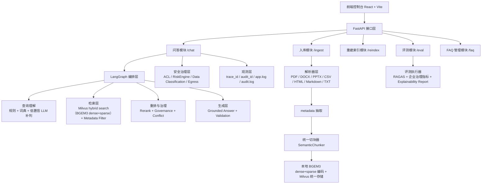

### 2.3 代码分层与职责

| 分层 | 目录 | 主要职责 |
| --- | --- | --- |
| API 层 | `apps/api` | 暴露 HTTP 接口、处理请求/响应、生成 `trace_id` |
| 前端层 | `apps/web` | 调用后端接口、渲染回答、展示 citation / trace / eval 结果 |
| 编排层 | `core/orchestration` | 把问答过程拆成状态图节点并串起来 |
| 检索层 | `core/retrieval` | 稀疏 / 稠密检索、融合、metadata 过滤、重排、FAQ、缓存 |
| 生成层 | `core/generation` | 上下文拼接、出域控制、grounded prompt、回答解析 |
| 入库层 | `core/ingestion` | 文件解析、metadata 抽取、切块、向量化准备 |
| 评测层 | `core/evaluation` | 评测集读取、调用当前 RAG 系统、RAGAS 和治理指标汇总 |
| 观测层 | `core/observability` | 日志、审计、告警、metrics、tracing |
| 运行时层 | `core/services` | 装配索引、检索器、LLM、图实例等运行时依赖 |

### 2.4 当前最重要的三条主线

这份项目最值得反复学习的是三条线：

1. **在线问答主线**
   - `/chat -> LangGraph -> retrieval -> rerank -> generation -> validate`
2. **离线入库主线**
   - `文件 -> parser -> metadata -> chunk -> embedding -> store -> runtime reload`
3. **企业安全与评测主线**
   - `risk -> ACL -> classification -> egress -> audit -> eval -> badcase`

---

## 3. 功能模块详解

## 3.1 问答功能模块

### 3.1.1 功能目标

问答功能不是“把用户问题发给模型”这么简单，它要完成以下任务：

1. 接收问题和用户上下文
2. 判断能不能走 fast path
3. 做 query understanding 和 query planning
4. 在权限、数据分级和风控约束下完成检索
5. 对候选证据进行重排、治理排序和冲突检测
6. 在最小必要上下文原则下生成 grounded answer
7. 返回可解释的引用、风险结果和链路标识

### 3.1.2 问答总链路图

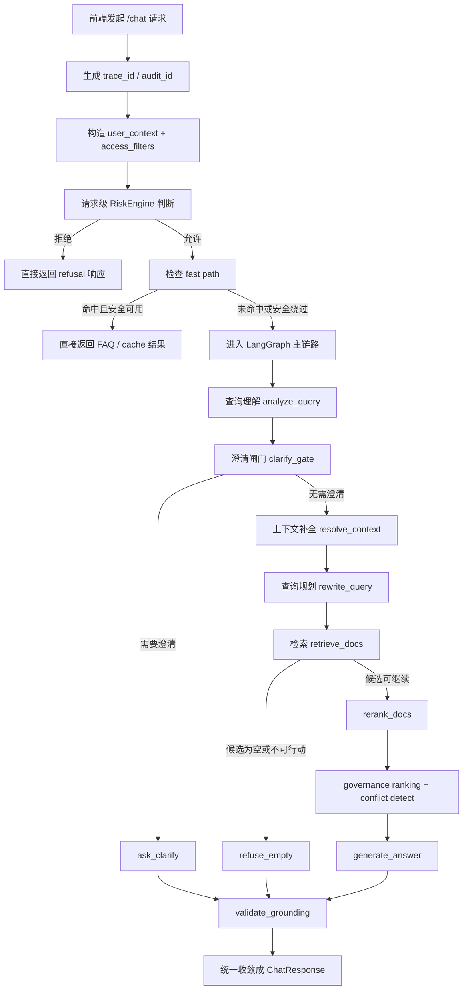

### 3.1.3 真实请求示例

请求体示例：

```json
{
  "question": "安环部在二矿用安生平台看隐患排查记录怎么查？",
  "top_k": 6,
  "stream": false,
  "user_id": "u-10001",
  "department": "安全环保部",
  "role": "engineer",
  "project_ids": ["safety-platform"],
  "clearance_level": "internal"
}
```

这条请求在系统里最开始会被收敛成几类核心状态：

- `trace_id`
- `audit_id`
- `user_context`
- `access_filters`
- `risk_state`

### 3.1.4 第一步：接口入口、链路上下文与请求级风控

对应文件：

- `python /Users/zhangzhijin/study/黑马学习/rag/RAG- project/enterprise-rag-platform/apps/api/routes/chat.py`

关键代码片段：

```python
# 文件路径：apps/api/routes/chat.py
user_context = _build_user_context(body)
access_filters = build_access_filters(user_context, runtime.settings)
audit_id = uuid4().hex
trace_id = getattr(request.state, "trace_id", "")

request_risk_context = build_risk_context(
    stage="request",
    question=body.question,
    audit_id=audit_id,
    user_context=user_context,
    state={"access_filters": access_filters, "trace_id": trace_id},
)
request_risk_decision = safe_evaluate_risk(risk_engine, request_risk_context, runtime.settings)
```

这里做了 4 件事：

1. 从请求体构造企业用户上下文
2. 基于用户上下文构造访问控制过滤条件
3. 为本次请求生成 `audit_id`
4. 在进入图之前先做一轮 request-level 风控判断
5. 当前 request-level 已预留可选的 `ML risk hint` 注入位：
   - 先基于 `question + user_context + session_metadata` 生成 `risk_level_hint`
   - 再交给现有 `RuleBasedRiskEngine` 做最终 `allow / deny / local_only / minimize`
   - 当前第一轮默认关闭，只做 request-level 接入，失败时回退到纯规则模式

#### 生产场景例子

如果问题是：

```text
Q4 人员编制调整预算是多少？
```

并且当前命中了高风险规则，那么系统会在图执行前直接拒答，而不是先去检索再裁掉结果。这样做的好处是：

- 更安全
- 更省算力
- 审计更清晰

### 3.1.5 第二步：fast path 命中或绕过

对应文件：

- `python /Users/zhangzhijin/study/黑马学习/rag/RAG- project/enterprise-rag-platform/core/orchestration/graph.py`
- `python /Users/zhangzhijin/study/黑马学习/rag/RAG- project/enterprise-rag-platform/core/orchestration/fast_path.py`
- `python /Users/zhangzhijin/study/黑马学习/rag/RAG- project/enterprise-rag-platform/apps/api/routes/chat.py`

关键代码片段：

```python
# 文件路径：core/orchestration/graph.py
fast = None
if not disable_fast_path:
    fast = await try_fast_path_answer(runtime, question)
if fast is not None:
    return {
        **fast,
        "conversation_id": conversation_id,
        "history_messages": history_messages or [],
        "user_context": user_context or {},
        "access_filters": access_filters or {},
        **(risk_state or {}),
        "audit_id": audit_id or "",
        "errors": [],
    }
```

当前 fast path 主要来自两类数据：

1. Redis 热点问答缓存
2. MySQL FAQ

但这里有一个重要分支：

- 如果请求携带了企业安全上下文，且当前 FAQ / cache 还没有完全 ACL 化，系统会**主动绕过 fast path**

这是一个很典型的企业工程取舍：

> 宁可少走快路径，也不能因为快路径绕过权限边界。

### 3.1.6 第三步：查询理解与查询规划

对应文件：

- `python /Users/zhangzhijin/study/黑马学习/rag/RAG- project/enterprise-rag-platform/core/orchestration/nodes/analyze_query.py`
- `python /Users/zhangzhijin/study/黑马学习/rag/RAG- project/enterprise-rag-platform/core/orchestration/query_understanding_vocab.py`
- `python /Users/zhangzhijin/study/黑马学习/rag/RAG- project/enterprise-rag-platform/core/orchestration/query_expansion.py`

#### 查询理解拆解图

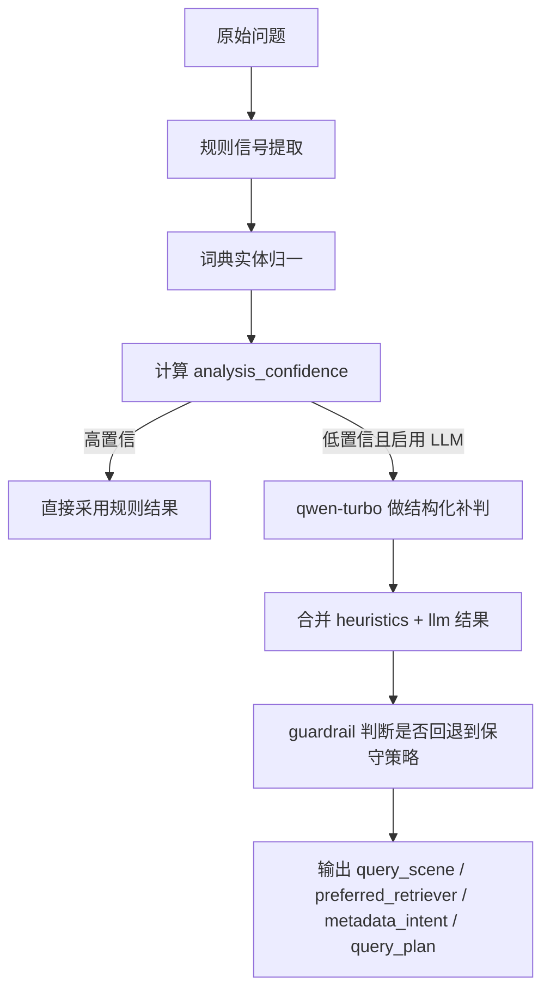

关键代码片段：

```python
# 文件路径：core/orchestration/graph.py
`analyze_signals -> clarify_gate -> resolve_context -> build_query_plan -> retrieve`
```

真实样例问题：

```text
安环部在二矿用安生平台看隐患排查记录怎么查？
```

当前项目大概率会把它理解成：

```json
{
  "query_scene": "procedure_lookup",
  "preferred_retriever": "hybrid",
  "top_k_profile": "balanced",
  "metadata_intent": {
    "department": "安全环保部",
    "owner_department": "安全环保部",
    "plant": "准东二矿",
    "applicable_site": "准东二矿",
    "system_name": "安全生产管理平台",
    "business_domain": "safety_production"
  }
}
```

#### 业务规则说明

当前 query understanding 不是“全靠 LLM 瞎猜”，而是分层做的：

1. 先用规则和词典抓高价值锚点
2. 低置信再用 `qwen-turbo` 补判
3. 实在不稳时回退到保守 hybrid

这样做的原因是：

- 更可控
- 更便宜
- 更适合企业术语和高频结构化 query

### 3.1.7 第四步：检索、融合、ACL 与治理排序

对应文件：

- `python /Users/zhangzhijin/study/黑马学习/rag/RAG- project/enterprise-rag-platform/core/orchestration/nodes/retrieve_docs.py`
- `python /Users/zhangzhijin/study/黑马学习/rag/RAG- project/enterprise-rag-platform/core/retrieval/metadata_filters.py`
- `python /Users/zhangzhijin/study/黑马学习/rag/RAG- project/enterprise-rag-platform/core/retrieval/governance.py`

#### 检索层拆解图

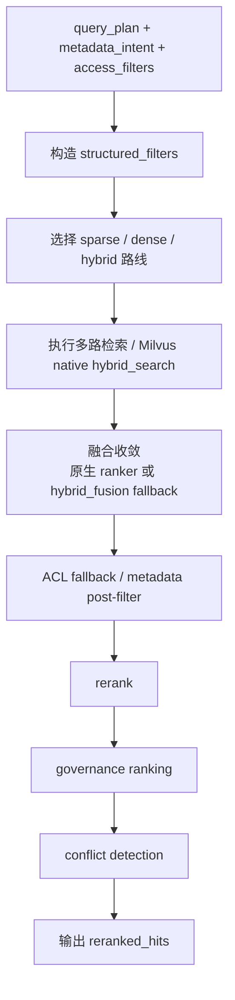

关键代码片段：

```python
# 文件路径：core/orchestration/nodes/retrieve_docs.py
retrieval_filters = _merge_query_filters(
    structured_filters=structured_filters,
    metadata_intent=metadata_intent,
    access_filters=retrieval_acl_filters,
)

sparse = _expand_hits_to_parent_chunks(runtime, sparse_child_hits)
dense = _expand_hits_to_parent_chunks(runtime, dense_child_hits)

fused = runtime.fusion.fuse(
    sparse,
    dense,
    query_scene=str(state.get("query_scene") or ""),
)
```

这里真正发生的不是“搜一下就结束”，而是：

1. 合并 query understanding 产出的 metadata intent
2. 合并用户 ACL 过滤条件
3. 按 query scene 动态选择 sparse / dense / hybrid
4. `MilvusDenseRetriever` 现在会把 `BGEM3` 的 dense 和 sparse 一起写入同一个 collection
5. 当 route 同时需要 sparse + dense 且当前后端可用时，优先直接走 Milvus 原生 `hybrid_search`
6. sparse 召回走 `sparse_embedding` 字段，dense 召回走 `embedding` 字段
7. ranker 默认走 `RRFRanker`，但 `policy_lookup / error_code_lookup / structured_fact_lookup` 会自动切到 `WeightedRanker`
8. `WeightedRanker` 的 sparse 权重还能按 `query_scene` 单独配置
9. 项目上层的 `HybridFusion` 仍然保留，作为非原生路径和测试桩场景的 fallback
10. 检索后再做 ACL fallback、rerank 和治理排序收敛

#### 3.1.7.1 现在 native hybrid search 到底怎么跑

当前真实执行入口在：

- [core/orchestration/nodes/retrieve_docs.py](/Users/zhangzhijin/study/黑马学习/rag/RAG-%20project/enterprise-rag-platform/core/orchestration/nodes/retrieve_docs.py)
- [core/retrieval/milvus_retriever.py](/Users/zhangzhijin/study/黑马学习/rag/RAG-%20project/enterprise-rag-platform/core/retrieval/milvus_retriever.py)
- [core/retrieval/hybrid_fusion.py](/Users/zhangzhijin/study/黑马学习/rag/RAG-%20project/enterprise-rag-platform/core/retrieval/hybrid_fusion.py)

当某个 route 同时需要：

- `use_sparse = True`
- `use_dense = True`

并且当前 backend 是：

- `vector_backend = milvus`
- `retrieval_embedding_backend = bgem3`

系统会优先直接走 `MilvusDenseRetriever.search_hybrid(...)`，而不是先分开搜再上层 fuse。

关键代码示例：

```python
# language: python
# 文件路径：core/orchestration/nodes/retrieve_docs.py
hybrid_search = getattr(runtime.dense, "search_hybrid", None)
if use_sparse and use_dense and callable(hybrid_search):
    native_hits = hybrid_search(
        route_query,
        sparse_top_k=sparse_top_k,
        dense_top_k=dense_top_k,
        top_k=hybrid_top_k,
        filters=retrieval_filters,
        query_scene=str(state.get("query_scene") or ""),
    )
```

这一步的核心含义是：

1. sparse query vector 和 dense query vector 都在 query 时生成。
2. 两路查询一起发给 Milvus。
3. ranker 在 Milvus 内部先完成一次融合。
4. 项目上层再继续做：
   - metadata boost
   - rerank
   - governance

#### 3.1.7.2 `RRFRanker / WeightedRanker` 是怎么选的

当前不是全局写死一种 ranker，而是按 `query_scene` 动态选择。

策略来源：
- [core/retrieval/hybrid_fusion.py](/Users/zhangzhijin/study/黑马学习/rag/RAG-%20project/enterprise-rag-platform/core/retrieval/hybrid_fusion.py)

当前决策逻辑：

1. 默认策略是 `RRF`
2. 如果 `query_scene` 命中：
   - `policy_lookup`
   - `error_code_lookup`
   - `structured_fact_lookup`
   
   就自动切到 `weighted`

3. `weighted` 时，`sparse_weight` 还会按场景单独取值，例如：
   - `policy_lookup: 0.65`
   - `error_code_lookup: 0.75`
   - `structured_fact_lookup: 0.70`

关键代码示例：

```python
# language: python
# 文件路径：core/retrieval/milvus_retriever.py
strategy, sparse_weight = HybridFusion(self._settings).resolve_policy(query_scene=query_scene)
if strategy == "weighted":
    ranker = WeightedRanker(sparse_weight, 1.0 - sparse_weight)
else:
    ranker = RRFRanker()
```

这背后的业务逻辑是：

- `RRF` 更稳，适合大多数普通问题
- `weighted` 更适合强词面锚点问题
- 但不能全局统一 weighted，因为不同 query 类型对 sparse/dense 的依赖程度不同

#### 3.1.7.3 一次真实检索中间态例子

还是用这个问题：

```text
安环部在二矿用安生平台看隐患排查记录怎么查？
```

当前 query understanding 输出可能是：

```json
{
  "query_scene": "procedure_lookup",
  "preferred_retriever": "hybrid",
  "metadata_intent": {
    "department": "安全环保部",
    "plant": "准东二矿",
    "system_name": "安全生产管理平台",
    "business_domain": "safety_production"
  }
}
```

然后 `retrieve_docs` 会构造：

```json
{
  "retrieval_filters": {
    "owner_department": "安全环保部",
    "applicable_site": "准东二矿",
    "system_name": "安全生产管理平台",
    "business_domain": "safety_production",
    "searchable": "true"
  }
}
```

如果当前 route 是双路召回，那么真实执行会更接近：

```text
Milvus hybrid_search(
  reqs=[
    sparse_request(sparse_embedding),
    dense_request(embedding),
  ],
  ranker=RRFRanker(),
  filter=expr
)
```

如果是 `policy_lookup` 这类场景，则会变成：

```text
Milvus hybrid_search(
  reqs=[...],
  ranker=WeightedRanker(0.65, 0.35),
  filter=expr
)
```

#### 3.1.7.4 `metadata_filter` 到底作用在哪

这一层一定要先讲清楚，因为很多人第一次看检索链路时，会把 `metadata_filter` 和 `metadata_boost` 混成一件事。  
它们在当前项目里不是一回事：

- `metadata_filter`：**硬约束**
- `metadata_boost`：**软信号**

`metadata_filter` 的核心作用是：

> 让明显不符合业务范围、权限范围、结构化约束的 chunk，尽量不要进入候选集。

它当前主要作用在两个位置：

1. **召回前 / 召回中**
   - 把可下推的过滤条件转成 Milvus filter expression
   - 直接缩小 Milvus 检索候选面

2. **召回后 fallback**
   - 对于不能完全下推到 Milvus 的字段
   - 或者为了保持过滤语义一致
   - 再做一次上层 `post-filter`

当前真实代码入口：

- [core/retrieval/metadata_filters.py](/Users/zhangzhijin/study/黑马学习/rag/RAG-%20project/enterprise-rag-platform/core/retrieval/metadata_filters.py)
- [core/orchestration/nodes/retrieve_docs.py](/Users/zhangzhijin/study/黑马学习/rag/RAG-%20project/enterprise-rag-platform/core/orchestration/nodes/retrieve_docs.py)

先看 query 侧过滤条件是怎么合并的：

```python
# language: python
# 文件路径：core/orchestration/nodes/retrieve_docs.py
def _merge_query_filters(
    *,
    structured_filters: dict[str, Any],
    metadata_intent: dict[str, Any],
    access_filters: dict[str, Any],
) -> dict[str, Any]:
    """合并 query 侧过滤条件。"""

    merged_query_filters = dict(metadata_intent)
    merged_query_filters.update(structured_filters)
    return _merge_filters(merged_query_filters, access_filters)
```

这里有 3 类来源：

- `metadata_intent`
  - 来自 query understanding
  - 更像“系统推断出来的轻量检索意图”
- `structured_filters`
  - 来自 query planning
  - 更像“显式结构化约束”
- `access_filters`
  - 来自用户身份和 ACL
  - 这部分必须强制叠加，不能被用户 query 覆盖

所以你可以把 `metadata_filter` 理解成：

> 先把 query 理解出的业务约束、用户显式约束和权限约束，收敛成一个统一过滤字典，再拿它去限制检索候选。

---

#### 3.1.7.5 `metadata_filter` 是怎么判断的

这一层的真实逻辑不是“随便做字符串匹配”，而是：

1. **优先走 Milvus 下推**
2. **过滤语义采用“组内 OR，组间 AND”**
3. **post-filter 再用同一套语义做兜底**

关键代码：

```python
# language: python
# 文件路径：core/retrieval/metadata_filters.py
FILTER_OR_GROUPS: dict[str, tuple[str, ...]] = {
    "department_scope": ("department", "owner_department"),
    "site_scope": ("plant", "applicable_site"),
}
```

这段代码非常关键，它决定了当前系统不是简单的：

```text
department == A and owner_department == A and plant == B and applicable_site == B
```

而是：

```text
(department == A or owner_department == A)
and (plant == B or applicable_site == B)
```

也就是：

- **组内 OR**
- **组间 AND**

这样做的原因是：

- 企业文档的同一个业务语义，可能落在不同 metadata 字段
- 如果直接全部 AND，过滤会过严，召回会被误杀

Milvus 下推表达式的构造逻辑：

```python
# language: python
# 文件路径：core/retrieval/metadata_filters.py
def build_milvus_filter_expression(filters: Mapping[str, Any] | None) -> str:
    clauses = ["searchable == true"]
    if not filters:
        return " and ".join(clauses)

    for field_group, values in _grouped_filter_items(filters):
        direct_fields = [key for key in field_group if key in MILVUS_DIRECT_FILTER_FIELDS]
        if not direct_fields:
            continue
        ...
        if len(field_clauses) == 1:
            clauses.append(field_clauses[0])
        else:
            clauses.append("(" + " or ".join(field_clauses) + ")")
    return " and ".join(clauses)
```

这段逻辑的真实含义是：

- 只有 `MILVUS_DIRECT_FILTER_FIELDS` 里的字段，才会被直接下推
- 其余字段不强行拼进 Milvus 表达式，避免 schema 不一致或表达式不可执行
- 所有检索都会自动带上：
  - `searchable == true`

如果下推后仍然需要兜底过滤，当前系统再走：

```python
# language: python
# 文件路径：core/retrieval/metadata_filters.py
def chunk_matches_filters(metadata: ChunkMetadata, filters: Mapping[str, Any] | None) -> bool:
    if not filters:
        return True

    metadata_text = _metadata_text(metadata)
    for field_group, expected_values in _grouped_filter_items(filters):
        matched = False
        actual_values: list[str] = []
        for key in field_group:
            actual_values.extend(_actual_values(_metadata_value(metadata, key)))
        for expected in expected_values:
            expected_norm = _normalize_scalar(expected)
            if not expected_norm:
                continue
            if expected_norm in actual_values:
                matched = True
                break
            if expected_norm in metadata_text:
                matched = True
                break
        if not matched:
            return False
    return True
```

这里要注意两个判断层次：

1. **先做规整后的精确值匹配**
2. **再退化为 metadata 文本子串匹配**

这意味着当前项目的 `metadata_filter` 不是严格数据库式的纯等值判断，而是：

> 在保持结构化优先的前提下，允许少量保守模糊匹配，以提高企业脏数据和历史文档上的鲁棒性。

---

#### 3.1.7.6 `metadata_boost` 到底作用在哪

`metadata_boost` 不负责“卡掉结果”，它负责的是：

> 在候选已经召回出来之后，把更符合 query intent、结构化约束和企业实体命中的 chunk 往前提。

它当前作用的位置是：

- **原生 hybrid_search / fallback fusion 之后**
- **rerank 之前**
- **governance ranking 之前**

当前真实入口：

- [core/orchestration/nodes/retrieve_docs.py](/Users/zhangzhijin/study/黑马学习/rag/RAG-%20project/enterprise-rag-platform/core/orchestration/nodes/retrieve_docs.py)

关键代码：

```python
# language: python
# 文件路径：core/orchestration/nodes/retrieve_docs.py
def _boost_hits_by_metadata(
    hits: list[RetrievedChunk],
    *,
    metadata_intent: dict[str, Any],
    structured_filters: dict[str, Any],
    runtime: RAGRuntime,
) -> list[RetrievedChunk]:
    if not hits:
        return []

    boosted: list[tuple[float, int, RetrievedChunk]] = []
    for index, hit in enumerate(hits):
        base_score = float(hit.score)
        bonus = 0.0
        reasons: list[str] = []
        matched_entity_groups: list[str] = []
        matched_entity_keys: list[str] = []
        for key, value in metadata_intent.items():
            if chunk_matches_filters(hit.metadata, {key: value}):
                bonus += float(runtime.settings.metadata_match_boost)
                reasons.append(f"intent:{key}")
                ...
        for key, value in structured_filters.items():
            if chunk_matches_filters(hit.metadata, {key: value}):
                bonus += float(runtime.settings.structured_filter_boost)
                reasons.append(f"filter:{key}")
        ...
        final_score = base_score + bonus
```

它和 `metadata_filter` 的区别非常重要：

- `metadata_filter`：不符合就尽量别进来
- `metadata_boost`：进来了以后，谁更匹配谁往前排

所以你可以把这两层关系理解成：

```text
filter = 缩小候选范围
boost  = 在候选范围内重排轻提权
```

---

#### 3.1.7.7 `metadata_boost` 具体是怎么判断的

当前 boost 不是一刀切加分，而是拆成了 3 层：

1. `metadata_intent` 命中加分
2. `structured_filters` 命中加分
3. 企业实体组命中加分

其中第 3 层是你当前项目里比较有企业特色的一层。

对应代码里的企业实体组：

```python
# language: python
# 文件路径：core/orchestration/nodes/retrieve_docs.py
_ENTERPRISE_ENTITY_GROUPS = {
    "department": "department",
    "owner_department": "department",
    "plant": "site",
    "applicable_site": "site",
    "system_name": "system",
    "business_domain": "business_domain",
    "process_stage": "process_stage",
    "equipment_type": "equipment",
    "equipment_id": "equipment",
    "project_name": "project",
}
```

这里的关键设计是：

- `department` 和 `owner_department` 算同一个企业语义组
- `plant` 和 `applicable_site` 算同一个企业语义组
- `equipment_type` 和 `equipment_id` 算同一个设备组

为什么要这样做？

因为如果不做组去重，很容易出现这种问题：

```text
同一份文档同时命中 department 和 owner_department
=> 被重复加两次分
=> 排名被人为放大
```

所以现在的逻辑是：

- 同一个组第一次命中时记一次
- 最后统一乘上 `enterprise_entity_match_boost`

当前 trace 里会留下这些字段，方便你排障和 explainability：

- `base_retrieval_score`
- `metadata_boost`
- `enterprise_entity_boost`
- `enterprise_entity_matches`
- `enterprise_entity_matched_keys`
- `metadata_boost_reasons`
- `boosted_retrieval_score`

这也是为什么你后面在：

- citation explainability
- `/eval`
- badcase report

里能看到 `metadata_boosted`、`enterprise_entity_matches` 这些信号。

---

#### 3.1.7.8 一个完整例子：同一个 query 如何先 filter 再 boost

还是用我们前面一直用的真实样例：

```text
安环部在二矿用安生平台看隐患排查记录怎么查？
```

假设 query understanding 得到：

```json
{
  "query_scene": "procedure_lookup",
  "metadata_intent": {
    "department": "安全环保部",
    "plant": "准东二矿",
    "system_name": "安全生产管理平台",
    "business_domain": "safety_production"
  }
}
```

同时当前用户上下文带来：

```json
{
  "access_filters": {
    "owner_department": "安全环保部",
    "applicable_site": "准东二矿",
    "data_classification": "internal"
  }
}
```

那么 `_merge_query_filters(...)` 之后，很可能得到：

```json
{
  "department": "安全环保部",
  "plant": "准东二矿",
  "system_name": "安全生产管理平台",
  "business_domain": "safety_production",
  "owner_department": "安全环保部",
  "applicable_site": "准东二矿",
  "data_classification": "internal"
}
```

再转换成 Milvus filter expression，更接近：

```text
searchable == true
and (department == "安全环保部" or owner_department == "安全环保部")
and (plant == "准东二矿" or applicable_site == "准东二矿")
and system_name == "安全生产管理平台"
and business_domain == "safety_production"
and data_classification == "internal"
```

这一步完成后，候选集已经被明显缩小。  
但系统还不会就此停止，因为候选里仍然可能有多条都满足过滤条件的记录，例如：

- A：制度正文中“隐患排查流程”
- B：系统操作手册中“安生平台查询步骤”
- C：会议纪要里“要求各部门上报隐患排查记录”

这时 `metadata_boost` 就开始发挥作用。

例如某个候选命中：

- `department`
- `plant`
- `system_name`
- `business_domain`

它就会得到：

- `metadata_match_boost`
- 企业实体组 bonus

最终 trace 可能会长成：

```json
{
  "base_retrieval_score": 0.812341,
  "metadata_boost": 0.09,
  "enterprise_entity_boost": 0.03,
  "enterprise_entity_matches": ["department", "site", "system", "business_domain"],
  "metadata_boost_reasons": [
    "intent:department",
    "intent:plant",
    "intent:system_name",
    "intent:business_domain",
    "entity:department",
    "entity:site",
    "entity:system",
    "entity:business_domain"
  ],
  "boosted_retrieval_score": 0.902341
}
```

这条候选接下来再进入：

- rerank
- governance ranking
- conflict detection

所以你要记住：

> `metadata_filter` 决定“哪些结果有资格进来”，  
> `metadata_boost` 决定“进来以后谁更值得排前面”。

---

#### 3.1.7.9 为什么这两层都要有，而不是只保留一层

这是一个很典型的工程取舍点。

如果只有 `metadata_filter`，问题是：

- 过滤条件不能写得太死
- 否则容易把有价值候选误杀

如果只有 `metadata_boost`，问题是：

- 候选范围会太宽
- 大量无关 chunk 会进入 rerank
- 成本、延迟、精度都受影响

所以当前项目才采用了这套更稳的组合：

1. **先 filter**
   - 把明显不应该进来的结果拦掉
2. **再 boost**
   - 在剩余候选里轻量提权
3. **再 rerank**
   - 用 cross-encoder 做更细粒度的语义判断
4. **再 governance**
   - 最后做企业权威性、版本和冲突治理

这也是为什么当前排序链路不是只有一个“大分数”，而是多阶段收敛。

返回结果里的 trace 现在会带：

```json
{
  "retriever": "milvus_hybrid",
  "fusion": "weighted",
  "fusion_strategy": "weighted",
  "fusion_sparse_weight": 0.65,
  "query_scene": "policy_lookup"
}
```

这对 explainability 和 badcase 分析很重要，因为后面你能明确知道：

- 这题是不是 native hybrid 跑的
- 用的是哪种 ranker
- sparse 权重是多少

#### 3.1.7.10 `metadata_filter -> metadata_boost -> rerank -> governance` 四层关系图

如果你想真正读懂当前检索链，最重要的不是只记住有哪些模块，而是记住：

> 这 4 层并不是重复排序，而是在解决 4 个不同的问题。

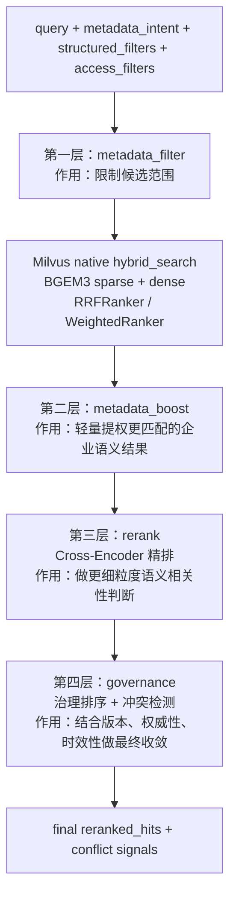

这 4 层各自解决的问题不同：

1. **metadata_filter**
   - 解决“哪些候选不该进来”
   - 本质是候选裁剪

2. **native hybrid_search**
   - 解决“词面相关性 + 语义相关性如何先做第一轮融合”
   - 本质是召回层排序

3. **metadata_boost**
   - 解决“已经进来的候选里，谁更符合企业实体和 query intent”
   - 本质是企业语义轻提权

4. **rerank**
   - 解决“这段证据和问题本身到底是不是最相关”
   - 本质是 query-chunk 对级别的精细判断

5. **governance**
   - 解决“相关不等于该排第一”
   - 本质是企业知识治理排序

这也是为什么当前系统不会只靠一个分数一把梭，而是做多阶段收敛。  
因为在企业知识场景里：

- 相关性
- 权限
- 业务实体匹配
- 版本
- 权威性

这些维度天然不是一回事。

---

#### 3.1.7.11 同一批候选分数是怎么逐层变化的

下面我们用一个更具体的例子来说明。

问题还是：

```text
安环部在二矿用安生平台看隐患排查记录怎么查？
```

假设经过 `metadata_filter` 之后，还剩 3 条候选：

- 候选 A：系统操作手册中的“安生平台隐患排查查询步骤”
- 候选 B：制度文件中的“隐患排查管理要求”
- 候选 C：会议纪要中的“要求各部门上报隐患排查记录”

它们在 4 层里的变化，可能会更接近下面这张表：

| 候选 | metadata_filter 后是否保留 | hybrid_search 初始分 | metadata_boost 后 | rerank 后 | governance 后最终排序 | 说明 |
| --- | --- | ---: | ---: | ---: | ---: | --- |
| A | 保留 | 0.81 | 0.90 | 0.93 | 1 | 同时命中 `department/site/system/business_domain`，且内容是操作步骤，最适合回答“怎么查” |
| B | 保留 | 0.84 | 0.88 | 0.79 | 2 | 制度很权威，但更偏规则说明，不如 A 直接回答操作步骤 |
| C | 保留 | 0.76 | 0.80 | 0.61 | 3 | 会议纪要有相关词，但不是标准操作证据 |

这张表最想说明的是：

1. **A 不一定一开始分最高**
   - 可能制度类文档因为词面更强，初始 hybrid 分数更高

2. **metadata_boost 会把更符合企业实体和 query intent 的结果往前抬**
   - 这里 A 命中了：
     - `department`
     - `plant`
     - `system_name`
     - `business_domain`

3. **rerank 会进一步放大“这条证据是不是最能回答问题”**
   - A 是“怎么查”的具体步骤
   - B 是“应该做什么”的制度要求
   - C 是“开会怎么要求”的纪要记录

4. **governance 最后不是简单重复 rerank**
   - 它会看：
     - `authority_level`
     - `effective_date`
     - `version`
     - `status`
   - 如果 A 和 B 在 rerank 后接近，治理排序还可能再做一次企业规则收敛

再结合 trace 字段看，就更容易理解了。

例如候选 A 在不同阶段可能带出：

```json
{
  "retriever": "milvus_hybrid",
  "fusion_strategy": "rrf",
  "base_retrieval_score": 0.812341,
  "metadata_boost": 0.09,
  "enterprise_entity_boost": 0.03,
  "boosted_retrieval_score": 0.902341,
  "semantic_score": 0.931552,
  "governance_rank_score": 0.964201
}
```

这些字段不要孤立看。更好的理解方式是：

- `base_retrieval_score`
  - 召回层分数
- `boosted_retrieval_score`
  - 加入企业 metadata 提权后的分数
- `semantic_score`
  - rerank 后的语义相关性强度
- `governance_rank_score`
  - 企业治理排序后的最终收敛分数

所以从工程视角看，这条链路其实是在不断回答 4 个问题：

1. **你有没有资格进入候选集**
2. **你在召回层是不是靠前**
3. **你是不是更符合当前企业语义上下文**
4. **你在企业知识治理规则下是不是应该最终排前**

这也是你后面做 badcase 分析时，不能只看“这条 chunk 分数低了”，而要看：

- 是 filter 过严了
- 是 boost 没生效
- 是 rerank 判断不准
- 还是 governance 把它压下去了

---

#### 3.1.7.12 同一个 query 从 `metadata_intent` 到 `retrieval_filters` 是怎么变化的

如果你现在还会把下面这 4 个概念混在一起，这是正常的：

- `metadata_intent`
- `structured_filters`
- `access_filters`
- `retrieval_filters`

它们名字都像“过滤条件”，但在当前项目里职责并不一样。

最稳的理解方式是：

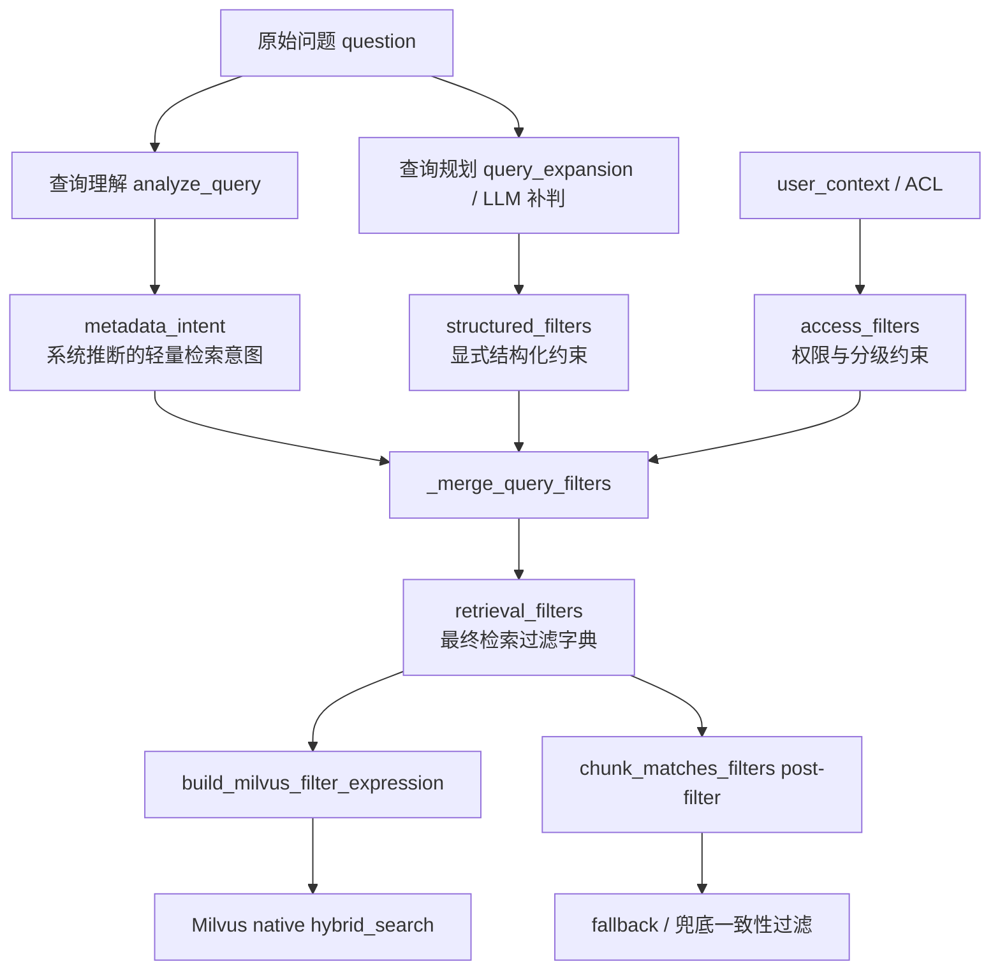

这张图里，最关键的是要记住：

1. `metadata_intent`
   - 是系统从 query 理解阶段推断出来的“轻量业务意图”
   - 它不一定代表用户显式说出来的硬条件

2. `structured_filters`
   - 是 query planning 或 LLM 补判后提炼出的更明确结构化条件
   - 它比 `metadata_intent` 更像“用户这题真的要按这个条件检索”

3. `access_filters`
   - 来自权限、部门、项目组、数据分级
   - 它不是优化建议，而是必须遵守的约束

4. `retrieval_filters`
   - 不是新的来源
   - 只是这三类条件最终合并后的结果

所以如果你想一句话记住：

> `metadata_intent` 更像系统推断，  
> `structured_filters` 更像显式约束，  
> `access_filters` 更像权限底线，  
> `retrieval_filters` 则是最终真正喂给检索器的统一过滤字典。

关键代码就是这段：

```python
# language: python
# 文件路径：core/orchestration/nodes/retrieve_docs.py
structured_filters = _clean_filters(state.get("structured_filters"))
metadata_intent = _clean_filters(
    state.get("metadata_intent") or strategy_signals.get("metadata_intent")
)
access_filters = _clean_filters(state.get("access_filters"))
retrieval_acl_filters = {}
if getattr(runtime.settings, "enable_acl", False):
    retrieval_acl_filters = _clean_filters(build_retrieval_acl_filters(access_filters))
retrieval_filters = _merge_query_filters(
    structured_filters=structured_filters,
    metadata_intent=metadata_intent,
    access_filters=retrieval_acl_filters,
)
```

这里有两个很容易忽略的细节：

1. `metadata_intent` 会先进入最终过滤字典  
   这意味着 query understanding 的结果不只是展示字段，而是会真实影响检索。

2. `access_filters` 不会直接原样拼进去  
   而是先经过：
   - `build_retrieval_acl_filters(...)`
   
   也就是说，权限上下文会先被规整成适合检索层理解的过滤约束。

---

#### 3.1.7.13 一个完整状态演化例子：这 4 个字段到底怎么一步步长出来

我们继续用同一个问题：

```text
安环部在二矿用安生平台看隐患排查记录怎么查？
```

假设当前用户上下文是：

```json
{
  "user_id": "u-1001",
  "department": "安全环保部",
  "role": "engineer",
  "project_ids": ["safety-platform"],
  "clearance_level": "internal"
}
```

第一步，`analyze_query` 先产出 `metadata_intent`：

```json
{
  "department": "安全环保部",
  "plant": "准东二矿",
  "system_name": "安全生产管理平台",
  "business_domain": "safety_production"
}
```

这里它表达的是：

- 这题大概率和哪个部门相关
- 大概率落在哪个场站
- 大概率和哪个系统相关
- 大概率属于哪个业务域

注意，这一步不是严格约束，而更像：

> “我推断这题更应该往这个业务空间里搜。”

第二步，query planning 或 LLM 补判后，可能产出 `structured_filters`：

```json
{
  "system_name": "安全生产管理平台",
  "business_domain": "safety_production"
}
```

这里和 `metadata_intent` 的差异在于：

- `metadata_intent` 可能更宽、更像 hint
- `structured_filters` 更像“这题明确要按这个结构化条件找”

第三步，用户 ACL / 分级会产生 `access_filters`，例如：

```json
{
  "department": "安全环保部",
  "applicable_site": ["准东二矿"],
  "data_classification": ["internal"]
}
```

这一步的本质不是“提高准确率”，而是：

> 保证系统不会把用户无权访问的文档也纳入候选集。

第四步，`build_retrieval_acl_filters(...)` 会把权限相关条件规整成检索层更容易执行的字段形式。  
最终 `_merge_query_filters(...)` 之后，`retrieval_filters` 会更接近：

```json
{
  "department": "安全环保部",
  "plant": "准东二矿",
  "system_name": "安全生产管理平台",
  "business_domain": "safety_production",
  "applicable_site": ["准东二矿"],
  "data_classification": ["internal"]
}
```

这时你就会发现：

- `metadata_intent` 里的 `plant`
- `access_filters` 里的 `applicable_site`

虽然字段名不同，但进入 `metadata_filter` 后会按：

- 同义实体组
- 组内 OR

统一理解。

所以最后进 Milvus 的 filter expression 不是简单重复，而更接近：

```text
searchable == true
and (plant == "准东二矿" or applicable_site in ["准东二矿"])
and (department == "安全环保部" or owner_department == "安全环保部")
and system_name == "安全生产管理平台"
and business_domain == "safety_production"
and data_classification in ["internal"]
```

这也是为什么当前链路不会因为字段名不同就互相打架。  
系统先做了一次“状态收敛”，再做真正的检索。

如果你想再进一步理解这 4 个字段之间的关系，可以把它们记成下面这张表：

| 字段 | 产生阶段 | 主要来源 | 强弱属性 | 在当前系统中的作用 |
| --- | --- | --- | --- | --- |
| `metadata_intent` | query understanding | 规则、词典、LLM 补判 | 偏软 | 给检索提供业务语义 hint，也参与 boost |
| `structured_filters` | query planning | 显式结构化抽取 | 偏硬 | 更明确地约束检索范围，也参与 boost |
| `access_filters` | user_context / ACL | 用户身份、部门、项目组、分级 | 最硬 | 保证权限和分级约束前置生效 |
| `retrieval_filters` | retrieve_docs | 上面三者合并 | 最终执行态 | 真正送进 Milvus 和 post-filter 的统一过滤字典 |

所以这 4 个概念不是同义词，而是一条逐步收敛的状态链。

---

#### 3.1.7.14 `retrieval trace` 字段对照表：每个字段是谁写进去的

当你开始排 badcase 时，最有价值的不是只看最终回答，而是看每条候选证据在 `trace` 里到底留下了什么信息。

当前项目里，`trace` 的核心载体是：

```python
# language: python
# 文件路径：core/retrieval/schemas.py
class RetrievedChunk(BaseModel):
    chunk_id: str
    score: float
    content: str
    metadata: ChunkMetadata
    trace: dict[str, Any] = Field(
        default_factory=dict,
        description="检索链路 trace，用于记录 route、boost、治理排序等调试信息",
    )
```

也就是说：

> `trace` 不是日志系统，也不是审计系统，  
> 它更像“单条候选证据在检索链路里的过程说明书”。

下面这张表是当前最常用、最值得记住的一批字段。

| 字段 | 主要写入位置 | 所属阶段 | 中文含义 | 排障时怎么理解 |
| --- | --- | --- | --- | --- |
| `retriever` | `MilvusDenseRetriever.search / search_sparse / search_hybrid` | 召回层 | 当前命中来自哪种检索器 | 看它是 `milvus_dense`、`milvus_sparse` 还是 `milvus_hybrid` |
| `fusion` | 检索召回或融合阶段 | 召回层 | 当前使用的融合方式标签 | 常见值如 `rrf`、`weighted` |
| `fusion_strategy` | native hybrid / fallback fusion | 召回层 | 实际采用的融合策略 | 判断这题最终走的是 `RRF` 还是 `weighted` |
| `fusion_sparse_weight` | native hybrid / fallback fusion | 召回层 | 当前 weighted 融合中 sparse 的权重 | 判断词面侧到底占多大比重 |
| `query_scene` | query understanding -> retrieval | 查询理解 / 召回衔接 | 当前问题场景分类 | 解释为什么会切某种 ranker |
| `query_route` | `_annotate_hits(...)` | route 层 | 候选来自哪一路 query | 例如 `original`、`rewrite`、`keyword_1` |
| `query_route_kind` | `_annotate_hits(...)` | route 层 | route 的类别 | 如 `direct_query`、`keyword`、`sub_query` |
| `query_text` | `_annotate_hits(...)` | route 层 | 实际送去检索的 query 文本截断版 | 看 rewrite / resolved / keyword 有没有改歪 |
| `structured_filters` | `_annotate_hits(...)` | 召回层 | 当前 route 带了哪些显式结构化过滤条件 | 判断是不是 query planning 提了约束 |
| `access_filters` | `_annotate_hits(...)` | 召回层 | 当前 route 上附带了哪些访问控制上下文 | 判断 ACL 是否真的进入检索链 |
| `acl_applied` | `_filter_accessible_hits(...)` | ACL fallback | 是否执行过 ACL 兜底过滤 | `true` 说明这条结果经过权限兜底检查 |
| `data_classification` | `_filter_accessible_hits(...)` | ACL / 分级 | 当前候选的数据分级 | 和 `model_route`、`egress` 联动看 |
| `base_retrieval_score` | `_boost_hits_by_metadata(...)` | boost 前 | metadata boost 之前的检索分 | 对比 boost 后分数变化 |
| `metadata_boost` | `_boost_hits_by_metadata(...)` | boost 层 | metadata 总加分 | 看 metadata 提权是不是生效 |
| `enterprise_entity_boost` | `_boost_hits_by_metadata(...)` | boost 层 | 企业实体组带来的额外加分 | 看部门/场站/系统等归一是否真起作用 |
| `enterprise_entity_matches` | `_boost_hits_by_metadata(...)` | boost 层 | 命中的企业实体组 | 常见如 `department`、`site`、`system` |
| `enterprise_entity_matched_keys` | `_boost_hits_by_metadata(...)` | boost 层 | 命中的具体字段键 | 比如 `department`、`plant`、`system_name` |
| `metadata_boost_reasons` | `_boost_hits_by_metadata(...)` | boost 层 | 为什么被加分 | 常见如 `intent:department`、`entity:site` |
| `boosted_retrieval_score` | `_boost_hits_by_metadata(...)` | boost 后 | metadata boost 之后的分数 | 用来观察 boost 对排序的真实影响 |
| `matched_routes` | `_merge_hits_by_chunk / _expand_hits_to_parent_chunks` | route 聚合 | 这条最终候选被哪些 route 命中过 | 看多路 query 是否真的起作用 |
| `matched_route_kinds` | 同上 | route 聚合 | 命中的 route 类型集合 | 看是 keyword 命中还是 rewrite 命中 |
| `matched_route_count` | 同上 | route 聚合 | 命中的 route 数量 | route 越多通常说明证据更稳 |
| `matched_child_chunk_ids` | `_expand_hits_to_parent_chunks(...)` | parent/child 回扩 | 当前 parent 由哪些 child 命中过 | 帮助解释 parent 为什么被选中 |
| `matched_child_count` | `_expand_hits_to_parent_chunks(...)` | parent/child 回扩 | 命中 child 数量 | 看 parent 的支持证据是否足够多 |
| `expanded_to_parent` | `_expand_hits_to_parent_chunks(...)` | parent/child 回扩 | 是否做了 child -> parent 回扩 | `true` 说明最终不是原始 child 直接回答 |
| `rerank_candidate_limit` | `rerank_docs_node(...)` | rerank 层 | 进入 rerank 的候选上限 | 看 rerank 前裁剪是不是太狠 |
| `rerank_input_size` | `rerank_docs_node(...)` | rerank 层 | rerank 前候选总数 | 对比最终 top_n 看压缩比例 |
| `semantic_score` | `apply_governance_ranking(...)` | governance 前 | rerank 后的语义相关性分 | governance 是在这个分上再做治理加成 |
| `governance_bonus` | `apply_governance_ranking(...)` | governance 层 | 治理加成总分 | 看版本/权威性/日期是否改变排序 |
| `governance_rank_score` | `apply_governance_ranking(...)` | governance 后 | 治理排序后的最终分数 | 真正决定治理后顺序的核心分 |
| `authority_level` | `apply_governance_ranking(...)` | governance 层 | 当前文档权威级别 | 解释为什么某份制度更靠前 |
| `effective_date` | `apply_governance_ranking(...)` | governance 层 | 当前文档生效日期 | 解释为什么新版本更靠前 |
| `version` | `apply_governance_ranking(...)` | governance 层 | 当前文档版本号 | 解释冲突与版本优先 |

如果你只想先记最重要的 8 个字段，我建议优先记：

- `retriever`
- `fusion_strategy`
- `query_scene`
- `metadata_boost`
- `enterprise_entity_matches`
- `matched_routes`
- `semantic_score`
- `governance_rank_score`

这 8 个已经足够覆盖大多数 badcase 分析。

---

#### 3.1.7.15 这些 trace 字段分别在哪一层写进去

为了避免你把 trace 理解成“某个地方一次性写完的大 JSON”，这里再把写入过程按阶段拆开。

##### 第一层：召回与 route 标注

对应代码在：

- [core/orchestration/nodes/retrieve_docs.py](/Users/zhangzhijin/study/黑马学习/rag/RAG-%20project/enterprise-rag-platform/core/orchestration/nodes/retrieve_docs.py)

最早一批字段，是在候选刚被召回并注入 route 信息时写进去的：

```python
# language: python
# 文件路径：core/orchestration/nodes/retrieve_docs.py
trace["query_route"] = route_name
trace["query_route_kind"] = route_kind
trace["query_text"] = route_query[:256]
trace["structured_filters"] = structured_filters
trace["access_filters"] = access_filters
```

这一层的作用是：

- 记录这条候选是怎么被搜出来的
- 记录它在当时带了哪些 query 级约束

也就是说，这一层主要回答：

> “这条结果是从哪一路进来的？”

##### 第二层：ACL / metadata boost

还是在 [core/orchestration/nodes/retrieve_docs.py](/Users/zhangzhijin/study/黑马学习/rag/RAG-%20project/enterprise-rag-platform/core/orchestration/nodes/retrieve_docs.py) 里，后续会继续追加：

```python
# language: python
# 文件路径：core/orchestration/nodes/retrieve_docs.py
trace["acl_applied"] = True
trace["data_classification"] = hit.metadata.extra.get("data_classification", ...)
...
trace["base_retrieval_score"] = round(base_score, 6)
trace["metadata_boost"] = round(bonus, 6)
trace["enterprise_entity_boost"] = round(entity_bonus, 6)
trace["enterprise_entity_matches"] = matched_entity_groups
trace["metadata_boost_reasons"] = reasons
trace["boosted_retrieval_score"] = round(final_score, 6)
```

这一层主要回答：

> “这条结果有没有经过 ACL 兜底？”  
> “它为什么被 metadata 提权了？”

##### 第三层：route 聚合与 parent 回扩

当前项目支持：

- 多 route 命中合并
- child -> parent 回扩

所以 trace 还会继续补：

```python
# language: python
# 文件路径：core/orchestration/nodes/retrieve_docs.py
trace["matched_routes"] = route_map.get(cid, [])
trace["matched_route_kinds"] = kind_map.get(cid, [])
trace["matched_route_count"] = len(route_map.get(cid, []))
...
trace["expanded_to_parent"] = parent_id != hit.chunk_id
trace["matched_child_chunk_ids"] = child_ids_map.get(parent_id, [])
trace["matched_child_count"] = len(child_ids_map.get(parent_id, []))
```

这一层主要回答：

> “这条最终候选到底是单路命中的，还是多路共同支撑的？”  
> “它是不是 parent 回扩上来的？”

##### 第四层：rerank 与 governance

对应代码在：

- [core/orchestration/nodes/rerank_docs.py](/Users/zhangzhijin/study/黑马学习/rag/RAG-%20project/enterprise-rag-platform/core/orchestration/nodes/rerank_docs.py)
- [core/retrieval/governance.py](/Users/zhangzhijin/study/黑马学习/rag/RAG-%20project/enterprise-rag-platform/core/retrieval/governance.py)

先在 rerank 节点里追加：

```python
# language: python
# 文件路径：core/orchestration/nodes/rerank_docs.py
trace["rerank_candidate_limit"] = candidate_limit
trace["rerank_input_size"] = len(fused)
```

再在治理排序里追加：

```python
# language: python
# 文件路径：core/retrieval/governance.py
trace["semantic_score"] = hit.score
trace["governance_bonus"] = round(governance_bonus, 6)
trace["governance_rank_score"] = round(hit.score + governance_bonus, 6)
trace["authority_level"] = hit.metadata.extra_text("authority_level")
trace["effective_date"] = hit.metadata.extra_text("effective_date")
trace["version"] = hit.metadata.extra_text("version")
```

这一层主要回答：

> “这条候选在 rerank 后语义上到底多相关？”  
> “治理排序有没有把它抬上来或压下去？”

---

#### 3.1.7.16 一份带中文注释的示例 trace

下面给一份更接近真实项目的 trace 示例，并直接在字段旁边加中文解释。

```json
{
  "retriever": "milvus_hybrid",
  "fusion_strategy": "rrf",
  "fusion_sparse_weight": 0.5,
  "query_scene": "procedure_lookup",
  "query_route": "original",
  "query_route_kind": "direct_query",
  "query_text": "安环部在二矿用安生平台看隐患排查记录怎么查？",
  "structured_filters": {
    "system_name": "安全生产管理平台",
    "business_domain": "safety_production"
  },
  "access_filters": {
    "department": "安全环保部",
    "applicable_site": ["准东二矿"],
    "data_classification": ["internal"]
  },
  "acl_applied": true,
  "data_classification": "internal",
  "base_retrieval_score": 0.812341,
  "metadata_boost": 0.09,
  "enterprise_entity_boost": 0.03,
  "enterprise_entity_matches": ["department", "site", "system", "business_domain"],
  "enterprise_entity_matched_keys": ["department", "plant", "system_name", "business_domain"],
  "metadata_boost_reasons": [
    "intent:department",
    "intent:plant",
    "intent:system_name",
    "intent:business_domain",
    "entity:department",
    "entity:site",
    "entity:system",
    "entity:business_domain"
  ],
  "boosted_retrieval_score": 0.902341,
  "matched_routes": ["original", "keyword_1"],
  "matched_route_kinds": ["direct_query", "keyword"],
  "matched_route_count": 2,
  "expanded_to_parent": true,
  "matched_child_chunk_ids": [
    "doc-001:child:0003",
    "doc-001:child:0004"
  ],
  "matched_child_count": 2,
  "rerank_candidate_limit": 8,
  "rerank_input_size": 14,
  "semantic_score": 0.931552,
  "governance_bonus": 0.032649,
  "governance_rank_score": 0.964201,
  "authority_level": "high",
  "effective_date": "2026-01-01",
  "version": "V3.2"
}
```

如果把这份 trace 用中文分层解释，可以读成：

- `retriever / fusion_strategy / query_scene`
  - 说明这条结果是怎么被召回出来的

- `query_route / query_route_kind / query_text`
  - 说明是哪个 query route 把它找出来的

- `structured_filters / access_filters / acl_applied`
  - 说明这条结果是否真的处在正确的业务过滤和权限过滤范围内

- `base_retrieval_score / metadata_boost / boosted_retrieval_score`
  - 说明 metadata 提权有没有真正改变排序

- `enterprise_entity_matches / metadata_boost_reasons`
  - 说明到底是哪些企业实体和业务意图触发了提权

- `matched_routes / matched_child_chunk_ids / expanded_to_parent`
  - 说明这条最终证据是不是被多路共同支撑，是不是 parent 回扩上来的

- `semantic_score / governance_rank_score`
  - 说明这条结果在语义层和治理层分别处于什么水平

所以这份 trace 最重要的价值不是“记录很多字段”，而是：

> 让你能沿着一条证据回放：  
> 它是怎么被找出来的，为什么被提权，为什么排到前面，最后为什么被系统采用。

---

#### 生产场景例子

同样的问题：

```text
安环部在二矿用安生平台看隐患排查记录怎么查？
```

检索中间态可能长这样：

```json
{
  "sparse_hits": 8,
  "dense_hits": 10,
  "fused_hits": 9,
  "accessible_hits": 6,
  "final_reranked_hits": 4,
  "data_classification": "internal",
  "model_route": "external_allowed"
}
```

这里最值得学习的点是：

- 检索不是一步
- 权限不是生成后裁掉
- 企业 metadata 不只是展示字段，而是真正参与过滤和排序

### 3.1.8 第五步：生成前安全控制、grounded answer 与校验

对应文件：

- `python /Users/zhangzhijin/study/黑马学习/rag/RAG- project/enterprise-rag-platform/core/orchestration/nodes/generate_answer.py`
- `python /Users/zhangzhijin/study/黑马学习/rag/RAG- project/enterprise-rag-platform/core/generation/egress_policy.py`
- `python /Users/zhangzhijin/study/黑马学习/rag/RAG- project/enterprise-rag-platform/core/generation/answer_builder.py`

#### 生成层拆解图

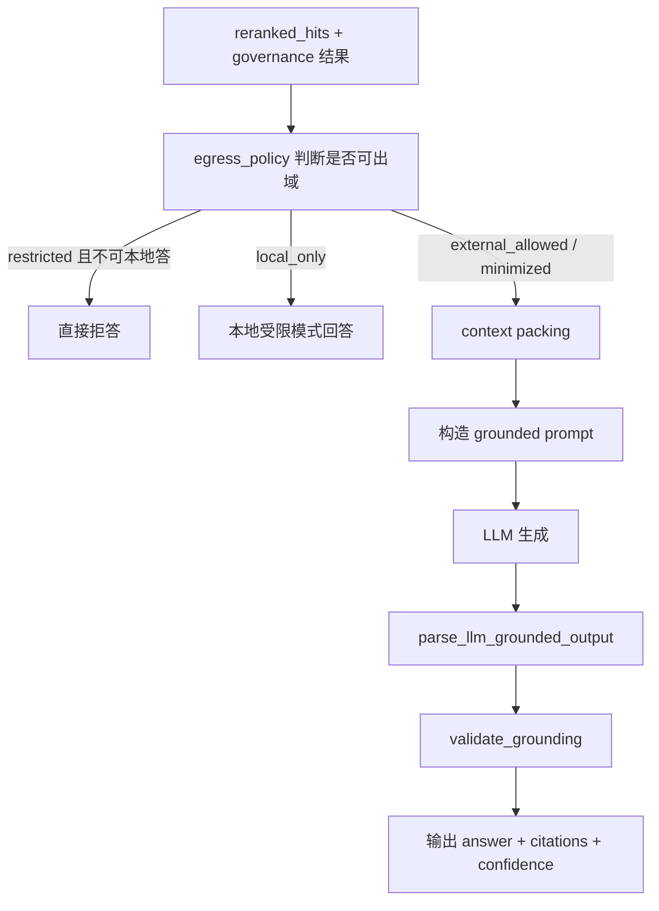

关键代码片段：

```python
# 文件路径：core/orchestration/nodes/generate_answer.py
# 核心语义：先做出域策略，再决定真正怎么生成
prepare_contexts_for_generation(...)
format_context_blocks(...)
parse_llm_grounded_output(...)
```

#### 边界与异常

这里至少有 4 类不同分支：

1. `restricted` 且没有本地执行能力 -> 拒答
2. `local_only` -> 本地受限模式回答
3. `internal / sensitive` -> 脱敏或最小上下文出域
4. `public / internal` -> 正常 grounded generation

#### 一个真实响应示例

```json
{
  "answer": "进入隐患管理菜单后选择“隐患排查记录查询”，可按场站和责任部门筛选。",
  "confidence": 0.83,
  "reasoning_summary": "系统命中了操作手册中的流程章节。",
  "citations": [
    {
      "chunk_id": "child-001",
      "title": "安全生产管理平台操作手册",
      "section_path": "安全生产管理平台操作手册 / 隐患排查记录查询",
      "selection_reason": "命中 original / keyword_1 检索路线，且流程型章节匹配。"
    }
  ],
  "refusal": false,
  "data_classification": "internal",
  "model_route": "external_allowed",
  "trace_id": "7ef3...",
  "audit_id": "2b87..."
}
```

### 3.1.9 为什么问答功能这样设计

当前这套设计的目标不是“让链路看起来高级”，而是同时平衡这 5 个目标：

1. 检索质量
2. 生成稳定性
3. 权限与风控
4. 可解释性
5. 可维护性

这也是为什么项目没有一上来就做成：

- 纯 LLM 决策
- 纯向量检索
- 单模型全链路
- 生成后裁权限

### 3.1.10 问答主链路的常见 badcase、误解与排障入口

#### 常见 badcase

1. **检索命中了正确文档，但最终答案还是偏**
   - 常见原因：
     - rerank 候选被裁得太小
     - governance 把正确证据压下去了
     - context packing 过于激进
2. **明明文档里有答案，却走了 refusal**
   - 常见原因：
     - metadata filter / ACL 过严
     - query understanding 把场景识别错了
     - egress policy 把本可外部回答的问题挡掉了
3. **citation 有，但 selection_reason 很弱**
   - 常见原因：
     - trace 在 retrieval / fusion / governance 阶段没带全

#### 常见误解

1. **误解：问答主链就是 `/chat -> LLM`**
   - 实际上还包括：
     - query understanding
     - hybrid retrieval
     - rerank
     - governance
     - egress
     - grounded parsing
2. **误解：Milvus native hybrid_search 已经做完全部排序**
   - 实际上 Milvus 只负责召回层融合；项目上层还要继续做 rerank 和 governance。
3. **误解：权限控制是在生成后裁掉**
   - 当前项目设计是尽量在请求级、检索级和出域级前置。

#### 排障入口

建议优先按这个顺序查：

1. [apps/api/routes/chat.py](/Users/zhangzhijin/study/黑马学习/rag/RAG-%20project/enterprise-rag-platform/apps/api/routes/chat.py)
2. [core/orchestration/nodes/analyze_query.py](/Users/zhangzhijin/study/黑马学习/rag/RAG-%20project/enterprise-rag-platform/core/orchestration/nodes/analyze_query.py)
3. [core/orchestration/nodes/retrieve_docs.py](/Users/zhangzhijin/study/黑马学习/rag/RAG-%20project/enterprise-rag-platform/core/orchestration/nodes/retrieve_docs.py)
4. [core/orchestration/nodes/generate_answer.py](/Users/zhangzhijin/study/黑马学习/rag/RAG-%20project/enterprise-rag-platform/core/orchestration/nodes/generate_answer.py)

先查日志：

```bash
grep "你的 trace_id" logs/app.log
grep "你的 trace_id" logs/audit.log
```

---

## 3.2 流式问答功能模块

### 3.2.1 功能目标

流式问答的目标不是单纯“逐字显示答案”，而是：

1. 先把检索和安全语义稳定下来
2. 再按 NDJSON 把 token 流给前端
3. 保证流式与非流式在关键字段上尽量一致

### 3.2.2 流式总链路图

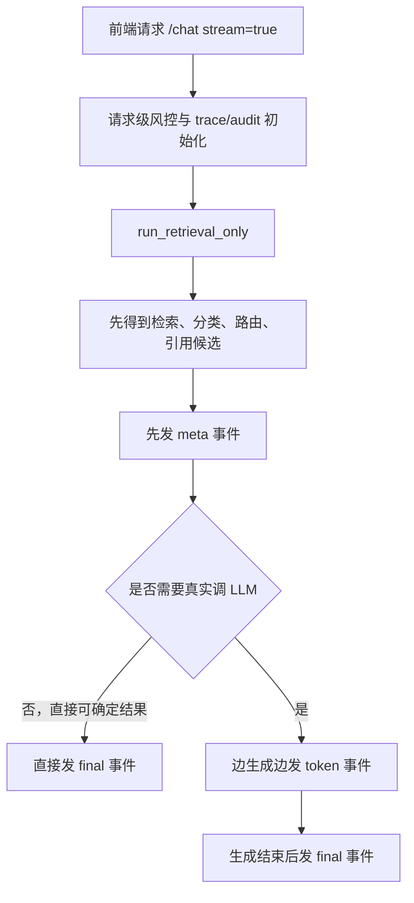

### 3.2.3 为什么流式单独走 retrieval-only

对应文件：

- `python /Users/zhangzhijin/study/黑马学习/rag/RAG- project/enterprise-rag-platform/core/orchestration/retrieval_pipeline.py`
- `python /Users/zhangzhijin/study/黑马学习/rag/RAG- project/enterprise-rag-platform/apps/api/routes/chat.py`

原因很现实：

1. 前端需要尽快知道“有没有命中、有无引用、安全字段是什么”
2. 如果一上来就等整条图跑完，流式体验就会变差
3. 先拿到 retrieval 结果，还能提前决定后面是否要真的走 LLM

### 3.2.4 流式事件格式

当前流式事件分三类：

1. `meta`
2. `token`
3. `final`

示例：

```json
{"type":"meta","audit_id":"a1","trace_id":"t1","data_classification":"internal","model_route":"external_allowed"}
{"type":"token","delta":"进入隐患管理菜单后"}
{"type":"final","answer":"进入隐患管理菜单后选择隐患排查记录查询。","citations":[...]}
```

### 3.2.5 边界情况

流式模式并不一定都会发 `token`：

- 如果 request-level risk 就拒绝了，直接 `final`
- 如果 fast path 命中且能确定结果，直接 `final`
- 如果 local fallback 直接给稳定答案，也可能少量或不发 `token`

---

## 3.3 FAQ 与快速路径模块

### 3.3.1 功能目标

FAQ 模块解决的是：

- 高频、稳定、结构化问题，不必每次都走完整 RAG 主链路

### 3.3.2 FAQ 总链路图

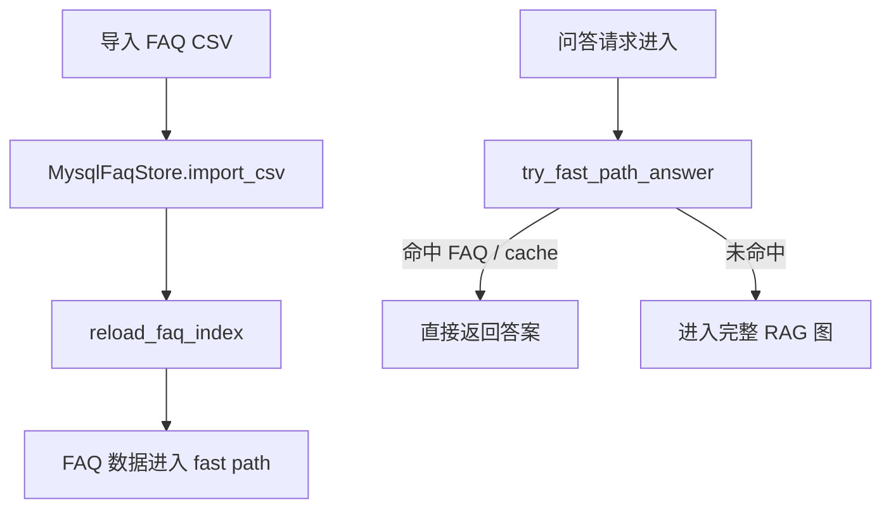

### 3.3.3 管理接口

对应文件：

- `python /Users/zhangzhijin/study/黑马学习/rag/RAG- project/enterprise-rag-platform/apps/api/routes/faq.py`

支持的动作：

1. 导入 CSV
2. 查看 FAQ 列表
3. 启用 / 停用某条 FAQ
4. 修改 FAQ 条目

业务规则很明确：

> FAQ 数据一旦变更，必须立刻 `reload_faq_index()`，否则 fast path 还是旧数据。

---

## 3.4 入库功能模块

### 3.4.1 功能目标与当前真实边界

离线文档录入模块当前负责把“上传的原始企业文件”变成“可检索、可过滤、可回扩、可重建索引的知识单元”。

这一轮代码更新后的真实边界是：

1. 上传接口只负责接收文件和创建后台任务，不在请求线程里完成耗时入库。
2. worker 负责串起 `解析 -> metadata -> chunk -> BGEM3 编码 -> Milvus 落库 -> runtime reload`。
3. Milvus 已经是唯一权威存储，不再依赖本地 `IndexStore / chunks.jsonl / embeddings.npy`。
4. 入库时会同时生成并持久化：
   - `dense embedding`
   - `sparse embedding`
   - 高频 metadata filter 字段
5. 重建索引不再重新解析原始文件，而是直接从 Milvus 中现有 chunk 文本重算向量。

这一点非常重要，因为它意味着“离线文档录入”不再只是一个简单上传功能，而是整个检索底座的数据生产入口。

### 3.4.2 入库总链路图

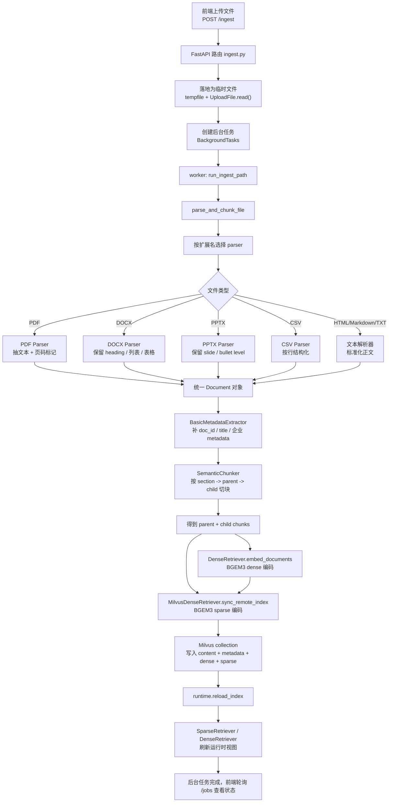

### 3.4.3 分段拆解图：上传与后台任务

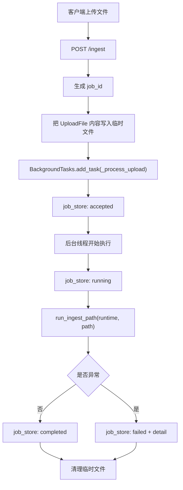

### 3.4.4 分段拆解图：解析、metadata、切块、向量化、落库

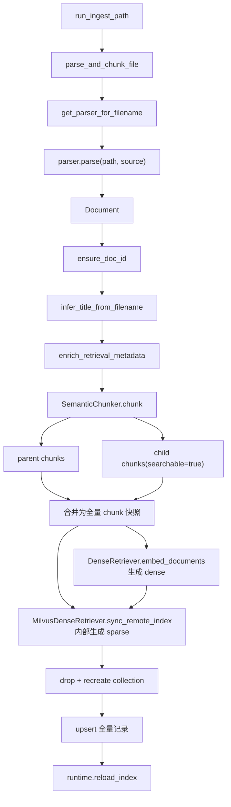

### 3.4.5 数据流转路径与关键业务逻辑

这一段建议直接对照以下文件一起读：

- [apps/api/routes/ingest.py](/Users/zhangzhijin/study/黑马学习/rag/RAG-%20project/enterprise-rag-platform/apps/api/routes/ingest.py)
- [apps/worker/jobs/ingest_job.py](/Users/zhangzhijin/study/黑马学习/rag/RAG-%20project/enterprise-rag-platform/apps/worker/jobs/ingest_job.py)
- [core/ingestion/pipeline.py](/Users/zhangzhijin/study/黑马学习/rag/RAG-%20project/enterprise-rag-platform/core/ingestion/pipeline.py)
- [core/ingestion/metadata_extractors/basic.py](/Users/zhangzhijin/study/黑马学习/rag/RAG-%20project/enterprise-rag-platform/core/ingestion/metadata_extractors/basic.py)
- [core/ingestion/chunkers/semantic_chunker.py](/Users/zhangzhijin/study/黑马学习/rag/RAG-%20project/enterprise-rag-platform/core/ingestion/chunkers/semantic_chunker.py)
- [core/retrieval/dense_retriever.py](/Users/zhangzhijin/study/黑马学习/rag/RAG-%20project/enterprise-rag-platform/core/retrieval/dense_retriever.py)
- [core/retrieval/milvus_retriever.py](/Users/zhangzhijin/study/黑马学习/rag/RAG-%20project/enterprise-rag-platform/core/retrieval/milvus_retriever.py)

#### 第一步：HTTP 上传请求只做“任务接入”，不做重活

实现位置：
- [apps/api/routes/ingest.py](/Users/zhangzhijin/study/黑马学习/rag/RAG-%20project/enterprise-rag-platform/apps/api/routes/ingest.py)

设计原因：

1. 文件解析、切块、编码可能持续数秒到数十秒。
2. 如果把这些逻辑放在请求线程里，会导致：
   - 接口超时风险上升
   - 前端体验差
   - 服务线程被长时间占用
3. 所以当前选择的是 `FastAPI BackgroundTasks + job_store` 的轻量异步方案。

关键代码示例：

```python
# language: python
# 文件路径：apps/api/routes/ingest.py
@router.post("/ingest", response_model=IngestResponse)
async def ingest(
    background: BackgroundTasks,
    file: UploadFile = File(...),
    runtime: RAGRuntime = Depends(get_runtime_dep),
) -> IngestResponse:
    """上传单个文件并异步触发入库。"""

    job_id = job_store.create()
    suffix = Path(file.filename or "upload").suffix
    tmp = Path(tempfile.mkdtemp()) / f"upload{suffix}"
    content = await file.read()
    tmp.write_bytes(content)
    background.add_task(_process_upload, job_id, tmp, runtime)
    return IngestResponse(job_id=job_id, status="accepted")
```

这里的业务规则是：

1. 上传文件会先被落成临时文件。
2. 返回给前端的不是“已入库完成”，而是：
   - `job_id`
   - `status=accepted`
3. 前端需要继续轮询 `/jobs/{job_id}` 才能知道最终成功或失败。

#### 第二步：worker 侧把“原始文件”转换成标准 Document

实现位置：
- [apps/worker/jobs/ingest_job.py](/Users/zhangzhijin/study/黑马学习/rag/RAG-%20project/enterprise-rag-platform/apps/worker/jobs/ingest_job.py)
- [core/ingestion/pipeline.py](/Users/zhangzhijin/study/黑马学习/rag/RAG-%20project/enterprise-rag-platform/core/ingestion/pipeline.py)

关键代码示例：

```python
# language: python
# 文件路径：apps/worker/jobs/ingest_job.py
def run_ingest_path(
    runtime: RAGRuntime,
    path: Path,
    *,
    source: str | None = None,
    replace_all: bool = False,
) -> None:
    """执行单文件入库。"""

    _, chunks = parse_and_chunk_file(path, source=source)
    index_chunks(runtime, chunks, replace_all=replace_all)
```

```python
# language: python
# 文件路径：core/ingestion/pipeline.py
def parse_and_chunk_file(path: Path, source: str | None = None) -> tuple[Document, list[TextChunk]]:
    src = source or str(path)
    parser = get_parser_for_filename(path.name)
    doc = parser.parse(path, src)
    ...
```

这里的核心思想是：**先统一成 `Document`，再统一后处理**。

这意味着不同文件类型的差异主要被限制在 parser 层，而不会污染后面的：

- metadata 提取
- chunk 切分
- 向量化
- 落库

#### 第三步：metadata 抽取把“纯文本”提升成“带企业语义的知识对象”

实现位置：
- [core/ingestion/metadata_extractors/basic.py](/Users/zhangzhijin/study/黑马学习/rag/RAG-%20project/enterprise-rag-platform/core/ingestion/metadata_extractors/basic.py)

当前 metadata 抽取不是大模型抽取，而是**启发式规则优先**。它会从：

- 文件名
- 文档标题
- 正文前 4000 字

抽取最有价值的企业检索字段，例如：

- 文档身份：`doc_number / doc_type / version / version_status / status`
- 组织归属：`department / owner_department / plant / subsidiary`
- 业务语义：`business_domain / process_stage / system_name / equipment_type`
- 安全治理：`data_classification / authority_level`

关键代码示例：

```python
# language: python
# 文件路径：core/ingestion/metadata_extractors/basic.py
doc = meta_ex.ensure_doc_id(doc)
doc = meta_ex.infer_title_from_filename(path, doc)
doc = meta_ex.enrich_retrieval_metadata(path, doc)
```

这一步的业务价值非常大，因为后面 Milvus 里的标量索引、ACL 过滤、企业实体 boost、governance ranking 都依赖这些字段。

#### 第四步：`SemanticChunker` 不是固定切块，而是“结构感知 + 分层切块”

实现位置：
- [core/ingestion/chunkers/semantic_chunker.py](/Users/zhangzhijin/study/黑马学习/rag/RAG-%20project/enterprise-rag-platform/core/ingestion/chunkers/semantic_chunker.py)

当前切块逻辑有三个关键特征：

1. 先按标题或页码切 section。
2. 再按 section 切 `parent chunk`。
3. 最后从 `parent chunk` 再切 `child chunk`。

其中：

- `parent chunk`
  - 更大
  - 更完整
  - 主要用于回扩、重排、生成
- `child chunk`
  - 更小
  - `searchable=True`
  - 主要用于召回

关键代码示例：

```python
# language: python
# 文件路径：core/ingestion/chunkers/semantic_chunker.py
for parent_piece in self._split_length(
    body,
    max_chars=profile.parent_max_chars,
    overlap=profile.parent_overlap,
):
    ...
    raw_children = self._split_length(
        parent_piece,
        max_chars=profile.child_max_chars,
        overlap=profile.child_overlap,
    )
```

当前还会按文件类型动态选择 `ChunkProfile`：

- `PDF`：按页更保守地切
- `CSV`：更小、更紧凑
- `PPTX`：适合 slide 粒度
- `TXT`：较保守的通用参数

这是一个很典型的生产级折中方案：

- 不为每种文件重写一套 chunker
- 但又不对所有文件用完全同一组参数

#### 第四步补充：后续优化方案，是否可以引入 `nlp_bert_document-segmentation_chinese-base`

这个问题可以直接给结论：

> **可以接，而且对这个项目是有价值的；但更适合作为“语义边界增强器”，而不是直接替换当前整套 `SemanticChunker`。**

这里先说明一个合理假设：

- 这里把 `nlp_bert_document-segmentation_chinese-base` 理解为一种**面向中文长文档的句段/段落边界识别模型**
- 它的职责不是做 embedding，也不是做 rerank
- 它更像是在判断：
  - 当前一句和下一句是否应该切开
  - 当前长段内部哪里更适合形成语义边界

在这个假设下，它**可以服务于当前项目的离线文档录入功能**，但最稳的接法不是“完全替换当前切块器”，而是：

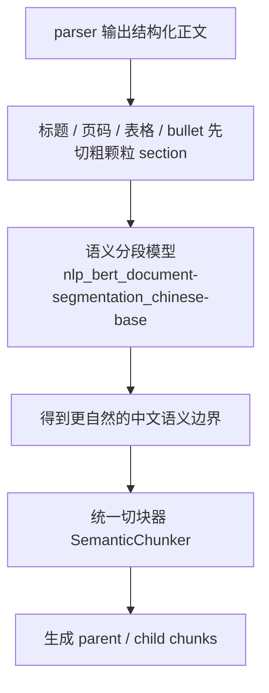

也就是说，更推荐它放在：

- `parser` 之后
- `parent/child` 分层切块之前

让它负责的不是“整个 chunk pipeline”，而是：

> **先把弱结构中文长文本切成更合理的语义段，再交给现有 `SemanticChunker` 做工程化分层切块。**

##### 它能解决当前方案的哪些痛点

当前 `SemanticChunker` 的核心优势是稳、简单、结构感知强，但它本质上还是：

- 标题结构优先
- 段落优先
- 长度约束兜底
- 超长再滑窗

这套方案对这些文件已经很好：

- `DOCX`
- `Markdown`
- `HTML`
- `PPTX`
- `CSV`

因为这些格式本来就有较强结构信号。

但在这些场景上，它会有天然短板：

1. **PDF 正文很长，但标题抽不出来**
2. **OCR 文本没有明显段落**
3. **TXT / 复制粘贴文本只有大段连续中文**
4. **同一大段里话题已经变化，但长度还没超过窗口**

这时当前切块器更像是在做：

- “结构感知 + 工程切块”

而不是：

- “真正理解句段边界后的语义切块”

`nlp_bert_document-segmentation_chinese-base` 这类模型的价值，就在于它能补这块短板：

- 发现长文本里的自然语义转折点
- 减少“明明该断但因为字数还没到所以没断”的问题
- 减少“一个 chunk 同时混进两个话题”的情况

##### 对这个项目最有价值的文件类型

如果按实际收益排序，我建议它优先作用在：

1. **PDF**
   - 尤其是制度、规范、纪要、报告类 PDF
2. **TXT**
3. **OCR 后文本**
4. **结构较弱的 HTML 抽取文本**

不建议一开始优先用在：

1. **CSV**
   - 更适合按行/字段语义切，不需要句段模型
2. **PPTX**
   - slide 和 bullet 结构比句段模型更重要
3. **结构良好的 DOCX**
   - Heading 往往比句段模型更有价值

所以它不是“通杀所有文件类型”的方案，而是：

> **对弱结构中文长文本最有价值。**

##### 相比当前方案，它的优势是什么

如果只看当前项目，最大的优势有 4 个。

1. **减少跨主题混块**
   当前如果一个 section 很长，而内部已经从“制度背景”切到“审批流程”，但中间没有明显标题，长度切块仍然可能把它们放进一个 parent 或 child 里。  
   语义分段模型更有机会在“主题真的发生变化”的地方先切开。

2. **提高 child chunk 的检索纯度**
   你现在的检索链路是：
   - BGEM3 dense+sparse
   - Milvus native hybrid search
   - rerank
   - governance

   在这条链路里，**child chunk 的语义纯度越高，召回越稳**。  
   语义分段模型能减少一个 child 同时承载多个意图的问题。

3. **降低 rerank 的噪声**
   如果候选 chunk 本身混了两个话题，即使 rerank 很强，也是在“脏候选”上做判断。  
   更好的段界意味着：
   - 候选更干净
   - rerank 更容易把最相关证据选出来

4. **更适合中文连续正文**
   这个项目是典型中文企业知识场景。  
   相比英文或强结构文档，中文制度类长文本更需要句段级边界识别。

##### 它的风险和限制是什么

这部分很重要，因为它不是银弹。

1. **它不是结构理解替代品**
   如果文件本身有强结构，比如：
   - Heading
   - 表格
   - slide
   - CSV row

   那么 parser 提供的结构信号通常比句段模型更值钱。  
   所以它不该替代：
   - `DOCX heading`
   - `PPTX bullet`
   - `CSV row title`

2. **它会增加离线入库成本**
   当前离线录入已经要做：
   - parser
   - metadata extractor
   - `SemanticChunker`
   - BGEM3 dense+sparse 编码
   - Milvus 落库

   再加一个语义分段模型后：
   - CPU/GPU 负担会更重
   - 入库时间会更长

3. **它不一定适合所有文档**
   对非常短、非常规整或表格型文档，它的收益可能很小，甚至只是增加复杂度。

4. **边界误判会影响稳定性**
   如果模型把不该切开的地方切开，或者没切开本该切开的地方，也会带来新的 badcase。  
   所以它一定要：
   - 小范围灰度
   - 用评测集验证
   - 不要一开始全量替换

##### 对这个项目最稳的演进建议

不建议把：

- [core/ingestion/chunkers/semantic_chunker.py](/Users/zhangzhijin/study/黑马学习/rag/RAG-%20project/enterprise-rag-platform/core/ingestion/chunkers/semantic_chunker.py)

整体推翻掉。  
更稳的路线是：

###### 第一阶段：做成可选增强

只对这类文档启用：

- `pdf`
- `txt`
- `ocr_text`

并且只作用在：

- 长 section
- 长段落
- 标题结构弱的正文

也就是：

```text
如果 section 很短 -> 继续走现有切块
如果 section 很长且结构弱 -> 先做语义分段，再走现有切块
```

###### 第二阶段：保留现有 parent/child 体系

不要让模型直接决定最终 chunk 长度。  
更稳的做法是：

1. 语义模型先输出候选边界
2. 再交给当前 `SemanticChunker`
3. 继续保留：
   - `parent chunk`
   - `child chunk`
   - overlap
   - `chunk_level`
   - `parent_chunk_id`

这样不会把整个检索链打碎。

###### 第三阶段：用评测而不是感觉决定是否推广

真正应该看的不是“切得看起来顺不顺”，而是：

- `context_precision`
- `context_recall`
- badcase 数量
- rerank 前 top-k 命中率
- 冲突检测是否更稳

如果这些指标没变好，就不值得全量推广。

##### 一个最贴当前项目的接入思路

如果以后真的要落，我建议入口就放在：

- [core/ingestion/chunkers/semantic_chunker.py](/Users/zhangzhijin/study/黑马学习/rag/RAG-%20project/enterprise-rag-platform/core/ingestion/chunkers/semantic_chunker.py)

实现思路不是大改，而是新增一个可选步骤，例如：

```python
# language: python
# 文件路径：core/ingestion/chunkers/semantic_chunker.py
# 这是建议性的演进示意，不是当前已上线代码
def _semantic_pre_split(self, text: str, *, doc_type: str) -> list[str]:
    """
    对弱结构中文长文本做语义预分段。

    建议只在：
    - pdf
    - txt
    - ocr_text
    且文本较长时启用。
    """
    ...
```

然后在 `_split_sections()` 或 `_split_length()` 前增加：

```python
# language: python
# 文件路径：core/ingestion/chunkers/semantic_chunker.py
# 这是建议性的演进示意，不是当前已上线代码
if should_enable_semantic_segmentation(doc_type, text):
    segments = self._semantic_pre_split(text, doc_type=doc_type)
else:
    segments = [text]
```

这样有 3 个好处：

1. 保留当前统一 chunker 架构
2. 不影响现有 parent/child 回扩体系
3. 可以按文件类型逐步灰度

##### 一句话建议

如果你后面面试里要讲这件事，我建议这样说：

> 我们当前主线采用的是结构感知 + 文件类型 profile + parent/child 分层切块，因为这套方案稳、易维护、适合生产。  
> 但针对中文 PDF、OCR、TXT 这类弱结构长文本，后续可以引入 `nlp_bert_document-segmentation_chinese-base` 这类语义分段模型，作为切块前的边界增强器。  
> 它不是替代当前 chunker，而是增强长文本语义边界识别能力，目标是提高 child chunk 的检索纯度和后续 rerank 效果。  
> 是否推广应通过评测和 badcase 回流来决定，而不是凭感觉全量替换。

#### 第四步补充（二）：OCR 作为后续优化方案，什么时候需要、怎么接、推荐什么模型

这个问题也先给结论：

> **当前项目主链路没有真正接 OCR，但它非常适合作为离线文档录入功能的下一阶段增强。**

更准确地说：

- 当前项目已经支持：
  - `PDF` 文本抽取
  - `DOCX / PPTX / CSV / HTML / TXT` 解析
- 但当前 `PDF` 解析走的是：
  - `pypdf + page.extract_text()`
- 这意味着：
  - **有文字层的 PDF 可以处理**
  - **扫描版 PDF / 图片版 PDF / 影印件 / 拍照文档，目前不能真正识别内容**

所以 OCR 在这个项目里的定位不是“锦上添花”，而是：

> **补齐图片型、扫描型、无文字层文档的可接入能力。**

##### 什么时候需要 OCR

只有在下面这些场景里，OCR 才真正值得引入：

1. **扫描版 PDF**
   - 例如制度扫描件、纸质盖章件导出的 PDF
2. **图片型文档**
   - JPG / PNG / TIFF
3. **OCR 弱化文本场景**
   - PDF 可以抽出少量文本，但正文大部分其实是图片
4. **文档版式重要**
   - 表格
   - 多栏排版
   - 报告/纪要扫描件

不太需要 OCR 的场景：

1. `DOCX`
2. `Markdown`
3. `HTML`
4. 普通 `TXT`
5. 自带清晰文字层的 PDF

所以更稳的策略不是“所有 PDF 都先 OCR 一遍”，而是：

> **先判断是否存在可用文字层，再决定要不要进入 OCR 分支。**

##### 最推荐的接法：不要改主链，而是在 parser 前半段加 OCR 分支

OCR 最稳的接法不是另起一套新入库系统，而是继续复用你现有的离线录入主链路：

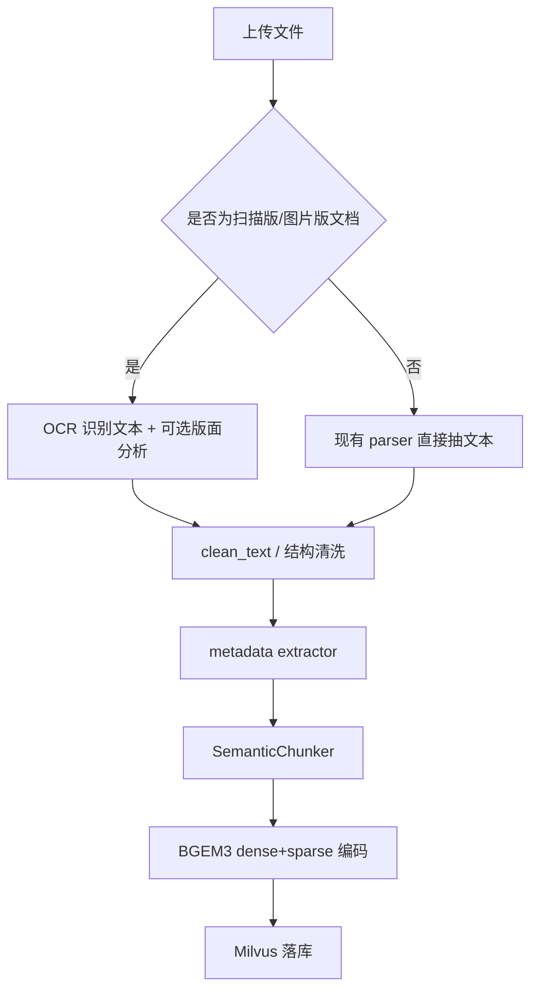

也就是说，OCR 更适合作为：

- **parser 层的前置增强**

而不是：

- 替换 metadata extractor
- 替换 SemanticChunker
- 替换 BGEM3 / Milvus

这样接的好处是：

1. 不会推翻现有主架构
2. OCR 只影响“文本从哪里来”
3. 后面的：
   - metadata
   - chunk
   - embedding
   - Milvus
   都还能继续复用

##### 推荐模型：主推荐用什么，轻量和增强版用什么

结合你这个项目的中文企业知识场景，我的推荐顺序是：

###### 方案 1：主推荐，`PaddleOCR PP-OCRv5`

这是我最推荐的主线模型路线。

推荐理由：

1. **中文场景强**
   - PaddleOCR 对中文文档场景长期优化较深
2. **生态成熟**
   - 文档、模型、部署资料都比较完整
3. **适合企业文档**
   - 纸质制度
   - 报告
   - 纪要
   - 截图
4. **官方持续更新**
   - PaddleOCR 官方文档已经给出 `PP-OCRv5` 作为新一代识别方案  
   参考：[PP-OCRv5 Introduction](https://paddlepaddle.github.io/PaddleOCR/v3.0.1/en/version3.x/algorithm/PP-OCRv5/PP-OCRv5.html)

适合你这个项目的原因：

- 你是中文企业知识场景
- 主要处理制度、规范、运维手册、会议纪要
- 追求的是“稳”和“可落地”，不是只追某个 benchmark

###### 方案 2：文档版式增强，`PP-Structure / DocLayout / 表格结构模型`

如果你后面不只是想把扫描件里的文字识别出来，而是还想保留：

- 表格结构
- 版面区域
- 标题区域
- 多栏布局

那就应该在 OCR 主模型之外，再考虑：

- `PP-Structure`
- `PP-DocLayout`
- 表格结构识别模型（例如 PaddleOCR 文档里的 table structure 系列）

官方近期更新里已经有：

- `PP-DocLayout-L / M / S`
- 新的表格结构识别模型  
参考：[PaddleOCR Recently Update](https://paddlepaddle.github.io/PaddleOCR/main/en/update/update.html)

这套更适合：

- 扫描版报告
- 带复杂表格的制度附件
- 版面信息对后续 chunk 很重要的文档

###### 方案 3：轻量工程接入备选，`RapidOCR`

如果你后面想先快速落一个轻量 OCR 能力，而不是一下子把 PaddleOCR 整套接满，可以考虑：

- `RapidOCR`

它的优势通常是：

1. 集成更轻
2. 推理链更简单
3. 更适合先做一个工程验证版

但它更适合做：

- 快速接入
- 轻量场景

不一定是你这个项目长期主线的最佳选择。

所以我的建议是：

- **长期主线：PaddleOCR**
- **快速验证版：RapidOCR**

##### 为什么我不建议一开始直接把 OCR 做成默认主路径

因为 OCR 虽然重要，但也会引入新的系统成本：

1. **入库时延更高**
2. **CPU/GPU 资源占用更高**
3. **错误识别会把脏文本带进后续链路**
4. **版面丢失可能让 chunk 和 metadata 质量下降**

所以 OCR 不应该理解成：

> 有了 OCR，一切都会更好。

更真实的理解是：

> OCR 让“原本无法进入知识库的扫描件”有了可接入能力，但也会带来新的识别误差和清洗成本。

##### 引入 OCR 后的收益是什么

如果接得对，它对你这个项目的收益非常明确：

1. **知识覆盖面扩大**
   - 扫描制度
   - 纸质盖章件
   - 老文档影印件  
   这些原来进不了知识库，现在能进

2. **企业落地性更强**
   很多企业的真实历史资料并不是干净 DOCX，而是：
   - 扫描 PDF
   - 纸件归档
   - 图片截图

3. **后续 chunk / 检索 / 评测才能覆盖这部分文档**
   没有 OCR，这些材料对 BGEM3、Milvus、RAGAS 都没有意义，因为它们根本拿不到文本。

##### 引入 OCR 后最大的风险是什么

最需要你注意的是这 4 个风险：

1. **识别错误**
   - 专有名词、编号、表格数字可能识别错
2. **结构丢失**
   - OCR 只给你文本，不一定给你正确版面
3. **噪声扩散**
   - 错字会一路传到：
     - metadata
     - chunk
     - BGEM3
     - 检索
4. **错误被“检索放大”**
   - OCR 错出来的文本如果恰好被切成 chunk 并进入 Milvus，后面可能仍会被召回

所以如果以后落 OCR，我建议一定同时做：

1. OCR 质量阈值
2. OCR 文本清洗
3. OCR 文档单独标记 metadata
4. OCR 文档的 badcase 评测集

##### 对这个项目最稳的工程实施路线

如果以后真的接 OCR，我建议按 3 步走：

###### 第一步：只接扫描版 PDF / 图片文档

先不要改所有 parser。  
只补一个 OCR 分支，例如：

- `pdf_parser.py` 检测文字层不足时走 OCR
- 或新增 `image_parser.py`

###### 第二步：OCR 只负责产出结构化文本

不要让 OCR 直接控制后续 chunk。  
更稳的方式是：

1. OCR 产出文本
2. 做清洗和基本结构恢复
3. 再进入现有：
   - `metadata extractor`
   - `SemanticChunker`
   - `BGEM3`
   - `Milvus`

###### 第三步：先灰度再推广

优先在这类文档上灰度：

- 制度扫描件
- 历史报告扫描件
- OCR 明显有价值但量不算特别大的资料

然后看：

- OCR 文本质量
- 检索命中率
- badcase 变化
- 实际入库时延

##### 一句话建议

如果你后面面试里要讲 OCR，我建议这样说：

> 当前项目主链路还没有接 OCR，PDF 解析主要依赖文字层抽取。  
> 但对企业真实资料来说，扫描版制度、纸质归档件和图片型文档很常见，所以 OCR 是一个很有价值的后续优化方向。  
> 我更推荐把 OCR 作为 parser 前半段的增强分支接入，而不是推翻后面的 metadata、chunk、embedding 和 Milvus 链路。  
> 模型上优先推荐 PaddleOCR 的 PP-OCRv5 作为中文主线，如果后续需要版面和表格结构，再叠加 PP-Structure / DocLayout；如果只是先做轻量验证，也可以考虑 RapidOCR 作为工程备选。

#### 第五步：dense 和 sparse 都在离线入库阶段生成

实现位置：
- [core/retrieval/dense_retriever.py](/Users/zhangzhijin/study/黑马学习/rag/RAG-%20project/enterprise-rag-platform/core/retrieval/dense_retriever.py)
- [core/retrieval/bgem3_backend.py](/Users/zhangzhijin/study/黑马学习/rag/RAG-%20project/enterprise-rag-platform/core/retrieval/bgem3_backend.py)
- [core/retrieval/milvus_retriever.py](/Users/zhangzhijin/study/黑马学习/rag/RAG-%20project/enterprise-rag-platform/core/retrieval/milvus_retriever.py)

当前的关键变化是：

1. `DenseRetriever.embed_documents()` 负责生成 `dense embedding`
2. `MilvusDenseRetriever.sync_remote_index()` 内部再次调用 `BGEM3.encode_documents()` 生成 `sparse embedding`
3. 两者都在离线录入阶段完成，不再依赖服务重启后补算 sparse

关键代码示例：

```python
# language: python
# 文件路径：core/ingestion/pipeline.py
texts = [c.content for c in all_chunks]
emb = dense.embed_documents(texts)
runtime.dense.sync_remote_index(all_chunks, np.asarray(emb))
runtime.reload_index()
```

```python
# language: python
# 文件路径：core/retrieval/milvus_retriever.py
if self._bgem3.enabled and self._bgem3.get_function() is not None:
    texts = [chunk.content for chunk in chunks]
    sparse_outputs = self._bgem3.encode_documents(texts)["sparse"]
    sparse_vectors = [sparse_row_to_milvus_dict(row) for row in sparse_outputs]
```

这意味着当前系统的离线录入结果已经是：

- `content`
- `metadata`
- `dense vector`
- `sparse vector`

一起写入 Milvus。

#### 第六步：Milvus 采用“全量快照重建 collection”而不是局部 patch

实现位置：
- [core/retrieval/milvus_retriever.py](/Users/zhangzhijin/study/黑马学习/rag/RAG-%20project/enterprise-rag-platform/core/retrieval/milvus_retriever.py)

当前同步策略是：

1. 准备完整的 `chunks + dense + sparse`
2. 如果 collection 存在，则 `drop_collection`
3. 重新建表建索引
4. 批量 `upsert`

关键代码示例：

```python
# language: python
# 文件路径：core/retrieval/milvus_retriever.py
if client.has_collection(collection_name=collection_name):
    client.drop_collection(collection_name=collection_name)
    self._collection_ready = False
self._ensure_collection(dim=int(matrix.shape[1]))
...
client.upsert(collection_name=collection_name, data=batch)
```

这样做的原因不是“最极致高性能”，而是：

1. 当前项目是企业工程骨架，优先要状态简单、易排障。
2. chunk_id 已经稳定，重建 collection 的结果可预测。
3. 现在 schema 和索引还在持续演进，全量快照重建比复杂的增量 patch 更稳。

#### 第七步：`runtime.reload_index()` 负责刷新线上运行时视图

当前 `Milvus` 已经是权威存储，但线上 runtime 仍然需要一次 reload 来刷新：

- `SparseRetriever` fallback 语料
- `DenseRetriever` 本地可用状态
- 上层编排图所依赖的最新 chunk 视图

这里要注意：

- `reload_index()` 现在已经不再承担“为主链路重建 BGEM3 sparse 矩阵”的职责
- sparse 主链路已经直接走 Milvus `sparse_embedding`

### 3.4.6 一次真实数据样例：从 DOCX 到 Milvus row

假设上传文件名是：

```text
新疆能源集团-安全生产管理平台操作手册-v2.1.docx
```

正文里有一段：

```text
2.3 隐患排查记录查询
登录平台后进入隐患管理菜单，选择隐患排查记录查询，可按场站和责任部门筛选。
```

经过 parser + metadata + chunk 后，某个 child chunk 可能变成：

```json
{
  "chunk_id": "c-4f7a8c21-7-bd31a5d0a6d74d8f",
  "doc_id": "4f7a8c21-6d49-4b02-a4b1-9d6a45fd1f11",
  "content": "登录平台后进入隐患管理菜单，选择隐患排查记录查询，可按场站和责任部门筛选。",
  "searchable": true,
  "metadata": {
    "doc_type": "docx",
    "section": "隐患排查记录查询",
    "section_path": "安全生产管理平台操作手册 / 隐患排查记录查询",
    "chunk_level": "child",
    "parent_chunk_id": "p-4f7a8c21-3-2dce5d2c6d7061f3",
    "business_domain": "safety_production",
    "process_stage": "inspection",
    "system_name": "安全生产管理平台",
    "owner_department": "安全环保部",
    "data_classification": "internal",
    "authority_level": "medium"
  }
}
```

写入 Milvus 后，它会被序列化成：

```json
{
  "chunk_id": "...",
  "doc_id": "...",
  "title": "新疆能源集团-安全生产管理平台操作手册-v2.1",
  "chunk_level": "child",
  "parent_chunk_id": "...",
  "searchable": true,
  "business_domain": "safety_production",
  "system_name": "安全生产管理平台",
  "owner_department": "安全环保部",
  "data_classification": "internal",
  "content": "登录平台后进入隐患管理菜单，选择隐患排查记录查询，可按场站和责任部门筛选。",
  "extra_json": {
    "section_path": "安全生产管理平台操作手册 / 隐患排查记录查询",
    "contains_steps": true
  },
  "embedding": "[1024维 dense 向量]",
  "sparse_embedding": "{token_id: score, ...}"
}
```

### 3.4.7 离线录入功能用到的框架、库和版本信息

下面这张表只列“离线录入功能直接相关”的技术组件。版本信息按 [pyproject.toml](/Users/zhangzhijin/study/黑马学习/rag/RAG-%20project/enterprise-rag-platform/pyproject.toml) 中声明的版本下限整理。

| 技术/库 | 版本信息 | 在离线录入中的具体用途 |
| --- | --- | --- |
| FastAPI | `>=0.109.0` | 提供 `/ingest`、`/jobs/{job_id}`、`/reindex` 接口 |
| python-multipart | `>=0.0.9` | 支持文件上传表单解析 |
| Pydantic | `>=2.5.0` | 请求/响应模型、统一数据对象 |
| LangGraph | `>=0.2.0` | 不直接参与离线录入，但与 runtime 装配共享状态体系 |
| NumPy | `>=1.24.0` | dense 向量矩阵、数组转换 |
| pypdf | `>=4.0.0` | PDF 文本提取 |
| python-docx | `>=1.1.0` | DOCX heading、段落、表格读取 |
| python-pptx | `>=1.0.2` | PPTX slide 和 bullet 读取 |
| beautifulsoup4 | `>=4.12.0` | HTML 解析 |
| lxml | `>=5.0.0` | HTML 解析器 backend |
| sentence-transformers | `>=2.3.0` | dense 编码 fallback 路线 |
| torch | `>=2.1.0`（当前环境已升级到 2.6） | 本地模型推理基础依赖 |
| pymilvus[milvus_lite,model] | `>=2.6.0` | Milvus 连接、建表、索引、原生 `BGEM3EmbeddingFunction` |
| FlagEmbedding | `>=1.3.3` | BGE 系列模型运行支持 |

这里有两个很关键的实现事实：

1. `BGEM3` 不是一个单独 HTTP 服务，而是当前 Python 进程本地加载的模型。
2. Milvus Lite 既承担开发环境数据库，也承担 schema/index 验证环境。

### 3.4.8 这一节最值得记住的工程取舍

1. 上传接口轻，后台任务重，这是为了稳。
2. parser 负责“格式差异”，pipeline 负责“统一主链路”。
3. metadata 提取优先启发式，不引入额外大模型依赖。
4. chunk 采用 `parent/child` 分层，而不是一刀切定长。
5. dense 和 sparse 都在离线入库时生成，而不是服务启动后补算。
6. Milvus 现在是唯一权威存储，`/reindex` 也以它为准。

### 3.4.9 离线录入的常见 badcase、误解与排障入口

#### 常见 badcase

1. **上传成功但 job 最终 failed**
   - 常见原因：
     - parser 不支持文件类型
     - 本地 BGEM3 模型加载失败
     - Milvus collection 重建失败
2. **入库成功但检索效果明显差**
   - 常见原因：
     - metadata 抽不到关键字段
     - chunk 太大或太碎
     - 文档结构在 parser 阶段就丢了
3. **文档确实已入库，但问答链路搜不到**
   - 常见原因：
     - child chunk 没被正确标成 `searchable=true`
     - 高频 filter 字段写错导致被提前过滤

#### 常见误解

1. **误解：离线录入只是把原文写进向量库**
   - 实际上还包括 metadata 提取、切块、dense+sparse 编码、runtime reload。
2. **误解：parser 只做抽文本**
   - 实际上 parser 保留结构信号，直接影响 chunk 和检索效果。
3. **误解：离线阶段只生成 dense**
   - 当前实现已经在入库时把 `dense + sparse` 一起写入 Milvus。

#### 排障入口

建议优先按这个顺序查：

1. [apps/api/routes/ingest.py](/Users/zhangzhijin/study/黑马学习/rag/RAG-%20project/enterprise-rag-platform/apps/api/routes/ingest.py)
2. [apps/worker/jobs/ingest_job.py](/Users/zhangzhijin/study/黑马学习/rag/RAG-%20project/enterprise-rag-platform/apps/worker/jobs/ingest_job.py)
3. [core/ingestion/pipeline.py](/Users/zhangzhijin/study/黑马学习/rag/RAG-%20project/enterprise-rag-platform/core/ingestion/pipeline.py)
4. [core/retrieval/milvus_retriever.py](/Users/zhangzhijin/study/黑马学习/rag/RAG-%20project/enterprise-rag-platform/core/retrieval/milvus_retriever.py)

先查：

```bash
grep "milvus index synced" logs/app.log
grep "bgem3" logs/app.log
grep "failed" logs/app.log
```

---

## 3.5 重建索引模块

### 3.5.1 功能目标与当前语义

重建索引模块解决的问题是：

- 文档内容不变
- chunk 结构不变
- metadata 语义不变
- 但 dense / sparse 表示需要重算

当前最新语义已经变成：

> `/reindex` 不是重跑原始文档解析，而是把 Milvus 中现有 chunk 当成唯一数据源，重新编码并整体回写 collection。

这和历史版本很不一样。现在 `/reindex` 不再依赖：

- `chunks.jsonl`
- `embeddings.npy`
- 本地 `IndexStore`

### 3.5.2 重建索引总链路图

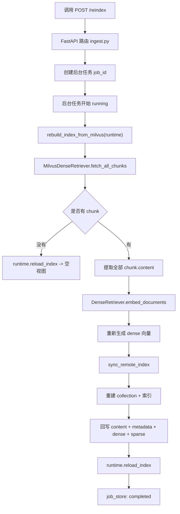

### 3.5.3 分段拆解图：为什么 `/reindex` 不重新解析文件

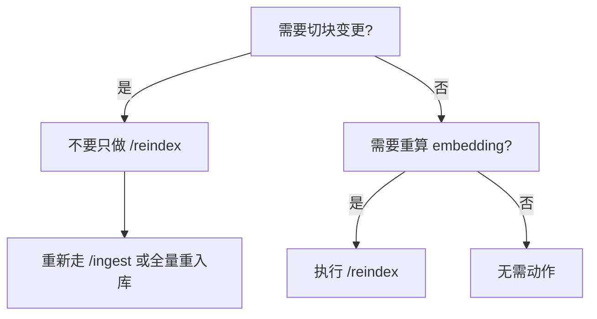

这张图背后的核心判断是：

- **chunk 会变**：重新入库
- **chunk 不变，只是向量空间要变**：重建索引

### 3.5.4 当前真实代码入口

对应文件：

- [apps/api/routes/ingest.py](/Users/zhangzhijin/study/黑马学习/rag/RAG-%20project/enterprise-rag-platform/apps/api/routes/ingest.py)
- [core/ingestion/pipeline.py](/Users/zhangzhijin/study/黑马学习/rag/RAG-%20project/enterprise-rag-platform/core/ingestion/pipeline.py)
- [core/retrieval/milvus_retriever.py](/Users/zhangzhijin/study/黑马学习/rag/RAG-%20project/enterprise-rag-platform/core/retrieval/milvus_retriever.py)

关键代码示例：

```python
# language: python
# 文件路径：apps/api/routes/ingest.py
@router.post("/reindex", response_model=IngestResponse)
def reindex(
    background: BackgroundTasks,
    runtime: RAGRuntime = Depends(get_runtime_dep),
) -> IngestResponse:
    job_id = job_store.create()

    def work() -> None:
        try:
            job_store.update(job_id, "running")
            rebuild_index_from_milvus(runtime)
            job_store.update(job_id, "completed")
        except Exception as e:
            job_store.update(job_id, "failed", detail=str(e))

    background.add_task(work)
    return IngestResponse(job_id=job_id, status="accepted")
```

```python
# language: python
# 文件路径：core/ingestion/pipeline.py
def rebuild_index_from_milvus(runtime: RAGRuntime) -> None:
    chunks = runtime.dense.fetch_all_chunks() if isinstance(runtime.dense, MilvusDenseRetriever) else []
    if not chunks:
        runtime.reload_index()
        return
    dense = DenseRetriever(runtime.settings)
    texts = [c.content for c in chunks]
    emb = dense.embed_documents(texts)
    runtime.dense.sync_remote_index(chunks, np.asarray(emb))
    runtime.reload_index()
```

### 3.5.5 重建索引的完整实现逻辑

#### 第一步：从 Milvus 拉出现有 chunk 快照

`fetch_all_chunks()` 会做全量扫描，拿回：

- `content`
- `metadata`
- `chunk_level`
- `parent_chunk_id`
- 以及所有当前 output fields

这一步的意义是：

1. 把 Milvus 当成唯一数据真相
2. 避免再去依赖本地快照文件
3. 保证重建结果和当前线上 collection 一致

#### 第二步：只重算 dense 编码入口，但最终仍会把 sparse 一起回写

你从 `rebuild_index_from_milvus()` 看起来会觉得这里只重算了：

- `DenseRetriever.embed_documents(texts)`

但真正回写时，`sync_remote_index()` 会再次基于同一批 chunk 内容生成：

- dense
- sparse

也就是说，`/reindex` 的最终结果仍然是：

- 重新生成完整 collection 快照
- 不是只补 dense，不管 sparse

这是当前实现里一个很容易忽略、但很关键的点。

#### 第三步：回写过程仍然采用“drop + recreate + upsert”

重建索引时不会局部 patch 某些向量，而是整体重建 collection。

这样做的收益是：

1. schema/index 演进时口径统一
2. 不容易出现一部分 row 是旧 embedding，一部分是新 embedding
3. 排障更简单

### 3.5.6 什么时候该用 `/reindex`

以下场景适合直接用 `/reindex`：

1. 把 dense 模型从旧 embedding 切到 `BGEM3`
2. 调整了 `embedding_model_name`
3. 升级了 `torch / sentence-transformers / pymilvus model`
4. 远端 collection 数据还在，但希望重建统一语义空间

### 3.5.7 什么时候不要只用 `/reindex`

以下场景不该只做 `/reindex`：

1. 原始文件内容变了
2. parser 输出结构变了
3. metadata 抽取规则变了
4. `SemanticChunker` 参数变了
5. parent/child 策略变了
6. 你希望新的 row 结构写入更多字段

这些情况本质上不是“向量重算”，而是“知识单元重建”，应该重新走 `/ingest` 或全量重入库。

### 3.5.8 真实生产例子

假设历史上某批文档是在“classic dense + BM25 fallback”阶段录入的，现在你把检索底座切到了：

- `BGEM3 dense`
- `BGEM3 sparse`
- `Milvus native hybrid_search`

但你并不想重新上传所有原始文件。

这时就可以执行：

```bash
curl -X POST "http://127.0.0.1:8000/reindex"
```

系统会：

1. 从 Milvus 读取现有 chunks
2. 用当前最新 `embedding_model_name=./modes/bge-m3`
3. 重新生成向量
4. 重建 collection
5. 刷新 runtime

这样线上问答就能切到新的向量空间，而不需要重新解析文件。

### 3.5.9 这一步最值得记住的工程取舍

1. `/reindex` 解决的是“表示层重建”，不是“知识清洗重建”。
2. 当前实现把 Milvus 作为唯一数据源，是为了减少历史包袱。
3. 只要 chunk 没变，就优先 `/reindex`，不要重新走完整入库。

### 3.5.10 重建索引的常见 badcase、误解与排障入口

#### 常见 badcase

1. **执行 `/reindex` 后效果基本没变**
   - 常见原因：
     - 问题根因不在 embedding，而在 chunk / metadata / parser
2. **重建后检索反而退化**
   - 常见原因：
     - `embedding_model_name` 配置错了
     - 新旧模型语义空间变化大，但 badcase 还没更新
3. **重建完成但运行时还像旧版本**
   - 常见原因：
     - `reload_index()` 没刷新成功
     - collection 重建成功但 runtime 状态未切换

#### 常见误解

1. **误解：`/reindex` 等于重新入库**
   - 实际上它不重跑 parser，不重切 chunk。
2. **误解：`/reindex` 只重建 dense**
   - 其实最终会通过 `sync_remote_index()` 把 `dense + sparse` 一起回写。
3. **误解：所有检索问题都能靠 `/reindex` 修**
   - 不是，chunk 和 metadata 问题要回到 `/ingest`。

#### 排障入口

建议优先按这个顺序查：

1. [apps/api/routes/ingest.py](/Users/zhangzhijin/study/黑马学习/rag/RAG-%20project/enterprise-rag-platform/apps/api/routes/ingest.py)
2. [core/ingestion/pipeline.py](/Users/zhangzhijin/study/黑马学习/rag/RAG-%20project/enterprise-rag-platform/core/ingestion/pipeline.py)
3. [core/retrieval/milvus_retriever.py](/Users/zhangzhijin/study/黑马学习/rag/RAG-%20project/enterprise-rag-platform/core/retrieval/milvus_retriever.py)

建议先 grep：

```bash
grep "milvus index synced" logs/app.log
grep "collection" logs/app.log
```

---

## 3.6 评测模块

### 3.6.1 功能目标与当前边界

评测模块当前解决的不是“算一个总分”这么简单，而是把整套企业 RAG 系统变成：

- 可复现
- 可比较
- 可定位问题
- 可驱动下一轮优化

这一轮代码更新后的真实边界是：

1. `/eval` 读取本地 JSONL 企业评测集。
2. 逐题调用当前真实 RAG 主链路，而不是调一个简化 mock。
3. 同时保留：
   - RAGAS 质量指标
   - 企业治理指标
   - query understanding 信号
   - explainability / badcase 数据
4. 最终输出两份报告：
   - JSON 原始报告
   - Markdown explainability report

### 3.6.2 评测总链路图

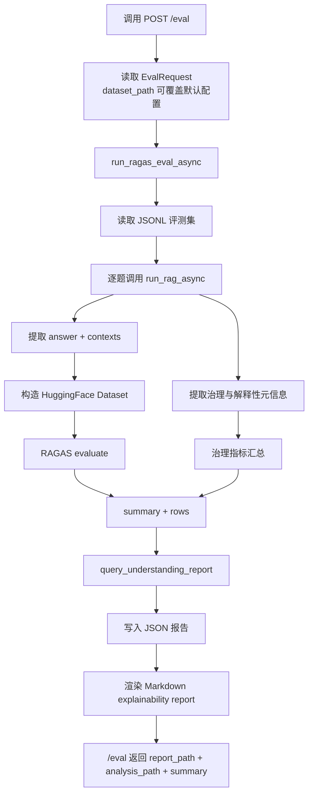

### 3.6.3 分段拆解图：单题评测是怎么跑的

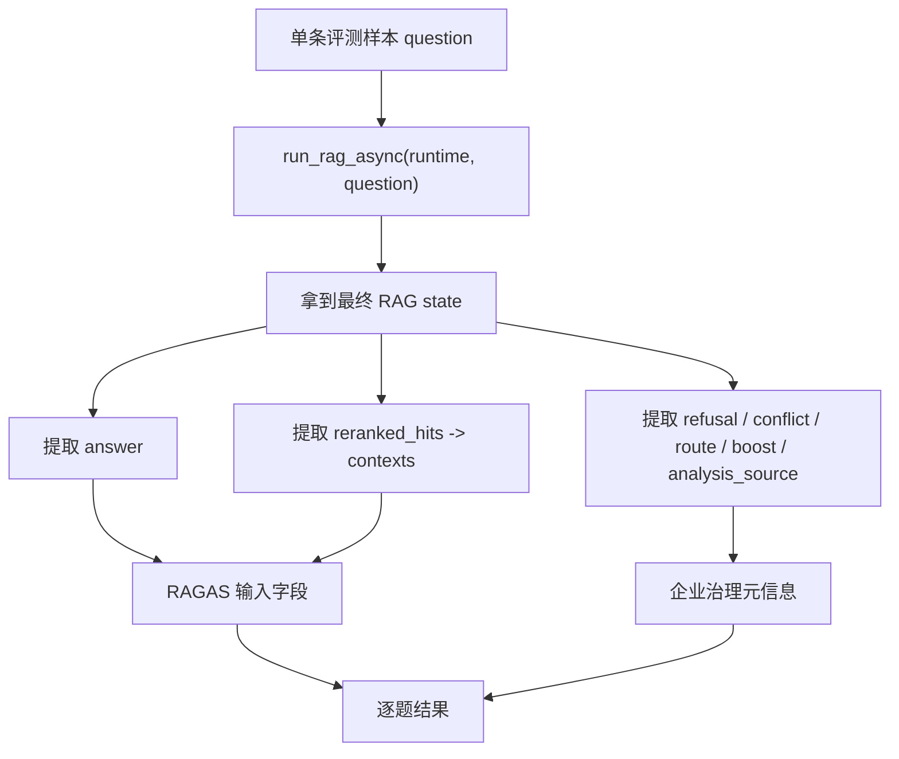

### 3.6.4 当前真实代码入口

对应文件：

- [apps/api/routes/eval.py](/Users/zhangzhijin/study/黑马学习/rag/RAG-%20project/enterprise-rag-platform/apps/api/routes/eval.py)
- [core/evaluation/ragas_runner.py](/Users/zhangzhijin/study/黑马学习/rag/RAG-%20project/enterprise-rag-platform/core/evaluation/ragas_runner.py)
- [core/orchestration/graph.py](/Users/zhangzhijin/study/黑马学习/rag/RAG-%20project/enterprise-rag-platform/core/orchestration/graph.py)

关键代码示例：

```python
# language: python
# 文件路径：apps/api/routes/eval.py
@router.post("/eval", response_model=EvalResponse)
async def run_eval(
    body: EvalRequest | None = None,
    runtime: RAGRuntime = Depends(get_runtime_dep),
) -> EvalResponse:
    body = body or EvalRequest()
    settings = get_settings()
    ds = body.dataset_path or Path(settings.eval_dataset_path)
    out = await run_ragas_eval_async(dataset_path=ds, output_dir=Path(settings.eval_output_dir), runtime=runtime)
```

```python
# language: python
# 文件路径：core/evaluation/ragas_runner.py
async def _answer_one(runtime: RAGRuntime, question: str) -> tuple[str, list[str], dict[str, Any]]:
    state = await run_rag_async(runtime, question=question)
    answer = state.get("answer") or ""
    ctxs = state.get("reranked_hits") or []
    contexts = [str(x.get("content", "")) for x in ctxs]
    return answer, contexts, _state_eval_metadata(state)
```

### 3.6.5 完整实现逻辑：为什么评测是“跑真实系统”而不是“测一个简化脚本”

#### 第一步：读取企业评测集

当前评测集格式是 JSONL，每一行至少包含：

- `question`
- 可选 `ground_truth`
- 可选 `contexts`
- 可选 `scenario`
- 可选 `expected_refusal`
- 可选 `expected_conflict`

这意味着评测集不仅能表达“这题标准答案是什么”，还能表达：

- 这题属于哪类场景
- 这题本来就应该拒答吗
- 这题本来就应该提示冲突吗

这对企业项目非常重要，因为企业 RAG 不是所有问题都该输出一个“直接答案”。

#### 第二步：逐题调用当前真实 RAG 主链路

不是调用一个“只做检索”的小函数，也不是调用一个“只做生成”的 mock，而是直接调用：

- `run_rag_async(runtime, question)`

这意味着评测会真实覆盖：

- query understanding
- route 决策
- hybrid retrieval
- rerank
- governance
- conflict detection
- refusal
- answer generation

所以评测结果和线上行为是可以对齐的。

#### 第三步：同时提取“答案质量”和“企业治理信号”

当前 `_state_eval_metadata(state)` 会从 state 中额外保留：

- `refusal`
- `refusal_reason`
- `answer_mode`
- `data_classification`
- `model_route`
- `analysis_confidence`
- `analysis_source`
- `analysis_reason`
- `query_scene`
- `preferred_retriever`
- `top_k_profile`
- `conflict_detected`
- `conflict_summary`
- `matched_routes`
- `metadata_boosted`
- `enterprise_entity_boosted`
- `enterprise_entity_matches`
- `governance_boosted`
- `explainable_citation_count`

这一步的意义是：

- RAGAS 负责看“答得好不好”
- 这些扩展信号负责看“系统为什么这样答”

#### 第四步：RAGAS 只是一层，不是全部

当前 `run_ragas_eval()` 会把：

- `question`
- `answer`
- `contexts`
- `ground_truth`

组装成 `datasets.Dataset`，然后传给：

- `ragas.evaluate(...)`

当前默认跑的指标包括：

- `faithfulness`
- `answer_relevancy`
- `context_recall`
- `context_precision`

但这只是第一层。

第二层会额外汇总企业治理指标，例如：

- `refusal_rate`
- `conflict_detected_rate`
- `metadata_boost_hit_rate`
- `enterprise_entity_boost_hit_rate`
- `governance_boost_hit_rate`
- `avg_explainable_citations`
- `avg_analysis_confidence`

第三层还会生成：

- `query_understanding_report`

用来告诉你：

- 哪些 scene 最常见
- 哪些 scene 最容易 guardrail
- 哪些 scene 依赖 llm_enhanced
- 下一轮该补规则还是补 badcase

### 3.6.6 为什么评测不只看 RAGAS

因为企业项目里，下面这些问题 RAGAS 本身并不能完整覆盖：

1. 是否拒答合理
2. 是否识别冲突
3. 数据分级是否影响了模型路由
4. query understanding 是否稳定
5. metadata boost / governance boost 是否真的生效
6. citation 是否真的可解释

所以当前项目的评测体系实际上是三层：

1. **基础质量层**
   - `faithfulness`
   - `answer_relevancy`
   - `context_recall`
   - `context_precision`

2. **企业治理层**
   - `refusal_rate`
   - `conflict_detected_rate`
   - `model_route:*`
   - `classification:*`

3. **可解释与调参层**
   - `matched_route:*`
   - `analysis_source:*`
   - `entity_match:*`
   - `query_understanding_report`

### 3.6.7 真实生产例子：一条 badcase 是怎么来的

假设评测集里有一题：

```json
{
  "question": "最新设备巡检制度是什么，旧版本和新版本差异在哪？",
  "scenario": "policy_conflict",
  "expected_conflict": true
}
```

如果当前系统运行后：

- 检索到了多个版本制度
- governance 提升了新版制度
- 但最终没有输出 `conflict_detected=true`

那么这条样本在评测报告里就会表现为：

- RAGAS 分数不一定很差
- 但 `expected_conflict_match_rate` 会被拉低
- explainability report 会把它排进 badcase

这就是为什么企业项目不能只看 RAGAS 均值。

### 3.6.8 当前会输出什么

当前一次 `/eval` 最终会输出：

1. JSON 报告
2. Markdown explainability report
3. `summary`
4. `rows`
5. `query_understanding_report`

其中：

- `JSON` 更适合程序消费和二次分析
- `Markdown` 更适合人肉复盘和面试展示

### 3.6.9 这一步最值得记住的工程取舍

1. 当前评测优先串行执行，吞吐不是第一目标，可读性和排障优先。
2. 评测跑的是真实 RAG 系统，不是简化链路。
3. RAGAS 是基础层，但企业治理信号必须额外统计。
4. badcase 报告的目标不是“看着好看”，而是反向驱动 query understanding / retrieval / governance 调参。

### 3.6.10 评测模块的常见 badcase、误解与排障入口

#### 常见 badcase

1. **RAGAS 分数不错，但线上体验还是不好**
   - 常见原因：
     - 只看基础质量，没看治理信号
2. **refusal_rate 很高**
   - 常见原因：
     - ACL / data_classification 太保守
     - query understanding 过于保守
3. **badcase 报告看不出根因**
   - 常见原因：
     - trace 字段不全
     - `scenario / expected_*` 没在数据集里标出来

#### 常见误解

1. **误解：评测就是跑 RAGAS**
   - 当前评测还要看治理指标和 query understanding 信号。
2. **误解：离线评测和线上没关系**
   - 当前评测直接调用真实 `run_rag_async`。
3. **误解：分数低只能调 prompt**
   - 更多时候问题在 retrieval、chunk、metadata 或 route。

#### 排障入口

建议优先按这个顺序查：

1. [apps/api/routes/eval.py](/Users/zhangzhijin/study/黑马学习/rag/RAG-%20project/enterprise-rag-platform/apps/api/routes/eval.py)
2. [core/evaluation/ragas_runner.py](/Users/zhangzhijin/study/黑马学习/rag/RAG-%20project/enterprise-rag-platform/core/evaluation/ragas_runner.py)
3. badcase 对应的 `trace_id / audit_id / matched_routes / analysis_source`

建议优先看：

```text
summary
rows
query_understanding_report
```

---

## 3.7 风控、权限、分级与日志审计模块

### 3.7.1 功能目标与当前边界

这一层解决的不是“功能能不能跑”，而是：

- 能不能安全地跑
- 出问题后能不能追踪
- 高敏数据会不会被错误出域
- 一次请求的责任链能不能被完整回放

当前这一轮代码更新后的真实边界是：

1. 每个请求都会有统一 `trace_id`
2. 每次问答都会生成 `audit_id`
3. 风控不是散落在各层，而是统一收敛到 `RiskEngine`
4. 数据分级最终会通过 `egress_policy` 翻译成真正的出域动作
5. 普通业务日志和审计日志都已本地落盘

### 3.7.2 安全与观测总链路图

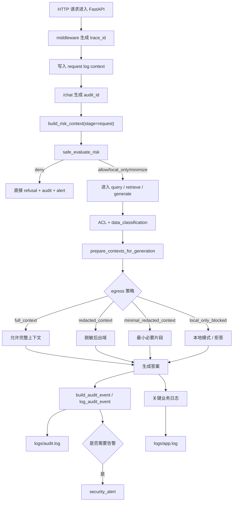

### 3.7.3 分段拆解图：trace_id 和 audit_id 是怎么贯穿的

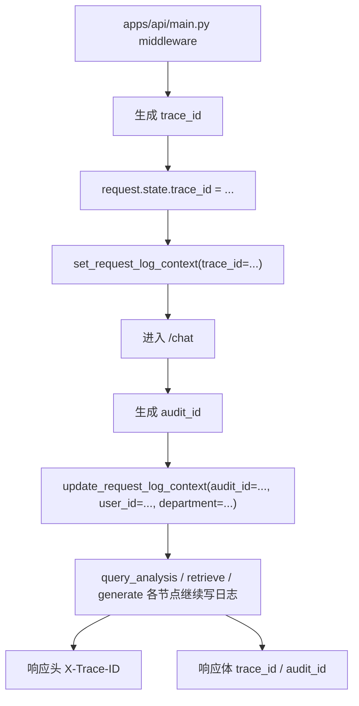

### 3.7.4 当前真实代码入口

对应文件：

- [apps/api/main.py](/Users/zhangzhijin/study/黑马学习/rag/RAG-%20project/enterprise-rag-platform/apps/api/main.py)
- [core/observability/logging.py](/Users/zhangzhijin/study/黑马学习/rag/RAG-%20project/enterprise-rag-platform/core/observability/logging.py)
- [core/security/risk_engine.py](/Users/zhangzhijin/study/黑马学习/rag/RAG-%20project/enterprise-rag-platform/core/security/risk_engine.py)
- [core/generation/egress_policy.py](/Users/zhangzhijin/study/黑马学习/rag/RAG-%20project/enterprise-rag-platform/core/generation/egress_policy.py)
- [core/observability/audit.py](/Users/zhangzhijin/study/黑马学习/rag/RAG-%20project/enterprise-rag-platform/core/observability/audit.py)

### 3.7.5 请求级日志上下文是怎么实现的

当前不是每个函数手动传一堆日志字段，而是用：

- `contextvars`
- `RequestContextFilter`

把请求上下文自动注入到每条日志记录里。

关键代码示例：

```python
# language: python
# 文件路径：core/observability/logging.py
_LOG_CONTEXT: ContextVar[dict[str, Any]] = ContextVar("log_context", default={})

def set_request_log_context(**values: Any) -> None:
    _LOG_CONTEXT.set({key: value for key, value in values.items() if value not in (None, "", [], {})})

class RequestContextFilter(logging.Filter):
    def filter(self, record: logging.LogRecord) -> bool:
        context = get_request_log_context()
        for key, value in context.items():
            if getattr(record, key, None) in (None, "", [], {}):
                setattr(record, key, value)
        return True
```

这套设计的好处是：

1. `trace_id / audit_id / user_id / department / role` 可以自动跟着日志走
2. 业务代码只需要正常写 `logger.info(...)`
3. 日志输出层统一决定：
   - stdout JSON
   - `app.log`
   - `audit.log`

### 3.7.6 `trace_id` 是怎么生成和回给前端的

实现位置：
- [apps/api/main.py](/Users/zhangzhijin/study/黑马学习/rag/RAG-%20project/enterprise-rag-platform/apps/api/main.py)

关键代码示例：

```python
# language: python
# 文件路径：apps/api/main.py
trace_id = request.headers.get("X-Trace-ID") or uuid4().hex
request.state.trace_id = trace_id
set_request_log_context(
    trace_id=trace_id,
    event="request_received",
    request_path=request.url.path,
    method=request.method,
)
...
response.headers["X-Trace-ID"] = trace_id
```

所以现在一条请求的链路 ID 会同时出现在：

1. `request.state.trace_id`
2. 日志上下文
3. 响应头 `X-Trace-ID`
4. `/chat` 响应体里的 `trace_id`
5. 前端展示区

这意味着你现在拿到页面里的 `trace_id`，就能直接去 grep：

```bash
grep "你的 trace_id" logs/app.log
grep "你的 trace_id" logs/audit.log
```

### 3.7.7 `RiskEngine` 为什么要单独抽象

当前项目没有把风控规则散落在：

- request
- retrieve
- generate

三个地方分别硬写，而是统一抽象成：

- `RiskContext`
- `RiskDecision`
- `RiskEngine`

关键代码示例：

```python
# language: python
# 文件路径：core/security/risk_engine.py
@dataclass(slots=True)
class RiskContext:
    stage: str
    audit_id: str
    question: str
    user_id: str | None = None
    department: str | None = None
    ...

@dataclass(slots=True)
class RiskDecision:
    allow: bool = True
    action: str = "allow"
    risk_level: str = "low"
    reason: str = ""
    ...
```

这样做的原因是：

1. 风控输入结构统一
2. 决策输出结构统一
3. 后面如果接远程风控中心或 OPA，不需要推翻主链路

当前默认实现是：

- `RuleBasedRiskEngine`

它优先看三类信号：

1. 明显高风险问法
2. ACL / refusal 等上游已确定语义
3. `data_classification / model_route`

### 3.7.8 数据分级如何真正影响出域

这一步不是“给结果打个标签”，而是会真实影响上下文是否允许送给模型。

实现位置：
- [core/generation/egress_policy.py](/Users/zhangzhijin/study/黑马学习/rag/RAG-%20project/enterprise-rag-platform/core/generation/egress_policy.py)

当前策略大致是：

- `public / default`
  - 完整上下文
- `internal`
  - 可按配置脱敏
- `sensitive`
  - 脱敏 + 限制 chunk 数 + 限制总长度
- `restricted / local_only`
  - 不允许外部模型使用原始上下文

关键代码示例：

```python
# language: python
# 文件路径：core/generation/egress_policy.py
if classification in local_only or route == "local_only":
    return [], {
        "allowed": False,
        "strategy": "local_only_blocked",
        "redacted": False,
        "truncated": False,
        "refusal_reason": "restricted_data_local_only",
    }
```

这一步非常关键，因为它把“数据分级”变成了真正的系统行为，而不是停留在元数据层。

### 3.7.9 审计日志记录了什么，为什么不直接落全文

实现位置：
- [core/observability/audit.py](/Users/zhangzhijin/study/黑马学习/rag/RAG-%20project/enterprise-rag-platform/core/observability/audit.py)

当前 `build_audit_event()` 会统一收敛：

- `trace_id`
- `audit_id`
- `risk_level / risk_action / risk_reason`
- `question_hash / question_preview`
- `user_id / department / role / project_ids`
- `data_classification / model_route`
- `refusal / conflict`
- `retrieved_chunk_ids / retrieved_doc_ids`
- `prompt_hash / prompt_preview`
- `output_hash / output_preview`

当前设计不是把全文原样打日志，而是优先：

1. `hash`
2. `preview`
3. `redact`

这是因为企业项目里：

- 你需要留痕
- 但不能为了留痕把敏感全文直接打到日志里

### 3.7.10 当前日志与链路追踪能力

当前已经具备：

1. `trace_id`
2. `audit_id`
3. `logs/app.log`
4. `logs/audit.log`
5. 关键步骤 `INFO` 日志

一个典型请求链路日志现在会更接近：

```log
2026-04-10T15:44:48+08:00 INFO [apps.api.routes.chat] trace_id=d536... audit_id=fd17... event=request_received user_id=u1001 department=安全环保部 role=engineer message=chat request received
2026-04-10T15:44:48+08:00 INFO [core.orchestration.nodes.analyze_query] trace_id=d536... audit_id=fd17... event=query_analysis_completed query_scene=procedure_lookup message=query analysis completed
2026-04-10T15:44:48+08:00 INFO [core.orchestration.nodes.retrieve_docs] trace_id=d536... audit_id=fd17... event=retrieval_completed data_classification=internal model_route=external_allowed message=retrieval completed
2026-04-10T15:44:48+08:00 INFO [core.orchestration.nodes.generate_answer] trace_id=d536... audit_id=fd17... event=generation_completed refusal=False message=generation completed
2026-04-10T15:44:48+08:00 INFO [apps.api.routes.chat] trace_id=d536... audit_id=fd17... event=response_sent message=non-stream response sent
```

### 3.7.11 真实生产例子：为什么这套链路有价值

假设用户提问：

```text
Q4 人员编制调整预算是多少？
```

当前系统可能出现两种路径：

1. **request-level deny**
   - `RiskEngine` 直接判定高风险批量敏感请求
   - 立刻返回 refusal
   - `audit.log` 记录一条高风险审计事件
   - 可额外触发 `security_alert`

2. **restricted -> local_only**
   - 检索到的 chunk 数据分级为 `restricted`
   - `egress_policy` 决定不允许外部模型使用原始上下文
   - 最终变成：
     - 本地模式
     - 或拒答

这两条路径都比“先送给外部模型，再想办法挡住”要安全得多。

### 3.7.12 这一节最值得记住的工程取舍

1. 权限和风险尽量前置，而不是生成后裁剪。
2. `trace_id` 负责链路追踪，`audit_id` 负责问答审计，两者都保留。
3. 审计日志优先存 hash / preview，不直接落敏感全文。
4. 数据分级最终必须影响 egress action，而不是只挂在 metadata 上。

### 3.7.13 风控与审计链路的常见 badcase、误解与排障入口

#### 常见 badcase

1. **高风险问题没有被拒绝**
   - 常见原因：
     - 风险规则未命中
     - `RiskContext` 关键字段没传进去
2. **普通问题被误拒答**
   - 常见原因：
     - `data_classification` 打得过高
     - `model_route` 误切成 `local_only`
3. **日志里能看到 trace_id，但拼不出完整链路**
   - 常见原因：
     - 某个节点没写 request log context
     - 只看了 `app.log` 没看 `audit.log`

#### 常见误解

1. **误解：风控只在入口做一次**
   - 实际上 request-level 和 generation-level 都在参与。
2. **误解：有了 classification 就自动安全**
   - 不对，必须经过 `egress_policy` 才会变成真实动作。
3. **误解：审计日志就是普通业务日志**
   - 不是，审计日志更强调留痕、哈希、摘要和告警。

#### 排障入口

建议优先按这个顺序查：

1. [apps/api/main.py](/Users/zhangzhijin/study/黑马学习/rag/RAG-%20project/enterprise-rag-platform/apps/api/main.py)
2. [core/security/risk_engine.py](/Users/zhangzhijin/study/黑马学习/rag/RAG-%20project/enterprise-rag-platform/core/security/risk_engine.py)
3. [core/generation/egress_policy.py](/Users/zhangzhijin/study/黑马学习/rag/RAG-%20project/enterprise-rag-platform/core/generation/egress_policy.py)
4. [core/observability/audit.py](/Users/zhangzhijin/study/黑马学习/rag/RAG-%20project/enterprise-rag-platform/core/observability/audit.py)

建议同时 grep：

```bash
grep "你的 trace_id" logs/app.log
grep "你的 trace_id" logs/audit.log
```

---

## 3.8 前端交互模块

### 3.8.1 功能目标

前端不是简单聊天框，而是一个：

- 问答控制台
- 入库控制台
- FAQ 管理页
- 评测控制台
- 调试与展示面板

### 3.8.2 前端总链路图

```mermaid
flowchart TD
    A["用户进入前端"] --> B["选择页签"]
    B --> C["智能问答"]
    B --> D["知识接入"]
    B --> E["FAQ 导入与管理"]
    B --> F["离线评测"]
    B --> G["连接设置"]

    C --> H["调用 /chat"]
    D --> I["调用 /ingest 或 /reindex"]
    E --> J["调用 /faq"]
    F --> K["调用 /eval"]
```

### 3.8.3 为什么前端自己解析 NDJSON

因为流式问答不是一个完整 JSON 一次性返回，而是：

- `meta`
- `token`
- `final`

按行增量返回，前端必须自己维护：

1. 已收到的 token
2. 当前 answer
3. 最终 citations
4. `trace_id / audit_id`

---

## 4. 技术点与框架解析

## 4.1 FastAPI

### 4.1.1 工作机制

FastAPI 基于：

- Starlette 处理 ASGI 与请求/响应
- Pydantic 处理数据校验与序列化

在当前项目里的作用：

1. 提供 `/chat`、`/ingest`、`/reindex`、`/faq`、`/eval` 等接口
2. 通过 `Depends` 注入 `RAGRuntime`
3. 通过 response model 稳定对外协议

### 4.1.2 为什么选 FastAPI

对比备选：

- Flask：轻，但类型和自动文档支持弱
- Django：功能重，但对本项目偏过重
- FastAPI：异步友好、Pydantic 集成好、文档自动生成强

选型原因：

1. Python 团队熟悉度高
2. 和 Pydantic、异步 IO、StreamingResponse 很契合
3. 适合问答、流式、文件上传、后台任务这类混合场景

## 4.2 LangGraph

### 4.2.1 工作机制

LangGraph 的核心思路是：

- 用显式状态图来表达多阶段 LLM / RAG 流程

在本项目里的状态图主链路：

```text
analyze_signals -> clarify_gate -> resolve_context -> build_query_plan -> retrieve -> rerank -> generate -> validate
```

### 4.2.2 为什么选 LangGraph

对比备选：

- 单大函数串流程：简单，但分支难维护
- LangChain Agent：灵活，但对当前企业 RAG 主链路过重
- Airflow / Prefect：更偏离线任务编排，不适合在线问答

选它的原因：

1. 中间状态可见
2. 分支条件可控
3. 方便插入企业安全、治理、风控节点
4. 比纯 Agent 更稳、更可预测

## 4.3 Pydantic / pydantic-settings

### 4.3.1 在本项目中的作用

1. 定义 API schema
2. 定义文档与 chunk 数据结构
3. 定义 settings
4. 对配置、请求、响应做强约束

### 4.3.2 选型理由

1. 和 FastAPI 天然协同
2. 类型提示好
3. 配置层清晰
4. 对长期维护和接口稳定特别有价值

## 4.4 稀疏检索 BM25

### 4.4.1 工作机制

BM25 不是“简单的关键词包含匹配”，它本质上是一种**基于词项统计的排序函数**。  
它会综合考虑 3 件事：

1. **查询词是否出现在文档里**
2. **这个词在当前文档里出现了多少次**
3. **这个词在整个语料库里是不是很常见**

当前项目里的具体实现文件：

- `python /Users/zhangzhijin/study/黑马学习/rag/RAG- project/enterprise-rag-platform/core/retrieval/sparse_retriever.py`

关键代码片段：

```python
# 文件路径：core/retrieval/sparse_retriever.py
_TOKEN_RE = re.compile(r"[\w\u4e00-\u9fff]+", re.UNICODE)

def tokenize(text: str) -> list[str]:
    return [t.lower() for t in _TOKEN_RE.findall(text)]

self._bm25 = BM25Okapi(self._corpus_tokens)
scores = self._bm25.get_scores(q)
```

#### 4.4.1.1 BM25 的内部直觉

可以把 BM25 理解成这样一套打分逻辑：

- 如果一个词在当前 chunk 里出现了，而且出现频次合适，会加分
- 如果这个词在整个语料库里特别常见，比如“系统”“管理”“流程”，那它的区分能力就不强，加分会变小
- 如果 chunk 特别长，BM25 还会做长度归一，避免“长文本天生吃优势”

所以 BM25 特别擅长处理：

- 错误码
- 文号
- 设备编号
- 系统名称
- 部门简称
- 明显术语锚点

#### 4.4.1.2 为什么这个项目的 tokenizer 不是随便写的

当前 tokenizer 同时支持：

- 英文单词
- 数字
- 中文字符区间

这样做的原因很实际：

企业问题里经常有这种混合表达：

```text
Q/XJNY-2025-001 这个制度现在还生效吗
E-1001 错误码怎么处理
安环部在 2 号线用安生平台怎么查记录
```

如果 tokenizer 只适配英文空格分词，这类 query 的词法锚点会严重损失。

#### 4.4.1.3 在当前项目里，BM25 索引的不是所有 chunk

这一点很关键。

当前实现里，BM25 默认只索引：

- `searchable=True` 的 chunk

也就是默认只把 **child chunks** 放进稀疏索引，而不是 parent + child 全塞进去。

这样做的原因是：

1. child chunk 更短，词法信号更集中
2. parent chunk 太长，容易因为包含更多词而产生噪声优势
3. 当前项目的设计本来就是“child 负责召回，parent 负责回扩和生成”

所以你看到的 BM25，不是孤立存在的，它和 parent/child 双层切块是一起设计的。

### 4.4.2 为什么必须保留 BM25

因为企业场景里有大量 **强锚点 query**，而这正是稀疏检索最有价值的地方。

典型例子：

```text
Q/XJNY-2025-001
E-1001
安生平台
准东二矿
夜班值班表
```

如果只用 dense retrieval，会遇到一个问题：

- 模型能理解“语义相近”
- 但不一定会把“字符串非常精确”的锚点放到最前面

而企业项目里，很多问题恰恰要求：

> 先把精确对象找对，再谈后续解释。

所以当前项目保留 BM25，不是为了“多一个算法看起来更复杂”，而是因为：

- 企业知识库里术语、编号、版本、系统名非常多
- 这类 query 的首要目标是**精准命中**
- BM25 在这类问题上的性价比非常高

#### 4.4.2.1 生产场景例子

问题：

```text
Q/XJNY-2025-001 这个制度现在还生效吗
```

这一类 query 最重要的是：

- `Q/XJNY-2025-001` 这个文号必须先命中对

如果先把文号命中错了，后面的：

- governance ranking
- conflict detection
- citation

都会建立在错误文档之上。

### 4.4.3 与纯向量检索对比

- 纯向量检索：语义强，但精确术语类问题不稳
- BM25：对精确匹配强，但泛化差
- 当前项目：两者混合

#### 4.4.3.1 两者本质差别

| 维度 | BM25 | Dense Retrieval |
| --- | --- | --- |
| 依赖 | 词面匹配 | 向量语义空间 |
| 优势 | 编号、术语、错误码、系统名 | 同义表达、口语化表达、语义泛化 |
| 弱点 | 对改写和同义表达不敏感 | 对强锚点的精确控制不如 BM25 |
| 成本 | 低 | 高 |

#### 4.4.3.2 当前项目为什么不二选一

因为这两类问题在企业里都大量存在：

1. **精确实体问题**
   - 文号、编号、系统名、制度版本
2. **语义表达问题**
   - 用户口语化提问、经验型问题、描述不标准的问题

所以当前项目选择的是：

> BM25 保精确命中，Dense 保语义泛化，再用 Hybrid Fusion 做统一融合。

## 4.5 Dense 检索与 Embedding

### 4.5.1 工作机制

Dense Retrieval 的核心思想是：

> 不再依赖“词面是否一样”，而是把 query 和 chunk 映射到同一个向量空间，再比较它们的语义距离。

当前项目里的实现文件：

- `python /Users/zhangzhijin/study/黑马学习/rag/RAG- project/enterprise-rag-platform/core/retrieval/dense_retriever.py`

关键代码片段：

```python
# 文件路径：core/retrieval/dense_retriever.py
def embed_query(self, query: str) -> np.ndarray:
    return self._get_model().encode([query], normalize_embeddings=True, show_progress_bar=False)[0]

def embed_documents(self, texts: list[str]) -> np.ndarray:
    return self._get_model().encode(texts, normalize_embeddings=True, show_progress_bar=False)

sims = self._matrix @ q
```

#### 4.5.1.1 为什么这里的矩阵乘法就等价于余弦相似度

注意当前实现里有一个非常关键的参数：

```python
normalize_embeddings=True
```

它的含义是：

- query 向量归一化
- document 向量也归一化

这样后续：

```python
sims = self._matrix @ q
```

本质上就在做批量余弦相似度计算。

为什么这样做：

1. 实现简单
2. 数学语义明确
3. 在线检索效率更高

#### 4.5.1.2 在当前项目里，dense 检索同样默认只放 child chunks

这一点和 BM25 一样，不是巧合，而是同一套检索设计。

当前 `rebuild()` 里只把 `searchable=True` 的 chunk 放进向量矩阵，也就是默认的 child chunks。

原因是：

1. child chunk 更适合做高精度向量召回
2. parent chunk 更适合作为生成时的完整上下文
3. 如果让长 parent chunk 直接参与 dense retrieval，会让语义粒度过粗

#### 4.5.1.3 真实数据是怎么流过 dense 检索的

假设某个 child chunk 内容是：

```text
登录平台后进入隐患管理菜单，选择隐患排查记录查询，可按场站和责任部门筛选。
```

入库阶段它会被编码成一个向量，比如概念上是：

```text
[0.012, -0.441, 0.118, ...]
```

当用户问：

```text
安环部在二矿用安生平台看隐患排查记录怎么查？
```

query 也会被编码成一个向量，然后和所有 child chunk 向量做相似度比较，找出最像的那几个。

### 4.5.2 在项目里的作用

Dense Retrieval 最有价值的场景是：

1. 用户表达和文档表述不完全一致
2. 用户说的是口语化、缩写化、经验化表达
3. 文档中的正确答案和 query 在词面上差异很大，但语义一致

典型例子：

用户问：

```text
安环部在二矿用安生平台看隐患排查记录怎么查？
```

文档写的是：

```text
登录平台后进入“隐患管理”菜单，选择“隐患排查记录查询”，按场站与责任部门进行筛选。
```

这里 query 和文档并不是逐字一致，但 dense retrieval 能更容易看出它们语义接近。

#### 4.5.2.1 为什么不能只靠 dense

虽然 dense 对语义泛化强，但它不是银弹。

它的典型短板包括：

1. 对编号、错误码、制度文号这类精确锚点不如 BM25 稳
2. 对企业特定术语的效果依赖 embedding 模型质量
3. 如果 embedding 模型切换却没 reindex，整条 dense 检索会失真

所以它在这个项目里的定位从来不是“替代所有检索”，而是：

> 和 BM25 互补。

### 4.5.3 选型理由

如果没有 dense retrieval，下面这些问题会明显退化：

1. 口语表达
2. 同义改写
3. 上下文承接后的隐含表达
4. 文档里没有完全同词面，但确实是同语义的问题

#### 4.5.3.1 为什么选 SentenceTransformer 这一类方案

当前项目用的是：

- `SentenceTransformer`

它的现实优点是：

1. 接入简单
2. 本地部署和调试成本低
3. 与当前 Python 技术栈兼容性好
4. 适合做教学、实验和中等规模工程

相比更重的备选：

- 自建检索训练体系：效果可能更强，但工程成本太高
- 完全托管式 embedding 平台：接入简单，但本地可控性和学习透明度较弱

当前项目阶段更适合先把：

- 检索链路
- 数据分级
- explainability
- 评测闭环

这些骨架搭稳，再考虑更重的定制化向量模型。

### 4.5.4 Hybrid Fusion 原理

当前项目里的融合实现文件：

- `python /Users/zhangzhijin/study/黑马学习/rag/RAG- project/enterprise-rag-platform/core/retrieval/hybrid_fusion.py`

当前支持两类融合策略：

1. `RRF`
2. `weighted fusion`

#### 4.5.4.1 为什么融合是必须的

因为 BM25 和 dense 的分数**不在同一个量纲上**。

例如：

- BM25 可能是基于词项统计的打分
- dense 可能是归一化后的相似度分数

如果直接把两边分数硬加，通常没有数学意义。

所以当前项目引入独立的 HybridFusion 层，专门处理：

- 两路结果怎么合并
- 哪种融合策略更适合当前配置

#### 4.5.4.2 RRF 为什么稳

RRF 的思想是：

> 不相信原始分数尺度，只相信“你在各自列表里排第几”。  

如果一个 chunk：

- 在 BM25 排第 1
- 在 dense 排第 3

它就会因为在两边都排得比较靠前，而拿到较高的总分。

RRF 的最大优点是：

1. 不依赖两边分数量纲一致
2. 工程上稳
3. 很适合多路检索混合

这也是为什么当前项目默认更偏向 RRF。

#### 4.5.4.3 weighted fusion 什么时候更有价值

如果你已经很清楚：

- 当前场景更应该偏 BM25
- 或更应该偏 dense

那就可以用 weighted fusion。

它会先做一个粗归一化，再按权重线性组合：

```text
final_score = sparse_weight * sparse_norm + dense_weight * dense_norm
```

它的优点是：

1. 可控
2. 能显式体现业务偏好

缺点是：

1. 更依赖调参
2. 需要你对两路表现有更强先验

当前项目没有把它做成“全局统一 weighted”，而是做成了**按 `query_scene` 动态切换**：

- 全局默认：`RRF`
- 命中这些场景时自动切到 `weighted`
  - `policy_lookup`
  - `error_code_lookup`
  - `structured_fact_lookup`

并且现在已经支持**按场景配置不同的 sparse 权重**：

- `policy_lookup: 0.65`
- `error_code_lookup: 0.75`
- `structured_fact_lookup: 0.70`

对应配置项是：

- `FUSION_STRATEGY=rrf`
- `WEIGHTED_FUSION_QUERY_SCENES=policy_lookup,error_code_lookup,structured_fact_lookup`
- `WEIGHTED_FUSION_SCENE_WEIGHTS=policy_lookup:0.65,error_code_lookup:0.75,structured_fact_lookup:0.70`

这样设计的原因是：

1. 大多数 query 仍然适合用更稳的 `RRF`
2. 但制度号、错误码、结构化事实这类 query 词面锚点更强，更适合让 sparse 路线拿更高权重
3. 不同场景强行共用同一个 `sparse_weight`，往往会让一部分场景效果变好、另一部分变差

#### 4.5.4.4 在本项目里，融合层为什么必须独立出来

如果把融合逻辑直接塞进 retrieval 节点：

1. 检索节点会越来越臃肿
2. 后续替换融合策略成本变高
3. explainability 和评测也更难单独看 fusion 效果

当前独立 `HybridFusion` 的好处是：

- retrieval 节点只负责调度
- fusion 逻辑集中
- 后续要看 `matched_routes`、`metadata_boost`、`governance_boost` 时更容易解释

## 4.6 Milvus 统一存储与本地 BGEM3 检索底座

### 4.6.1 当前真实架构已经变成什么

当前检索底座的真实实现已经收敛成：

- **Milvus**：唯一权威存储与原生 hybrid 检索执行层
- **本地 `BGEM3`**：负责离线/在线的 dense+sparse 表示生成
- **本地 `bge-reranker-large`**：负责二阶段 cross-encoder 精排

这意味着历史上的本地 `IndexStore` 已经退出主链路。Milvus 现在同时承担：

1. 文本存储：`content`
2. metadata 存储：一级字段 + `extra_json`
3. dense 检索：`embedding`
4. sparse 检索：`sparse_embedding`
5. parent/child 回扩
6. `/reindex` 的唯一数据源

### 4.6.2 Milvus collection 表结构设计

下面这张表按当前代码 [_ensure_collection()](/Users/zhangzhijin/study/黑马学习/rag/RAG-%20project/enterprise-rag-platform/core/retrieval/milvus_retriever.py) 真实整理，字段已经覆盖当前离线录入和在线检索主链路。

#### A. 主键与基础字段

| 字段名 | 数据类型 | 约束/长度 | 说明 |
| --- | --- | --- | --- |
| `chunk_id` | `VARCHAR` | 主键，`max_length=256` | chunk 唯一标识，`auto_id=False` |
| `doc_id` | `VARCHAR` | `256` | 文档唯一标识 |
| `source` | `VARCHAR` | `2048` | 来源文件或来源路径 |
| `title` | `VARCHAR` | `1024` | 文档标题 |
| `page` | `INT64` | 无 | 页码；无页码时入库为 `-1` |
| `section` | `VARCHAR` | `1024` | 当前 chunk 所属章节标题 |
| `chunk_level` | `VARCHAR` | `32` | `parent` 或 `child` |
| `parent_chunk_id` | `VARCHAR` | `256` | child 对应的父 chunk id |
| `searchable` | `BOOL` | 无 | 是否参与直接召回，通常只有 child 为 `true` |
| `content` | `VARCHAR` | `65535` | chunk 正文 |
| `extra_json` | `JSON` | 无 | 未被提升到一级 schema 的扩展 metadata |

#### B. 企业 metadata 一级字段

| 字段名 | 数据类型 | 长度 | 业务含义 |
| --- | --- | --- | --- |
| `doc_number` | `VARCHAR` | `256` | 文号/制度编号 |
| `department` | `VARCHAR` | `256` | 部门 |
| `owner_department` | `VARCHAR` | `256` | 归属部门 |
| `group_company` | `VARCHAR` | `256` | 集团主体 |
| `subsidiary` | `VARCHAR` | `256` | 子公司/二级单位 |
| `plant` | `VARCHAR` | `256` | 厂站/矿区/装置区域 |
| `shift` | `VARCHAR` | `64` | 班次 |
| `line` | `VARCHAR` | `128` | 线别/产线/线路 |
| `person` | `VARCHAR` | `128` | 人员 |
| `time` | `VARCHAR` | `128` | 时间约束 |
| `environment` | `VARCHAR` | `128` | 运行环境 |
| `version` | `VARCHAR` | `128` | 版本号 |
| `version_status` | `VARCHAR` | `64` | 版本状态 |
| `doc_category` | `VARCHAR` | `128` | 文档类别 |
| `doc_type` | `VARCHAR` | `128` | 文档类型 |
| `status` | `VARCHAR` | `64` | 文档状态 |
| `data_classification` | `VARCHAR` | `64` | 数据分级 |
| `effective_date` | `VARCHAR` | `64` | 生效日期 |
| `expiry_date` | `VARCHAR` | `64` | 失效日期 |
| `authority_level` | `VARCHAR` | `64` | 权威级别 |
| `source_system` | `VARCHAR` | `128` | 来源系统 |
| `issued_by` | `VARCHAR` | `128` | 发布方 |
| `approved_by` | `VARCHAR` | `128` | 审批方 |
| `owner_role` | `VARCHAR` | `128` | 归属角色 |
| `business_domain` | `VARCHAR` | `128` | 业务域 |
| `process_stage` | `VARCHAR` | `128` | 流程阶段 |
| `applicable_region` | `VARCHAR` | `256` | 适用区域 |
| `applicable_site` | `VARCHAR` | `256` | 适用场站 |
| `equipment_type` | `VARCHAR` | `128` | 设备类型 |
| `equipment_id` | `VARCHAR` | `128` | 设备编号 |
| `system_name` | `VARCHAR` | `256` | 系统名称 |
| `project_name` | `VARCHAR` | `256` | 项目名称 |
| `project_phase` | `VARCHAR` | `128` | 项目阶段 |
| `section_path` | `VARCHAR` | `1024` | 章节路径 |
| `section_level` | `VARCHAR` | `32` | 章节层级 |
| `section_type` | `VARCHAR` | `64` | 章节类型 |
| `contains_table` | `VARCHAR` | `16` | 是否包含表格 |
| `contains_steps` | `VARCHAR` | `16` | 是否包含步骤 |
| `contains_contact` | `VARCHAR` | `16` | 是否包含联系人信息 |
| `contains_version_signal` | `VARCHAR` | `16` | 是否包含版本信号 |
| `contains_risk_signal` | `VARCHAR` | `16` | 是否包含风险信号 |

#### C. 向量字段

| 字段名 | 数据类型 | 约束 | 说明 |
| --- | --- | --- | --- |
| `embedding` | `FLOAT_VECTOR` | `dim=当前 dense 维度` | dense 向量，当前由 `BGEM3` 生成，真实维度取决于模型输出 |
| `sparse_embedding` | `SPARSE_FLOAT_VECTOR` | 条件字段 | BGEM3 sparse 向量；只有 BGEM3 可用时建表加入 |

#### D. 表级约束

| 约束项 | 当前设计 |
| --- | --- |
| 主键策略 | `chunk_id` 主键，`auto_id=False` |
| 动态字段 | `enable_dynamic_field=False` |
| null 处理 | 通过序列化阶段收敛，`page=None -> -1`，可空字符串 -> `""` |
| parent/child 策略 | 全量入库 parent+child；通常只有 child `searchable=true` |

### 4.6.3 当前所有索引清单

当前 collection 索引是三层组合：

1. dense 向量索引
2. sparse 向量索引
3. 高频 metadata filter 标量倒排索引

> 说明：代码里没有显式自定义索引名称，Milvus 会自动生成内部名称。下面为了维护方便，使用“逻辑名”来描述。

| 逻辑索引名 | 索引类别 | 字段 | 当前配置 | 用途 |
| --- | --- | --- | --- | --- |
| `idx_embedding_dense` | 向量索引 | `embedding` | `AUTOINDEX + COSINE` | dense 语义召回 |
| `idx_sparse_embedding` | 稀疏向量索引 | `sparse_embedding` | `SPARSE_INVERTED_INDEX + IP` | sparse/BGEM3 词面召回 |
| `idx_searchable_inverted` | 标量倒排索引 | `searchable` | `INVERTED` | 只召回 child |
| `idx_doc_number_inverted` | 标量倒排索引 | `doc_number` | `INVERTED` | 文号精确过滤 |
| `idx_department_inverted` | 标量倒排索引 | `department` | `INVERTED` | 部门过滤 |
| `idx_owner_department_inverted` | 标量倒排索引 | `owner_department` | `INVERTED` | 归属部门过滤 |
| `idx_plant_inverted` | 标量倒排索引 | `plant` | `INVERTED` | 厂站过滤 |
| `idx_applicable_site_inverted` | 标量倒排索引 | `applicable_site` | `INVERTED` | 适用场站过滤 |
| `idx_business_domain_inverted` | 标量倒排索引 | `business_domain` | `INVERTED` | 业务域过滤 |
| `idx_process_stage_inverted` | 标量倒排索引 | `process_stage` | `INVERTED` | 流程阶段过滤 |
| `idx_equipment_type_inverted` | 标量倒排索引 | `equipment_type` | `INVERTED` | 设备类型过滤 |
| `idx_equipment_id_inverted` | 标量倒排索引 | `equipment_id` | `INVERTED` | 设备编号过滤 |
| `idx_system_name_inverted` | 标量倒排索引 | `system_name` | `INVERTED` | 系统名称过滤 |
| `idx_project_name_inverted` | 标量倒排索引 | `project_name` | `INVERTED` | 项目名称过滤 |
| `idx_data_classification_inverted` | 标量倒排索引 | `data_classification` | `INVERTED` | 数据分级过滤 |
| `idx_authority_level_inverted` | 标量倒排索引 | `authority_level` | `INVERTED` | 权威级别过滤 |
| `idx_source_system_inverted` | 标量倒排索引 | `source_system` | `INVERTED` | 来源系统过滤 |
| `idx_status_inverted` | 标量倒排索引 | `status` | `INVERTED` | 状态过滤 |
| `idx_version_status_inverted` | 标量倒排索引 | `version_status` | `INVERTED` | 版本状态过滤 |
| `idx_doc_type_inverted` | 标量倒排索引 | `doc_type` | `INVERTED` | 文档类型过滤 |

### 4.6.4 每种索引类型的原理、适用场景和系统用途

#### A. `AUTOINDEX`：dense 向量索引

当前字段：
- `embedding`

当前配置：
- `index_type = AUTOINDEX`
- `metric_type = COSINE`

实现原理：

1. 文档 chunk 会先被编码成固定维度 dense 向量。
2. `COSINE` 表示系统更关注“向量方向是否相近”，而不是绝对长度。
3. `AUTOINDEX` 的意义不是“没有索引”，而是由 Milvus 自动选择/维护更合适的底层向量索引实现。

为什么这里用 `COSINE`：

1. `DenseRetriever.embed_query()` 和 `embed_documents()` 本身都按语义相似性设计。
2. 在文本语义检索里，余弦相似度通常比裸 `L2` 更符合“语义靠近”的直觉。
3. 当前项目 query 多为中文问句和企业术语，语义方向比向量模长更重要。

适用场景：

- 解释型问题
- 口语问法
- 同义改写
- 词面不一致但语义接近的检索

在系统中的具体用途：

- 支撑 `MilvusDenseRetriever.search()`
- 支撑 `MilvusDenseRetriever.search_hybrid()` 里的 dense 子查询
- 支撑 child chunk 的语义召回

为什么这里不自己手写 `HNSW / IVF_FLAT / IVF_PQ`：

1. 现在项目优先稳定和兼容性。
2. `AUTOINDEX` 在 Milvus 2.6 路线上更省维护。
3. 当前规模和目标不需要过早做复杂索引调优。

#### B. `SPARSE_INVERTED_INDEX`：稀疏向量索引

当前字段：
- `sparse_embedding`

当前配置：
- `index_type = SPARSE_INVERTED_INDEX`
- `metric_type = IP`

实现原理：

1. `BGEM3` 会为文本生成稀疏表示，本质上类似“只保留少量高权重 token 特征”。
2. 稀疏向量绝大部分维度是 0，只在少量维度上非零。
3. `SPARSE_INVERTED_INDEX` 会为这些非零项建立倒排结构，使查询时只关注真正出现的特征维度。
4. `IP`（Inner Product）适合做这类稀疏权重匹配，分值可以理解为“query sparse 和 doc sparse 的重合强度”。

适用场景：

- 制度编号
- 错误码
- 系统名
- 设备编号
- 强词面锚点问题

在系统中的具体用途：

- 支撑 `MilvusDenseRetriever.search_sparse()`
- 支撑 `MilvusDenseRetriever.search_hybrid()` 里的 sparse 子查询
- 在 `policy_lookup / error_code_lookup / structured_fact_lookup` 这类场景中通常更关键

为什么它比“服务启动后内存里重建 sparse matrix”更好：

1. 离线和在线共用同一份 sparse 表示
2. 服务重启不需要重新编码所有 child chunk
3. 更接近原生 Milvus hybrid search

#### C. `INVERTED`：标量倒排索引

当前字段主要包括：

- `searchable`
- `doc_number`
- `department`
- `owner_department`
- `plant`
- `applicable_site`
- `business_domain`
- `process_stage`
- `equipment_type`
- `equipment_id`
- `system_name`
- `project_name`
- `data_classification`
- `authority_level`
- `source_system`
- `status`
- `version_status`
- `doc_type`

实现原理：

1. 对标量字段建立倒排结构，记录“某个字段值对应哪些行”。
2. 当检索表达式里出现：
   - `business_domain == "safety_production"`
   - `doc_type == "pdf"`
   - `data_classification == "internal"`
   这类 filter 条件时，Milvus 可以更快定位候选集合。

适用场景：

- 检索前 metadata 下推
- ACL / 数据分级过滤
- 企业实体约束
- 结构化事实类检索

在系统中的具体用途：

1. 提高 `build_milvus_filter_expression(...)` 生成的过滤表达式执行效率
2. 让 `policy_lookup`、`equipment_lookup`、`structured_fact_lookup` 的候选更早收敛
3. 避免“先全量召回，再在应用层过滤”的无效成本

为什么不是所有 varchar 字段都建 `INVERTED`：

1. 并不是所有字段都高频参与过滤
2. 全量建倒排索引会增加建表和维护成本
3. 当前选择的是“高价值过滤字段优先”

### 4.6.5 当前 Milvus 查询执行路径

当前在线检索在 `Milvus + BGEM3` 场景下，优先走：

```text
query understanding
-> 根据 query_scene 决定 fusion 策略
-> Milvus native hybrid_search
   - dense request: embedding
   - sparse request: sparse_embedding
-> RRFRanker 或 WeightedRanker
-> metadata boost
-> rerank
-> governance ranking
```

这意味着当前 Milvus 已经不只是“存数据”，而是直接参与：

1. 召回
2. sparse+dense 融合
3. metadata filter 下推

上层仍然保留：

- rerank
- governance
- conflict detection
- explainability

这是刻意保留的工程边界，不是没有做完。

### 4.6.6 为什么这一轮要去掉本地 IndexStore

历史双系统的主要问题是：

1. 一份数据两套存储
2. parent 回扩依赖本地 store
3. `/reindex` 依赖本地 `chunks.jsonl`
4. sparse 表示在线重建，状态不稳定
5. 文档、排障、部署都要解释两套底座

改成当前 Milvus-only 后，直接收益是：

1. 数据唯一真相清晰
2. 入库和检索口径一致
3. sparse/dense 共用同一 collection
4. 重建索引只依赖 Milvus

### 4.6.7 对应的关键实现代码示例

#### 示例 1：建表与索引

```python
# language: python
# 文件路径：core/retrieval/milvus_retriever.py
schema = MilvusClient.create_schema(
    auto_id=False,
    enable_dynamic_field=False,
)
schema.add_field(field_name="chunk_id", datatype=DataType.VARCHAR, is_primary=True, max_length=256)
schema.add_field(field_name="searchable", datatype=DataType.BOOL)
schema.add_field(field_name="content", datatype=DataType.VARCHAR, max_length=65535)
schema.add_field(field_name="extra_json", datatype=DataType.JSON)
schema.add_field(field_name="embedding", datatype=DataType.FLOAT_VECTOR, dim=dim)
schema.add_field(field_name="sparse_embedding", datatype=DataType.SPARSE_FLOAT_VECTOR)

index_params = client.prepare_index_params()
index_params.add_index(field_name="embedding", index_type="AUTOINDEX", metric_type="COSINE")
index_params.add_index(field_name="sparse_embedding", index_type="SPARSE_INVERTED_INDEX", metric_type="IP")
index_params.add_index(field_name="business_domain", index_type="INVERTED")
```

设计思路：

1. 一级字段只保留“高频过滤 + 高可读”字段。
2. 其余 metadata 放到 `extra_json`，避免 schema 无限制膨胀。
3. vector 与 scalar 索引同 collection 共存，方便混合检索。

#### 示例 2：入库时写入 dense+sparse

```python
# language: python
# 文件路径：core/retrieval/milvus_retriever.py
if self._bgem3.enabled and self._bgem3.get_function() is not None:
    texts = [chunk.content for chunk in chunks]
    sparse_outputs = self._bgem3.encode_documents(texts)["sparse"]
    sparse_vectors = [sparse_row_to_milvus_dict(row) for row in sparse_outputs]

for idx, (chunk, embedding) in enumerate(zip(chunks, matrix, strict=True)):
    sparse_embedding = sparse_vectors[idx] if sparse_vectors is not None else None
    batch.append(self._serialize_record(chunk, embedding, sparse_embedding=sparse_embedding))
```

设计思路：

1. dense 和 sparse 必须在同一批 chunk 上生成，避免错位。
2. 稀疏向量先转换成 Milvus 兼容 dict，再统一入库。
3. 这样后续查询可以直接走 Milvus 原生 `hybrid_search`。

### 4.6.8 这一节最值得记住的取舍

1. 当前 Milvus schema 是“可过滤、可检索、可回扩”的折中结构，不是无限平铺所有 metadata。
2. 当前索引设计是“三层组合”：
   - dense：`AUTOINDEX`
   - sparse：`SPARSE_INVERTED_INDEX`
   - scalar：`INVERTED`
3. 当前方案不是为了追求最复杂，而是为了让：
   - 离线入库
   - 在线检索
   - 重建索引
   这三条链路共享同一份数据真相。

## 4.7 Cross-Encoder Rerank

### 4.7.1 工作机制

Cross-Encoder 和前面的 dense retrieval 最大的区别是：

- Dense Retrieval：query 和文档分别编码，再在向量空间比较
- Cross-Encoder：query 和候选 chunk 一起送进模型，直接判断“这一对是否相关”

当前项目实现文件：

- `python /Users/zhangzhijin/study/黑马学习/rag/RAG- project/enterprise-rag-platform/core/retrieval/reranker.py`

关键代码片段：

```python
# 文件路径：core/retrieval/reranker.py
pairs = [[query, c.content] for c in candidates]
scores = self._get_model().predict(pairs, show_progress_bar=False)
ranked = sorted(
    zip(candidates, scores, strict=True),
    key=lambda x: float(x[1]),
    reverse=True,
)[:n]
```

#### 4.7.1.1 为什么它更适合精排

因为 Cross-Encoder 在打分时能同时看到：

- query 全文
- candidate chunk 全文

所以它不像双塔那样只能靠“两个独立向量是否接近”，而是能直接建模二者之间的细粒度关系。

这意味着它更容易判断：

- 这段话是不是在真正回答这个问题
- 这段话是不是只是碰巧有几个相关词
- 两段候选里哪段更贴当前问题

#### 4.7.1.2 代价是什么

代价也很明显：

1. 不能像向量检索那样一次性提前编码全文档
2. 必须对每个候选逐对打分
3. 候选一多，成本和延迟就上来

所以 Cross-Encoder 天然不适合做：

- 全库召回

它最适合的位置就是：

> 先召回一批候选，再做二阶段精排。

### 4.7.2 为什么需要 rerank

因为多路 hybrid 检索之后，系统面对的是一个“候选很多，但质量参差不齐”的集合。

典型情况：

- BM25 命中了术语很对，但上下文不够完整
- dense 命中了语义相近的段落，但有些是噪声
- metadata boost 又把某些企业实体相关候选抬了上来

这时候如果不再做精排，直接把融合结果拿去生成，通常会遇到：

1. 上下文噪声多
2. top_k 偏宽
3. 最终引用不稳定

#### 4.7.2.1 当前项目里 rerank 之前还做了什么优化

当前主链路不是“所有候选都无脑进 rerank”，而是已经做了：

1. route pruning
2. dynamic top_k
3. metadata boost
4. rerank candidate 裁剪

这几个动作的目的，就是把 Cross-Encoder 的计算留给**最值得精排的那一小批候选**。

#### 4.7.2.2 一个真实例子

问题：

```text
最新设备巡检制度是什么，旧版本和新版本差异在哪？
```

融合后可能有这些候选：

1. 旧版制度正文段
2. 新版制度正文段
3. 制度附录页
4. 会议纪要里提到制度更新的讨论
5. 另外一份相似主题但不同部门的制度

这时候 rerank 的价值就在于：

- 把“真正最贴这个 query 的候选”压到前面
- 为后面的 governance ranking 和 conflict detection 提供更干净的输入

#### 4.7.2.3 为什么 rerank 后还有 governance

因为 rerank 解决的是：

- 语义相关性

但企业项目还要继续解决：

- 权威性
- 生效日期
- 版本优先级
- 状态是否有效

所以当前项目不是：

```text
retrieve -> rerank -> answer
```

而是：

```text
retrieve -> rerank -> governance -> conflict -> answer
```

这也是企业 RAG 和普通 demo 的一个明显区别。

## 4.8 Governance Ranking 与 Conflict Detection

### 4.8.1 工作机制

在语义相关性之后，再引入：

- `authority_level`
- `effective_date`
- `version`
- `status`

做企业治理排序，并检测同主题多版本冲突。

### 4.8.2 为什么需要它

企业里很多时候不是“没答案”，而是：

- 多个版本都命中了
- 来源权威性不一致
- 新旧制度冲突

这时如果没有治理层，只靠相似度排序很危险。

## 4.9 RiskEngine / ACL / Egress Policy

### 4.9.1 为什么要单独抽 RiskEngine

如果不抽出来，风险规则会散落在：

- request
- retrieval
- generation

三处，越来越难维护。

### 4.9.2 为什么 ACL 要前置

因为敏感内容不能先让模型看到，再事后裁剪。  
这既是安全要求，也是企业系统的底线。

### 4.9.3 数据分级如何影响模型调用

当前至少有：

- `public`
- `internal`
- `sensitive`
- `restricted`

它们会真实影响：

- `model_route`
- `egress_policy`
- 是否拒答
- 是否 local_only

## 4.10 RAGAS 与企业治理评测

### 4.10.1 为什么 RAGAS 不够但仍然要用

RAGAS 适合基础质量层：

- faithfulness
- answer relevancy
- context recall
- context precision

但企业项目还要额外评：

- refusal
- conflict
- classification
- route
- explainability

所以当前项目是：

> RAGAS + 企业治理指标 + query understanding 指标

## 4.11 React + Vite

### 4.11.1 在项目中的作用

前端承担的不是复杂业务平台，而是：

- 演示
- 调试
- 控制台交互

### 4.11.2 为什么这样选

对比备选：

- Vue：也可以，但团队当前代码就是 React
- Next.js：对于本项目过重
- 纯模板：不适合流式事件和复杂状态面板

React + Vite 的优势：

1. 启动快
2. 工程心智负担低
3. 适合做单页控制台

## 4.12 Redis 与 MySQL FAQ / Cache

### 4.12.1 在本项目中的作用

当前项目里，Redis 和 MySQL 不是主知识库，而是承担两类“加速层”职责：

1. Redis
   - 热点问答缓存
   - 缓解高频重复请求
2. MySQL FAQ
   - 结构化 FAQ 数据存储
   - 支撑 fast path 的稳定命中

### 4.12.2 为什么 FAQ 不直接进主知识库

因为 FAQ 和长文档知识在性质上不一样：

- FAQ：高频、短小、结构稳定、答案强确定
- 长文档：内容长、上下文依赖强、需要检索与重排

如果把 FAQ 完全混进长文档检索链路：

1. 命中成本更高
2. 不必要地占用 rerank 和生成资源
3. 不利于做启停、编辑、命中统计这类运维动作

所以当前项目把 FAQ 作为独立快路径管理，这是一个很合理的企业工程设计。

### 4.12.3 为什么不用纯 Redis FAQ

对比来看：

- 纯 Redis
  - 读快
  - 但不适合作为结构化管理主存储
- MySQL
  - 更适合做持久化、后台管理、编辑和统计
- 当前组合
  - MySQL 做存储真源
  - Redis 做热点缓存

这个组合更符合企业长期维护场景。

## 4.13 OpenTelemetry / Prometheus / 本地日志

### 4.13.1 在本项目中的作用

当前项目的观测能力不是只靠一种手段，而是三层组合：

1. 本地结构化日志
   - `app.log`
   - `audit.log`
2. Metrics
   - Prometheus 风格指标
3. Tracing
   - OpenTelemetry 接口预留

### 4.13.2 为什么不是只用日志

因为三种观测手段解决的问题不同：

- 日志
  - 适合按 `trace_id` 回放一次请求过程
- Metrics
  - 适合看整体趋势和报警
- Tracing
  - 适合做跨组件链路追踪

如果只靠日志，排障能做，但趋势分析和性能统计会很弱。

### 4.13.3 为什么当前还保留本地 `.log`

因为本项目既是生产级工程演练，也承担学习和面试展示功能。

本地 `.log` 的价值很高：

1. 不依赖外部平台就能排查
2. 适合本机开发与演示
3. 更容易教学和复盘

所以当前观测方案的取舍是：

> 先把本地链路日志和审计日志做扎实，再保留 OTel / Prometheus 的扩展能力。

---

## 4.14 当前集成的 AI 模型全梳理与评估

### 4.14.1 先给结论

当前项目真正跑在主链路里的模型，不是很多，但职责分工已经比较清晰：

1. 本地检索模型
   - `./modes/bge-m3`
   - 负责 dense + sparse 一体化编码
2. 本地精排模型
   - `./modes/bge-reranker-large`
   - 负责 cross-encoder 精排
3. 云端轻量生成模型
   - `qwen-turbo`
   - 负责 query understanding / query planning
4. 云端主回答模型
   - `qwen-plus`
   - 负责最终 grounded answer 生成

这说明当前项目采用的是一条非常典型、也非常适合企业场景的路线：

> 检索与精排优先本地化，生成优先走云服务；  
> 召回质量和数据控制放在本地，复杂语言生成交给托管模型。

这条路线的优点是：

- 检索链路可控
- 对敏感数据更友好
- 成本比“全量大模型”更低
- 后续可以自然扩展到“高敏走本地生成、普通问题走云端生成”

### 4.14.2 当前真实代码入口：这些模型到底在哪被接入

#### 示例 1：统一配置中心里的模型名

文件路径：
`core/config/settings.py`

代码语言：`Python`

```python
llm_model_name: str = Field(default="qwen-plus", alias="LLM_MODEL_NAME")
query_understanding_model_name: str = Field(
    default="qwen-turbo",
    alias="QUERY_UNDERSTANDING_MODEL_NAME",
)
query_planning_model_name: str = Field(
    default="qwen-turbo",
    alias="QUERY_PLANNING_MODEL_NAME",
)
answer_generation_model_name: str = Field(
    default="qwen-plus",
    alias="ANSWER_GENERATION_MODEL_NAME",
)
embedding_model_name: str = Field(
    default="./modes/bge-m3",
    alias="EMBEDDING_MODEL_NAME",
)
reranker_model_name: str = Field(
    default="./modes/bge-reranker-large",
    alias="RERANKER_MODEL_NAME",
)
```

这里的设计意图很清楚：

- 生成侧默认走 `qwen-turbo / qwen-plus`
- 检索侧默认走本地 `bge-m3`
- 精排默认走本地 `bge-reranker-large`

也就是说，模型路由在配置层就是分层的，不是一个模型打天下。

#### 示例 2：本地 embedding 模型是如何进入检索链路的

文件路径：
`core/retrieval/dense_retriever.py`

代码语言：`Python`

```python
def embed_documents(self, texts: list[str]) -> np.ndarray:
    if not texts:
        return np.zeros((0, 384), dtype=np.float32)
    if self._bgem3.enabled:
        outputs = self._bgem3.get_function()
        if outputs is not None:
            return np.asarray(self._bgem3.encode_documents(texts)["dense"], dtype=np.float32)
    return self._embed_documents_classic(texts)
```

这里的关键点有两个：

1. 主线优先走 `BGEM3`
2. 只有在本地模型不可用时，才回退到 classic 路线

也就是说，当前仓库已经不再是“SentenceTransformer 优先”的老形态了，而是 `BGEM3-first`。

#### 示例 3：本地 reranker 是怎么进入二阶段精排的

文件路径：
`core/retrieval/reranker.py`

代码语言：`Python`

```python
class CrossEncoderReranker:
    def _get_model(self) -> CrossEncoder:
        if self._model is None:
            self._model = CrossEncoder(self._settings.reranker_model_name)
        return self._model

    def rerank(self, query: str, candidates: list[RetrievedChunk], top_n: int | None = None):
        pairs = [[query, c.content] for c in candidates]
        scores = self._get_model().predict(pairs, show_progress_bar=False)
```

这里的意思是：

- 检索先做大范围召回
- 然后把 `query + candidate chunk` 成对送进 `CrossEncoder`
- 最后用更细粒度的语义相关性做精排

这也是为什么当前项目能做到：

- hybrid_search 负责“找回来”
- reranker 负责“排得准”

#### 示例 4：云端 `qwen-turbo / qwen-plus` 是怎么按任务分层调用的

文件路径：
`core/generation/llm_client.py`

代码语言：`Python`

```python
def _resolve_model(
    self,
    *,
    model: str | None = None,
    task: Literal["query_understanding", "query_planning", "answer_generation"] | None = None,
) -> str:
    if model:
        return model
    if task == "query_understanding":
        return self._settings.query_understanding_model_name
    if task == "query_planning":
        return self._settings.query_planning_model_name
    if task == "answer_generation":
        return self._settings.answer_generation_model_name
    return self._settings.llm_model_name
```

这里体现的是任务级模型分层：

- 查询理解：`qwen-turbo`
- 查询规划：`qwen-turbo`
- 最终回答：`qwen-plus`

这比“所有事情都调一个更大模型”更稳，因为它同时考虑了：

- 成本
- 时延
- 任务难度
- 企业出域风险

### 4.14.3 当前模型总表：名称、版本、机构、场景、参数和部署方式

> 说明：  
> 1. 本地模型当前是“目录版”，代码里没有锁定 HuggingFace revision hash，所以版本记录为“本地目录版 / 未显式 pin revision”。  
> 2. `qwen-turbo / qwen-plus` 当前用的是滚动别名，不是快照版；这对日常开发方便，但对复现和评测稳定性不够友好，后面会在“优化路径”里专门说。  
> 3. 商业 API 模型如果官方未公开参数规模，这里会明确标注“官方未披露”。  

| 职责层 | 当前模型 | 版本状态 | 开发机构 | 当前主要应用场景 | 参数规模 | 部署方式 |
| --- | --- | --- | --- | --- | --- | --- |
| 查询理解 | `qwen-turbo` | 滚动别名，未 pin 快照 | 阿里云 / 通义千问 | `analyze_query` 低置信补判、`query planning` 轻量改写 | 官方未披露 | 云服务（DashScope / OpenAI-compatible） |
| 查询规划 | `qwen-turbo` | 滚动别名，未 pin 快照 | 阿里云 / 通义千问 | `rewrite / sub-query / structured_filters` 生成 | 官方未披露 | 云服务 |
| 最终回答 | `qwen-plus` | 滚动别名，未 pin 快照 | 阿里云 / 通义千问 | grounded answer、冲突说明、引用生成 | 官方未披露 | 云服务 |
| 本地高敏生成（推荐路线，当前代码未接入） | `Qwen/Qwen3-14B` | 官方开源权重，可选 `-AWQ / -FP8` 量化版 | 通义千问 | `restricted / local_only` 场景下的 grounded answer、证据摘要、冲突解释、本地闭环生成 | `14.8B` | 本地部署（建议 `vLLM` OpenAI-compatible） |
| dense+sparse 检索 | `BAAI/bge-m3` | 本地目录版，未显式 pin revision | BAAI / 智源研究院 | 离线入库 dense+sparse 编码、在线 query dense+sparse 编码、Milvus hybrid_search | 约 `0.56B`（按底座估算） | 本地部署 |
| 精排 | `BAAI/bge-reranker-large` | 本地目录版，未显式 pin revision | BAAI / 智源研究院 | rerank top-k 候选、提升最终证据纯度 | 约 `0.56B`（按底座估算） | 本地部署 |

### 4.14.4 支撑这些模型的运行时库与当前环境版本

这里列的是当前 `tmf_project` 环境里已经实际安装并被项目使用到的关键运行时版本。

| 组件 | 当前环境版本 | 在本项目中的作用 |
| --- | --- | --- |
| `openai` | `2.7.1` | 调用 OpenAI-compatible 云端大模型接口 |
| `sentence-transformers` | `5.3.0` | 本地 embedding / reranker 加载与推理基础设施 |
| `torch` | `2.6.0` | 本地模型推理底座 |
| `pymilvus` | `2.6.11` | Milvus 数据写入、dense/sparse/native hybrid 检索 |
| `FlagEmbedding` | `1.3.5` | BGEM3 系列模型的高层封装能力 |
| `langgraph` | `1.0.10` | 模型调用编排框架 |
| `fastapi` | `0.135.1` | API 接口层 |

这里最值得注意的两个点：

1. `torch` 已经是 `2.6.0`  
   这一步很重要，因为前面我们已经遇到过 `torch<2.6` 导致本地 `pytorch_model.bin` 无法被 BGEM3 正常加载的问题。

2. `pymilvus` 已经是 `2.6.x`  
   这意味着当前项目能稳定使用：
   - `SPARSE_FLOAT_VECTOR`
   - `hybrid_search`
   - `RRFRanker / WeightedRanker`

### 4.14.5 参数规模分析：这些模型到底算什么量级

#### 4.14.5.1 `bge-m3`

当前本地 `./modes/bge-m3/config.json` 暴露出的结构是：

- `model_type = xlm-roberta`
- `num_hidden_layers = 24`
- `hidden_size = 1024`
- `intermediate_size = 4096`
- `num_attention_heads = 16`

这说明它的骨干结构与 `XLM-Roberta-Large` 同级。  
公开资料里 `XLM-Roberta-Large` 的参数量通常按 `559M / 0.56B` 量级统计，因此当前项目里的 `bge-m3` 可以**合理地按约 0.56B 级别模型**来理解。

和同类模型相比：

| 模型 | 大致参数规模 | 类型 | 特点 |
| --- | --- | --- | --- |
| `bge-small-zh-v1.5` | 约 `0.1B` | 开源 embedding | 轻量，但长文和多语种能力较弱 |
| `bge-base-zh-v1.5` | 约 `0.28B` | 开源 embedding | 成本和效果平衡 |
| `bge-m3` | 约 `0.56B` | 开源 hybrid embedding | dense+sparse+multi-vector 一体化，长文本和多语种更强 |
| `text-embedding-3-large` | 官方未披露 | 商业 embedding API | API 使用方便，但不原生提供 sparse 表示 |

对当前项目来说，`bge-m3` 的核心价值不是“参数更大”本身，而是：

- 同一个模型同时提供 `dense + sparse`
- 对中文和长文本检索更友好
- 能把 Milvus 的 hybrid_search 用起来

#### 4.14.5.2 `bge-reranker-large`

当前本地 `./modes/bge-reranker-large/config.json` 暴露出的结构也是：

- `model_type = xlm-roberta`
- `architectures = XLMRobertaForSequenceClassification`
- `num_hidden_layers = 24`
- `hidden_size = 1024`

所以它同样可按**约 0.56B 级 cross-encoder** 理解。

和同类型精排模型相比：

| 模型 | 大致参数规模 | 类型 | 评价 |
| --- | --- | --- | --- |
| `bge-reranker-base` | 约 `0.28B` | 开源 cross-encoder | 更便宜、更快，但精度通常不如 large |
| `bge-reranker-large` | 约 `0.56B` | 开源 cross-encoder | 当前项目默认精排主力 |
| `bge-reranker-v2-m3` | 约 `0.56B+` 量级 | 开源 cross-encoder | 对多语和长输入更强，是后续可升级路线 |
| `Cohere Rerank v3.5` | 官方未披露 | 商业 rerank API | 集成简单，但本地化和数据可控性弱 |

#### 4.14.5.3 `qwen-turbo / qwen-plus`

这两个模型当前是通过阿里云百炼的 API 别名使用的。  
官方文档会给：

- 功能规格
- 上下文长度
- 最大输入/输出
- 价格
- 限流

但**不会公开参数规模**。  
这意味着：

1. 它们适合按“能力等级 + token 成本”来选型
2. 不适合按“多少 B 参数”来规划本地容量
3. 如果以后要做本地替换，不能简单用参数规模一一映射

所以当前项目里对这两个模型的工程理解应是：

- `qwen-turbo`
  - 便宜、快、适合轻任务
- `qwen-plus`
  - 更适合最终回答和复杂总结

### 4.14.6 部署与资源需求评估

#### 4.14.6.1 本地部署模型：当前真实需求是谁在吃本地算力

当前本地部署的只有两类模型：

1. `bge-m3`
2. `bge-reranker-large`

也就是说，本地机器主要承担的是：

- 离线入库编码
- 在线 query 编码
- rerank 精排

最终回答生成目前仍然优先走云端 `qwen`，所以**本地机器不是大语言模型推理机**，而是**检索与精排推理机**。

#### 4.14.6.2 本地部署资源建议表

> 说明：  
> 下面是按“当前项目真实职责”做的资源规划，不是泛泛而谈的模型 benchmark。  
> 如果未来再把生成模型也本地化，资源需求会显著上升，那是另一类规划。  

| 场景 | CPU | RAM | GPU | 存储 | 适用性 |
| --- | --- | --- | --- | --- | --- |
| 开发机 / 本地验证 | `8-16` 核 | `32-64GB` | 可无 GPU；有 `24GB` 单卡更好 | `>=200GB SSD` | 能跑通，但离线编码和 rerank 延迟较高 |
| 小规模测试环境 | `16-24` 核 | `64-128GB` | `RTX 4090 24GB` 或同级 | `>=500GB NVMe` | 适合部门级 PoC 和日常验证 |
| 部门级生产（当前项目最稳建议） | `24-32` 核 | `128GB` | `1 x RTX 4090 24GB` 或 `1 x L40S 48GB` | `>=1TB NVMe` | 可以同时承担入库、在线检索和 rerank |
| 更高并发生产 | `32+` 核 | `256GB` | `1-2 x L40S 48GB / A800 80GB` | `>=2TB NVMe` | 适合高并发、批量重建索引和更大语料规模 |

#### 4.14.6.3 为什么当前推荐 24GB 以上显卡

因为当前本地需要同时考虑：

1. `bge-m3` 编码
2. `bge-reranker-large` 精排
3. 批量入库时的 batch 推理
4. Milvus Lite / 本地 Milvus 自身也会占一定资源

从模型目录大小上看，当前仓库里的模型文件大致是：

- `modes/bge-m3`：约 `2.1G`
- `modes/bge-reranker-large`：约 `6.3G`

这不代表运行时只要 8.4GB 内存/显存就够。  
真正推理时还要考虑：

- 模型载入后的张量内存
- tokenizer / runtime buffer
- batch 放大
- rerank 成对输入带来的额外开销

所以当前项目更稳妥的经验是：

- CPU-only：能跑，但不适合高频在线
- `24GB` 单卡：比较适合当前项目
- `48GB` 单卡：更适合后续继续放大 batch、接 OCR 或更多并发

#### 4.14.6.4 云服务模型：当前用的是什么云能力

当前云模型侧本质上使用的是：

- 云服务提供商：**阿里云百炼（DashScope / Model Studio）**
- 接口形态：**OpenAI-compatible REST API**
- 当前 Base URL：`.env.example` 里默认是
  - `https://dashscope.aliyuncs.com/compatible-mode/v1`

这意味着当前项目没有购买“独享 GPU 实例”，而是：

- 使用共享 SaaS 推理能力
- 按 token 计费
- 按模型规格限流

对当前项目来说，这种方式的优点是：

- 上线快
- 运维轻
- 成本低
- 适合 query understanding / planning / generation 这种波动型流量

#### 4.14.6.5 云服务规格应该怎么理解

当前项目没有使用“专有推理实例”或“独享 GPU 容器”，而是使用**共享 SaaS 推理服务**。  
所以这里所谓的“规格”，不再是：

- 多少核 CPU
- 多大显卡
- 多少显存

而是下面这些对工程更关键的规格：

- 模型别名或快照名
- 上下文长度档位
- token 价格
- RPM / TPM 限流
- 是否支持思考模式
- 是否可以走 OpenAI-compatible 接口

可以把当前云服务规格理解成下面这张表：

| 模型 | 当前用途 | 服务提供商 | 服务类型 | 当前接入方式 | 工程上最重要的规格 |
| --- | --- | --- | --- | --- | --- |
| `qwen-turbo` | 查询理解、查询规划 | 阿里云百炼 | 共享 SaaS 推理 | OpenAI-compatible `/chat/completions` | 低价、低延迟、适合高频轻任务 |
| `qwen-plus` | 最终回答生成 | 阿里云百炼 | 共享 SaaS 推理 | OpenAI-compatible `/chat/completions` | 能力更强、适合中等复杂度生成 |

如果你从维护角度理解，“云模型规格”真正要盯的是：

1. 价格是否变化
2. 限流是否够用
3. 快照是否固定
4. 输出风格是否漂移

而不是它背后到底跑了哪张卡。

#### 4.14.6.6 本地部署生成模型推荐：当前最稳妥的是 `Qwen/Qwen3-14B`

> 先说结论：  
> 如果当前项目要补齐“高敏数据不出域”的本地生成能力，而代码里又还没有正式定型一个本地生成模型，我最推荐的默认选择是：  
> **`Qwen/Qwen3-14B`，部署方式优先 `vLLM 0.9.0+`，默认走非思考模式，需要复杂分析时再灰度打开 thinking。**

这里的推荐是基于当前项目的真实约束做的，不是泛泛选一个热门开源模型：

1. 当前项目核心是**企业中文 RAG**，不是通用聊天  
   它要求模型在制度、SOP、设备运维、项目资料、会议纪要等中文或中英混合文档上，能稳定做：
   - grounded answer
   - citation 对齐后的摘要
   - 冲突说明
   - 低幻觉拒答

2. 当前项目已经有云端 `qwen-turbo / qwen-plus` 路由  
   所以本地模型不需要替掉所有生成流量，更适合作为：
   - `restricted`
   - `local_only`
   - 不允许外部 LLM 的高敏场景

3. 当前项目强调“稳、可维护、长期迭代”  
   在这种前提下，`14B` 量级是一个比较好的工程平衡点：
   - 比 `8B` 更适合复杂证据总结和冲突解释
   - 比 `32B` 更容易在单机或轻量多卡环境落地
   - 维护难度、硬件门槛和吞吐压力都更容易控住

为什么我优先推荐 `Qwen/Qwen3-14B`，而不是别的本地生成模型：

1. **中文和多语能力更贴近当前企业知识场景**  
   Qwen3 官方说明支持 `100+` 语言和方言，其中包括中文场景；对企业里常见的中英混排文档、表格说明、流程文本更友好。

2. **一个模型同时支持 thinking / non-thinking 两种工作模式**  
   这对 RAG 很实用。默认我们可以：
   - 普通 grounded answer：`enable_thinking=False`
   - 复杂冲突归纳 / 多文档对比：灰度 `enable_thinking=True`

   这样不会把所有请求都打成高时延高成本模式。

3. **部署形态和当前工程兼容性最好**  
   Qwen 官方文档明确给出了：
   - `vLLM`
   - `SGLang`
   - OpenAI-compatible API

   而当前项目本来就已经是 OpenAI-compatible 的 LLM 接入方式，所以改造成本最低。

4. **量化路径完整，便于从 PoC 平滑走向生产**  
   官方同时提供了：
   - `Qwen/Qwen3-14B`
   - `Qwen/Qwen3-14B-FP8`
   - `Qwen/Qwen3-14B-AWQ`

   这意味着我们可以按硬件条件分阶段落地，而不是一上来就被 BF16 门槛卡死。

5. **它比 `Qwen2.5-14B-Instruct` 更新，也比 `Qwen3-32B` 更容易落地**  
   - 相比 `Qwen2.5-14B-Instruct`：Qwen3 有更完整的 thinking / non-thinking 切换和更新的部署生态
   - 相比 `Qwen3-32B`：14B 对单机资源更友好，更适合作为当前项目的第一代本地生成主模型

#### 4.14.6.7 `Qwen/Qwen3-14B` 的部署资源需求怎么估

> 说明：  
> 1. 下面是**工程估算**，不是厂商硬门槛。  
> 2. 显存需求除了权重，还会受上下文长度、并发数、KV Cache、batch、vLLM buffer 影响。  
> 3. 权重显存可以做一个粗估：  
>    - BF16：`14.8B × 2 bytes ≈ 29.6GB`  
>    - FP8：`14.8B × 1 byte ≈ 14.8GB`  
>    - AWQ 4-bit：理论权重约 `7.4GB`，但运行时通常还要额外预留量化 scale、KV Cache 和框架 buffer  
> 4. 上面这个权重换算是**根据参数量和精度推导出的工程估算**，不是 Qwen 官方直接给出的固定值。  

如果按当前企业 RAG 场景理解，本地生成不是拿来跑超长思维链 benchmark，而是做：

- 有证据约束的生成
- 多 chunk 摘要
- 高敏场景本地答复
- 冲突说明或拒答说明

那么资源规划更适合这样分层：

| 部署档位 | 推荐模型形态 | GPU | RAM | 存储 | 适用场景 | 判断 |
| --- | --- | --- | --- | --- | --- | --- |
| 最低可用验证 | `Qwen/Qwen3-14B-AWQ` | `1 x 24GB`（如 `RTX 4090`） | `64GB` | `>=300GB NVMe` | 单人开发、本地验证、低并发 PoC | 能跑通本地生成闭环，建议控制 `8K-16K` 上下文和低并发 |
| 单机稳妥生产 | `Qwen/Qwen3-14B-FP8` | `1 x 48GB`（如 `L40S 48GB`） | `128GB` | `>=500GB NVMe` | 部门级生产、本地高敏生成 | 这是当前最推荐的生产形态，性能、稳定性和成本更平衡 |
| 高保真生产 | `Qwen/Qwen3-14B` BF16 | `1 x 80GB` 或 `2 x 48GB` | `128-256GB` | `>=1TB NVMe` | 对质量更敏感、需要更高稳定性的生产环境 | 更适合长期稳定跑本地生成，但硬件成本明显更高 |
| 长上下文 / 更高并发 | `Qwen/Qwen3-14B-FP8` 或 BF16 + 张量并行 | `2 x 48GB` 或 `1-2 x 80GB` | `256GB` | `>=1TB NVMe` | `32K` 上下文、本地多并发、复杂冲突分析 | 适合后续平台化，而不是第一阶段 |

这里最关键的工程判断有 3 个：

1. **如果你想先把本地生成接起来，最短路径是 `Qwen3-14B-AWQ + 24GB` 单卡**  
   它适合：
   - 先把 `restricted -> local model -> grounded answer` 主链路跑通
   - 先验证引用、拒答、冲突说明是否可用

   但它不是我最推荐的最终生产形态，因为：
   - 量化后质量会有轻微折损
   - 长上下文和高并发更容易吃紧

2. **如果你要真正在生产里长期跑，我更建议 `Qwen3-14B-FP8 + 48GB` 单卡**  
   这是当前“质量、成本、部署复杂度”最平衡的一档。

3. **如果你追求尽量少的量化损失，再考虑 BF16**  
   但 BF16 的门槛明显更高，不适合作为当前仓库第一步本地化方案。

#### 4.14.6.8 为什么部署框架优先推荐 `vLLM 0.9.0+`

对当前项目来说，我不建议第一步就直接自己包一层 `transformers` 原生推理服务，而是优先：

- `vLLM 0.9.0+`

原因很简单：

1. 它天然支持 **OpenAI-compatible API**  
   能直接和当前项目的 LLM 适配方式对齐，减少接入改造。

2. Qwen 官方文档明确推荐 `vLLM` 作为部署方案之一  
   而且 Qwen 官方部署文档已经给出了 thinking / non-thinking 的配置方式。

3. `vLLM 0.9.0+` 对 Qwen3 更合适  
   官方文档明确提到：从 `vLLM 0.9.0` 开始，可以直接用 `qwen3` reasoning parser，而且修复了 `enable_thinking=False` 与 reasoning parser 的兼容问题。  
   这对企业 RAG 很关键，因为我们默认更希望：
   - 常规回答走 non-thinking
   - 少量复杂任务才走 thinking

4. 对并发和 KV Cache 更友好  
   在单机部署场景里，`PagedAttention + continuous batching` 的工程收益会明显好于“自己起一个简单 HF 推理脚本”。

### 4.14.7 成本分析

#### 4.14.7.1 本地部署模型成本：采购、电费、维护和 TCO

> 假设前提：  
> 1. 这里只估算“当前项目真实本地职责”，也就是 retrieval + rerank，不含本地大语言模型生成。  
> 2. 价格按 2026 年一季度到二季度常见市场区间估算，不是供应商正式报价。  
> 3. 电价按 `0.8 元 / kWh` 估算，PUE 近似按 `1.5` 计入空调与机房损耗。  

##### 方案 A：部门级单机（当前项目最推荐）

配置假设：

- `24-32` 核 CPU
- `128GB RAM`
- `RTX 4090 24GB`
- `1TB NVMe SSD`

成本估算：

| 项目 | 估算方式 | 月度 / 一次性成本 |
| --- | --- | --- |
| 服务器采购 | 工作站或塔式服务器整机 | `2.5万 - 4万元` |
| 月电费 | `0.35kW × 24 × 30 × 0.8 × 1.5` | 约 `300 元 / 月` |
| 年维护成本 | 备件、系统维护、故障冗余，按硬件 `8%-12%` | 约 `2000 - 4800 元 / 年` |

按这个口径，第一年 TCO 大致可以按：

```text
第一年 TCO ≈ 硬件采购 + 年电费 + 年维护
≈ (2.5万 - 4万) + 3600 + (2000 - 4800)
≈ 3.06万 - 4.84万元
```

##### 方案 B：更高并发生产

配置假设：

- `32+` 核 CPU
- `256GB RAM`
- `L40S 48GB` 或同级
- `2TB NVMe`

成本估算：

| 项目 | 估算方式 | 月度 / 一次性成本 |
| --- | --- | --- |
| 服务器采购 | 机架式服务器 + 企业级 GPU | `10万 - 18万元` |
| 月电费 | `0.6kW × 24 × 30 × 0.8 × 1.5` | 约 `520 - 650 元 / 月` |
| 年维护成本 | 按硬件 `8%-12%` | 约 `0.8万 - 2.1万元 / 年` |

第一年 TCO 大致为：

```text
第一年 TCO ≈ 10万 - 18万 + 0.7万电费 + 0.8万 - 2.1万维护
≈ 11.5万 - 20.8万元
```

当前项目如果只考虑企业知识问答主链路，我不建议一开始就上方案 B。  
方案 A 已经足够支撑：

- BGEM3 离线编码
- 在线 query 编码
- rerank
- Milvus Lite / 单机 Milvus 验证

#### 4.14.7.2 云服务模型成本：按当前项目真实链路估算

> 假设前提：  
> 1. 使用中国内地地域。  
> 2. `qwen-turbo` 和 `qwen-plus` 默认走**非思考模式**。  
> 3. 单次请求平均 token 用量按当前项目的典型问答链路估算：  
>    - `qwen-turbo`：输入 `1200`，输出 `250`  
>    - `qwen-plus`：输入 `4500`，输出 `700`  
> 4. 这个估算更接近“有引用、有上下文拼接”的企业 RAG，而不是极短问答。  

中国内地官方价格口径（按 2026-04-16 官方页面）：

- `qwen-turbo`
  - 输入：`0.3 元 / 百万 Token`
  - 输出：`0.6 元 / 百万 Token`
- `qwen-plus`
  - 输入：`0.8 元 / 百万 Token`（0-128K 非思考）
  - 输出：`2 元 / 百万 Token`（0-128K 非思考）

单次请求成本估算：

```text
qwen-turbo 单次成本
= 1200 / 1,000,000 × 0.3 + 250 / 1,000,000 × 0.6
= 0.00051 元

qwen-plus 单次成本
= 4500 / 1,000,000 × 0.8 + 700 / 1,000,000 × 2
= 0.005 元

合计
= 0.00551 元 / 次
```

按不同规模估算：

| 场景 | 月请求量 | 估算月成本 | 估算年成本 | 备注 |
| --- | --- | --- | --- | --- |
| PoC / 小团队 | `1 万次 / 月` | 约 `55 元 / 月` | 约 `660 元 / 年` | 非常低 |
| 部门级 | `5 万次 / 月` | 约 `276 元 / 月` | 约 `3312 元 / 年` | 当前项目默认形态下很划算 |
| 集团级中等流量 | `20 万次 / 月` | 约 `1102 元 / 月` | 约 `13224 元 / 年` | 仍明显低于自建大模型生成 |

#### 4.14.7.3 为什么当前云成本看起来不高

因为当前项目把成本最重的部分切分开了：

1. retrieval / rerank 本地化
2. query understanding 用 `qwen-turbo`
3. 最终生成才用 `qwen-plus`
4. `restricted` / 高敏问题还会被 ACL、classification、risk 策略拦住

所以当前不是“每次请求都把全部上下文和全部逻辑扔给最贵模型”。

#### 4.14.7.4 如果开启 thinking mode，会发生什么

这也是后续很容易踩坑的点。

以中国内地 `qwen-plus` 为例：

- 非思考输出：`2 元 / 百万 Token`
- 思考模式输出：`8 元 / 百万 Token`

也就是说，**输出成本会直接变成约 4 倍**。  
`qwen-turbo` 的思考模式输出也明显高于非思考模式。

所以当前项目默认不建议把：

- query understanding
- query planning
- 主回答生成

全量切到 thinking mode。  
更稳的做法是：

- 默认非思考
- 只对复杂分析型问题灰度启用

### 4.14.8 替代方案调研：每个当前模型的 2-3 个主流替代

#### 4.14.8.1 `bge-m3` 的替代方案

| 方案 | 类型 | 参数规模 | 主要优点 | 主要缺点 | 适用判断 |
| --- | --- | --- | --- | --- | --- |
| `multilingual-e5-large-instruct` | 开源 dense embedding | 约 `0.56B` | 多语种强，社区广 | 不原生提供 sparse | 如果未来不强调 sparse，可评估 |
| `jina-embeddings-v3` | 商业/开放权重 dense embedding | 官方未披露 | 多语和长文本体验较好 | 成本、部署与 license 需要额外评估 | 适合 API-first 团队 |
| `text-embedding-3-large` | 商业 embedding API | 官方未披露 | 接入简单、效果稳 | 纯 API、无 sparse、本地可控性弱 | 不适合当前项目的“本地检索优先”路线 |

对当前项目来说，`bge-m3` 的最大护城河不是“纯 dense 表现”，而是：

- dense+sparse 一体化
- 本地可控
- 能和 Milvus native hybrid_search 直接结合

#### 4.14.8.2 `bge-reranker-large` 的替代方案

| 方案 | 类型 | 参数规模 | 主要优点 | 主要缺点 | 适用判断 |
| --- | --- | --- | --- | --- | --- |
| `bge-reranker-base` | 开源 cross-encoder | 约 `0.28B` | 更省资源、更快 | 精排上限低于 large | 如果硬件受限，可作为降级方案 |
| `bge-reranker-v2-m3` | 开源 cross-encoder | 约 `0.56B+` 量级 | 多语和长输入更强 | 接入与评测需要重新做 A/B | 是当前最值得的升级候选 |
| `Cohere Rerank v3.5` | 商业 rerank API | 官方未披露 | 集成方便，效果普遍不错 | 外部依赖更强，本地化弱 | 不适合高敏内网场景 |

#### 4.14.8.3 `qwen-turbo` 的替代方案

| 方案 | 类型 | 参数规模 | 主要优点 | 主要缺点 | 适用判断 |
| --- | --- | --- | --- | --- | --- |
| `qwen3.5-flash` | 商业 API | 官方未披露 | 更快、更便宜，适合轻任务 | 能力边界要重新评测 | 很适合作为未来 query understanding 替代 |
| `gpt-4.1-mini` | 商业 API | 官方未披露 | 英文和通用指令稳定 | 国内企业内网与成本口径不如 Qwen 自然 | 适合作为对照评测 |
| `gemini-2.5-flash` | 商业 API | 官方未披露 | 便宜、响应快 | 国内企业部署与数据出域叙事较弱 | 可做外部 A/B 参考 |

#### 4.14.8.4 `qwen-plus` 的替代方案

| 方案 | 类型 | 参数规模 | 主要优点 | 主要缺点 | 适用判断 |
| --- | --- | --- | --- | --- | --- |
| `qwen3.5-plus` | 商业 API | 官方未披露 | 能力更强，官方路线连续 | 输出成本更高 | 适合复杂总结任务灰度升级 |
| `gpt-4.1` | 商业 API | 官方未披露 | 通用生成稳定 | 出域与国内落地叙事较弱 | 更适合做 benchmark 对照 |
| `gemini-2.5-pro` | 商业 API | 官方未披露 | 长上下文和推理能力较强 | 成本与出域策略需要重新评估 | 适合复杂长文对比实验 |

#### 4.14.8.5 本地生成主模型的平替方案

如果把“本地高敏生成”单独拿出来看，我建议重点比较下面 3 个平替，而不是同时铺开一堆模型：

| 方案 | 类型 | 参数规模 | 主要优点 | 主要缺点 | 适用判断 |
| --- | --- | --- | --- | --- | --- |
| `Qwen/Qwen3-8B` | 开源本地生成 | `8.2B` | 更轻、更容易上 `24GB` 单卡，部署简单 | 多文档归纳、复杂冲突解释能力通常弱于 `14B` | 如果预算紧，适合作为第一版 PoC 或边缘节点模型 |
| `Qwen/Qwen3-32B` | 开源本地生成 | `32.8B` | 复杂总结、推理和稳定性上限更高 | 显存与吞吐门槛显著提升，不适合当前第一步默认方案 | 适合总部级或高价值场景的后续升级 |
| `Qwen/Qwen2.5-14B-Instruct` | 开源本地生成 | `14.7B` | 社区成熟、`instruct` 行为稳定、迁移成本低 | 相比 Qwen3，缺少更完整的 thinking / non-thinking 原生切换 | 如果更看重老版本生态稳定性，可以作为保守备选 |

如果必须只留一个主推荐，我仍然建议：

- 首选：`Qwen/Qwen3-14B`
- 低成本平替：`Qwen/Qwen3-8B`
- 高质量升级：`Qwen/Qwen3-32B`
- 保守兼容备选：`Qwen/Qwen2.5-14B-Instruct`

### 4.14.9 未来优化路径规划：模型侧最值得做的 5 件事

#### 路线 1：把滚动别名改成快照版

当前项目最值得立刻做、而且几乎没有副作用的一步，不是换模型，而是：

- `qwen-turbo` -> 固定快照版
- `qwen-plus` -> 固定快照版

原因：

1. 评测更稳定
2. badcase 可复现
3. 成本与能力不会悄悄漂移

这是一个很典型的“高级工程师会先做的工程化动作”。

#### 路线 2：评估 `bge-reranker-v2-m3`

如果后面我们发现 badcase 主要集中在：

- chunk 很长
- 中英混杂
- 术语很多
- 需要更稳的 cross-encoder 排序

那最值得的升级不是先换 embedding，而是先评估：

- `bge-reranker-v2-m3`

原因是：

- 当前项目已经把召回底座做得比较完整
- 很多最终 badcase 会集中在“候选顺序不够干净”

#### 路线 3：把 query understanding 进一步轻量化

当前 query understanding / query planning 已经用了：

- 规则
- 词典
- `qwen-turbo`

后面如果请求量进一步上升，可以考虑：

- 更便宜的 `qwen3.5-flash`
- 或者本地轻量模型做 query intent 分类

这一步的收益主要是：

- 降低 API 成本
- 降低平均时延
- 提高高峰期吞吐

#### 路线 4：为高敏场景引入本地生成模型

当前项目已经有：

- ACL
- classification
- egress policy
- local_only 思想

但真正的本地生成主模型还没有接上。  
未来如果要把 `restricted` 场景真正闭环，可以考虑：

- 第一阶段：`Qwen/Qwen3-14B-AWQ` 或 `Qwen/Qwen3-14B-FP8`
- 第二阶段：`Qwen/Qwen3-14B` BF16
- 第三阶段：`Qwen/Qwen3-32B`

通过：

- `vLLM`
- `SGLang`

做本地生成路由。

这一步的收益是：

- 高敏数据不出域
- 真正形成“检索本地 + 生成本地”的闭环

但这一步的资源门槛会比当前项目高很多，所以不建议作为当前第一优先级。
更稳的实施顺序应该是：

1. 先用 `Qwen3-14B-AWQ` 跑通链路
2. 再切 `FP8` 做部门级验证
3. 最后再根据 badcase 和吞吐数据决定是否升级到 BF16 或 `32B`

##### 路线 4 补充：当前仓库已经可以直接执行的本地生成模型微调实施链路

这里不是“未来也许可以做”的空方案，而是当前仓库已经落了训练脚本、样例数据、自动整理脚本和质量检查脚本。  
也就是说，只要你有：

1. 本地基础模型目录，例如 `Qwen3-14B-Instruct`
2. 一份 `/eval` JSON 报告
3. Linux + CUDA 训练机

就可以开始第一轮本地生成模型 QLoRA 训练。

当前相关文件：

- 训练脚本：[train/train_local_llm_qlora.py](/Users/zhangzhijin/study/黑马学习/rag/RAG-%20project/enterprise-rag-platform/train/train_local_llm_qlora.py)
- 自动整理样本脚本：[train/build_local_llm_dataset.py](/Users/zhangzhijin/study/黑马学习/rag/RAG-%20project/enterprise-rag-platform/train/build_local_llm_dataset.py)
- 数据质量检查脚本：[train/check_local_llm_dataset.py](/Users/zhangzhijin/study/黑马学习/rag/RAG-%20project/enterprise-rag-platform/train/check_local_llm_dataset.py)
- 详细实施指南：[docs/local_llm_finetune_guide.md](/Users/zhangzhijin/study/黑马学习/rag/RAG-%20project/enterprise-rag-platform/docs/local_llm_finetune_guide.md)

###### 为什么本地生成模型微调不应该一开始就上

当前项目的在线主链是：

```mermaid
flowchart TD
    A["query 进入系统"] --> B["query understanding / planning"]
    B --> C["Milvus native hybrid_search"]
    C --> D["metadata_filter / rerank / governance"]
    D --> E["grounded answer generation"]
```

这意味着：

- 如果前面检索和精排还不稳
- 直接去调本地生成模型

常见结果是：

1. 模型“看起来更会说了”
2. 但仍然基于错误证据输出更像样的错误答案

所以这条路线更适合在：

1. 检索链路已经相对稳
2. reranker 已经开始优化
3. 问题主要集中在 grounded/refusal/conflict 表达

之后再做。

###### 为什么当前优先推荐 `QLoRA + SFT`

原因非常务实：

1. 当前项目第一代本地生成模型更强调“先跑通、先落地”
2. `QLoRA` 比全量微调更省显存
3. adapter 更容易回滚和灰度
4. 对 `Qwen3-14B-Instruct` 这种 14B 级模型更现实

这里用到的关键技术点是：

- **4bit 量化加载**
  - 用更低精度把基础模型装进显存
  - 主要目的是降低训练门槛
- **LoRA**
  - 不直接更新整套大模型权重
  - 只训练少量低秩适配器参数
- **QLoRA**
  - 把“量化加载”和“LoRA 微调”结合起来
  - 是当前本地大模型第一轮领域对齐里非常实用的路线

###### 当前训练数据怎么来

当前仓库不是让你手工从零拼几千条对话，而是优先复用：

1. 原始评测集 `enterprise_eval.jsonl`
2. `/eval` 报告

自动整理脚本会把它们转成 SFT 所需的 `messages`：

```mermaid
flowchart TD
    A["原始评测集 enterprise_eval.jsonl"] --> C["按 question 对齐"]
    B["/eval JSON 报告"] --> C
    C --> D["提取 contexts / answer / ground_truth"]
    D --> E["拼接为 messages"]
    E --> F["保留 refusal / conflict / scenario / tags"]
    F --> G["SFT JSONL"]
    G --> H["质量检查"]
    H --> I["QLoRA 训练"]
```

自动整理规则当前是：

1. `contexts`
   - 优先用 `/eval` 报告里的 `contexts`
   - 没有就退回评测集里的 `contexts`
2. `assistant answer`
   - 优先用报告里的 `answer`
   - 没有就退回 `ground_truth`
3. `refusal / conflict`
   - 默认保留
   - 这样模型能一起学习：
     - 正常 grounded 回答
     - 证据不足拒答
     - 冲突场景保守解释

###### 为什么训练前一定要先做数据质量检查

和 reranker 一样，本地生成模型这条线也不能自动整理完数据就直接开训。

当前数据质量检查脚本主要看：

1. `messages` 是否完整
2. `system / user / assistant` 是否齐
3. grounded / refusal / conflict 样本比例是否失衡
4. user / assistant 长度是否异常
5. 是否有重复样本

这一步的意义非常大，因为生成模型比 reranker 更容易被“脏样本”带偏：

- 如果 user/assistant 拼错
- 如果 refusal 样本极少
- 如果全是正常回答样本

最后模型就很容易：

- 只会答
- 不会拒答
- 冲突场景乱解释

###### 关键脚本各自负责什么

1. [train/build_local_llm_dataset.py](/Users/zhangzhijin/study/黑马学习/rag/RAG-%20project/enterprise-rag-platform/train/build_local_llm_dataset.py)
   - 把 `/eval` 评测资产翻译成 `messages` 训练数据

2. [train/check_local_llm_dataset.py](/Users/zhangzhijin/study/黑马学习/rag/RAG-%20project/enterprise-rag-platform/train/check_local_llm_dataset.py)
   - 检查样本是否适合直接开第一轮训练

3. [train/train_local_llm_qlora.py](/Users/zhangzhijin/study/黑马学习/rag/RAG-%20project/enterprise-rag-platform/train/train_local_llm_qlora.py)
   - 真正执行 `QLoRA + SFT`

###### 当前推荐资源规格

这条路线默认按 Linux + CUDA 环境设计。

| 场景 | CPU | RAM | GPU | 存储 |
| --- | --- | --- | --- | --- |
| 最低可跑验证 | 16 核 | 64GB | `1 x 48GB` | `300GB+ NVMe` |
| 推荐 | 24 核 | 128GB | `1 x 80GB` 或 `2 x 48GB` | `500GB+ NVMe` |

这里比 reranker 训练更重，原因是：

1. 生成模型本体更大
2. 序列更长
3. attention 计算更重
4. 训练输出是完整 assistant 段落，而不是单个相关性分数

###### 当前仓库可直接执行的完整命令链

第一步，先从 `/eval` 报告整理 SFT 数据：

```bash
cd /Users/zhangzhijin/study/黑马学习/rag/RAG-\ project/enterprise-rag-platform

conda run -n tmf_project python train/build_local_llm_dataset.py \
  --eval-report-path ./data/eval_reports/enterprise_eval_latest.json \
  --dataset-path ./core/evaluation/datasets/enterprise_eval.jsonl \
  --output-path ./data/train/llm_sft.auto.jsonl
```

第二步，先检查数据质量：

```bash
cd /Users/zhangzhijin/study/黑马学习/rag/RAG-\ project/enterprise-rag-platform

conda run -n tmf_project python train/check_local_llm_dataset.py \
  --dataset-path ./data/train/llm_sft.auto.jsonl \
  --report-path ./data/train/llm_sft.auto.report.json
```

第三步，再开第一轮 QLoRA：

```bash
cd /Users/zhangzhijin/study/黑马学习/rag/RAG-\ project/enterprise-rag-platform

python train/train_local_llm_qlora.py \
  --model-name /data/models/Qwen3-14B-Instruct \
  --train-path ./data/train/llm_sft.auto.jsonl \
  --output-dir ./artifacts/qwen3-14b-qlora-v1 \
  --max-seq-length 4096 \
  --per-device-train-batch-size 1 \
  --gradient-accumulation-steps 8 \
  --learning-rate 2e-4 \
  --num-train-epochs 2
```

###### 训练完成后怎么接回项目

当前最推荐的方式不是把 LoRA adapter 直接塞进应用进程，而是：

1. 用本地 OpenAI-compatible 服务加载：
   - base model
   - LoRA adapter
2. 再让当前项目按模型路由调用它

也就是：

```text
当前项目应用
  -> 本地 OpenAI-compatible 服务（vLLM / SGLang）
  -> base model + adapter
```

这样更利于：

1. 和当前云模型调用方式统一
2. 后续接 `local_only / restricted`
3. 灰度切换基础模型和 adapter

###### 这条路线的边界

当前仓库这套本地生成模型训练链，定位是：

- 第一轮可落地方案

而不是：

- 完整长期训练平台

当前边界包括：

1. 还没自动把 `app.log / audit.log` 深度并入训练数据
2. 还没内建 refusal/conflict 专项 evaluator
3. 还没把 adapter 自动接回 runtime

但对于当前项目阶段来说，这已经足够支撑：

1. 第一版高敏本地生成模型对齐
2. grounded/refusal/conflict 的初始能力建设
3. 后续 badcase 驱动的数据增强

#### 路线 5：embedding 与 reranker 做领域微调

如果未来企业语料进一步稳定，并积累了足够 badcase，可以考虑：

1. 对 `bge-m3` 做领域微调
2. 对 `bge-reranker-large` 或 `v2-m3` 做 hard negative 微调

这一步的收益通常比“盲目换更大模型”更高，因为它直击：

- 术语
- 编号
- 企业内部简称
- 设备名 / 系统名 / 文号

##### 路线 5 补充：当前仓库已经可以直接执行的 `bge-reranker-large` 微调实施链路

这里不是“以后可以做”的空泛建议，而是当前仓库已经落了训练侧脚本和实施文档，拿到真实 `/eval` 报告后就能直接开始第一轮 reranker 微调。

当前相关文件：

- 训练脚本：[train/train_reranker.py](/Users/zhangzhijin/study/黑马学习/rag/RAG-%20project/enterprise-rag-platform/train/train_reranker.py)
- 自动抽样脚本：[train/build_reranker_dataset.py](/Users/zhangzhijin/study/黑马学习/rag/RAG-%20project/enterprise-rag-platform/train/build_reranker_dataset.py)
- 数据质量检查脚本：[train/check_reranker_dataset.py](/Users/zhangzhijin/study/黑马学习/rag/RAG-%20project/enterprise-rag-platform/train/check_reranker_dataset.py)
- 详细实施指南：[docs/reranker_finetune_guide.md](/Users/zhangzhijin/study/黑马学习/rag/RAG-%20project/enterprise-rag-platform/docs/reranker_finetune_guide.md)

###### 为什么当前优先做 reranker 微调，而不是先调生成模型

这和当前项目的主链路直接相关：

```mermaid
flowchart TD
    A["query 进入系统"] --> B["查询理解与规划"]
    B --> C["Milvus native hybrid_search"]
    C --> D["metadata_filter / metadata_boost"]
    D --> E["Cross-Encoder 精排<br/>bge-reranker-large"]
    E --> F["governance / conflict"]
    F --> G["grounded answer generation"]
```

当前很多 badcase 的根因并不是：

- 没召回

而是：

- 正确候选已经在 top-k 里
- 但排位不够靠前
- 最终没有进入生成上下文

所以第一轮微调最值钱的方向通常是：

1. 保留当前 `Milvus + BGEM3 + hybrid_search` 检索底座
2. 只优化 `CrossEncoder` 精排能力
3. 通过 `/eval` 和 badcase 回放验证收益

###### 训练数据是怎么来的

当前仓库采用的是一条非常务实的弱监督路线，不要求你一开始就手工精标几千条 triplet。

数据来源分两部分：

1. 原始评测集 `enterprise_eval.jsonl`
   - 提供相对可信的 `question` 和参考 `contexts`
2. 当前系统 `/eval` 产出的 JSON 报告
   - 提供系统当时实际召回到的 `contexts`

自动抽样脚本会把它们拼成第一版训练集：

```mermaid
flowchart TD
    A["原始评测集 enterprise_eval.jsonl"] --> C["按 question 对齐"]
    B["/eval JSON 报告"] --> C
    C --> D["参考 contexts 作为正例"]
    C --> E["误召回 contexts 作为负例"]
    E --> F["跨题 contexts 作为补充负例"]
    D --> G["triplet JSONL"]
    F --> G
    G --> H["质量检查"]
    H --> I["reranker 微调"]
```

当前自动抽样输出的样本结构是：

```json
{
  "query": "安环部在二矿用安生平台看隐患排查记录怎么查",
  "positive": "在安全生产管理平台中，隐患排查记录查询路径为：隐患治理 -> 排查记录 -> 条件筛选。",
  "negative": "安全环保部职责包括组织安全检查、环保监督和事故统计。",
  "negatives": [
    "准东二矿锅炉巡检记录需按班次完成签字确认。"
  ],
  "scenario": "procedure_lookup",
  "tags": [
    "safety",
    "platform"
  ],
  "source": "eval_report"
}
```

字段说明：

- `query`：训练时的查询文本
- `positive`：应该排在前面的正确 chunk
- `negative`：主负例，通常来自当前系统误召回
- `negatives`：补充负例，用于扩充 pairwise 负样本
- `scenario`：问题场景，后续适合拿来分析不同 query_scene 的提升情况
- `tags`：业务标签，后续适合拿来分析“哪个业务域最容易排错”
- `source`：样本来源，方便后续把人工精标样本和自动样本区分开

###### 为什么自动抽样之后还要做质量检查

第一版训练集虽然能自动生成，但不能盲目开训。  
当前仓库专门补了质量检查脚本，目的是先筛掉明显不该直接训练的数据。

重点检查项包括：

1. `invalid_rows`
   - 有没有缺 `query`、缺 `positive`、没有负例的样本
2. `duplicate_positive_negative_rows`
   - 正例和负例是不是抽成了同一段文本
3. `duplicate_triplet_rows`
   - 同一个 triplet 是否被过度重复
4. `negative_count_distribution`
   - 每个 query 平均到底有多少个负例
5. `scenario / tags / source`
   - 元信息有没有保留下来，方便后面分析 badcase

一个比较务实的“可以开始第一轮训练”的标准是：

1. `invalid_rows` 尽量为 0
2. `duplicate_positive_negative_rows` 为 0
3. 有效样本数至少几百条，最好几千条
4. 每个 query 不要都只有 1 个极弱负例
5. 最好保留 `scenario` 和 `tags`

###### 训练脚本的核心实现思路

当前训练脚本不是直接做生成模型 SFT，而是把 triplet 转成 `CrossEncoder` 能直接吃的 pairwise 样本。

关键代码如下：

```python
# language: python
# 文件路径：train/train_reranker.py
def build_pairwise_examples(rows: list[dict[str, Any]]) -> list[InputExample]:
    """把 triplet 数据转换成 CrossEncoder 的 pairwise 样本。"""
    examples: list[InputExample] = []
    for row in rows:
        query, positive, negatives = normalize_triplet_row(row)
        examples.append(InputExample(texts=[query, positive], label=1.0))
        for neg in negatives:
            examples.append(InputExample(texts=[query, neg], label=0.0))
    return examples
```

这里的原理是：

- 当前 reranker 本质是 `CrossEncoder`
- 它的输入是 `(query, chunk)` 一对文本
- 输出是“这一对文本是否相关”的分数

所以第一轮最稳的训练方式就是：

- 正例对标 `1.0`
- 负例对标 `0.0`

这样做的优点是：

1. 和当前线上推理形式最一致
2. 训练数据结构简单
3. 第一轮最容易通过 `/eval` 看出收益

###### 关键训练参数为什么这样设置

当前训练脚本默认值并不是随手写的，而是按当前项目的第一轮试训目标定的：

| 参数 | 默认值 | 当前推荐理由 |
| --- | --- | --- |
| `batch_size` | `8` | 在 `max_length=512` 下，对 24GB~48GB 单卡更稳 |
| `epochs` | `2` | 企业第一轮更怕过拟合，先看收益再决定是否加轮数 |
| `learning_rate` | `2e-5` | CrossEncoder 微调常见稳妥起点 |
| `warmup_ratio` | `0.1` | 降低训练初期梯度波动 |
| `max_length` | `512` | 足够覆盖大多数制度段落和 SOP 片段 |
| `eval_steps` | `200` | 对几千到几万样本规模的第一轮实验更实用 |

这些参数在 [train/train_reranker.py](/Users/zhangzhijin/study/黑马学习/rag/RAG-%20project/enterprise-rag-platform/train/train_reranker.py) 里都已经补了中文注释和中文 `--help` 说明。

###### 需要什么样的服务资源

对于当前仓库默认的本地模型：

- 基础 reranker：`./modes/bge-reranker-large`

第一轮训练的资源建议如下：

| 场景 | CPU | RAM | GPU | 存储 |
| --- | --- | --- | --- | --- |
| 最低可跑 | 16 核 | 64GB | 1 x 24GB | 100GB+ |
| 推荐 | 24 核 | 128GB | 1 x 48GB | 500GB+ |

为什么这一步资源门槛不算特别高：

1. 训练的是 reranker，不是 14B/32B 生成模型
2. 第一轮是 pairwise 微调，不是超长上下文生成训练
3. 样本长度主要由 `query + chunk` 决定，比长上下文 SFT 轻很多

###### 当前仓库可直接执行的完整命令链

第一步，先从 `/eval` 报告生成自动样本：

```bash
cd /Users/zhangzhijin/study/黑马学习/rag/RAG-\ project/enterprise-rag-platform

conda run -n tmf_project python train/build_reranker_dataset.py \
  --eval-report-path ./data/eval_reports/enterprise_eval_latest.json \
  --dataset-path ./core/evaluation/datasets/enterprise_eval.jsonl \
  --output-path ./data/train/reranker_train.auto.jsonl \
  --negatives-per-query 3
```

第二步，先做数据质量检查：

```bash
cd /Users/zhangzhijin/study/黑马学习/rag/RAG-\ project/enterprise-rag-platform

conda run -n tmf_project python train/check_reranker_dataset.py \
  --dataset-path ./data/train/reranker_train.auto.jsonl \
  --report-path ./data/train/reranker_train.auto.report.json
```

第三步，再开第一轮微调：

```bash
cd /Users/zhangzhijin/study/黑马学习/rag/RAG-\ project/enterprise-rag-platform

conda run -n tmf_project python train/train_reranker.py \
  --model-name ./modes/bge-reranker-large \
  --train-path ./data/train/reranker_train.auto.jsonl \
  --output-dir ./artifacts/reranker-finetuned-v1 \
  --epochs 2 \
  --batch-size 8 \
  --learning-rate 2e-5 \
  --warmup-ratio 0.1 \
  --max-length 512
```

第四步，训练后切换模型：

```env
RERANKER_MODEL_NAME=./artifacts/reranker-finetuned-v1
```

第五步，再跑：

1. `/eval`
2. badcase 回放
3. 引用正确率复核

###### 这条微调路线的边界和风险

要实话说明，当前仓库这套微调链路属于“第一轮可直接落地方案”，不是终态数据工程。

当前边界有：

1. 正例很多来自评测集 `contexts`，不一定总是最细颗粒 chunk
2. 负例以自动抽样为主，hard negative 质量还有提升空间
3. 目前重点是先把 reranker 微调链路跑通，不是直接做大规模领域训练平台

当前最大风险不是“代码跑不起来”，而是：

- 数据质量一般，但直接盲目开训

所以最稳的实践顺序始终是：

1. `/eval`
2. 自动抽样
3. 质量检查
4. 第一轮训练
5. `/eval` 对比
6. 再决定是否进入第二轮 hard-negative 强化

###### 为什么这条路径比“先换更大的生成模型”更值

因为这一步直接打在当前项目最关键的质量放大器上：

- `Milvus native hybrid_search` 决定“候选能不能进来”
- `reranker` 决定“正确证据能不能排到前面”
- `generation` 只是用最终证据去表达

如果 reranker 没排准：

1. 即使 `qwen-plus` 很强
2. 即使 prompt 很精致
3. 即使 citation 模板很好看

最终也只能基于错误证据输出“看起来很像样但不够准”的回答。

所以在当前项目的真实演进顺序里，`bge-reranker-large` 微调属于比“先换更大生成模型”更优先、也更容易见效的一条路线。

### 4.14.10 这一节最值得记住的 9 个结论

1. 当前项目真实集成的 AI 模型一共 4 类：`bge-m3`、`bge-reranker-large`、`qwen-turbo`、`qwen-plus`。
2. 当前最推荐补齐的本地生成主模型是 `Qwen/Qwen3-14B`，它最适合作为 `restricted / local_only` 场景的第一代本地生成方案。
3. `bge-m3` 的核心价值不只是 embedding，而是 dense+sparse 一体化。
4. `bge-reranker-large` 决定最终证据质量，是当前检索质量的关键放大器。
5. `qwen-turbo` 更像轻量规划模型，`qwen-plus` 更像当前云端主回答模型。
6. `Qwen3-14B` 的最佳落地顺序通常是：`AWQ -> FP8 -> BF16 / 32B`，而不是一开始就追求更大模型。
7. 商业 API 模型官方不披露参数规模时，不要强行编参数；应该按能力、价格、上下文和限流来评估。
8. 现在最值得的短期优化不是“马上换模型”，而是“先 pin 快照版，再做 A/B 评测”。
9. 真正要上更高强度本地化时，应该优先考虑本地生成模型路由，而不是只继续堆检索模型。

### 4.14.11 参考来源

下面这些是这一节判断里最关键的官方来源：

- BGE-M3 模型卡：<https://huggingface.co/BAAI/bge-m3>
- BGE Reranker 模型卡：<https://huggingface.co/BAAI/bge-reranker-large>
- XLM-Roberta-Large 模型页：<https://huggingface.co/FacebookAI/xlm-roberta-large>
- Qwen3-14B 模型卡：<https://huggingface.co/Qwen/Qwen3-14B>
- Qwen3-14B-AWQ 模型卡：<https://huggingface.co/Qwen/Qwen3-14B-AWQ>
- Qwen3-14B-FP8 模型卡：<https://huggingface.co/Qwen/Qwen3-14B-FP8>
- Qwen3 发布博客：<https://qwenlm.github.io/blog/qwen3/>
- Qwen 官方 vLLM 部署文档：<https://qwen.readthedocs.io/en/v3.0/deployment/vllm.html>
- 阿里云百炼模型大全：<https://help.aliyun.com/zh/model-studio/model>
- 阿里云百炼模型价格：<https://help.aliyun.com/zh/model-studio/model-pricing>
- 阿里云百炼限流说明：<https://help.aliyun.com/zh/model-studio/rate-limit>

---

## 5. 技术选型总结

### 5.1 当前方案的核心特点

当前项目不是“单模型 + 单检索 + 单 prompt”的轻量 demo，而是一套更偏企业生产实践的组合方案：

1. API 层：FastAPI
2. 编排层：LangGraph
3. 检索层：BM25 + Dense + Rerank + Governance
4. 安全层：ACL + RiskEngine + Data Classification + Egress
5. 索引层：本地 BGEM3 编码 + Milvus 统一存储
6. 评测层：RAGAS + 企业治理指标
7. 前端层：React + Vite 控制台

### 5.2 为什么这个组合适合当前项目

因为这个项目的目标是：

- 可学习
- 可维护
- 可演示
- 可面试讲
- 可逐步逼近生产级实践

如果一上来就用非常重、非常黑盒、非常自动化的方案，虽然看起来“高级”，但：

- 很难解释
- 很难调试
- 很难做新成员培训
- 很难做技术交接

当前方案最大的优点是：

> 每一层都足够真实，同时又足够透明。

### 5.3 从 Milvus 官方 RAG 增强技术分类看，本项目已经做了哪些增强

这一节的目的不是再重复介绍模块，而是换一个“优化视角”来看当前项目。

Milvus 官方在 RAG 增强思路里，通常会把增强技术分成 5 类：

1. **查询增强**
2. **索引增强**
3. **检索器增强**
4. **生成器增强**
5. **整体 RAG 管道增强**

你可以把这一套理解成：

> 不是只在 prompt 上做花活，而是从“问什么、怎么切、怎么搜、怎么排、怎么生成、怎么评测和治理”整条链路去增强 RAG。

这一节可参考 [Milvus 官方文档](https://milvus.io/docs) 中关于 RAG enhancement / hybrid search / full text search / filtered search 的思路，但下面的内容是**严格映射到当前项目真实代码**后的结果，不是照搬官网概念。

#### 5.3.1 先给一张总览图

```mermaid
flowchart TD
    A["查询增强\nquery understanding / rewrite / multi-query / HyDE"] --> B["索引增强\n结构感知切块 + parent/child + metadata + Milvus schema/index"]
    B --> C["检索器增强\nBGEM3 dense+sparse + Milvus native hybrid_search + filter/boost/rerank/governance"]
    C --> D["生成器增强\ncontext packing + grounded answer + citation + refusal/conflict"]
    D --> E["RAG 管道增强\nACL + RiskEngine + egress + eval + badcase + trace/audit"]
```

这张图想表达的是：

- 你这个项目不是只在“检索器”层做增强
- 而是把增强做成了一个分层体系

这也是为什么当前项目更像企业级 RAG，而不是：

- 一个 embedding 接一个向量库再加一个 prompt 的 demo

#### 5.3.2 一张映射表：Milvus 那 5 类增强，对应到本项目是什么

| Milvus 分类 | 在本项目里的具体能力 | 当前状态 | 主要代码位置 |
| --- | --- | --- | --- |
| 查询增强 | `analyze_query`、`resolved_query`、`rewrite`、`multi_queries`、`keyword_queries`、`HyDE`、`query_scene`、动态 route pruning | 已实现 | `core/orchestration/nodes/analyze_query.py`、`core/orchestration/query_expansion.py` |
| 索引增强 | 结构感知 parser、文件类型 profile、`SemanticChunker`、`parent/child`、metadata 增强、Milvus dense+sparse 双向量、标量倒排索引 | 已实现 | `core/ingestion/*`、`core/retrieval/milvus_retriever.py` |
| 检索器增强 | BGEM3 dense+sparse、Milvus native `hybrid_search`、`RRFRanker/WeightedRanker`、metadata filter、metadata boost、ACL filter、rerank、governance | 已实现 | `core/retrieval/*`、`core/orchestration/nodes/retrieve_docs.py` |
| 生成器增强 | `egress_policy`、context packing、grounded answer、citation explainability、refusal、conflict summary | 已实现 | `core/generation/*`、`core/orchestration/nodes/generate_answer.py` |
| 管道增强 | Fast path、RiskEngine、trace/audit、本地日志、RAGAS + 企业治理评测、badcase 回流、query understanding report | 已实现 | `apps/api/routes/*`、`core/security/*`、`core/evaluation/*`、`core/observability/*` |

这个表最值得学习的地方在于：

> 你现在的项目已经不是“用了几个点状技巧”，而是已经具备一套可被归类、可被解释、可继续演进的 RAG 增强体系。

---

#### 5.3.3 查询增强：本项目已经做了哪些

Milvus 说的“查询增强”，核心是：

> 不直接把用户原问题原封不动扔给检索器，而是先增强 query 本身。

当前项目已经做了这些：

1. **query understanding**
   - `query_scene`
   - `preferred_retriever`
   - `top_k_profile`
   - `metadata_intent`

2. **多路 query planning**
   - `original`
   - `resolved`
   - `rewrite`
   - `sub_query`
   - `keyword`
   - `hyde`

3. **route pruning**
   - 精确问题不会把所有 route 全跑一遍
   - `policy_lookup / error_code_lookup` 等场景会收窄路线

4. **scene-aware top_k**
   - `precise / balanced / broad`
   - 决定 sparse / dense 召回宽度

对应代码位置：

- [core/orchestration/nodes/analyze_query.py](/Users/zhangzhijin/study/黑马学习/rag/RAG-%20project/enterprise-rag-platform/core/orchestration/nodes/analyze_query.py)
- [core/orchestration/query_expansion.py](/Users/zhangzhijin/study/黑马学习/rag/RAG-%20project/enterprise-rag-platform/core/orchestration/query_expansion.py)
- [core/orchestration/nodes/retrieve_docs.py](/Users/zhangzhijin/study/黑马学习/rag/RAG-%20project/enterprise-rag-platform/core/orchestration/nodes/retrieve_docs.py)

为什么这属于查询增强？

因为它本质上是在解决：

- 用户问得不完整
- 用户问得不标准
- 用户问的是复合问题
- 用户问的是强锚点问题

如果不做这层增强，后面的：

- hybrid retrieval
- rerank
- governance

都只能在一个质量较差的原始 query 上工作。

---

#### 5.3.4 索引增强：本项目不只是“把文档扔进向量库”

Milvus 说的“索引增强”，不应该只理解成“建个 ANN 索引”。  
在当前项目里，它更完整地表现为：

1. **解析增强**
   - `DOCX` 保留 heading
   - `PPTX` 保留 bullet 层级
   - `CSV` 提取 row title
   - `PDF` 按页/结构尽量保留信号

2. **切块增强**
   - 统一 `SemanticChunker`
   - 文件类型 profile
   - `parent / child` 分层切块

3. **metadata 增强**
   - 文档级 metadata
   - chunk 级 metadata
   - section path / section type / topic keywords
   - 企业字段归一

4. **Milvus schema 增强**
   - `content`
   - dense `embedding`
   - sparse `sparse_embedding`
   - 高频 metadata scalar 字段

5. **Milvus 索引增强**
   - `AUTOINDEX + COSINE`
   - `SPARSE_INVERTED_INDEX + IP`
   - 高频 filter 字段的 `INVERTED`

这部分对应代码位置：

- [core/ingestion/parsers/*](/Users/zhangzhijin/study/黑马学习/rag/RAG-%20project/enterprise-rag-platform/core/ingestion)
- [core/ingestion/chunkers/semantic_chunker.py](/Users/zhangzhijin/study/黑马学习/rag/RAG-%20project/enterprise-rag-platform/core/ingestion/chunkers/semantic_chunker.py)
- [core/ingestion/metadata_extractors/basic.py](/Users/zhangzhijin/study/黑马学习/rag/RAG-%20project/enterprise-rag-platform/core/ingestion/metadata_extractors/basic.py)
- [core/retrieval/milvus_retriever.py](/Users/zhangzhijin/study/黑马学习/rag/RAG-%20project/enterprise-rag-platform/core/retrieval/milvus_retriever.py)

为什么这属于索引增强？

因为在真实 RAG 系统里，**索引质量不只是 ANN 参数，而是文档被如何表达成“可检索对象”**。

你这个项目已经把索引增强做到了：

- 文档结构层
- chunk 设计层
- metadata 层
- 向量字段层
- 标量索引层

这已经明显超过“只做 embedding”的简单形态。

---

#### 5.3.5 检索器增强：这是当前项目最重的一层增强

Milvus 说的“检索器增强”，在当前项目里是最典型的一层。

当前真实链路大致是：

```text
BGEM3 dense+sparse
-> Milvus native hybrid_search
-> RRFRanker / WeightedRanker
-> metadata_filter
-> metadata_boost
-> ACL fallback
-> rerank
-> governance
```

这层已经做了很多增强：

1. **Hybrid Retrieval**
   - dense + sparse 同时召回
   - 不再是单一路线

2. **Native Hybrid Search**
   - Milvus 原生 `hybrid_search`
   - 不是纯上层拼接分数

3. **动态 Ranker**
   - 默认 `RRF`
   - 对 `policy_lookup / error_code_lookup / structured_fact_lookup` 走 `WeightedRanker`
   - 还支持不同 `query_scene` 用不同 `sparse_weight`

4. **Metadata Filter**
   - query understanding、structured filters、ACL 合并成统一过滤字典
   - 直接下推到 Milvus

5. **Metadata Boost**
   - 在候选召回之后，再按企业实体与 query intent 轻提权

6. **Enterprise Entity Boost**
   - `department / site / system / business_domain / equipment / project`
   - 按实体组去重加权

7. **Rerank**
   - 本地 `bge-reranker-large`
   - 对 query-chunk 做精细相关性判断

8. **Governance Ranking**
   - 权威级别
   - 生效日期
   - 版本号
   - 冲突检测

为什么这层特别像 Milvus 说的“检索器增强”？

因为它不是只做“把 top_k 调大”，而是在检索阶段持续增强：

- 候选来源
- 候选过滤
- 候选融合
- 候选提权
- 候选精排
- 候选治理

这也是当前项目检索质量能比较稳的核心原因。

---

#### 5.3.6 生成器增强：当前项目不是“拿到上下文就直接生成”

Milvus 说的“生成器增强”，在当前项目里主要体现在：

1. **context packing**
   - 限制文档数
   - 限制单文档 chunk 数
   - 限制总字符数
   - 去掉重复 section

2. **grounded generation**
   - 不是自由生成
   - 而是要求回答尽量绑定证据

3. **citation explainability**
   - 除了 citation 本身
   - 还保留 selection reason、matched routes、governance signals

4. **refusal**
   - 证据不足拒答
   - 无权限拒答
   - restricted/local_only 拒答或本地化

5. **conflict-aware answer**
   - 多版本冲突时不是硬糊成一个答案
   - 而是显式提示冲突

对应代码位置：

- [core/generation/context_format.py](/Users/zhangzhijin/study/黑马学习/rag/RAG-%20project/enterprise-rag-platform/core/generation/context_format.py)
- [core/orchestration/nodes/generate_answer.py](/Users/zhangzhijin/study/黑马学习/rag/RAG-%20project/enterprise-rag-platform/core/orchestration/nodes/generate_answer.py)
- [core/generation/answer_builder.py](/Users/zhangzhijin/study/黑马学习/rag/RAG-%20project/enterprise-rag-platform/core/generation/answer_builder.py)
- [core/generation/citation_formatter.py](/Users/zhangzhijin/study/黑马学习/rag/RAG-%20project/enterprise-rag-platform/core/generation/citation_formatter.py)

这层为什么属于生成器增强？

因为在企业 RAG 里，生成层要解决的不是“更会说”，而是：

- 更稳
- 更可控
- 更可解释
- 更不容易幻觉

当前项目已经明显做到了这点。

---

#### 5.3.7 管道增强：这也是当前项目区别于普通 Demo 的地方

Milvus 所说的“增强 RAG 管道”，在当前项目里其实体现得非常明显。

当前项目已经做了：

1. **Fast Path**
   - FAQ / 常见问题快路径
   - 减少不必要的重检索和生成

2. **RiskEngine**
   - request-level / generation-level 风控

3. **ACL + Data Classification + Egress**
   - 权限前置
   - 数据分级
   - 外部模型最小必要出域

4. **Trace / Audit**
   - `trace_id`
   - `audit_id`
   - `app.log`
   - `audit.log`

5. **Evaluation Loop**
   - `/eval`
   - RAGAS
   - 企业治理指标
   - explainability report
   - badcase 回流

6. **Query Understanding Feedback**
   - `query_understanding_report`
   - 规则词典可配置
   - route / boost / governance 信号进入评测闭环

这层为什么重要？

因为企业级 RAG 真正的难点，很多时候不在“某个模型不够强”，而在：

- 整条管道是否可控
- 是否可解释
- 是否可治理
- 是否能持续优化

这也是当前项目和普通问答 Demo 最大的差别之一。

---

#### 5.3.8 如果按 Milvus 这套分类来评价，本项目现在处于什么水平

如果按上面 5 类增强技术来评价，当前项目的状态可以概括成：

1. **查询增强**
   - 已经做得比较完整

2. **索引增强**
   - 已经超过普通项目
   - 尤其是 `parent/child + metadata + Milvus schema/index`

3. **检索器增强**
   - 是当前项目最强的一块
   - 已经具备企业级特色

4. **生成器增强**
   - 已经不是简单 prompt 级增强
   - 有 grounded、citation、refusal、conflict

5. **管道增强**
   - 已经进入生产级思维
   - 尤其是 ACL、RiskEngine、audit、eval、badcase

如果要一句话评价：

> 这个项目现在已经不是“只有 hybrid retrieval”的 RAG，而是一套在查询、索引、检索、生成、治理五个层次都做过增强的企业级 RAG 系统。

---

#### 5.3.9 已做增强 vs 后续可做增强：一张对照表看当前阶段和下一步路线

如果你后面要带新人、做技术交接，或者面试里被问“现在做到哪一步、下一步准备怎么做”，最稳的方式不是口头泛讲，而是直接用一张表讲清楚：

| 增强类别 | 当前已经做了什么 | 当前还没完全做的点 | 下一步最值得做什么 |
| --- | --- | --- | --- |
| 查询增强 | `query_scene`、`metadata_intent`、rewrite、sub-query、keyword、HyDE、route pruning、动态 top_k | route 选择还主要是规则+配置驱动 | 基于 badcase 做 query_scene / route 的数据驱动优化 |
| 索引增强 | parser 结构增强、`SemanticChunker`、文件类型 profile、parent/child、metadata 增强、Milvus dense+sparse+scalar 索引 | 对弱结构长文本的语义边界识别还不够强 | 引入语义分段模型增强 PDF/TXT/OCR 切块 |
| 检索器增强 | BGEM3、Milvus native hybrid_search、RRF/weighted、metadata filter、metadata boost、rerank、governance | weighted 仍然主要靠静态配置，不够自适应 | 做 scene-aware 权重学习与检索参数自适应 |
| 生成器增强 | context packing、grounded answer、citation explainability、refusal、conflict | citation 聚合和冲突解释还可以更细 | 做更强的 citation 聚合和 conflict explanation |
| 管道增强 | ACL、RiskEngine、egress、trace/audit、RAGAS、企业治理评测、badcase report | badcase 回放和线上离线闭环还可以更强 | 建更完整的 replay / tuning / online-offline eval loop |

这张表最重要的价值在于：

- 你不会把项目讲成“已经完美了”
- 也不会讲成“现在还只是个 demo”

而是更准确地表达成：

> 主链路已经有比较完整的增强体系，下一步优化重点是把部分静态策略进一步做成数据驱动和评测驱动。

##### 这张表适合怎么用

如果你在面试里被追问：

```text
你这个项目现在最强的地方是什么？
下一步如果继续做，你会先做哪块？
```

你可以直接这样回答：

1. 当前最强的是：
   - 检索器增强
   - 管道增强

2. 下一步最优先的是：
   - 索引增强里的语义切块
   - 检索器增强里的动态权重学习

3. 原因是：
   - 这两块最可能继续提升 top-k 命中率和 badcase 收敛速度

---

#### 5.3.10 还可以继续怎么优化

虽然当前项目已经做了很多增强，但按同一套框架继续往下走，仍然有几个很值的方向。

1. **查询增强继续深化**
   - 让 `query_scene` 和 route 选择更数据驱动
   - 用 badcase 持续校正 query understanding

2. **索引增强继续深化**
   - 对弱结构中文长文本引入语义分段模型
   - 继续提高 chunk 纯度

3. **检索器增强继续深化**
   - 做 query_scene 级别的动态 sparse/dense 权重学习
   - 让 weighted 不只是静态配置

4. **生成器增强继续深化**
   - 更细的 citation 聚合
   - 更强的冲突解释

5. **管道增强继续深化**
   - 更强的 badcase 回放
   - 更完整的线上离线一致评测

这些方向都不需要推翻现有架构，而是可以继续沿着当前项目的主链路逐步演进。

#### 5.3.11 这一节最适合面试时怎么讲

如果你面试时想用这节来讲项目，我建议这样说：

> 我不是只把这个项目做成了“能检索”的 RAG，而是按 Milvus 官方对 RAG 增强技术的分类，从查询增强、索引增强、检索器增强、生成器增强和整体管道增强五个层次去系统优化。  
> 查询层我做了 query understanding、多路 query planning 和动态 route；索引层我做了结构感知切块、parent/child 和 Milvus 的 dense+sparse+scalar 索引；检索层我用了 BGEM3、Milvus native hybrid search、metadata filter、metadata boost、rerank 和 governance；生成层我做了 grounded answer、citation explainability、refusal 和 conflict；管道层我补了 ACL、RiskEngine、日志审计、评测和 badcase 回流。  
> 所以这个项目的重点不是某个点技巧，而是一套能持续优化、可解释、可治理的企业级 RAG 增强体系。

##### 如果面试官继续追问“你现在做到哪一步，下一步最先做什么”

你可以接着这样讲：

> 当前这套系统的主链路已经比较完整，尤其是检索增强和管道增强这两层已经具备企业级特征。  
> 如果继续投入，我会优先做两块：第一块是弱结构中文长文本的语义切块增强，解决 PDF / OCR / TXT 的 chunk 纯度问题；第二块是检索层的动态权重学习，让 `query_scene` 不只是切 route，还能驱动 sparse / dense / weighted 策略更自适应。  
> 这样做的原因是，这两块最有机会继续提升 top-k 命中质量，同时能通过现有评测闭环比较快验证收益。

---

## 6. 维护与学习建议

### 6.0 配置与运行矩阵

这份文档前面已经把链路和原理讲得比较细了，但如果要真正落地、调试和交接，还需要一层“配置视角”。

这一节的目标是：

1. 告诉你关键配置到底有哪些
2. 每个配置影响哪条链路
3. 哪些值是必填的
4. 改大或改小会带来什么直接影响

当前统一配置入口：

- [core/config/settings.py](/Users/zhangzhijin/study/黑马学习/rag/RAG-%20project/enterprise-rag-platform/core/config/settings.py)
- [.env.example](/Users/zhangzhijin/study/黑马学习/rag/RAG-%20project/enterprise-rag-platform/.env.example)

最重要的原则只有一句：

> **不要直接在业务代码里写死行为，优先通过 `Settings` 控制主链路。**

#### 6.0.1 基础运行配置

| 配置项 | 默认值 | 是否必填 | 作用范围 | 改动影响 |
| --- | --- | --- | --- | --- |
| `APP_ENV` | `development` | 否 | 全局运行环境 | 主要影响部署语义和排障心智，不直接改变主链路逻辑 |
| `API_HOST` | `0.0.0.0` | 否 | API 服务监听 | 本地/容器监听地址 |
| `API_PORT` | `8000` | 否 | API 服务监听 | 改端口会影响前端与调用地址 |
| `LOG_LEVEL` | `INFO` | 否 | 全局日志输出 | 调高到 `DEBUG` 有利排障，但日志量会明显增加 |
| `ENABLE_FILE_LOGGING` | `true` | 否 | 本地日志落盘 | 关闭后只保留 stdout，不利于本地链路回放 |
| `LOG_DIR` | `./logs` | 否 | `app.log / audit.log` | 改目录要确认运行用户有写权限 |
| `APP_LOG_FILENAME` | `app.log` | 否 | 业务链路日志 | 排障常用 |
| `AUDIT_LOG_FILENAME` | `audit.log` | 否 | 审计日志 | 安全/合规/留痕常用 |
| `LOG_MAX_BYTES` | `10485760` | 否 | 日志滚动策略 | 太小会频繁切分，太大单文件不易查 |
| `LOG_BACKUP_COUNT` | `5` | 否 | 日志保留份数 | 太小易丢历史，太大占空间 |

#### 6.0.2 模型与 Milvus 底座配置

这一组配置决定了当前项目最核心的离线/在线检索底座。

| 配置项 | 默认值 | 是否必填 | 作用范围 | 改动影响 |
| --- | --- | --- | --- | --- |
| `VECTOR_BACKEND` | `milvus` | 是 | 检索底座 | 当前主线只支持 `milvus`，不应改成其他值 |
| `RETRIEVAL_EMBEDDING_BACKEND` | `bgem3` | 否 | 检索编码策略 | `bgem3` 走 BGEM3 dense+sparse；`classic` 走旧兼容路径 |
| `BGEM3_DEVICE` | `auto` | 否 | BGEM3 推理设备 | `cpu/cuda/mps/auto`，直接影响入库和检索速度 |
| `BGEM3_USE_FP16` | `true` | 否 | BGEM3 推理精度 | GPU 上更快，但要看硬件兼容性 |
| `MILVUS_URI` | `./data/milvus/enterprise_rag.db` | 是 | Milvus 连接地址 | 本地开发可用 Lite；生产可切远端地址 |
| `MILVUS_TOKEN` | 空 | 否 | Milvus 鉴权 | 云上或有鉴权时必填 |
| `MILVUS_DB_NAME` | 空 | 否 | Milvus 多数据库 | 远端多租户场景更有价值 |
| `MILVUS_COLLECTION_NAME` | `rag_chunks` | 是 | 集合命名 | 改了会直接影响入库、检索、重建索引 |
| `MILVUS_INDEX_TYPE` | `AUTOINDEX` | 否 | dense 向量索引策略 | 当前默认最稳，不建议随便改 |
| `MILVUS_METRIC_TYPE` | `COSINE` | 否 | dense 相似度度量 | 若改成 `IP/L2`，要确认向量归一策略与检索解释都同步调整 |
| `EMBEDDING_MODEL_NAME` | `./modes/bge-m3` | 是 | BGEM3 本地模型路径 | 改模型后通常应配合 `/reindex` |
| `RERANKER_MODEL_NAME` | `./modes/bge-reranker-large` | 是 | 本地 reranker 模型路径 | 改模型会影响 rerank 行为和最终 top-n 质量 |

这一组里最容易踩坑的点有两个：

1. **改了 embedding 模型但没重建索引**
   - 结果：Milvus 里的向量空间和当前 query 编码空间不一致
2. **改了 collection 名但没同步数据**
   - 结果：检索看起来“空了”，其实是查到了另一个空 collection

#### 6.0.3 生成模型与 OpenAI-compatible 配置

| 配置项 | 默认值 | 是否必填 | 作用范围 | 改动影响 |
| --- | --- | --- | --- | --- |
| `OPENAI_API_KEY` | 空 | 生产必填 | 外部 LLM 调用 | 不填则外部模型相关能力不可用 |
| `OPENAI_BASE_URL` | `https://dashscope.aliyuncs.com/compatible-mode/v1` | 生产建议填 | OpenAI-compatible provider | 决定接哪家兼容服务 |
| `LLM_MODEL_NAME` | `qwen-plus` | 否 | 通用 LLM 默认值 | 主要影响默认模型回退 |
| `QUERY_UNDERSTANDING_MODEL_NAME` | `qwen-turbo` | 否 | query understanding LLM | 影响低置信 query 补判成本与速度 |
| `QUERY_PLANNING_MODEL_NAME` | `qwen-turbo` | 否 | query planning / rewrite / sub-query | 影响查询增强质量与成本 |
| `ANSWER_GENERATION_MODEL_NAME` | `qwen-plus` | 否 | 最终回答生成 | 直接影响回答质量、时延和费用 |

这组配置的核心工程原则是：

> **规划层用便宜模型，回答层用更强模型，本地高敏数据继续走受限策略。**

#### 6.0.4 检索、融合与 rerank 配置

这是对问答质量影响最大的一组配置。

| 配置项 | 默认值 | 是否必填 | 作用范围 | 改动影响 |
| --- | --- | --- | --- | --- |
| `BM25_TOP_K` | `20` | 否 | 稀疏召回宽度 | 太小会漏精确锚点，太大增加噪声 |
| `DENSE_TOP_K` | `20` | 否 | dense 召回宽度 | 太小会漏语义候选，太大增加 rerank 压力 |
| `HYBRID_TOP_K` | `30` | 否 | hybrid 候选上限 | 过大增加后续处理成本 |
| `RERANK_TOP_N` | `8` | 否 | rerank 后保留数量 | 太小会丢证据，太大生成上下文会变脏 |
| `RERANK_CANDIDATE_MULTIPLIER` | `4` | 否 | rerank 候选扩张倍数 | 控制“进入 rerank 的宽度” |
| `RERANK_CANDIDATE_MAX` | `24` | 否 | rerank 候选最大数 | 限制 rerank 成本上限 |
| `BROAD_SUB_QUERY_LIMIT` | `3` | 否 | broad 场景子查询数 | 影响复杂问题召回面 |
| `BALANCED_SUB_QUERY_LIMIT` | `2` | 否 | balanced 场景子查询数 | 影响默认复杂度 |
| `KEYWORD_ROUTE_LIMIT` | `2` | 否 | keyword route 数量 | 影响精确词面增强力度 |
| `FUSION_STRATEGY` | `rrf` | 否 | 默认融合策略 | 当前全局默认最稳的方案 |
| `FUSION_SPARSE_WEIGHT` | `0.5` | 否 | weighted fusion 默认 sparse 权重 | 只有 weighted 时才会起作用 |
| `WEIGHTED_FUSION_QUERY_SCENES` | `policy_lookup,error_code_lookup,structured_fact_lookup` | 否 | scene-aware fusion | 决定哪些 query_scene 自动切到 weighted |
| `WEIGHTED_FUSION_SCENE_WEIGHTS` | `policy_lookup:0.65,error_code_lookup:0.75,structured_fact_lookup:0.70` | 否 | scene-aware sparse 权重 | 让不同强锚点问题用不同 sparse 偏置 |
| `METADATA_MATCH_BOOST` | `0.08` | 否 | metadata intent 提权 | 太高会让 metadata 过度主导排序 |
| `ENTERPRISE_ENTITY_MATCH_BOOST` | `0.12` | 否 | 企业实体组提权 | 太高会让部门/场站命中压过语义相关性 |
| `STRUCTURED_FILTER_BOOST` | `0.05` | 否 | 显式结构化过滤命中提权 | 用于增强结构化约束结果的排序稳定性 |

这一组里最值得记住的 3 条经验：

1. **先调 top_k，再调 rerank，再调 boost**
2. **先保 `RRF` 稳，再让 weighted 按 scene 生效**
3. **boost 不应该盖过 rerank 和 governance**

#### 6.0.5 query understanding 与拒答阈值配置

| 配置项 | 默认值 | 是否必填 | 作用范围 | 改动影响 |
| --- | --- | --- | --- | --- |
| `QUERY_UNDERSTANDING_CONFIDENCE_THRESHOLD` | `0.78` | 否 | query understanding 是否触发 LLM 增强 | 越低越容易走 LLM 补判，成本更高 |
| `QUERY_UNDERSTANDING_FORCE_HYBRID_THRESHOLD` | `0.58` | 否 | 低置信时是否强制回 hybrid | 越高越保守，越低越激进 |
| `QUERY_UNDERSTANDING_MAX_TOKENS` | `512` | 否 | query understanding LLM 输出上限 | 控制补判输出长度 |
| `MIN_RETRIEVAL_SCORE` | `0.15` | 否 | 召回层最低可用阈值 | 太高会更容易拒答，太低会放进脏候选 |
| `MIN_RERANK_SCORE` | `-5.0` | 否 | rerank 最低阈值 | 控制生成前最后一道质量门 |
| `REFUSAL_CONFIDENCE_THRESHOLD` | `0.35` | 否 | 拒答阈值 | 太高会过度拒答，太低会放大幻觉风险 |

如果线上出现：

- “答非所问但不拒答”
- “明明有证据却总拒答”

优先看这组配置。

#### 6.0.6 生成上下文与出域控制配置

| 配置项 | 默认值 | 是否必填 | 作用范围 | 改动影响 |
| --- | --- | --- | --- | --- |
| `GENERATION_CONTEXT_MAX_DOCS` | `4` | 否 | 生成前最多保留文档数 | 太大容易喂脏上下文 |
| `GENERATION_CONTEXT_MAX_CHUNKS_PER_DOC` | `2` | 否 | 单文档最多保留 chunk 数 | 控制重复和冗余 |
| `GENERATION_CONTEXT_MAX_CHARS` | `3200` | 否 | 总上下文字符数上限 | 直接影响生成成本和稳定性 |
| `SENSITIVE_CONTEXT_MAX_CHUNKS` | `1` | 否 | sensitive 数据可出域 chunk 数 | 控制高敏上下文暴露面 |
| `SENSITIVE_CONTEXT_MAX_CHARS` | `600` | 否 | sensitive 数据可出域字符数 | 控制高敏数据出域量 |
| `ENABLE_LOCAL_FALLBACK_GENERATION` | `true` | 否 | 本地占位生成 | 影响 restricted / local_only 兜底 |
| `ALLOW_EXTERNAL_LLM_FOR_SENSITIVE` | `false` | 否 | sensitive 是否允许外部模型 | 直接影响出域策略 |
| `LOCAL_ONLY_CLASSIFICATIONS` | `restricted` | 否 | 哪些分级只允许本地处理 | 直接影响 local_only 行为 |
| `INTERNAL_REDACT_FOR_EXTERNAL` | `true` | 否 | internal 数据出域前是否脱敏 | 影响安全性与回答完整度 |

这组配置的核心是：

> **它们不是“生成体验参数”，而是真正决定数据能不能、能带多少、以什么方式进入模型。**

#### 6.0.7 安全、治理与审计配置

| 配置项 | 默认值 | 是否必填 | 作用范围 | 改动影响 |
| --- | --- | --- | --- | --- |
| `ENABLE_ACL` | `true` | 否 | 检索前/检索中 ACL | 关闭会严重破坏企业权限边界 |
| `ENABLE_DATA_CLASSIFICATION` | `true` | 否 | 数据分级 | 影响 model route / egress / audit |
| `ENABLE_MODEL_ROUTING` | `true` | 否 | 模型路由 | 决定不同分级数据走哪种生成路径 |
| `ENABLE_RISK_ENGINE` | `true` | 否 | 风控链路 | 关闭后高风险请求缺少统一风险判断 |
| `RISK_ENGINE_PROVIDER` | `rule_based` | 否 | 风控实现提供方 | 当前只支持规则版 |
| `RISK_ENGINE_FAIL_OPEN` | `true` | 否 | 风控失败时放行还是阻断 | 非常关键的安全策略开关 |
| `ENABLE_ML_RISK_HINT` | `false` | 否 | 是否启用 ML 风控 hint | 第一轮默认关闭，开启后只在 request-level 产出风险提示 |
| `ML_RISK_HINT_PROVIDER` | `disabled` | 否 | ML 风控 hint 提供方 | 当前支持 `disabled / mock / onnx` |
| `ML_RISK_FAIL_OPEN` | `true` | 否 | ML hint 失败时是否回退到纯规则模式 | 建议生产默认开启 |
| `ML_RISK_REQUEST_STAGE_ENABLED` | `true` | 否 | 是否在请求阶段启用 ML hint | 第一轮只接这个阶段 |
| `ENABLE_GOVERNANCE_RANKING` | `true` | 否 | 治理排序 | 关闭后版本/权威性收敛会弱很多 |
| `ENABLE_CONFLICT_DETECTION` | `true` | 否 | 冲突检测 | 关闭后多版本冲突更难解释 |
| `DEFAULT_DATA_CLASSIFICATION` | `internal` | 否 | 默认分级 | 影响未显式打标文档的默认策略 |
| `ACL_STRICT_MODE` | `true` | 否 | ACL 严格模式 | 影响“无权限信息时是收紧还是放宽” |
| `AUDIT_LOG_ENABLED` | `true` | 否 | 审计日志 | 关闭后丢失留痕能力 |
| `AUDIT_LOG_REDACT_CONTENT` | `true` | 否 | 审计脱敏 | 关闭后敏感信息落审计的风险变高 |
| `AUDIT_LOG_PREVIEW_CHARS` | `240` | 否 | 审计预览长度 | 过长有泄露风险，过短排障价值下降 |
| `ALERT_ON_HIGH_RISK_QUERIES` | `true` | 否 | 高风险告警 | 影响告警噪声与漏报 |
| `ALERT_ON_RESTRICTED_ACCESS` | `true` | 否 | restricted 访问告警 | 影响安全事件感知 |
| `ALERT_ON_CONFLICT_DETECTED` | `true` | 否 | 冲突检测告警 | 影响治理事件感知 |

这组里最不建议随便动的值有：

- `ENABLE_ACL`
- `ENABLE_DATA_CLASSIFICATION`
- `ACL_STRICT_MODE`
- `AUDIT_LOG_REDACT_CONTENT`

因为这些不是体验配置，而是企业安全边界。

#### 6.0.8 FAQ、缓存、评测与观测配置

| 配置项 | 默认值 | 是否必填 | 作用范围 | 改动影响 |
| --- | --- | --- | --- | --- |
| `FAQ_BM25_THRESHOLD` | `0.85` | 否 | FAQ 快路径命中阈值 | 太低会误命中 FAQ，太高 FAQ 收益变弱 |
| `FAQ_TOP_K` | `3` | 否 | FAQ 召回数量 | 控制 FAQ 候选范围 |
| `ANSWER_CACHE_TTL_SEC` | `86400` | 否 | 答案缓存 TTL | 影响缓存命中和陈旧性 |
| `FAQ_SEED_PATH` | `./data/mock_corpus/faq_seed.csv` | 否 | FAQ 种子路径 | FAQ 初始化依赖 |
| `EVAL_OUTPUT_DIR` | `./data/eval_reports` | 否 | 评测报告输出目录 | 决定评测报告落盘位置 |
| `EVAL_DATASET_PATH` | `./core/evaluation/datasets/enterprise_eval.jsonl` | 否 | 默认评测集 | 决定 `/eval` 默认数据源 |
| `OTEL_EXPORTER_OTLP_ENDPOINT` | 空 | 否 | OTel 导出 | 不填则不导出远端 trace |
| `OTEL_SERVICE_NAME` | `enterprise-rag-api` | 否 | OTel 服务名 | 影响链路追踪标识 |
| `CORS_ORIGINS` | `http://localhost:5173,http://127.0.0.1:5173` | 否 | 前后端跨域 | 本地开发常见，生产必须改实际域名 |

#### 6.0.9 最小可运行配置建议

如果你只是想本地先把主链跑起来，最小配置建议至少保证这些值可用：

```env
OPENAI_API_KEY=你的真实 key
OPENAI_BASE_URL=https://dashscope.aliyuncs.com/compatible-mode/v1
VECTOR_BACKEND=milvus
RETRIEVAL_EMBEDDING_BACKEND=bgem3
MILVUS_URI=./data/milvus/enterprise_rag.db
MILVUS_COLLECTION_NAME=rag_chunks
EMBEDDING_MODEL_NAME=./modes/bge-m3
RERANKER_MODEL_NAME=./modes/bge-reranker-large
QUERY_UNDERSTANDING_MODEL_NAME=qwen-turbo
QUERY_PLANNING_MODEL_NAME=qwen-turbo
ANSWER_GENERATION_MODEL_NAME=qwen-plus
```

#### 6.0.10 这节最值得记住的 5 条经验

1. **改 embedding 模型后，优先考虑 `/reindex`**
2. **改 Milvus collection 名称前，先想清楚是不是要迁数据**
3. **先调 `top_k / rerank / context packing`，再去调 prompt**
4. **安全相关配置默认宁严勿松**
5. **不要把 `.env.example` 当成“解释文档”，它只是样例，不是运行语义说明**

### 6.1 如果你是新成员，建议这样读

1. 先读 `/chat` 主链路
2. 再读 `retrieve_docs -> rerank_docs -> generate_answer`
3. 再读 `ingestion/pipeline.py` 和 `semantic_chunker.py`
4. 再读 `risk_engine.py`、`egress_policy.py`、`audit.py`
5. 最后读 `ragas_runner.py`

### 6.2 排障时的最短路径

#### 问答结果不准

先查：

1. query understanding
2. retrieval 命中
3. rerank / governance
4. generation / grounding

#### 权限或拒答异常

先查：

1. `RiskEngine`
2. `access_filters`
3. `data_classification`
4. `egress_policy`

#### 新文档搜不到

先查：

1. parser 是否正常
2. metadata 是否补齐
3. chunk 是否落盘
4. embedding 是否成功
5. `reload_index()` 是否执行

### 6.3 面试时最值得重点讲的点

1. 这不是通用聊天 demo，而是企业知识副驾
2. 权限控制和数据分级是前置的，不是生成后裁剪
3. 检索不是单一路，而是 query understanding + hybrid retrieval + rerank + governance
4. 评测不只看 RAGAS，还看企业治理信号
5. 项目具备可解释性、审计、trace_id / audit_id 和本地日志能力

---

## 7. 附：关键源码入口清单

### 7.1 在线问答

- `python /Users/zhangzhijin/study/黑马学习/rag/RAG- project/enterprise-rag-platform/apps/api/routes/chat.py`
- `python /Users/zhangzhijin/study/黑马学习/rag/RAG- project/enterprise-rag-platform/core/orchestration/graph.py`
- `python /Users/zhangzhijin/study/黑马学习/rag/RAG- project/enterprise-rag-platform/core/orchestration/nodes/retrieve_docs.py`
- `python /Users/zhangzhijin/study/黑马学习/rag/RAG- project/enterprise-rag-platform/core/orchestration/nodes/generate_answer.py`

### 7.2 入库与重建索引

- `python /Users/zhangzhijin/study/黑马学习/rag/RAG- project/enterprise-rag-platform/apps/api/routes/ingest.py`
- `python /Users/zhangzhijin/study/黑马学习/rag/RAG- project/enterprise-rag-platform/core/ingestion/pipeline.py`
- `python /Users/zhangzhijin/study/黑马学习/rag/RAG- project/enterprise-rag-platform/core/ingestion/chunkers/semantic_chunker.py`

### 7.3 评测

- `python /Users/zhangzhijin/study/黑马学习/rag/RAG- project/enterprise-rag-platform/apps/api/routes/eval.py`
- `python /Users/zhangzhijin/study/黑马学习/rag/RAG- project/enterprise-rag-platform/core/evaluation/ragas_runner.py`

### 7.4 安全、审计与日志

- `python /Users/zhangzhijin/study/黑马学习/rag/RAG- project/enterprise-rag-platform/core/security/risk_engine.py`
- `python /Users/zhangzhijin/study/黑马学习/rag/RAG- project/enterprise-rag-platform/core/generation/egress_policy.py`
- `python /Users/zhangzhijin/study/黑马学习/rag/RAG- project/enterprise-rag-platform/core/observability/audit.py`
- `python /Users/zhangzhijin/study/黑马学习/rag/RAG- project/enterprise-rag-platform/core/observability/logging.py`

### 7.5 运行时装配

- `python /Users/zhangzhijin/study/黑马学习/rag/RAG- project/enterprise-rag-platform/core/services/runtime.py`
