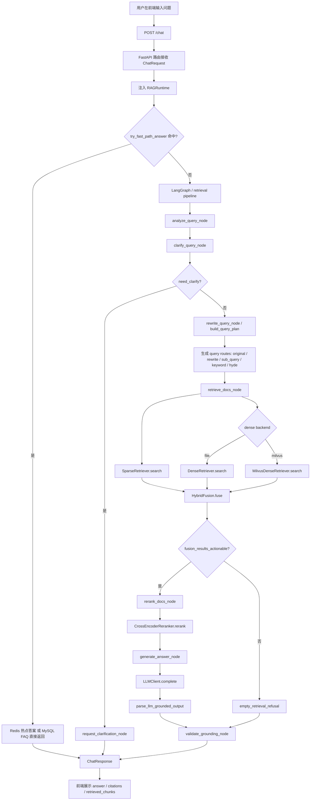
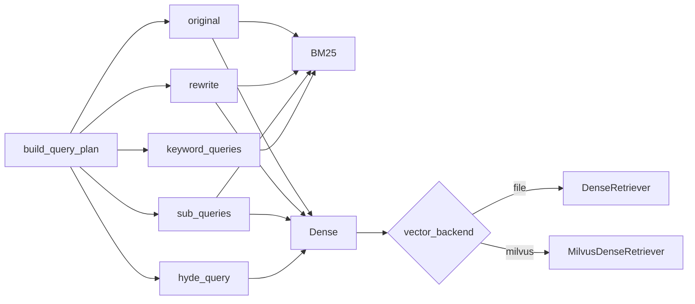

# Enterprise RAG Platform - 功能链路详解

## 目录

1. [问答功能全链路](#1-问答功能全链路)
2. [流式问答功能全链路](#2-流式问答功能全链路)
3. [入库功能全链路](#3-入库功能全链路)
4. [重建索引功能全链路](#4-重建索引功能全链路)
5. [评测功能全链路](#5-评测功能全链路)
6. [前端交互链路](#6-前端交互链路)

---

## 1. 问答功能全链路

### 1.1 学习这一节时，你要先抓住的核心结论

这个项目的问答功能不是“用户提问 -> 直接调大模型 -> 返回答案”。

它真正的工程链路是：

1. 先判断能不能走更便宜、更稳定的快速通道
2. 再判断问题是不是足够明确，是否需要先追问用户
3. 再进入完整 RAG 检索链路
4. 召回后不是直接生成，而是先融合、再门控、再重排
5. 生成后不是直接相信模型，而是再做 grounded 校验
6. 最后才把内部状态收敛成稳定的 API 响应

如果你把这 6 个判断点记住，这个项目的问答骨架就抓住了。

### 1.2 先看完整链路图



### 1.3 这条链路其实有 3 条真实路径

#### 路径 A：快速通道

适用场景：

- 高频 FAQ
- 已缓存热点问答
- 答案稳定、变化不频繁的问题

特点：

- 不走向量检索
- 不走 rerank
- 不走 LLM 生成
- 响应快、成本低、稳定性高

#### 路径 B：澄清通道

适用场景：

- 问题过短
- 只有“这个报错怎么解决”这类模糊描述
- 缺少错误码、日志、环境、版本、比较对象

特点：

- 不急着检索
- 先追问，把歧义收敛
- 避免把错误问题送进后续检索链路

#### 路径 C：完整 RAG 通道

适用场景：

- 问题信息足够明确
- 快速通道未命中
- 需要在知识库中检索证据后作答

特点：

- 混合检索
- 融合与门控
- Cross-Encoder 重排
- grounded generation
- grounding 校验

### 1.4 第 0 步：前端采集问题并发起请求

对应文件：

- [apps/web/src/App.tsx](/Users/zhangzhijin/study/黑马学习/rag/RAG-demo1/enterprise-rag-platform/apps/web/src/App.tsx)

前端核心状态：

```ts
const [question, setQuestion] = useState(...)
const [topK, setTopK] = useState(8)
const [stream, setStream] = useState(false)
```

这 3 个字段分别控制：

- `question`：用户自然语言问题
- `topK`：最终重排后保留多少条上下文
- `stream`：是否以流式方式返回答案

非流式请求最小示例：

```ts
await fetch(apiPath("/chat", apiBase), {
  method: "POST",
  headers: { "Content-Type": "application/json" },
  body: JSON.stringify({
    question: question.trim(),
    top_k: topK,
    stream: false,
  }),
})
```

这里有一个非常重要的工程思想：

> 前端只暴露少量稳定参数，复杂的检索、融合、重排参数统一留在后端控制。

为什么这样设计：

1. 避免前端直接感知太多底层实现细节
2. 后端可以在不改接口的情况下持续优化召回策略
3. 统一由后端做参数约束，更利于线上稳定性

### 1.5 第 1 步：路由接收请求并完成 schema 校验

对应文件：

- [apps/api/routes/chat.py](/Users/zhangzhijin/study/黑马学习/rag/RAG-demo1/enterprise-rag-platform/apps/api/routes/chat.py)
- [apps/api/schemas/chat.py](/Users/zhangzhijin/study/黑马学习/rag/RAG-demo1/enterprise-rag-platform/apps/api/schemas/chat.py)

核心入口：

```python
@router.post("")
async def chat(
    body: ChatRequest,
    runtime: RAGRuntime = Depends(get_runtime_dep),
):
```

请求模型：

```python
class ChatRequest(BaseModel):
    question: str
    conversation_id: str | None = None
    top_k: int = Field(default=8, ge=1, le=64)
    stream: bool = False
```

这里你要学会看懂两层职责：

#### 第一层：Pydantic 校验

作用：

- 保证 `question` 一定存在
- 保证 `top_k` 范围可控
- 避免异常请求把后面链路打穿

为什么不用在函数里手写 `if top_k < 1`：

- schema 校验更集中
- 错误响应格式统一
- 维护成本更低

#### 第二层：依赖注入 `runtime`

作用：

- 给当前请求注入统一运行时对象
- 运行时里挂着 sparse、dense、reranker、llm、cache、store、settings 等核心依赖

这是一种典型的工程装配思想：

> 路由层只负责“接请求”和“交给运行时”，不负责自己初始化底层组件。

### 1.6 第 2 步：由一个 `top_k` 派生内部多组参数

对应文件：

- [apps/api/routes/chat.py](/Users/zhangzhijin/study/黑马学习/rag/RAG-demo1/enterprise-rag-platform/apps/api/routes/chat.py)

关键代码：

```python
sk = min(body.top_k * 2, runtime.settings.bm25_top_k + 10)
dk = min(body.top_k * 2, runtime.settings.dense_top_k + 10)
```

这一步的真实含义是：

- 用户给的是“最终我想看多少条结果”
- 系统内部要把它扩成“召回阶段先多拿一些候选”

为什么要这样做：

1. 检索阶段目标是召回率，不是最终精度
2. 重排阶段目标才是从候选中选出最好的少数片段
3. 如果一开始只拿很小的 `top_k`，有价值片段可能在召回阶段就被漏掉

一个直观例子：

- 用户希望最终保留 8 条上下文
- 系统可能先用 BM25 找 16 条、Dense 找 16 条
- 融合后再交给 rerank，最终只保留 8 条

这就是经典的两阶段思想：

```text
高召回候选集 -> 高精度重排集
```

同类方案如何选：

1. 小型 demo 可以直接检索 8 条然后生成，简单但不稳
2. 生产场景更推荐“先扩召回，再收敛”，当前项目采用的就是这个方案

### 1.7 第 3 步：先走快速通道 `try_fast_path_answer`

对应文件：

- [core/orchestration/fast_path.py](/Users/zhangzhijin/study/黑马学习/rag/RAG-demo1/enterprise-rag-platform/core/orchestration/fast_path.py)
- [core/orchestration/graph.py](/Users/zhangzhijin/study/黑马学习/rag/RAG-demo1/enterprise-rag-platform/core/orchestration/graph.py)

关键代码：

```python
fast = await try_fast_path_answer(runtime, question)
if fast is not None:
    return {
        **fast,
        "conversation_id": conversation_id,
        "errors": [],
    }
```

快速通道的执行顺序：

```text
question
  -> 归一化问题文本
  -> 查 Redis 热点答案缓存
  -> 若未命中则查 MySQL FAQ 检索
  -> 若 FAQ 置信度达标则直接返回
  -> 否则进入完整 RAG
```

为什么这个设计很重要：

很多人做 RAG 时会下意识认为：

> 所有问题都应该走 embedding -> retrieval -> rerank -> LLM。

但生产系统里并不是这样。  
对于高频、稳定、结构化的问题，完整 RAG 往往不是最优解。

快速通道的价值：

1. 响应更快
2. 成本更低
3. 答案更稳定
4. 让 RAG 只处理真正需要检索和生成的复杂问题

这个思路很像 Web 系统里的缓存层：

```text
热点请求先走 cache
复杂请求再走主链路
```

技术选型说明：

1. Redis 热点答案缓存
   适合高频、重复问题
2. MySQL FAQ
   适合结构化问答资产、人工维护知识
3. 完整 RAG
   适合长文档知识、开放式检索问答

如果以后升级，可以考虑：

1. 给 FAQ 增加别名词、同义词表
2. 对热门问题做 embedding 缓存命中
3. 给 fast path 增加命中统计与自动回灌策略

### 1.8 第 4 步：构建 LangGraph 主图，显式管理分支

对应文件：

- [core/orchestration/graph.py](/Users/zhangzhijin/study/黑马学习/rag/RAG-demo1/enterprise-rag-platform/core/orchestration/graph.py)

核心代码：

```python
graph.add_edge(START, "analyze")
graph.add_edge("analyze", "clarify")
graph.add_conditional_edges(
    "clarify",
    route_clarify,
    {"ask": "ask_clarify", "continue": "rewrite"},
)
graph.add_edge("rewrite", "retrieve")
graph.add_conditional_edges(
    "retrieve",
    route_retrieve,
    {"empty": "refuse_empty", "ok": "rerank"},
)
graph.add_edge("rerank", "generate")
graph.add_edge("generate", "validate")
```

完整图的主路径现在是：

```text
analyze -> clarify -> rewrite -> retrieve -> rerank -> generate -> validate
```

两条分支路径：

```text
clarify -> ask_clarify -> validate
retrieve -> refuse_empty -> validate
```

为什么要用 LangGraph，而不是在一个大函数里 `if/else` 写完：

1. 流程节点更显式
2. 分支更清楚
3. 后续更容易插入新节点
4. 便于把“状态变化”作为一等公民管理

你可以把 LangGraph 理解成：

> 它不是在替代检索或生成，而是在替代“混乱的控制流”。

### 1.9 第 5 步：查询分析 `analyze_query_node`

对应文件：

- [core/orchestration/nodes/analyze_query.py](/Users/zhangzhijin/study/黑马学习/rag/RAG-demo1/enterprise-rag-platform/core/orchestration/nodes/analyze_query.py)

核心代码：

```python
if _CODE_RE.search(q):
    qtype = "error_code"
elif re.search(r"流程|步骤|SOP|怎么|如何", q):
    qtype = "procedure"
else:
    qtype = "general"
```

当前实现原理：

- 用正则识别错误码类问题
- 用规则识别流程类问题
- 其余归到通用类问题

这个节点看起来简单，但战略作用很大：

1. 它是 query routing 的起点
2. 它决定后续是否需要专门的改写策略
3. 它也可以决定未来是否走不同知识源

为什么这里先用规则而不是直接上分类模型：

1. 当前分类目标很少
2. 规则足够快、足够稳
3. 维护成本低
4. 错误码 / 流程词这类模式本身就很适合规则

可升级方向：

1. 用小模型做 query intent classification
2. 结合历史对话做更稳的意图识别
3. 按 query_type 动态切换检索器和 prompt

### 1.10 第 6 步：澄清判定 `clarify_query_node`

对应文件：

- [core/orchestration/nodes/clarify_query.py](/Users/zhangzhijin/study/黑马学习/rag/RAG-demo1/enterprise-rag-platform/core/orchestration/nodes/clarify_query.py)

这是当前项目很值得你重点学习的一步。  
很多 RAG 系统答不准，不是检索器不行，而是问题本身就不够明确。

典型坏问题：

- `这个报错怎么处理`
- `怎么部署`
- `这个和那个有什么区别`

这些问题的共同点是：

1. 缺少错误码
2. 缺少日志
3. 缺少版本
4. 缺少环境
5. 缺少比较对象

当前实现是“规则 + LLM”双层判定：

```text
先查缓存
  -> 规则判定高风险模糊问题
  -> 如果没有启用 LLM，直接返回规则结果
  -> 如果启用 LLM，再让 LLM 输出 need_clarify 的 JSON
  -> 如果 LLM 判定不稳，就回退到规则结果
```

这里的设计非常工程化：

1. 规则负责兜底
2. LLM 负责补语言理解能力
3. 缓存负责降低重复判断成本

为什么不能只靠 LLM 判断是否澄清：

1. LLM 结果不完全稳定
2. 显著高风险模糊问题应该优先被规则拦住
3. 生产系统更强调保守正确，而不是“有时聪明”

最值得学习的一段逻辑：

```python
if heuristic.need_clarify and not need_clarify:
    need_clarify = True
    clarify_question = heuristic.clarify_question
```

这表示：

> 如果规则已经认定这是高风险模糊问题，就不要轻易被 LLM 放过去。

这是一种很典型的“高风险场景保守优先”思想。

### 1.11 第 7 步：查询规划与策略选择 `rewrite_query_node`

对应文件：

- [core/orchestration/nodes/rewrite_query.py](/Users/zhangzhijin/study/黑马学习/rag/RAG-demo1/enterprise-rag-platform/core/orchestration/nodes/rewrite_query.py)
- [core/orchestration/query_expansion.py](/Users/zhangzhijin/study/黑马学习/rag/RAG-demo1/enterprise-rag-platform/core/orchestration/query_expansion.py)
- [core/retrieval/cache.py](/Users/zhangzhijin/study/黑马学习/rag/RAG-demo1/enterprise-rag-platform/core/retrieval/cache.py)

这一节就是你刚才指出的重点。

如果按“学习和架构表达”的视角，这里不应该只叫“query rewrite”，而应该叫：

```text
策略选择模型 / 查询规划层
```

当前项目没有把它单独做成一个大盒子，而是拆成了 3 层：

1. `analyze_query_node`
   判断问题类型，比如 `error_code / procedure / general`
2. `clarify_query_node`
   判断问题是否信息不足，需不需要先追问
3. `rewrite_query_node -> build_query_plan`
   真正生成多路查询计划

也就是说，你图里的“策略选择模型”在当前代码里是分布式落地的，不是一个单点类。

执行顺序：

```text
原问题
  -> 结合 query_type
  -> 生成 cache_key
  -> 查缓存
  -> 无 LLM 时走规则版 query plan
  -> 有 LLM 时结构化生成 query plan
  -> 用规则结果做字段级兜底
  -> 缓存 query plan
```

当前这个“策略选择层”最终产出的不是一个 query，而是一份检索计划：

```python
QueryPlan(
    rewritten_query=...,
    multi_queries=[...],
    keyword_queries=[...],
    hyde_query="...",
    planning_summary="...",
)
```

这 5 个字段本质上对应了 5 种不同的检索意图：

1. `rewritten_query`
   让 query 变得更像“适合被检索器理解”的表达
2. `multi_queries`
   把复杂问题拆成多个切面，扩召回面
3. `keyword_queries`
   把错误码、产品名、术语、路径这类词面锚点抠出来，交给 BM25
4. `hyde_query`
   构造一个假设答案式 query，交给 Dense 做语义召回
5. `planning_summary`
   留给日志、调试和 badcase 分析看

#### 1.11.1 对照源码看“策略选择”怎么落到代码里

关键代码思路：

```python
if query_type == "error_code":
    rewritten = f"{question} {code} 原因 排查 处理方法"
    multi_queries.extend([f"{code} 是什么", f"{code} 原因", f"{code} 处理方法"])
elif query_type == "procedure":
    rewritten = f"{question} SOP 步骤 前置条件 注意事项"
    multi_queries.extend([f"{question} 步骤", f"{question} 前置条件", f"{question} 注意事项"])
```

这说明当前系统已经不是“只有一条 rewrite query”了，而是会基于问题类型，生成更适合不同检索器的 route。

#### 1.11.2 为什么不能只有一条 query

因为不同检索器偏好的 query 形式不同。

举个更接近你那张图的例子：

```text
原问题：我有一个包含 100 亿条记录的数据集，想把它存到 Milvus 中进行查询，可以吗？
```

一次规划后可能得到：

```text
rewritten_query:
Milvus 海量数据写入 查询 可行性 限制

multi_queries:
- Milvus 支持多大规模数据
- Milvus 写入性能和查询性能
- 海量数据存储到 Milvus 的注意事项

keyword_queries:
- Milvus
- 100 亿
- 查询

hyde_query:
- Milvus 支持超大规模向量数据集的存储与检索，但需要合理设计分片、索引和资源规划
```

这里每一路 query 的职责都不一样：

1. `rewritten_query` 负责收敛表达
2. `multi_queries` 负责扩召回面
3. `keyword_queries` 负责精确词面命中
4. `hyde_query` 负责拉近语义空间

这其实就是你图里“直接检索 / 子查询 / 问题简化 / 假设问题”在当前代码中的映射。

#### 1.11.3 同类方案如何选型

1. single query rewrite
   最简单，但复杂问题容易漏召回
2. 纯规则多路扩展
   可解释、稳定，但覆盖面有限
3. 纯 LLM query planner
   灵活，但成本更高，也更依赖缓存和兜底
4. 当前项目方案：规则 + LLM + 缓存
   这是目前最稳、最容易维护的折中

#### 1.11.4 以后还可以怎么升级

1. 先做 intent router，再按意图切不同 planner
2. 为不同 route 配不同 top_k
3. 为不同 route 配不同 backend
4. 统计 route 命中率，自动裁剪低价值 route

### 1.12 第 8 步：多路检索调度与后端分发 `retrieve_docs_node`

对应文件：

- [core/orchestration/nodes/retrieve_docs.py](/Users/zhangzhijin/study/黑马学习/rag/RAG-demo1/enterprise-rag-platform/core/orchestration/nodes/retrieve_docs.py)
- [core/services/runtime.py](/Users/zhangzhijin/study/黑马学习/rag/RAG-demo1/enterprise-rag-platform/core/services/runtime.py)

这一步是“把策略选择真正执行出去”的地方。

也就是说：

```text
query plan 是计划
retrieve_docs_node 是执行器
```

这一步不能简单理解成“搜一下文档”。  
它实际上做了 6 层工作：

1. 组织多路 query 路线
2. 为每一路决定走 sparse、dense，还是两者都走
3. 根据 `vector_backend` 决定 dense 是本地矩阵还是 Milvus
4. 给每条命中补 trace
5. 按 chunk_id 去重聚合
6. 把 child 命中回扩成 parent，再做融合

当前 query route 设计：

```python
query_routes = [("original", question, "original", True, True)]
if rewritten.strip():
    query_routes.append(("rewrite", rewritten, "rewrite", True, True))
for sub_query in multi_queries:
    query_routes.append((..., "sub_query", True, True))
for keyword_query in keyword_queries:
    query_routes.append((..., "keyword", True, False))
if hyde_query.strip():
    query_routes.append(("hyde", hyde_query, "hyde", False, True))
```

这段代码背后的原理是：

1. `original`
   保留用户原始表达，避免改写把真实意图改坏
2. `rewrite`
   提供更检索友好的表达
3. `sub_query`
   把复杂问题拆成多个检索切面，扩召回面
4. `keyword`
   更适合 BM25 精确匹配
5. `hyde`
   更适合 Dense 语义检索

这就是典型的“多路线召回”思想：

> 不假设只有一条 query 能代表用户意图，而是让多种表达共同参与召回。

#### 1.12.1 多路 query 是怎么进入不同检索后端的



这张图才更接近你说的“策略选择模型 -> 多路查询 -> Milvus”。

#### 1.12.2 为什么你之前没在文档里明显看到 Milvus

因为 `Milvus` 不是独立问答节点，而是 dense backend 的一种实现。

关键装配逻辑：

```python
if self.settings.vector_backend == "milvus":
    self._dense = MilvusDenseRetriever(self.settings)
else:
    self._dense = DenseRetriever(self.settings)
```

所以更准确的表述不是：

```text
所有 query 一定直接进 Milvus
```

而是：

```text
所有需要 dense 的 query route 都会进入 dense backend；
当 dense backend 被配置成 milvus 时，这些 route 才会真正落到 Milvus。
```

#### 1.12.3 为什么不是“所有路都只进 Milvus”

因为当前系统是混合检索架构：

1. 稀疏路负责错误码、路径、术语这类精确词锚点
2. 稠密路负责语义近义和口语表达
3. parent 回扩、fusion、rerank 仍然依赖本地可读索引镜像

所以当前最准确的工程表述是：

```text
多路 query
  -> sparse / dense 分路执行
  -> dense backend 可选 file 或 milvus
  -> unified fusion
  -> rerank
  -> grounded answer
```

### 1.13 第 9 步：稀疏检索 `SparseRetriever.search`

对应文件：

- [core/retrieval/sparse_retriever.py](/Users/zhangzhijin/study/黑马学习/rag/RAG-demo1/enterprise-rag-platform/core/retrieval/sparse_retriever.py)

稀疏检索的核心技术是 BM25。  
它最擅长的不是“语义理解”，而是“词面精准命中”。

为什么企业知识问答一定要保留 BM25：

1. 错误码检索非常依赖精确词匹配
2. 文件路径、命令、缩写词通常更适合 sparse
3. 一些专业术语哪怕 embedding 一般，BM25 也能稳命中

示例：

```text
query: E-1001 如何处理
chunk_a: 当系统报错 E-1001 时，请检查 Redis 连接
chunk_b: 系统出现异常时请检查基础服务
```

BM25 通常会强烈偏向 `chunk_a`，因为它含有精确的 `E-1001`。

同类方案如何选：

1. 只用 Dense
   对错误码、路径、命令类问题不稳
2. 只用 BM25
   对语义改写问题不稳
3. BM25 + Dense 混合
   当前项目采用，最稳

#### 1.13.1 对照源码看 BM25 是怎么跑起来的

核心代码：

```python
q = tokenize(query)
scores = self._bm25.get_scores(q)
ranked = sorted(enumerate(scores), key=lambda x: x[1], reverse=True)[:k]
```

这里其实就是 3 步：

1. 把 query 切成 token
2. 对每个 chunk 计算 BM25 分数
3. 取分数最高的前 `k` 个

#### 1.13.2 `tokenize` 为什么要自己写

对应代码：

```python
_TOKEN_RE = re.compile(r"[\w\u4e00-\u9fff]+", re.UNICODE)
return [t.lower() for t in _TOKEN_RE.findall(text)]
```

这个 tokenizer 不是追求最细分词，而是追求：

> 对企业知识问答最稳定、最够用的词法切分。

它重点兼容：

1. 英文单词
2. 数字和错误码
3. 中文字符

这样 `Redis`、`E-1001`、`Docker`、中文 SOP 名称都更容易进入检索。

#### 1.13.3 BM25 的打分原理到底是什么

BM25 会同时考虑：

1. 查询词在当前 chunk 里出现得多不多
2. 这个词在整个知识库里稀不稀有
3. 当前 chunk 是不是长得过分离谱

可以把它粗略理解成：

```text
相关性 = 词频贡献 × 稀有词加权 × 文档长度校正
```

也就是说，BM25 擅长的不是“深层语义”，而是：

> 把真正带检索锚点的词精确地抓出来。

#### 1.13.4 一个最适合记忆的例子

假设 query 是：

```text
E-1001 Redis 连接
```

两个候选 chunk：

```text
chunk_a: 系统报错 E-1001 时，请检查 Redis 连接和密码配置。
chunk_b: Redis 是常用缓存组件，支持高性能读写。
```

`chunk_a` 更可能排前，因为：

1. 同时命中了 `E-1001` 和 `Redis`
2. `E-1001` 在全库里通常是高区分度 token
3. 整段内容主题就是排障

#### 1.13.5 为什么 BM25 默认只索引 child chunk

对应代码：

```python
self._chunks = [c for c in chunks if c.searchable]
```

这里默认只把 `searchable=True` 的 chunk 放入 BM25，也就是 child chunk。

原因：

1. child 更短，关键词密度更高
2. child 更适合精准召回
3. parent 太长时，词频和长度会引入更多噪声

### 1.14 第 10 步：稠密检索 `DenseRetriever.search / MilvusDenseRetriever.search`

对应文件：

- [core/retrieval/dense_retriever.py](/Users/zhangzhijin/study/黑马学习/rag/RAG-demo1/enterprise-rag-platform/core/retrieval/dense_retriever.py)
- [core/retrieval/milvus_retriever.py](/Users/zhangzhijin/study/黑马学习/rag/RAG-demo1/enterprise-rag-platform/core/retrieval/milvus_retriever.py)

稠密检索的核心思想是：

> 把 query 和 chunk 都编码到同一个向量空间里，用向量相似度找语义接近的内容。

为什么 Dense 必不可少：

用户问法和文档写法经常不一致。

示例：

```text
用户问：密码忘了怎么办
文档写：账号密码重置流程
```

这时 BM25 不一定稳定，但 Dense 往往能把它们拉近。

Dense 的优势：

1. 处理语义近义表达
2. 处理口语化问法
3. 对改写和 paraphrase 更鲁棒

Dense 的局限：

1. 对错误码、路径、命令等精确 token 不一定占优
2. 分数可解释性通常不如 BM25
3. embedding 模型选型不当时会带来明显波动

这里你还要额外记住一个工程事实：

> 当前项目的 dense 检索有两个 backend，但对上层节点暴露的是同一个接口。

也就是：

1. `DenseRetriever`
   适合本地学习、单机调试、中小规模数据
2. `MilvusDenseRetriever`
   适合把 dense retrieval 升级到正式向量数据库

它们对 `retrieve_docs_node` 来说都叫：

```python
runtime.dense.search(query, top_k=dk)
```

这样主链路就不用改，但后端实现可以升级。

#### 1.14.1 对照源码看 Dense 检索怎么实现

核心代码：

```python
q = self.embed_query(query)
sims = self._matrix @ q
ranked = np.argsort(-sims)[:k]
```

可以拆成 3 步：

1. 把 query 编码成向量
2. 让 query 向量和所有 chunk 向量做批量相似度计算
3. 取相似度最高的前 `k` 个

#### 1.14.2 为什么矩阵乘法就能当相似度

对应代码：

```python
self._get_model().encode(texts, normalize_embeddings=True)
```

这里把向量做了归一化。  
归一化后，向量长度接近 1，这时点积就近似等于余弦相似度。

也就是：

```text
cos(a, b) = a · b / (|a||b|)
```

当 `|a|` 和 `|b|` 都接近 1 时：

```text
cos(a, b) ≈ a · b
```

所以项目里可以直接用：

```python
sims = self._matrix @ q
```

做一整批文档的相似度计算。

#### 1.14.3 Dense 为什么能召回“词不一样但意思接近”的内容

因为 embedding 模型训练的目标之一，就是让语义相近的句子在向量空间里靠近。

例如：

```text
query: 密码忘了怎么办
doc: 账号密码重置流程
```

词面不同，但语义接近，所以 Dense 往往更容易命中。

#### 1.14.4 Dense 的风险点

Dense 的典型风险有：

1. 精确 token 可能被语义相近文本稀释
2. 向量相似不代表业务上真的可回答
3. embedding 模型切换后，历史阈值可能整体漂移

所以生产里通常不会只靠 Dense 单独作答。

### 1.15 第 11 步：为什么还要做 child -> parent 回扩

对应文件：

- [core/orchestration/nodes/retrieve_docs.py](/Users/zhangzhijin/study/黑马学习/rag/RAG-demo1/enterprise-rag-platform/core/orchestration/nodes/retrieve_docs.py)

这一段是很多学习者最容易忽略，但非常关键的地方。

当前实现思路是：

1. 检索阶段更喜欢短小的 child chunk
2. 生成阶段更喜欢更完整的 parent chunk
3. 所以命中 child 后，要把它重新映射回 parent

为什么检索不直接拿 parent：

1. parent 太长，信息密度低
2. 检索粒度太粗
3. 一个长 parent 里可能只有一小段真相关

为什么生成又不直接喂 child：

1. child 可能上下文不完整
2. 引用展示不友好
3. 回答时容易缺条件、缺步骤、缺前后因果

所以项目采用的折中是：

```text
child 用于召回
parent 用于 rerank 和 generation
```

这是一个非常常见、也非常值得学的工程模式。

#### 1.15.1 对照源码看回扩逻辑

关键代码：

```python
parent_chunk = _resolve_parent_chunk(runtime, hit)
parent_id = parent_chunk.metadata.chunk_id
```

它的逻辑是：

1. 如果当前命中的就是 parent，直接用自己
2. 如果当前命中的是 child，就通过 `parent_chunk_id` 回查 parent
3. 如果回查失败，再退化使用 child 自身，保证链路不断

#### 1.15.2 为什么 parent 分数默认取 `max(child_score)`

项目当前策略是：

> 一个 parent 下只要有一个 child 特别相关，这个 parent 就值得进入候选。

为什么先用 `max`：

1. 语义直观
2. 容易解释
3. 不会被同一 parent 下其他弱相关 child 稀释掉

未来可升级成：

1. `max + coverage bonus`
2. `top-2 mean`
3. 按命中路线数量加权

### 1.16 第 12 步：混合融合 `HybridFusion.fuse`

对应文件：

- [core/retrieval/hybrid_fusion.py](/Users/zhangzhijin/study/黑马学习/rag/RAG-demo1/enterprise-rag-platform/core/retrieval/hybrid_fusion.py)

项目支持两种融合方式：

1. `RRF`
2. `weighted fusion`

#### 为什么需要融合

因为 sparse 和 dense 各自只看到了问题的一部分。

- sparse 擅长词面
- dense 擅长语义

如果只信一路，另一类优势就被浪费了。

#### RRF 原理

RRF 的思想不是比较原始分数，而是比较“排名”。

公式直觉：

```text
score = 1 / (k + rank_1) + 1 / (k + rank_2) + ...
```

它的优点是：

1. 不要求不同检索器分数同尺度
2. 对工程实现更稳
3. 适合作为默认融合方案

#### weighted fusion 原理

weighted fusion 的思想是：

1. 先把 sparse / dense 分数粗归一化
2. 再按权重线性组合

适用场景：

- 你比较清楚两路检索的重要性
- 你已经做过离线调参
- 你愿意维护分数尺度和阈值

当前项目为什么默认更偏向 RRF 思路：

> RRF 对“分数不可比”更鲁棒，生产上更容易先跑稳。

#### 1.16.1 对照源码看 RRF 是如何实现的

核心代码：

```python
for rank, item in enumerate(lst, start=1):
    scores[cid] += 1.0 / (k + rank)
```

这表示：

1. 某个 chunk 在榜单里越靠前，贡献越大
2. 贡献是平滑递减的，不是断崖式变化
3. 多路榜单都排得靠前的 chunk 会自然浮上来

例如：

```text
BM25 排名 1 -> 贡献 1 / (60 + 1)
Dense 排名 3 -> 贡献 1 / (60 + 3)
总分 = 两次贡献相加
```

#### 1.16.2 weighted fusion 为什么更难调

核心代码：

```python
scores = {
    cid: sparse_weight * s_map.get(cid, 0.0) + w_d * d_map.get(cid, 0.0)
    for cid in keys
}
```

weighted 看起来更直观，但更难调的原因是：

1. 先要保证两路分数归一化合理
2. 再要调 `sparse_weight`
3. 最后还要重新理解阈值 `min_retrieval_score`

所以它更适合离线调参较充分的场景。

#### 1.16.3 融合还能怎么升级

可升级方向：

1. 按 query 类型动态选融合策略
2. 基于学习排序模型做融合
3. 把文档新鲜度、知识源质量也纳入融合特征

### 1.17 第 13 步：融合门控 `fusion_results_actionable`

对应文件：

- [core/orchestration/fusion_gate.py](/Users/zhangzhijin/study/黑马学习/rag/RAG-demo1/enterprise-rag-platform/core/orchestration/fusion_gate.py)
- [core/orchestration/policies/fallback.py](/Users/zhangzhijin/study/黑马学习/rag/RAG-demo1/enterprise-rag-platform/core/orchestration/policies/fallback.py)

关键逻辑：

```python
if not fused_hits:
    return False
if settings.fusion_strategy != "weighted":
    return True
best = max(float(x.get("score", 0.0)) for x in fused_hits)
return best >= settings.min_retrieval_score
```

这一步的本质是：

> 不是什么检索结果都值得继续进入生成。

为什么要在 rerank 前做第一道门：

1. 空召回直接终止，最省成本
2. 低质量召回继续往后走，大概率只会生成幻觉
3. 先挡住明显无效候选，后续模块更稳定

这里有个容易忽略的细节：

RRF 分数和 weighted 分数的量纲不一样，所以项目只在 `weighted fusion` 时用 `min_retrieval_score` 阈值。

这就是典型的工程细节：

> 阈值不是抽象概念，它必须跟分数定义绑定。

#### 1.17.1 为什么门控应该尽量前置

门控前置的收益非常大：

1. 省 rerank 计算
2. 省 LLM 生成成本
3. 降低“低质量证据被模型包装成高质量答案”的风险

很多初学者喜欢把拒答只放在最后，但更稳的做法是：

```text
能早拒答，就别晚拒答
```

### 1.18 第 14 步：Cross-Encoder 重排 `rerank_docs_node`

对应文件：

- [core/orchestration/nodes/rerank_docs.py](/Users/zhangzhijin/study/黑马学习/rag/RAG-demo1/enterprise-rag-platform/core/orchestration/nodes/rerank_docs.py)
- [core/retrieval/reranker.py](/Users/zhangzhijin/study/黑马学习/rag/RAG-demo1/enterprise-rag-platform/core/retrieval/reranker.py)

关键代码：

```python
pairs = [[query, c.content] for c in candidates]
scores = self._get_model().predict(pairs, show_progress_bar=False)
```

Rerank 的原理可以理解为：

1. 检索阶段像“粗筛简历”
2. rerank 阶段像“面试官逐个精看候选”

为什么检索后还要 rerank：

因为检索器通常只能粗略判断“相关不相关”，但很难在前几名里做到非常细的排序。

Cross-Encoder 和 Dual-Encoder 的差异：

1. Dual-Encoder
   query 和 doc 分别编码，适合大规模召回
2. Cross-Encoder
   query 和 doc 一起输入模型，交互更充分，适合小规模精排

所以经典搭配就是：

```text
Dual-Encoder / BM25 召回
  -> Cross-Encoder 精排
```

当前项目选择它的原因：

1. 候选集已经不大
2. 需要更高精度的最终上下文
3. rerank 比直接把所有候选喂给 LLM 更便宜、更可控

#### 1.18.1 对照源码看 Cross-Encoder 在做什么

关键代码：

```python
pairs = [[query, c.content] for c in candidates]
scores = self._get_model().predict(pairs, show_progress_bar=False)
```

这里的含义不是“再做一次向量相似度”，而是：

> 让模型直接看 `query + chunk` 这一对文本，然后判断它们是否相关。

这和 Dense 的差别很大：

1. Dense 是分别编码再比相似度
2. Cross-Encoder 是联合看一对文本

#### 1.18.2 为什么 Cross-Encoder 更准但更慢

因为它没有预先把文档全部编码好。  
每次 query 来了，都要针对每个候选重新做一遍联合推理。

所以它适合：

- 小规模候选精排

不适合：

- 全库大规模召回

#### 1.18.3 一个直观例子

假设 query 是：

```text
怎么处理 E-1001
```

两个候选：

```text
a: E-1001 常见原因与修复步骤
b: Redis 基础介绍与安装指南
```

召回阶段 `a` 和 `b` 可能都进来了。  
但 Cross-Encoder 在真正对照 `query + a`、`query + b` 后，通常会更稳地把 `a` 排到更前面。

### 1.19 第 15 步：生成前再做一次可靠性门控

对应文件：

- [core/orchestration/nodes/generate_answer.py](/Users/zhangzhijin/study/黑马学习/rag/RAG-demo1/enterprise-rag-platform/core/orchestration/nodes/generate_answer.py)

关键逻辑：

```python
if not contexts:
    return {... "refusal_reason": "empty_context"}

max_score = max(c.score for c in contexts)
if max_score < runtime.settings.min_rerank_score:
    return {... "refusal_reason": "low_relevance"}
```

这里你要特别记住：

项目不是只有一层门控，而是至少两层：

1. 检索融合后门控
2. rerank 后生成前再门控

为什么还要第二次门控：

因为“有候选”不等于“候选足够好到可以作答”。

这一步的思想是：

> 宁可保守拒答，也不要带着低质量证据去让模型生成一个看起来很像真的答案。

#### 1.19.1 为什么不能把“是否低相关”交给 LLM 自己判断

原因：

1. LLM 很容易被输入上下文诱导
2. 一旦你把低质量证据喂进去，它通常会倾向于“努力回答”
3. 这样会把检索噪声放大成生成幻觉

所以更稳的做法是：

> 先用系统阈值挡掉明显不可靠的上下文，再决定要不要让 LLM 开口。

### 1.20 第 16 步：grounded prompt 组装

对应文件：

- [core/generation/context_format.py](/Users/zhangzhijin/study/黑马学习/rag/RAG-demo1/enterprise-rag-platform/core/generation/context_format.py)
- [core/generation/prompts/templates.py](/Users/zhangzhijin/study/黑马学习/rag/RAG-demo1/enterprise-rag-platform/core/generation/prompts/templates.py)

关键代码：

```python
ctx_text = format_context_blocks(contexts)
user = f"QUESTION:\n{rq}\n\nCONTEXT:\n{ctx_text}"
messages = [
    {"role": "system", "content": GROUNDED_ANSWER_SYSTEM},
    {"role": "user", "content": user},
]
```

`format_context_blocks` 输出的上下文长这样：

```text
[CHUNK_ID:abc] title=密码重置 SOP source=sop.md page=2 section=常见错误
请先进入控制台，再点击“重置密码”...
```

为什么一定要把 `chunk_id` 显式放进 prompt：

1. 让模型引用时有稳定锚点
2. 后处理时可以做白名单校验
3. 前端可以展示可追溯引用

为什么不只把“纯正文”喂给模型：

1. 模型需要知道来源
2. 需要知道标题、页码、section 等附加信息
3. 否则引用无法落到具体片段

#### 1.20.1 一个最小 grounded prompt 示例

可以把它理解成这样：

```text
SYSTEM:
你必须只依据给定 CONTEXT 作答，并给出引用。

USER:
QUESTION:
系统报 E-1001 怎么处理？

CONTEXT:
[CHUNK_ID:c1] title=错误码手册 source=ops.md page=3 section=E-1001
E-1001 通常表示 Redis 连接失败，请检查地址、端口和密码。
```

这个 prompt 的关键不是“写得花哨”，而是：

1. 问题和上下文边界清楚
2. 每个 chunk 都有稳定 id
3. 模型被明确约束只能依据给定上下文回答

#### 1.20.2 为什么 grounded prompt 比“多塞上下文”更重要

真正重要的不是上下文越多越好，而是：

1. 上下文是否相关
2. 引用锚点是否稳定
3. 输出格式是否可解析

所以好的 grounded prompt 重点在“可控”，不在“越长越好”。

### 1.21 第 17 步：调用 LLM 生成 grounded answer

对应文件：

- [core/generation/llm_client.py](/Users/zhangzhijin/study/黑马学习/rag/RAG-demo1/enterprise-rag-platform/core/generation/llm_client.py)
- [core/orchestration/nodes/generate_answer.py](/Users/zhangzhijin/study/黑马学习/rag/RAG-demo1/enterprise-rag-platform/core/orchestration/nodes/generate_answer.py)

关键调用：

```python
raw, _ = await runtime.llm.complete(messages, temperature=0.1, max_tokens=1024)
```

为什么这里的 prompt 叫 grounded answer：

因为它要求模型：

1. 只基于给定上下文回答
2. 输出引用
3. 输出 confidence
4. 输出 reasoning_summary

本质上，这是把开放式生成约束成“带证据的结构化生成”。

同类方案如何选：

1. 纯自由回答
   最简单，但最容易幻觉
2. 让模型输出 JSON
   结构更强，但有时可读性不够好
3. 当前项目这种“答案正文 + 结构化标记”
   兼顾可读性和可解析性

#### 1.21.1 为什么这里 `temperature` 比较低

关键调用里用了：

```python
temperature=0.1
```

原因是当前任务不是创作，而是：

1. 基于证据作答
2. 输出稳定结构
3. 尽量减少自由发挥

在这种场景下，低温度通常更符合可控性目标。

### 1.22 第 18 步：解析模型输出 `parse_llm_grounded_output`

对应文件：

- [core/generation/answer_builder.py](/Users/zhangzhijin/study/黑马学习/rag/RAG-demo1/enterprise-rag-platform/core/generation/answer_builder.py)

关键目标：

1. 解析 `ANSWER`
2. 解析 `CONFIDENCE`
3. 解析 `REASONING_SUMMARY`
4. 解析 `CITATIONS_JSON`
5. 校验引用是否真的来自当前上下文

关键代码：

```python
id_set = {c.chunk_id for c in contexts}
for item in arr:
    cid = item.get("chunk_id")
    if cid and cid in id_set:
        ...
```

为什么这一步非常关键：

因为模型可能出现两类问题：

1. 格式不规范
2. 编造引用

所以这个函数不是“美化输出”，而是在做：

> 把 LLM 文本重新收敛成系统可信的结构化数据。

它还有一个很重要的降级策略：

1. 先尝试解析 `CITATIONS_JSON`
2. 如果失败，再退化解析 `[CHUNK_ID:xxx]`
3. 如果还不行，也至少保留 `answer` 文本

这体现的是生产系统常见的容错思想：

> 不把成功路径建立在“模型永远严格遵守格式”上。

#### 1.22.1 对照源码看解析顺序

这个函数大致按下面的顺序工作：

```text
原始文本
  -> 提取 CONFIDENCE
  -> 提取 REASONING_SUMMARY
  -> 提取 ANSWER
  -> 优先解析 CITATIONS_JSON
  -> 失败时退化解析 [CHUNK_ID:xxx]
  -> 返回结构化字段
```

这个顺序很合理，因为：

1. `ANSWER` 是最低保底
2. `CITATIONS_JSON` 是最稳定的引用来源
3. 文本正则引用只是最后兜底

#### 1.22.2 为什么一定要做引用白名单校验

关键代码：

```python
id_set = {c.chunk_id for c in contexts}
if cid and cid in id_set:
    ...
```

它的意义是：

> 模型只能引用系统真的给过它的 chunk，不能自己临时编一个看起来像真的 `chunk_id`。

这是 grounded generation 真正落地的关键之一。

### 1.23 第 19 步：grounding 校验 `validate_grounding_node`

对应文件：

- [core/orchestration/nodes/validate_grounding.py](/Users/zhangzhijin/study/黑马学习/rag/RAG-demo1/enterprise-rag-platform/core/orchestration/nodes/validate_grounding.py)

校验内容：

1. 非拒答答案是否带引用
2. 引用的 chunk_id 是否属于当前召回上下文
3. confidence 是否低于系统阈值
4. 是否需要把最终结果改判为 refusal

关键逻辑：

```python
if not refusal and not citations:
    grounding_ok = False
    conf = min(conf, 0.25)
    refusal = True
```

这段逻辑代表了一个很重要的系统立场：

> 如果你说自己不是拒答，那你至少应该拿得出证据。

还有一个关键点：

```python
if conf < settings.refusal_confidence_threshold and not refusal:
    refusal = True
```

这表示：

> 模型自己给的置信度并不会被直接相信，而是还要经过系统阈值判断。

所以这里其实区分了两层“信任”：

1. 模型的自我判断
2. 系统的最终裁决

#### 1.23.1 这一步其实在做什么

可以把 `validate_grounding_node` 理解成一个最终裁判：

1. 检索负责提供证据
2. 生成负责组织答案
3. 校验负责决定“这个答案能不能真的发出去”

也就是说，系统不会因为模型已经说完了，就默认接受。

#### 1.23.2 三种典型失败场景

场景 A：答案没有引用

- 说明模型没有给出证据
- 系统会倾向于拒答或压低置信度

场景 B：引用了不存在的 chunk

- 说明模型可能在编造引用
- 系统会把 `grounding_ok` 置为 `False`

场景 C：模型自己给的置信度过低

- 就算文本看起来通顺
- 系统也可能拒答

这一步的工程本质是：

> 发给用户的，不是“模型最会说的话”，而是“系统愿意背书的话”。

### 1.24 第 20 步：收敛成对外响应 `ChatResponse`

对应文件：

- [apps/api/routes/chat.py](/Users/zhangzhijin/study/黑马学习/rag/RAG-demo1/enterprise-rag-platform/apps/api/routes/chat.py)
- [apps/api/schemas/chat.py](/Users/zhangzhijin/study/黑马学习/rag/RAG-demo1/enterprise-rag-platform/apps/api/schemas/chat.py)

最终响应构造：

```python
resp = ChatResponse(
    answer=state.get("answer") or "",
    confidence=float(state.get("confidence") or 0.0),
    fast_path_source=state.get("fast_path_source") or None,
    citations=_citations_from_state(state),
    retrieved_chunks=_chunks_from_state(state),
)
```

这个收口动作很重要，因为它把内部复杂状态压平为稳定 API：

- `answer`
- `confidence`
- `fast_path_source`
- `citations`
- `retrieved_chunks`

也就是说：

> 无论内部走了 fast path、clarify path，还是完整 RAG path，前端最终都拿同一套结构。

这会让前端和后端解耦得更好。

### 1.25 用一个完整例子把整条链路串起来

假设用户问题是：

```text
系统一直报 E-1001 怎么处理？
```

系统可能这样执行：

1. 前端把 `question=系统一直报 E-1001 怎么处理？` 发给 `/chat`
2. 路由层用 `ChatRequest` 校验请求
3. `run_rag_async` 先尝试 `try_fast_path_answer`
4. 如果 Redis / FAQ 没有命中，就进入图
5. `analyze_query_node` 判断这更像 `error_code`
6. `clarify_query_node` 发现问题里已经有错误码，不需要澄清
7. `rewrite_query_node` 把 query 改写成更适合检索的表达
8. `retrieve_docs_node` 同时做 sparse 和 dense 召回
9. 检索命中 child chunk，再回扩到 parent chunk
10. `HybridFusion.fuse` 融合 BM25 和 Dense 结果
11. `fusion_results_actionable` 判断候选值不值得继续
12. `CrossEncoderReranker.rerank` 重新排序
13. `generate_answer_node` 把高分 chunk 组装成 grounded prompt
14. `LLMClient.complete` 生成带引用答案
15. `parse_llm_grounded_output` 抽取结构化字段
16. `validate_grounding_node` 检查引用和置信度
17. 路由层返回 `ChatResponse`
18. 前端展示答案、引用和召回片段

### 1.26 这一节你最应该真正学会的 10 个工程点

1. 不是所有问题都应该直接进完整 RAG，先 fast path 很重要。
2. 问题不清楚时，先澄清比“硬检索”更重要。
3. `top_k` 不等于召回数，生产里通常先扩召回、再收敛。
4. 混合检索不是为了炫技，而是为了同时覆盖词面和语义。
5. child 用来召回，parent 用来生成，是很常见的折中设计。
6. 融合后先门控，再 rerank，是在控制幻觉成本。
7. rerank 的职责不是“再检索一次”，而是精排最终上下文。
8. grounded prompt 的关键不是长，而是“可引用、可追溯、可解析”。
9. 模型输出不是系统输出，必须经过解析和校验。
10. 真正的生产 RAG，核心不是让模型更会说，而是让系统更会拒答和收敛风险。

---

## 2. 流式问答功能全链路

### 2.1 为什么单独做流式链路

流式模式不只是“把答案一段段吐出来”，而是为了：

- 更早反馈
- 更适合观察中间状态
- 提升用户体感

### 2.2 流式路径的差异

流式路径不会直接上来就开始吐 token，它会先执行一个“精简检索流水线”。

对应文件：

- [core/orchestration/retrieval_pipeline.py](/Users/zhangzhijin/study/黑马学习/rag/RAG-demo1/enterprise-rag-platform/core/orchestration/retrieval_pipeline.py)

真实执行顺序是：

```text
try_fast_path_answer
  -> analyze
  -> clarify
  -> 若 need_clarify 则直接返回追问
  -> rewrite
  -> retrieve
  -> fusion gate
  -> rerank
```

然后才：

- 先发 `meta`
- 再发 `token`
- 最后发 `final`

为什么流式链路不直接复用完整图：

1. 流式场景更关心尽快把“已检索到的证据”推给前端
2. `retrieval_pipeline` 显式顺序执行，控制更轻
3. 最终生成阶段由路由里的 `StreamingResponse(gen())` 接管，更适合逐 token 输出

### 2.3 NDJSON 事件格式

事件类型：

- `meta`
- `token`
- `final`

前端会在 [apps/web/src/App.tsx](/Users/zhangzhijin/study/黑马学习/rag/RAG-demo1/enterprise-rag-platform/apps/web/src/App.tsx) 里逐行解析这些事件。

### 2.4 `fast_path_source` 的作用

当前代码里还支持 `fast_path_source` 这类快路径标记。

它的意义是：

- 某些情况下系统可能不需要真的走到 LLM
- 而是直接返回已有拒答 / 兜底结果

这样前端能知道：

- 当前结果是正常生成路径得到的
- 还是快路径 / 拒答路径得到的

---

## 3. 入库功能全链路

### 3.1 功能目标

入库功能的目标不是“把文件存起来”，而是把原始文件加工成：

1. 可解析的标准化文档对象
2. 可检索的 chunk 数据
3. 可重建的向量索引
4. 可追溯的 metadata
5. 可立即生效的运行时检索状态

你可以把入库理解成一条“知识生产线”：

```text
原始文件 -> 标准文档 -> parent/child chunks -> embeddings -> 本地索引 -> 内存检索器
```

如果问答链路解决的是“怎么用知识回答问题”，  
那入库链路解决的就是：

> 怎么把原始知识加工成系统能用的形态。

### 3.2 完整执行链路

```text
上传文件
  -> /ingest
  -> BackgroundTasks
  -> run_ingest_path
  -> parse_and_chunk_file
  -> parser.parse
  -> metadata extractor
  -> SemanticChunker.chunk
  -> index_chunks
  -> DenseRetriever.embed_documents
  -> IndexStore.save
  -> runtime.reload_index
```

这条链路里有 3 个特别关键的工程判断：

1. 解析前先把上传流落成临时文件，而不是直接在请求里处理
2. 切块不是单层，而是 `parent + child` 两层
3. 索引落盘后必须 `reload_index`，否则新知识不会立刻进入线上查询

### 3.3 第 1 步：接收上传文件并转成后台任务

对应文件：

- [apps/api/routes/ingest.py](/Users/zhangzhijin/study/黑马学习/rag/RAG-demo1/enterprise-rag-platform/apps/api/routes/ingest.py)

关键代码：

```python
tmp = Path(tempfile.mkdtemp()) / f"upload{suffix}"
content = await file.read()
tmp.write_bytes(content)
background.add_task(_process_upload, job_id, tmp, runtime)
```

这里发生了 4 件事：

1. 给这次入库创建一个 `job_id`
2. 把上传流写入临时文件
3. 把真正的入库动作放进 `BackgroundTasks`
4. 先立刻返回 `accepted`，不阻塞 HTTP 连接

为什么这里一定要异步化：

1. PDF / DOCX 解析可能比较慢
2. 切块和 embedding 会占时间
3. 如果整个流程都堵在 HTTP 请求里，用户会一直等待
4. 一旦失败，也不方便做状态追踪

所以这里的思路不是“上传接口立刻完成所有计算”，而是：

> 上传接口只负责接收任务，真正的重活交给后台任务。

为什么先写临时文件，而不是直接把 `UploadFile` 传给 parser：

1. 当前 parser 统一按 `Path` 工作，接口更简单
2. 避免在请求上下文里长期持有大文件内容
3. 失败重试、日志定位和临时文件清理都更容易做

### 3.4 第 2 步：后台任务执行

后台函数 `_process_upload` 负责：

1. 更新 job 状态为 `running`
2. 调用 `run_ingest_path`
3. 成功后标记 `completed`
4. 失败后标记 `failed`
5. 最后删除临时文件

这一层的工程价值是：

1. 前端可以轮询任务状态，而不是傻等
2. 错误信息会被写回 `job_store`
3. 临时文件生命周期更清晰

这是很典型的“接入层轻量、后台执行重任务”的设计。

### 3.5 第 3 步：根据扩展名选择解析器

对应文件：

- [core/ingestion/parsers/registry.py](/Users/zhangzhijin/study/黑马学习/rag/RAG-demo1/enterprise-rag-platform/core/ingestion/parsers/registry.py)

关键代码：

```python
_SUFFIX_MAP = {
    ".pdf": PdfParser(),
    ".docx": DocxParser(),
    ".md": MarkdownParser(),
    ".html": HtmlParser(),
}
```

作用：

- 把“不同格式有不同实现”这件事封装起来

#### 3.5.1 为什么这里用 registry，而不是在 pipeline 里一长串 `if/elif`

原因很实际：

1. 文件格式分派逻辑集中
2. 新增一种格式时改动点很少
3. 测试更容易做
4. 主流水线可以保持干净

这个设计本质上是在做：

> 让“格式识别”和“格式处理”解耦。

#### 3.5.2 为什么这里不用复杂插件发现机制

`get_parser_for_filename()` 当前是显式映射。

这样做的优点：

1. 高可读
2. 高稳定
3. 易调试
4. 新手更容易看懂整个入库系统到底支持哪些格式

在教学型和中小型工程里，这种显式注册往往比“自动发现插件”更稳。

### 3.6 第 4 步：解析为 `Document`

所有 parser 最终都要返回统一的 `Document`。

这样上层不需要关心：

- PDF 怎么提
- DOCX 怎么提
- HTML 怎么提

它只需要知道：

- 我现在拿到的是一个标准化文档对象

这里最核心的思想叫：

> 先标准化，再统一处理。

为什么这一步非常重要：

1. PDF、DOCX、HTML 的抽取方式完全不同
2. 但切块器、metadata extractor、索引器不应该关心这些差异
3. 所以 parser 的职责就是把“异构文件”变成“统一文档对象”

如果没有这一步，后面的 pipeline 会被文件格式差异污染得很重。

#### 3.6.1 `Document` 这一层解决了什么问题

`Document` 至少要承载这些统一字段：

1. `content`
2. `source`
3. `title`
4. `doc_id`
5. `mime_type`

有了这层抽象后，上层逻辑就可以统一写成：

```text
parse -> get Document -> chunk -> index
```

而不是：

```text
如果是 PDF 就这样处理
如果是 DOCX 就那样处理
如果是 HTML 又是另一套
```

### 3.7 第 5 步：补充 metadata

对应文件：

- [core/ingestion/metadata_extractors/basic.py](/Users/zhangzhijin/study/黑马学习/rag/RAG-demo1/enterprise-rag-platform/core/ingestion/metadata_extractors/basic.py)

会补：

- `doc_id`
- `title`

#### 3.7.1 为什么 `doc_id` 很关键

如果没有稳定的 `doc_id`，后面很多能力都会变差：

1. chunk 无法稳定归属到同一篇文档
2. 引用追踪会变难
3. 增量更新不稳定
4. 调试时很难知道当前 chunk 来自哪个源文件

所以 `ensure_doc_id()` 的本质不是“补个字段”，而是：

> 给整条知识链路建立主键。

#### 3.7.2 为什么 `title` 也必须尽量补齐

`title` 不只是展示好看，它还影响：

1. 前端引用展示
2. prompt 里的上下文可读性
3. 日志和评测的可解释性

如果 parser 本身拿不到标题，至少可以从文件名推一个默认标题。

### 3.8 第 6 步：语义切块

对应文件：

- [core/ingestion/chunkers/semantic_chunker.py](/Users/zhangzhijin/study/黑马学习/rag/RAG-demo1/enterprise-rag-platform/core/ingestion/chunkers/semantic_chunker.py)

会做：

1. 按标题切 section
2. 按段落拼接
3. 超长段滑窗切
4. 生成 stable chunk_id
5. 继承页码、section、title 等 metadata

这一节是入库链路最关键的算法步骤之一。

#### 3.8.1 为什么切块不是简单按固定 1000 字截断

如果只做固定长度切块，会有几个问题：

1. 标题和正文容易被切散
2. 步骤类内容容易断在中间
3. 召回时会出现语义边界不自然的问题
4. 生成时上下文容易显得碎

所以当前项目采用的是：

```text
section 切分
  -> parent chunk
  -> child chunk
```

#### 3.8.2 为什么要 `parent + child` 两层切块

这是当前项目非常值得你重点学的设计。

两层 chunk 的职责分工是：

1. `child chunk`
   更短、更细，适合精准召回
2. `parent chunk`
   更长、更完整，适合 rerank 和 generation

为什么不只保留一种：

1. 只保留大块，召回不够精细
2. 只保留小块，生成时上下文不完整

所以最稳的折中是：

```text
child 负责召回
parent 负责回答
```

#### 3.8.3 对照源码看切块流程

在 [core/ingestion/chunkers/semantic_chunker.py](/Users/zhangzhijin/study/黑马学习/rag/RAG-demo1/enterprise-rag-platform/core/ingestion/chunkers/semantic_chunker.py) 里，核心顺序是：

```text
按 Markdown 标题切 section
  -> section 先切 parent
  -> 每个 parent 再切 child
  -> 给 parent / child 都补 metadata
  -> 返回 parent_chunks + child_chunks
```

#### 3.8.4 overlap 的原理

如果一个 chunk 在边界把句子切断了，下一块会回退一部分字符重叠。

示例：

```text
chunk_1: ...点击“重建索引”
chunk_2: 点击“重建索引”后，系统开始重新生成 embedding
```

这样可以降低边界切断带来的信息损失。

#### 3.8.5 stable chunk_id 为什么重要

源码里用的是基于 `doc_id + idx + content_prefix` 的哈希思路。

它的价值：

1. 同一文档重复入库时，chunk_id 尽量稳定
2. 增量更新更容易覆盖旧记录
3. 引用和测试断言更稳定

#### 3.8.6 切块还能怎么升级

可升级方向：

1. 按 token 数而不是字符数切块
2. 对表格、代码块、FAQ 做结构化切块
3. 引入更强的语义边界检测
4. 针对 PDF、SOP、FAQ 采用不同切块策略

### 3.9 第 7 步：文本向量化

对应文件：

- [core/retrieval/dense_retriever.py](/Users/zhangzhijin/study/黑马学习/rag/RAG-demo1/enterprise-rag-platform/core/retrieval/dense_retriever.py)

调用方式：

```python
emb = dense.embed_documents(texts)
```

#### 3.9.1 这一步到底在做什么

它会把每个 chunk 文本编码成一个 embedding 向量。  
这些向量以后会被 DenseRetriever 用来做语义相似度搜索。

也就是说，问答阶段的 Dense 检索能力，真正是在入库阶段预先准备好的。

#### 3.9.2 为什么 embedding 要在入库时算，而不是查询时现算

因为文档库通常比 query 大得多。

如果每次问答都把全库文档重新编码，成本会非常高。  
所以更合理的策略是：

1. 入库时一次性把文档向量算好
2. 查询时只编码 query
3. 然后直接做相似度匹配

这就是典型的“离线预计算 + 在线查询”思想。

#### 3.9.3 为什么这里对所有 chunk 一次性编码

当前 `index_chunks()` 会把合并后的 `all_chunks` 全量重新编码。

这不是最极致的增量优化，但它有明显优点：

1. 简单
2. 对齐关系清晰
3. 不容易出现 chunk 和 embeddings 错位

在教学和中小规模场景里，这是一个很稳的默认选择。

### 3.10 第 8 步：索引持久化

对应文件：

- [core/retrieval/index_store.py](/Users/zhangzhijin/study/黑马学习/rag/RAG-demo1/enterprise-rag-platform/core/retrieval/index_store.py)

产物：

- `chunks.jsonl`
- `embeddings.npy`
- `index_meta.json`

这一层非常值得你重点学，因为它体现了“教学友好”和“工程够用”的平衡。

#### 3.10.1 为什么拆成这 3 个文件

1. `chunks.jsonl`
   保存文本和 metadata，方便直接查看和调试
2. `embeddings.npy`
   保存向量矩阵，适合高效读写
3. `index_meta.json`
   保存一些索引元信息

这种拆法的好处是：

1. 结构清晰
2. 本地可读性好
3. 不依赖重量级向量数据库也能跑通

#### 3.10.2 对照源码看一致性保护

在 [core/retrieval/index_store.py](/Users/zhangzhijin/study/黑马学习/rag/RAG-demo1/enterprise-rag-platform/core/retrieval/index_store.py) 里有一个非常重要的检查：

```python
if self._embeddings.shape[0] != len(self._chunks):
    self._embeddings = None
```

它的含义是：

> 如果向量行数和 chunk 数对不上，宁可清空向量，也不能带着错位索引继续检索。

这是一种典型的“宁可降级，不可错答”的工程原则。

#### 3.10.3 为什么这里选择文件型索引存储

优点：

1. 学习成本低
2. 调试方便
3. 本地开发零门槛

局限：

1. 不适合超大规模数据
2. 不适合复杂分布式检索
3. 并发写入能力有限

所以它非常适合当前这个项目的教学、demo 和单机工程场景。

### 3.11 第 9 步：刷新运行时检索器

关键代码：

```python
runtime.reload_index()
```

这一句非常重要。

没有它：

- 磁盘里虽然有新索引
- 但线上服务仍然会用旧内存状态回答问题

#### 3.11.1 为什么“落盘成功”不等于“服务马上可用”

因为问答服务平时读的是：

1. 内存里的 BM25 结构
2. 内存里的向量矩阵
3. 内存里的 chunk 映射

所以文件写完之后，还必须把这些运行时对象重建出来。

#### 3.11.2 `reload_index()` 本质上做了什么

你可以把它理解成：

```text
重新读取 chunks / embeddings
  -> 重建 SparseRetriever
  -> 重建 DenseRetriever
  -> 更新 runtime 内存状态
```

这一步如果漏掉，就会出现很典型的现象：

> 你明明已经上传了新文档，但马上提问时系统还是搜不到。

### 3.12 用一个真实例子串起整个入库过程

假设你上传了一个文件：

```text
故障处理手册.pdf
```

系统会这样处理：

1. `/ingest` 接收上传请求，创建 `job_id`
2. 文件被落到临时目录
3. 后台任务 `_process_upload` 开始执行
4. `run_ingest_path()` 调用 `parse_and_chunk_file()`
5. parser registry 根据 `.pdf` 选择 `PdfParser`
6. `PdfParser` 把 PDF 内容抽取成统一 `Document`
7. `BasicMetadataExtractor` 补 `doc_id` 和 `title`
8. `SemanticChunker` 先切 parent，再切 child
9. `index_chunks()` 合并新旧 chunk
10. `DenseRetriever.embed_documents()` 计算 embedding
11. `IndexStore.replace_all()` 更新内存索引内容
12. `IndexStore.save()` 落盘到 `chunks.jsonl` 和 `embeddings.npy`
13. `runtime.reload_index()` 重建运行时检索器
14. 后台任务把 job 状态标成 `completed`
15. 从这一刻开始，这份 PDF 的知识才能被 `/chat` 用来回答问题

### 3.13 这一节你最应该真正学会的 8 个工程点

1. 入库不是上传文件，而是把原始知识加工成检索系统能消费的结构。
2. 上传接口本身应该轻，重任务放后台更稳。
3. parser 的核心职责是把异构文件统一成标准 `Document`。
4. metadata 不是装饰信息，而是后续追踪、引用和增量更新的基础。
5. 切块是入库里最关键的质量环节之一，尤其是 `parent + child` 双层设计。
6. embedding 计算通常是离线预处理，不应该在每次查询时重算全库。
7. 文件型索引存储简单但透明，非常适合本地学习和调试。
8. 索引落盘后一定要重载运行时，否则新知识不会立即生效。

---

## 4. 重建索引功能全链路

### 4.1 功能目标

重建索引功能的目标不是“重新入库一遍”，而是：

1. 不重新解析原始文件
2. 直接复用磁盘上已经存在的 chunk 数据
3. 重新计算 embedding
4. 重建向量索引
5. 刷新运行时检索器

也就是说，`reindex` 解决的是：

> chunk 文本没变，但向量索引需要重新生成。

### 4.2 完整执行链路

```text
/reindex
  -> BackgroundTasks
  -> rebuild_index_from_store_files
  -> store.load()
  -> 读取 chunks
  -> DenseRetriever.embed_documents
  -> replace_all
  -> save
  -> reload_index
```

### 4.3 为什么它和“重新入库”不是一回事

重新入库和重建索引最大的区别在于：

1. 重新入库会重新读取原始文件
2. 重新入库会重新解析、补 metadata、切块
3. 重建索引只基于已有 `chunks.jsonl` 重算 embeddings

所以这两个动作适用场景不同：

#### 重新入库适合

- 原始文档内容变了
- parser 逻辑变了
- 切块策略变了
- metadata 提取逻辑变了

#### 重建索引适合

- embedding 模型变了
- 向量文件损坏了
- 想确认向量矩阵和 chunk 文本重新对齐

### 4.4 为什么需要这个功能

常见场景：

- 更换 embedding 模型
- 向量文件损坏
- 想重新生成 embedding，但 chunk 本身没变

### 4.5 第 1 步：通过 `/reindex` 提交重建任务

对应文件：

- [apps/api/routes/ingest.py](/Users/zhangzhijin/study/黑马学习/rag/RAG-demo1/enterprise-rag-platform/apps/api/routes/ingest.py)

关键代码：

```python
@router.post("/reindex", response_model=IngestResponse)
def reindex(...):
    job_id = job_store.create()
    background.add_task(work)
    return IngestResponse(job_id=job_id, status="accepted")
```

这一层和 `/ingest` 的设计风格保持一致：

1. 先创建任务
2. 后台执行
3. 立即返回 `accepted`

为什么这里也要异步：

1. 全量 embedding 可能很慢
2. 会占较多 CPU / GPU 资源
3. 不适合阻塞 HTTP 请求

### 4.6 第 2 步：从磁盘重新加载已有 chunk

对应文件：

- [core/ingestion/pipeline.py](/Users/zhangzhijin/study/黑马学习/rag/RAG-demo1/enterprise-rag-platform/core/ingestion/pipeline.py)
- [core/retrieval/index_store.py](/Users/zhangzhijin/study/黑马学习/rag/RAG-demo1/enterprise-rag-platform/core/retrieval/index_store.py)

关键代码：

```python
runtime.store.load()
chunks = runtime.store.get_all_chunks()
```

这一步非常关键，因为 `reindex` 的数据源不是原始 PDF / DOCX，  
而是磁盘上的 `chunks.jsonl`。

这意味着：

> `reindex` 默认相信“当前 chunk 语义切分结果已经是正确的”，它只重建向量层。

### 4.7 第 3 步：为什么重建时不重新切块

这是一个非常值得你记住的设计点。

因为重建索引的目标是：

1. 保留当前 chunk 体系
2. 保留当前 chunk_id
3. 只更新 embeddings

如果重建时又重新切块，会带来几个问题：

1. chunk_id 可能变化
2. 引用关系可能变化
3. 无法清楚区分“切块变化”还是“向量变化”导致的效果变化

所以这里采用的是更稳的思路：

```text
chunk 层稳定
向量层重建
```

这对排查效果变化非常重要。

### 4.8 第 4 步：重新计算 embedding

对应文件：

- [core/ingestion/pipeline.py](/Users/zhangzhijin/study/黑马学习/rag/RAG-demo1/enterprise-rag-platform/core/ingestion/pipeline.py)
- [core/retrieval/dense_retriever.py](/Users/zhangzhijin/study/黑马学习/rag/RAG-demo1/enterprise-rag-platform/core/retrieval/dense_retriever.py)

关键代码：

```python
texts = [c.content for c in chunks]
emb = dense.embed_documents(texts)
```

这一层做的事情很直接：

1. 取出所有 chunk 的文本
2. 用当前 embedding 模型重新编码
3. 得到新的向量矩阵

#### 4.8.1 什么时候你必须执行 `reindex`

最典型的场景是：

1. `embedding_model_name` 改了
2. 你切换了向量后端或编码维度
3. 你怀疑当前 `embeddings.npy` 已经损坏或错位

原因很简单：

> Dense 检索看到的不是文本本身，而是向量矩阵。

如果文本没变，但向量没更新，系统其实还在用旧语义空间检索。

#### 4.8.2 为什么切换 embedding 模型后不 reindex 会出错

因为不同 embedding 模型往往意味着：

1. 向量空间不同
2. 向量分布不同
3. 有时连维度都可能不同

如果 query 用新模型编码、文档还用旧模型向量，那么相似度比较就失去意义了。

### 4.9 第 5 步：整体替换索引并落盘

关键代码：

```python
runtime.store.replace_all(chunks, np.asarray(emb))
runtime.store.save()
```

为什么这里用 `replace_all` 而不是增量 upsert：

1. `reindex` 本来就是全量重建动作
2. 全量替换更容易保证 chunks 和 embeddings 一一对齐
3. 不容易残留旧向量

这里体现的是一个很常见的工程取舍：

> 全量重建不一定最省算力，但通常最容易保证一致性。

### 4.10 第 6 步：刷新运行时检索器

关键代码：

```python
runtime.reload_index()
```

为什么这一步在 `reindex` 里尤其关键：

因为 `reindex` 改的是问答系统最核心的语义检索底座。  
如果落盘后不 reload，就会出现：

1. 磁盘上是新 embedding
2. 内存里还是旧 embedding
3. 查询结果和你以为的不一致

### 4.11 `reindex` 的局限和边界

`reindex` 不能解决的问题：

1. parser 抽取错了
2. 文档清洗错了
3. 切块策略不好
4. metadata 缺失

因为这些问题都发生在“向量化之前”。  
这也是为什么定位 RAG 问题时，一定要分清：

```text
数据问题
切块问题
检索问题
重排问题
生成问题
```

不要把所有问题都误判成“embedding 不行”。

### 4.12 你应该怎样判断要不要 `reindex`

最短判断路径：

1. 如果改了原始文件、parser、chunker
   优先重新入库
2. 如果只改了 embedding 模型或向量文件
   优先 `reindex`
3. 如果不确定
   先检查 `chunks.jsonl` 是否需要变化

这个判断非常重要，因为它直接关系到你后续排障效率。

### 4.13 这一节你最应该真正学会的 5 个工程点

1. `reindex` 重建的是向量层，不是文档解析层。
2. 切换 embedding 模型后，如果不重建索引，Dense 检索语义空间就不一致了。
3. 全量替换虽然不一定最省成本，但通常最容易保证向量和 chunk 对齐。
4. `reindex` 不能修 parser、切块、metadata 问题，它只解决向量层问题。
5. `reload_index()` 是“让新索引真正生效”的最后一步。

---

## 5. 评测功能全链路

### 5.1 功能目标

评测功能的目标不是“跑个分数看看”，而是：

1. 用离线数据集稳定复现当前系统表现
2. 同时观测答案质量和上下文质量
3. 把“感觉答得不好”变成可比较、可定位的问题
4. 为后续改 chunk、改检索、改 rerank、改 prompt 提供依据

一句话概括就是：

> 评测不是为了打分本身，而是为了定位问题和指导优化。

### 5.2 完整执行链路

```text
/eval
  -> run_ragas_eval_async
  -> run_ragas_eval
  -> _load_jsonl
  -> 对每个问题 run_rag_async
  -> 构造 Dataset
  -> ragas.evaluate
  -> 输出 report_path + summary
```

### 5.3 第 1 步：通过 `/eval` 触发评测

对应文件：

- [apps/api/routes/eval.py](/Users/zhangzhijin/study/黑马学习/rag/RAG-demo1/enterprise-rag-platform/apps/api/routes/eval.py)

关键代码：

```python
out = await run_ragas_eval_async(
    dataset_path=ds,
    output_dir=Path(settings.eval_output_dir),
    runtime=runtime,
)
```

这一层负责的不是评测计算本身，而是：

1. 接收数据集路径
2. 调用评测执行器
3. 读取报告摘要
4. 把 `report_path + summary` 返回给调用方

### 5.4 第 2 步：读取 JSONL 评测集

对应文件：

- [core/evaluation/ragas_runner.py](/Users/zhangzhijin/study/黑马学习/rag/RAG-demo1/enterprise-rag-platform/core/evaluation/ragas_runner.py)

关键代码：

```python
rows = _load_jsonl(dataset_path)
questions = [r["question"] for r in rows]
ground_truths = [r.get("ground_truth", "") for r in rows]
ref_contexts = [r.get("contexts") or [] for r in rows]
```

当前评测集至少围绕这几类字段组织：

1. `question`
2. `ground_truth`
3. `contexts`

为什么用 JSONL：

1. 一行一条样本，方便增删改查
2. Git diff 友好
3. 很适合离线评测集维护

### 5.5 第 3 步：对每个问题运行当前 RAG 系统

关键代码：

```python
state = await run_rag_async(runtime, question=question)
answer = state.get("answer") or ""
ctxs = state.get("reranked_hits") or []
```

这一层非常重要，因为评测并不是直接拿一个静态答案文件去打分，  
而是让当前在线链路真实跑一遍。

这意味着评测覆盖的是：

1. 快速通道
2. query 分析
3. 澄清分支
4. 检索
5. 融合
6. rerank
7. generation
8. grounding 校验

也就是说，评测不是只测大模型，而是在测整条 RAG 系统。

### 5.6 第 4 步：为什么这里要同时拿 answer 和 contexts

关键代码：

```python
contexts = [str(x.get("content", "")) for x in ctxs]
```

RAG 评测和纯生成评测最大的区别之一就在这里：

> 不光要看答案，还要看答案所依赖的上下文质量。

因为一个答案“看起来对”，不代表它真的是基于正确证据产生的。

### 5.7 第 5 步：为什么评测不能只看“答得像不像”

因为 RAG 质量至少涉及：

- 忠实度
- 相关性
- 上下文召回率
- 上下文精确率

如果只看答案像不像，很容易忽略：

- 模型其实没引用上下文
- 模型凭常识答对了但不 grounded

最典型的误判场景是：

1. 模型凭常识答对了
2. 但检索其实没召回到正确证据
3. 如果你只看“答案像不像”，会误以为系统没问题

可真正上线后，这类系统往往最危险。

### 5.8 第 6 步：构造 `Dataset` 并交给 RAGAS

关键代码：

```python
ds = Dataset.from_dict(
    {
        "question": questions,
        "answer": answers,
        "contexts": contexts,
        "ground_truth": ground_truths,
    }
)
```

然后：

```python
result = evaluate(
    ds,
    metrics=[faithfulness, answer_relevancy, context_recall, context_precision],
)
```

这里的关键不是 API 写法，而是评测视角。

当前项目至少在看 4 个核心指标：

1. `faithfulness`
2. `answer_relevancy`
3. `context_recall`
4. `context_precision`

### 5.9 第 7 步：这 4 个指标到底各自看什么

#### 5.9.1 `faithfulness`

看的是：

> 答案是否忠实于提供的上下文。

如果 `faithfulness` 低，常见原因是：

1. 模型幻觉
2. prompt 约束不够
3. 检索上下文和答案不匹配

#### 5.9.2 `answer_relevancy`

看的是：

> 答案有没有真正回答用户问题。

如果这个分数低，常见原因是：

1. 问答跑偏
2. 模型绕圈子
3. 回答内容泛泛而谈

#### 5.9.3 `context_recall`

看的是：

> 系统召回的上下文里，是否覆盖了回答问题所需的关键证据。

如果这个分数低，通常优先怀疑：

1. chunk 切分不好
2. 检索召回不足
3. query rewrite 不够好
4. fusion / rerank 把有用证据挤掉了

#### 5.9.4 `context_precision`

看的是：

> 召回出来的上下文里，有多少是真的有用证据，而不是噪声。

如果这个分数低，通常优先怀疑：

1. 检索拿得太多
2. rerank 不够准
3. chunk 太大、噪声太多

### 5.10 第 8 步：怎么看指标组合，而不是只看单个分数

这是评测里最值得你学的地方之一。

#### 情况 A：`context_recall` 低，`context_precision` 也低

优先怀疑：

1. 检索整体有问题
2. chunk 策略不合适
3. query rewrite / 多路 query 不够好

#### 情况 B：`context_recall` 高，但 `faithfulness` 低

优先怀疑：

1. 证据其实召回到了
2. 但模型没有老老实实基于证据回答
3. prompt 或输出约束可能有问题

#### 情况 C：`context_recall` 高，`faithfulness` 也高，但 `answer_relevancy` 低

优先怀疑：

1. 系统回答虽然 grounded
2. 但没有真正回答用户想问的点
3. 可能是 query 理解、澄清或回答组织方式有问题

#### 情况 D：`context_precision` 低，但 `context_recall` 高

优先怀疑：

1. 召回太宽
2. 有用证据在，但噪声也很多
3. rerank 或 top_k 需要收紧

这就是为什么不能只看平均分。  
真正有价值的是“指标组合 -> 可能根因”的映射。

### 5.11 第 9 步：为什么当前评测实现先串行执行

对应代码注释里已经明确说明：

```python
这里故意保持串行，优先保证教学环境下日志和错误更容易定位。
```

这背后的取舍是：

1. 串行更慢
2. 但更容易看懂每一题发生了什么
3. 报错定位更简单
4. 对学习和调试更友好

以后如果追求吞吐，可以改成并发；  
但当前项目优先的是“可解释、好调试”。

### 5.12 第 10 步：评测失败时为什么还要落盘报告

对应代码：

```python
payload = {
    "error": str(e),
    "traceback": traceback.format_exc(),
    "summary": {},
    "rows": [],
}
```

这一步体现的是很好的工程意识：

> 即使评测失败，也要把失败信息结构化保存下来。

这样做的价值：

1. 不会只在控制台丢一条报错就结束
2. 后续可以回看失败原因
3. 便于排查环境问题、模型问题、依赖问题

### 5.13 当前评测入口

对应文件：

- [apps/api/routes/eval.py](/Users/zhangzhijin/study/黑马学习/rag/RAG-demo1/enterprise-rag-platform/apps/api/routes/eval.py)
- [core/evaluation/ragas_runner.py](/Users/zhangzhijin/study/黑马学习/rag/RAG-demo1/enterprise-rag-platform/core/evaluation/ragas_runner.py)

### 5.14 这一节你最应该真正学会的 8 个工程点

1. RAG 评测测的是整条系统链路，不只是 LLM。
2. 评测集至少要能提供问题、参考答案和参考上下文。
3. 好的 RAG 评测一定同时看答案质量和上下文质量。
4. `faithfulness` 低，优先怀疑幻觉或 grounded 约束不足。
5. `context_recall` 低，优先去查数据、切块、检索、fusion。
6. `context_precision` 低，优先去查噪声、top_k、rerank。
7. 不要只看平均分，必须看指标组合和单题 badcase。
8. 评测的最终目的不是“出分”，而是给优化路径提供依据。

---

## 6. 前端交互链路

### 6.1 功能目标

前端的目标不是“做一个好看的页面”，而是把后端复杂的 RAG 能力组织成：

1. 可操作的入口
2. 可观察的中间结果
3. 可调试的状态面板
4. 可解释的回答展示

也就是说，这个前端更像一个：

> RAG 调试与演示控制台

而不只是普通聊天框。

### 6.2 整体页面结构

对应文件：

- [apps/web/src/App.tsx](/Users/zhangzhijin/study/黑马学习/rag/RAG-demo1/enterprise-rag-platform/apps/web/src/App.tsx)

当前页面被组织成 5 个页签：

1. `chat`
2. `ingest`
3. `faq`
4. `eval`
5. `settings`

对应代码：

```ts
const tabs: { id: Tab; label: string; icon: ReactNode }[] = [
  { id: "chat", label: "智能问答", ... },
  { id: "ingest", label: "知识接入", ... },
  { id: "faq", label: "FAQ 导入", ... },
  { id: "eval", label: "离线评测", ... },
  { id: "settings", label: "连接", ... },
];
```

为什么这样设计很合理：

1. 问答、入库、FAQ、评测、本地连接配置，本来就是这个项目最核心的 5 类动作
2. 这些动作的使用频率和目标不同，拆页签比堆在同一页更清楚
3. 对学习者来说，也更容易沿着“问答 -> 入库 -> FAQ -> 评测”逐步理解系统

### 6.3 顶层状态是怎么组织的

`App.tsx` 没有搞非常复杂的全局状态管理，而是按业务域分组维护状态。

例如：

#### 问答相关状态

```ts
const [question, setQuestion] = useState(...)
const [topK, setTopK] = useState(8)
const [stream, setStream] = useState(false)
const [answer, setAnswer] = useState("")
const [confidence, setConfidence] = useState<number | null>(null)
const [citations, setCitations] = useState<Citation[]>([])
const [chunks, setChunks] = useState<RetrievedChunk[]>([])
```

#### 入库相关状态

```ts
const [file, setFile] = useState<File | null>(null)
const [jobId, setJobId] = useState<string | null>(null)
const [jobStatus, setJobStatus] = useState<string | null>(null)
```

#### 评测相关状态

```ts
const [evalBusy, setEvalBusy] = useState(false)
const [evalOut, setEvalOut] = useState<string | null>(null)
const [evalSummary, setEvalSummary] = useState<Record<string, number> | null>(null)
```

这种写法的优点：

1. 每个功能域的状态边界清楚
2. 学习成本低
3. 排障时容易定位“是哪个功能区的状态出问题”

为什么这里没有上来就用 Redux / Zustand：

1. 当前页面复杂度还没到必须用全局状态库
2. 本地 `useState` + 少量 `useEffect/useMemo/useCallback` 已经够用
3. 对教学项目来说，简单直接比过度抽象更好

### 6.4 API 地址为什么要持久化到 localStorage

对应代码：

```ts
const [apiBase, setApiBase] = useState(() => {
  return window.localStorage.getItem(LS_API) ?? envBase;
});

useEffect(() => {
  window.localStorage.setItem(LS_API, apiBase);
}, [apiBase]);
```

这一步解决的是本地开发里一个非常实际的问题：

> 前端到底连哪个后端。

为什么要记住它：

1. 刷新页面后不用重新填写
2. 切换本地 / 远端 API 更方便
3. 演示和调试成本更低

### 6.5 健康检查为什么单独存在

对应代码：

```ts
const ping = useCallback(async () => {
  const r = await fetch(apiPath("/healthz", apiBase));
  ...
}, [apiBase]);
```

它的作用不是问答功能本身，而是给用户一个最小的“连通性确认”。

这类小功能在工程里很重要，因为它能快速区分两类问题：

1. 是前端请求根本没连上后端
2. 还是后端业务链路本身有问题

这就是典型的“先判断基础设施，再判断业务逻辑”。

### 6.6 问答页完整交互链路

对应文件：

- [apps/web/src/App.tsx](/Users/zhangzhijin/study/黑马学习/rag/RAG-demo1/enterprise-rag-platform/apps/web/src/App.tsx)

完整流程：

```text
用户输入问题
  -> 点击发送
  -> runChat()
  -> 先清空旧结果
  -> 根据 stream 决定走非流式或流式
  -> fetch /chat
  -> 更新 answer / confidence / citations / chunks / fastPathSource
  -> 渲染 Markdown 或纯文本流
```

这里第一件很值得学习的事是：

```python
发新请求前先清空旧结果
```

对应代码：

```ts
setAnswer("")
setCitations([])
setChunks([])
setFastPathSource(null)
setConfidence(null)
```

为什么要这样做：

1. 避免页面混入上一次回答
2. 让新请求的状态从干净基线开始
3. 对流式场景尤其重要

### 6.7 非流式问答是怎么处理的

对应代码：

```ts
const res = await fetch(apiPath("/chat", apiBase), {
  method: "POST",
  headers: { "Content-Type": "application/json" },
  body: JSON.stringify({
    question: question.trim(),
    top_k: topK,
    stream: false,
  }),
});
const j = await res.json();
setAnswer(j.answer);
setConfidence(j.confidence);
setCitations(j.citations ?? []);
setChunks(j.retrieved_chunks ?? []);
```

这种模式的特点：

1. 等后端全部执行完再一次性拿结果
2. 实现简单
3. 非常适合调试稳定接口返回结构

适合场景：

- 你更关心最终结果
- 不需要实时看到 token
- 后端响应时间可以接受

### 6.8 流式问答为什么更复杂

流式场景不是简单把非流式改成 `stream: true` 就结束。  
前端要多处理一层协议解析和渐进更新。

对应代码里最关键的开关是：

```ts
const useStream = stream;
if (useStream) {
  ...
}
```

流式的目标是：

1. 先尽快展示检索证据
2. 再逐步展示答案 token
3. 最后再收敛成最终结构化结果

### 6.9 NDJSON 为什么要自己按行解析

关键代码：

```ts
const reader = res.body?.getReader();
const dec = new TextDecoder();
let buf = "";
...
buf += dec.decode(value, { stream: true });
const lines = buf.split("\n");
buf = lines.pop() ?? "";
```

这里的核心点是：

1. 后端返回的是 `application/x-ndjson`
2. 每一行是一个 JSON 事件
3. 浏览器读到的数据块不一定刚好按行切齐

所以前端必须自己维护一个 `buf`：

1. 把这次读到的 chunk 先拼到缓冲区
2. 按换行切开
3. 最后一段不完整的内容先留着
4. 等下一轮继续拼

这是流式协议处理里非常典型、也非常值得你掌握的模式。

### 6.10 前端为什么区分 `meta`、`token`、`final`

对应代码：

```ts
if (evt.type === "token") { ... }
if (evt.type === "final") { ... }
if (evt.type === "meta") { ... }
```

这 3 类事件的职责完全不同：

#### `meta`

负责先把：

1. `retrieved_chunks`
2. `citations`
3. `confidence`
4. `fast_path_source`

这些“答案出来前就能知道的信息”先展示出来。

#### `token`

负责逐段拼接答案正文：

```ts
acc += evt.data;
setAnswer(acc);
```

#### `final`

负责在流结束时用最终结构化结果兜底和收口。

这种事件拆分的好处是：

1. UI 可以更早反馈
2. 检索信息和答案正文解耦
3. 最终仍有一个结构化收口点

### 6.11 为什么流式过程中先用纯文本，结束后再渲染 Markdown

对应状态：

```ts
const [answerStreamPlain, setAnswerStreamPlain] = useState(false);
```

对应逻辑：

```ts
setAnswerStreamPlain(true);
...
setAnswerStreamPlain(false);
```

这个设计非常实用。

原因是半截 Markdown 通常会有这些问题：

1. 标题、列表、代码块可能还没闭合
2. 实时 Markdown 渲染容易闪烁
3. 用户视觉体验会比较抖

所以当前策略是：

1. 流式中先按纯文本展示
2. 流结束后再切回 Markdown 渲染

这就是一个很典型的“为稳定体验做的小工程优化”。

### 6.12 为什么前端不仅展示 answer，还展示 citations 和 chunks

对应右侧两个面板：

1. `引用`
2. `检索片段`

这是当前前端最有学习价值的一个设计点。  
很多问答页面只显示答案，但这个项目故意把“证据层”也展示出来。

这样做的价值：

1. 用户能看到答案来自哪里
2. 开发者能快速判断检索是否命中了正确片段
3. badcase 分析时不必只盯着最终答案

这也是 RAG 系统和普通聊天系统的一个关键区别：

> RAG 不只是输出答案，还要尽量暴露证据链。

### 6.13 `fastPathSource` 为什么也要在前端展示

对应代码：

```ts
{fastPathSource && (
  <span> {fastPathSource} </span>
)}
```

这个字段的意义是：

1. 让你知道当前答案是否来自 fast path
2. 区分答案是 Redis / FAQ 直出，还是完整 RAG 路径生成
3. 对调试“为什么这次没走 RAG”非常有帮助

这类小字段在工程排障里往往价值很高。

### 6.14 入库页为什么要暴露任务状态

对应代码：

```ts
setJobId(j.job_id);
setJobStatus(j.status);
...
await fetch(apiPath(`/jobs/${jobId}`, apiBase));
```

原因：

1. 入库和重建索引都是异步任务
2. 用户需要知道任务是否完成
3. 失败时还要能看到 `detail`

这说明前端在这里不只是“按钮触发器”，而是在承担：

> 异步任务观察面板

### 6.15 FAQ 页为什么单独存在

FAQ 页不是普通文档入库的重复功能，它服务的是另一条知识路径：

1. 结构化 FAQ 导入 MySQL
2. 问答时优先走 Redis / FAQ 快速通道
3. 只有没命中，才进入完整 RAG

所以 FAQ 页单独存在，是为了让用户理解：

> 这个系统不是只有一个知识入口，而是同时支持结构化问答和文档型知识。

### 6.16 评测页为什么只显示摘要和报告路径

对应代码：

```ts
setEvalOut(j.report_path);
setEvalSummary(j.summary ?? null);
```

这说明前端在评测场景里的定位不是完整报表系统，而是：

1. 触发评测
2. 快速查看摘要
3. 提示你去看落盘报告

这种设计很合理，因为评测明细通常更适合在报告文件或专门分析工具里看。

### 6.17 `MarkdownView` 组件解决了什么问题

对应文件：

- [apps/web/src/MarkdownView.tsx](/Users/zhangzhijin/study/黑马学习/rag/RAG-demo1/enterprise-rag-platform/apps/web/src/MarkdownView.tsx)

这个组件不是简单地“把 Markdown 变 HTML”，它还负责：

1. 样式映射
2. GFM 支持
3. 安全净化
4. 紧凑 / 普通两种显示模式

### 6.18 为什么 Markdown 渲染要做组件映射

对应代码：

```ts
const mdComponents = (compact: boolean): Components => ({
  h1: ...,
  h2: ...,
  p: ...,
  table: ...,
  code: ...,
})
```

原因是浏览器默认 Markdown 渲染样式往往不够统一。  
项目通过组件映射把：

1. 标题
2. 列表
3. 表格
4. 代码块

统一映射到当前设计系统的视觉风格里。

这一步的本质是：

> 内容语义由 Markdown 提供，视觉一致性由前端自己掌控。

### 6.19 为什么要启用 GFM 和 sanitize

对应代码：

```ts
remarkPlugins={[remarkGfm]}
rehypePlugins={[rehypeSanitize]}
```

两者职责不同：

#### `remark-gfm`

负责支持 GitHub Flavored Markdown，例如：

1. 表格
2. 任务列表
3. 删除线

#### `rehype-sanitize`

负责过滤危险 HTML，避免不可信内容直接注入 DOM。

这一步很重要，因为答案和片段内容都可能来自外部知识文本。  
即使当前项目主要用于学习和内网场景，也不应该默认相信所有 Markdown 内容绝对安全。

### 6.20 这一节你最应该真正学会的 10 个工程点

1. 这个前端更像 RAG 控制台，而不是单纯聊天页面。
2. 状态最好按业务域组织，而不是一开始就过度上全局状态管理。
3. 非流式和流式是两种不同的交互协议，不只是一个布尔开关。
4. NDJSON 流式解析的关键是缓冲区和按行切分。
5. `meta / token / final` 三类事件分工清楚，能让 UI 更早反馈。
6. 流式过程中先展示纯文本，结束后再渲染 Markdown，是很实用的稳定性优化。
7. RAG 前端应该尽量展示 citations 和 retrieved chunks，而不只展示 answer。
8. `fastPathSource` 这类小字段对调试路径非常有帮助。
9. `MarkdownView` 不只是渲染器，还承担样式统一和安全净化职责。
10. 一个好的工程前端，不只是能点按钮，还要能帮助你观察系统内部状态。
