# Enterprise RAG Platform - 功能链路详解

## 目录

1. [问答功能全链路](#1-问答功能全链路)
2. [流式问答功能全链路](#2-流式问答功能全链路)
3. [入库功能全链路](#3-入库功能全链路)
4. [重建索引功能全链路](#4-重建索引功能全链路)
5. [评测功能全链路](#5-评测功能全链路)
6. [前端交互链路](#6-前端交互链路)

---

## 1. 问答功能全链路

### 1.1 这一章应该怎么学

这一章不再按“历史上加了一个功能，就往后补一段”的方式写，而是按**当前真实代码的执行顺序**重构成一份学习加强版。

建议你按下面的顺序读：

1. 先看一张总链路图，建立全局认知。
2. 再看 4 张分段拆解图，分别理解入口、查询理解、检索重排、生成收敛。
3. 每一段都跟着同一个真实问题样例走，观察数据怎么一步步变化。
4. 最后看工程取舍，理解为什么系统要这样设计。

这一章真正要学会的，不是记住很多节点名字，而是：

- 一次企业问答请求在系统里到底经历了什么；
- 哪些步骤是为了效果，哪些步骤是为了安全，哪些步骤是为了成本；
- 为什么这个项目不是“调 API 的聊天机器人”，而是一个工程化的企业知识副驾。

### 1.2 先记住当前问答主链路的 7 个阶段

当前真实代码里，一次**非流式问答请求**可以抽象成 7 个阶段：

1. **请求入口与链路标识**
   - `/chat`
   - `ChatRequest`
   - `trace_id / audit_id`
   - `user_context / access_filters`

2. **快速通道与入口级风控**
   - `try_fast_path_answer`
   - request-level `RiskEngine`
   - 是否允许带企业上下文走 fast path

3. **查询理解与查询规划**
   - `analyze_query_node`
   - `clarify_query_node`
   - `resolve_context_node`
   - `rewrite_query_node`

4. **检索调度与候选收敛**
   - `retrieve_docs_node`
   - sparse / dense / Milvus
   - ACL fallback
   - `data_classification / model_route`

5. **融合、重排与治理**
   - `HybridFusion`
   - `fusion_results_actionable`
   - `rerank_docs_node`
   - `governance ranking`
   - `conflict detection`

6. **生成前安全控制与 grounded generation**
   - `RiskEngine`
   - `egress_policy`
   - `context packing`
   - `generate_answer_node`

7. **结果解析、校验、落日志与响应**
   - `answer_builder`
   - `validate_grounding_node`
   - `ChatResponse`
   - `app.log / audit.log`

### 1.3 问答总链路图

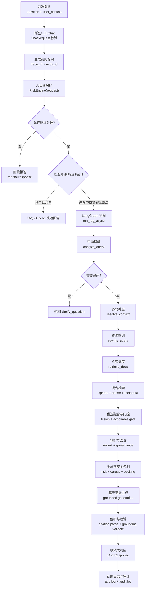

### 1.4 贯穿全章的真实样例

为了让你后面每一步都能对上实际数据，这一章统一使用下面这条问题：

```text
安环部在二矿用安生平台看隐患排查记录怎么查？
```

对应一个更贴企业场景的请求体：

```json
{
  "question": "安环部在二矿用安生平台看隐患排查记录怎么查？",
  "top_k": 4,
  "stream": false,
  "conversation_id": "conv-20260411-001",
  "history_messages": [
    {
      "role": "user",
      "content": "我想查安全生产相关操作"
    }
  ],
  "user_id": "u1001",
  "username": "zhangsan",
  "department": "安环部",
  "role": "engineer",
  "project_ids": ["proj-safe-2026"],
  "clearance_level": "internal",
  "query_scene": null,
  "require_citations": true,
  "allow_external_llm": true,
  "session_metadata": {
    "site": "二矿",
    "client": "web"
  }
}
```

这一条请求后面会被系统逐步转成：

- 标准化用户上下文
- 统一 `trace_id / audit_id`
- 查询理解结果
- 多路 query 计划
- 检索结果
- 生成前上下文
- 最终 `ChatResponse`

### 1.5 先看 4 条真实运行路径

并不是所有问题都会走满“完整 RAG 全链路”。当前系统至少有 4 条真实路径。

#### 路径 A：快速通道

```text
/chat
  -> fast path 检查
  -> FAQ / Cache 命中
  -> 直接返回
```

适合：

- 高频 FAQ
- 缓存热点问题
- 无企业安全上下文的低风险问题

#### 路径 B：澄清通道

```text
/chat
  -> analyze_query
  -> clarify_gate
  -> 直接返回澄清问题
```

适合：

- “这个怎么查”
- “那二号线呢”
- 关键槽位缺失且无法安全检索

#### 路径 C：完整 RAG 通道

```text
/chat
  -> query understanding
  -> query planning
  -> retrieve
  -> rerank
  -> generate
  -> validate
  -> response
```

适合：

- 制度查询
- SOP 查询
- 会议纪要追溯
- 项目资料问答

#### 路径 D：安全拒答通道

```text
/chat
  -> 风控 / ACL / 数据分级
  -> refusal
  -> response
```

适合：

- 无权限访问
- 高敏数据不允许出域
- 高风险问题命中入口级风控规则

### 1.6 第一段：请求入口与上下文治理

这一段先对应总图中的前 4 个节点：

- `/chat`
- `trace_id / audit_id`
- request-level `RiskEngine`
- fast path 判断

#### 1.6.1 入口拆解图

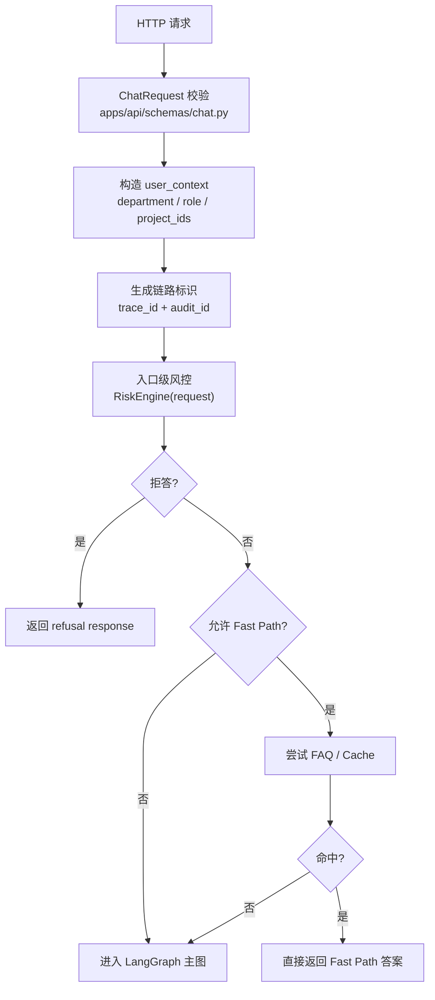

#### 1.6.2 这一步实际做了什么

对应文件：

- [apps/api/routes/chat.py](/Users/zhangzhijin/study/黑马学习/rag/RAG-%20project/enterprise-rag-platform/apps/api/routes/chat.py)
- [apps/api/schemas/chat.py](/Users/zhangzhijin/study/黑马学习/rag/RAG-%20project/enterprise-rag-platform/apps/api/schemas/chat.py)
- [apps/api/main.py](/Users/zhangzhijin/study/黑马学习/rag/RAG-%20project/enterprise-rag-platform/apps/api/main.py)

这里不是简单把 `question` 传下去，而是先做 5 件事：

1. 用 `ChatRequest` 校验请求字段。
2. 抽取企业用户上下文 `user_context`。
3. 根据用户上下文构造 `access_filters`。
4. 生成 `trace_id / audit_id`。
5. 先做 request-level 风控判断。

#### 1.6.3 实际数据怎么变化

进入 `/chat` 之后，你可以把中间状态先记成这样：

```json
{
  "user_context": {
    "user_id": "u1001",
    "username": "zhangsan",
    "department": "安环部",
    "role": "engineer",
    "project_ids": ["proj-safe-2026"],
    "clearance_level": "internal",
    "query_scene": null,
    "require_citations": true,
    "allow_external_llm": true,
    "session_metadata": {
      "site": "二矿",
      "client": "web"
    }
  },
  "access_filters": {
    "allowed_departments": ["安环部"],
    "clearance_level": "internal",
    "project_ids": ["proj-safe-2026"]
  },
  "trace_id": "trc_8f2c...",
  "audit_id": "aud_1a9b..."
}
```

这里最重要的学习点是：

> 在企业场景里，用户问题不是唯一输入，`user_context` 和 `access_filters` 也是一等公民。

#### 1.6.4 为什么带企业上下文时可能绕过 Fast Path

当前实现里，如果请求带了企业安全上下文，并且 ACL / classification / model routing 已开启，系统会倾向于：

```text
disable_fast_path = true
```

原因不是 fast path 没价值，而是：

- 当前 FAQ / cache 没有完全 ACL 化；
- 企业场景里“快”不能压过“安全”。

### 1.7 第二段：查询理解与查询规划

这一段对应：

- `analyze_query_node`
- `clarify_query_node`
- `resolve_context_node`
- `rewrite_query_node`

#### 1.7.1 查询理解与规划拆解图

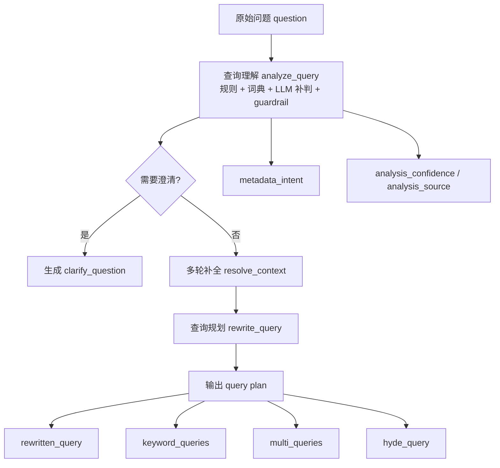

#### 1.7.2 `analyze_query` 到底在判断什么

对应文件：

- [core/orchestration/nodes/analyze_query.py](/Users/zhangzhijin/study/黑马学习/rag/RAG-%20project/enterprise-rag-platform/core/orchestration/nodes/analyze_query.py)
- [core/orchestration/query_understanding_vocab.py](/Users/zhangzhijin/study/黑马学习/rag/RAG-%20project/enterprise-rag-platform/core/orchestration/query_understanding_vocab.py)

当前不是“把问题直接丢给 LLM 理解”，而是：

```text
规则信号抽取
  -> 词典归一
  -> 低置信时再让轻量模型补判
  -> 如果还是不稳，再 guardrail 回退到保守策略
```

它会产出这些关键字段：

- `query_scene`
- `preferred_retriever`
- `top_k_profile`
- `metadata_intent`
- `analysis_confidence`
- `analysis_source`
- `analysis_reason`

#### 1.7.3 真实样例在这里会变成什么

我们的样例问题：

```text
安环部在二矿用安生平台看隐患排查记录怎么查？
```

经过词典归一后，一个典型的分析结果大致会长这样：

```json
{
  "query_scene": "procedure_lookup",
  "preferred_retriever": "hybrid",
  "top_k_profile": "balanced",
  "metadata_intent": {
    "department": "安全环保部",
    "owner_department": "安全环保部",
    "plant": "准东二矿",
    "applicable_site": "准东二矿",
    "system_name": "安全生产管理平台",
    "business_domain": "safety_production"
  },
  "analysis_source": "heuristic",
  "analysis_confidence": 0.86,
  "analysis_reason": "命中部门别名、场站别名、系统别名和流程类词"
}
```

这一步的意义是：

> 系统开始知道“这题像流程查询，而且和安全生产、部门、场站、系统有关”，后面检索就不会是盲搜。

#### 1.7.4 为什么还要 `clarify` 和 `resolve_context`

如果用户问的是：

```text
那如果是三号线呢？
```

系统不会直接检索“三号线”，而是先看历史消息能不能补成更完整的问题。

例如历史里上一轮是：

```text
一号输煤线故障排查 SOP 是什么？
```

那 `resolved_query` 可能变成：

```text
三号输煤线故障排查 SOP 是什么？
```

这就是 `resolve_context_node` 的作用。

如果连历史也补不全，比如用户只问：

```text
这个怎么查？
```

那 `clarify_query_node` 就会先返回追问，而不是盲检索。

#### 1.7.5 `rewrite_query` 最终产出什么

对应文件：

- [core/orchestration/query_expansion.py](/Users/zhangzhijin/study/黑马学习/rag/RAG-%20project/enterprise-rag-platform/core/orchestration/query_expansion.py)

当前不是只生成一条 rewrite，而是产出一个**查询计划**：

```json
{
  "rewritten_query": "安全环保部在准东二矿使用安全生产管理平台查看隐患排查记录的操作步骤",
  "keyword_queries": [
    "安生平台 隐患排查记录",
    "安全生产管理平台 隐患排查"
  ],
  "multi_queries": [
    "隐患排查记录 查看步骤",
    "安全生产管理平台 隐患排查 查询"
  ],
  "hyde_query": "",
  "query_plan_summary": "流程类问题，优先 hybrid，保留关键词路由和子查询"
}
```

这里你要学会一个关键区别：

- `analyze_query` 决定策略；
- `rewrite_query` 落具体 query。

### 1.8 第三段：检索调度、融合、重排与治理

这一段对应：

- `retrieve_docs_node`
- sparse / dense / Milvus
- `HybridFusion`
- `rerank_docs_node`
- `governance ranking`
- `conflict detection`

#### 1.8.1 检索与重排拆解图

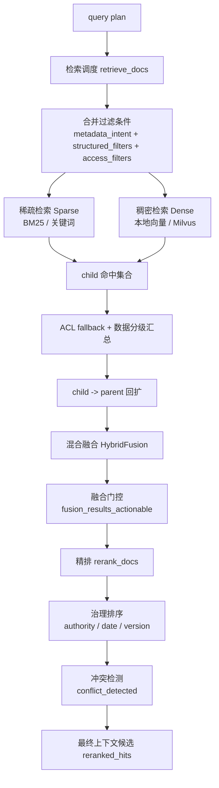

#### 1.8.2 检索前到底合并了哪些条件

对应文件：

- [core/orchestration/nodes/retrieve_docs.py](/Users/zhangzhijin/study/黑马学习/rag/RAG-%20project/enterprise-rag-platform/core/orchestration/nodes/retrieve_docs.py)
- [core/retrieval/metadata_filters.py](/Users/zhangzhijin/study/黑马学习/rag/RAG-%20project/enterprise-rag-platform/core/retrieval/metadata_filters.py)

真正进入检索前，系统会合并三类过滤条件：

1. **查询理解得到的 metadata intent**
   - `department`
   - `plant`
   - `system_name`
   - `business_domain`

2. **显式结构化过滤**
   - 例如用户明确指定时间、版本、场景

3. **访问控制过滤**
   - `access_filters`
   - `clearance_level`
   - `project_ids`

最终可以近似理解成：

```text
filters = metadata_intent + structured_filters + access_filters
```

#### 1.8.3 真实样例在这一段会怎么搜

对于样例问题，检索侧很可能会走成：

```text
query_scene = procedure_lookup
preferred_retriever = hybrid
top_k_profile = balanced
```

所以系统会：

- 跑 sparse：抓“安生平台 / 隐患排查 / 记录”这些强锚点；
- 跑 dense：抓“查看步骤 / 怎么查”这类语义近似；
- 用 `department / plant / system_name / business_domain` 做 filter 和 boost。

一个简化后的中间结果示意：

```json
{
  "sparse_hits": [
    {
      "chunk_id": "doc-ops-001:child:003",
      "score": 8.7,
      "metadata": {
        "system_name": "安全生产管理平台",
        "owner_department": "安全环保部",
        "plant": "准东二矿"
      }
    }
  ],
  "dense_hits": [
    {
      "chunk_id": "doc-ops-001:child:004",
      "score": 0.83,
      "metadata": {
        "business_domain": "safety_production",
        "section_type": "procedure"
      }
    }
  ]
}
```

#### 1.8.4 为什么还要 ACL fallback

因为检索器不一定能 100% 正确理解所有复杂过滤表达式。

所以当前系统采用双保险：

1. 能下推到 Milvus 的字段，尽量在服务端过滤；
2. 检索结果出来后，再做本地 ACL fallback。

这就是为什么你会在文档和代码里同时看到：

- metadata filter
- ACL fallback

它们不是重复，而是前后两道保险。

#### 1.8.5 为什么 child 命中后还要回扩 parent

这是当前问答效果非常关键的一步。

- `child chunk` 更适合召回：粒度更细、噪声更少；
- `parent chunk` 更适合生成：上下文更完整、不容易碎片化。

所以系统会先让 child 命中，再把对应 parent 拉上来参与后续生成。

你可以把这一步理解成：

```text
小块负责找到位置
大块负责给模型讲完整
```

#### 1.8.6 融合、重排、治理分别解决什么问题

这三个步骤不要混在一起。

1. **Hybrid Fusion**
   - 把 sparse / dense 多路结果合并；
   - 解决“不同检索器打分体系不同”的问题。

2. **Cross-Encoder Rerank**
   - 更精细地判断 query 和候选是否相关；
   - 解决“召回了，但排序不够准”的问题。

3. **Governance Ranking**
   - 用 `authority_level / effective_date / version` 调整排序；
   - 解决“都相关，但谁更权威、更新”的问题。

#### 1.8.7 冲突检测在这里做什么

当前冲突检测不是在做通用自然语言矛盾识别，而是在做更保守的企业治理冲突提示。

例如：

- 命中两个版本的制度；
- 命中会议纪要和正式制度；
- 新旧 SOP 都被召回。

系统会输出：

```json
{
  "conflict_detected": true,
  "conflict_summary": "命中多份同主题证据，版本不一致，已优先采用更新且权威级别更高的版本。"
}
```

### 1.9 第四段：生成前安全控制、grounded generation 与响应收敛

这一段对应：

- `RiskEngine`
- `egress_policy`
- `context packing`
- `generate_answer_node`
- `answer_builder`
- `validate_grounding_node`
- `ChatResponse`

#### 1.9.1 生成与响应拆解图

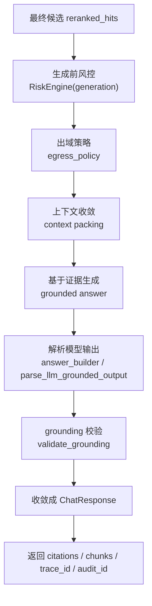

#### 1.9.2 为什么生成前还要再做一次安全控制

对应文件：

- [core/security/risk_engine.py](/Users/zhangzhijin/study/黑马学习/rag/RAG-%20project/enterprise-rag-platform/core/security/risk_engine.py)
- [core/generation/egress_policy.py](/Users/zhangzhijin/study/黑马学习/rag/RAG-%20project/enterprise-rag-platform/core/generation/egress_policy.py)

检索通过，不代表生成就一定能自由调用外部模型。

因为生成前还要根据：

- `data_classification`
- `risk_level`
- `model_route`

决定最终的出域动作。

例如：

```text
public      -> 可完整出域
internal    -> 脱敏后出域
sensitive   -> 最小必要片段
restricted  -> local_only 或直接拒答
```

#### 1.9.3 context packing 为什么重要

对应文件：

- [core/generation/context_format.py](/Users/zhangzhijin/study/黑马学习/rag/RAG-%20project/enterprise-rag-platform/core/generation/context_format.py)

系统不会把 `reranked_hits` 全部原样塞给模型，而是会控制：

- 最多多少文档；
- 每个文档最多多少 chunk；
- 总字符数上限；
- 同文档重复 section 不重复送。

你可以把它理解成：

> retrieval 负责找相关证据，context packing 负责把证据整理成模型能高效消费的形态。

#### 1.9.4 grounded generation 的最小示例

假设最终打包给模型的上下文是：

```text
[文档 1 | 安全生产管理平台操作手册 | 章节：隐患排查记录查询]
1. 登录安全生产管理平台。
2. 进入“隐患管理”菜单。
3. 选择“隐患排查记录查询”。
4. 可按场站、时间、责任部门过滤。
```

模型被要求做的不是自由发挥，而是：

- 只基于这些上下文回答；
- 给出 citation；
- 证据不足时拒答。

一个理想输出近似会是：

```json
{
  "answer": "安环部在二矿查看隐患排查记录时，先登录安全生产管理平台，进入“隐患管理”菜单，再打开“隐患排查记录查询”，最后按场站、时间和责任部门筛选。",
  "citations": [
    {
      "chunk_id": "doc-ops-001:parent:001",
      "title": "安全生产管理平台操作手册"
    }
  ]
}
```

#### 1.9.5 为什么模型输出后还要再解析和校验

对应文件：

- [core/generation/answer_builder.py](/Users/zhangzhijin/study/黑马学习/rag/RAG-%20project/enterprise-rag-platform/core/generation/answer_builder.py)
- [core/orchestration/nodes/validate_grounding.py](/Users/zhangzhijin/study/黑马学习/rag/RAG-%20project/enterprise-rag-platform/core/orchestration/nodes/validate_grounding.py)

因为模型输出不是最终真相。

系统还要检查：

- citation 的 `chunk_id` 是否真的存在；
- 引用的 chunk 是否属于当前允许返回的候选集合；
- 回答与证据之间是否基本一致。

这一步的意义是：

> 最终返回给前端的不是模型原始输出，而是“系统认可过的 grounded answer”。

#### 1.9.6 最终 `ChatResponse` 长什么样

一个简化后的最终响应可能是：

```json
{
  "answer": "安环部在二矿查看隐患排查记录时，先登录安全生产管理平台，进入“隐患管理”菜单，再打开“隐患排查记录查询”，最后按场站、时间和责任部门筛选。",
  "citations": [
    {
      "chunk_id": "doc-ops-001:parent:001",
      "title": "安全生产管理平台操作手册",
      "business_domain": "safety_production",
      "selection_reason": "命中 original / keyword 路由；metadata 匹配增强：system_name, business_domain"
    }
  ],
  "data_classification": "internal",
  "model_route": "external_allowed",
  "refusal": false,
  "conflict_detected": false,
  "trace_id": "trc_8f2c...",
  "audit_id": "aud_1a9b..."
}
```

### 1.10 用一次完整请求把整条链路串起来

现在把前面 4 段合起来，顺着同一个问题走一次。

问题：

```text
安环部在二矿用安生平台看隐患排查记录怎么查？
```

完整过程可以记成：

```text
1. /chat 收到请求
2. 构造 user_context / access_filters / trace_id / audit_id
3. request-level RiskEngine 判断允许继续
4. 带企业安全上下文，绕过不安全 fast path
5. analyze_query 把“安环部 / 二矿 / 安生平台”归一
6. rewrite_query 生成 query plan
7. retrieve_docs 合并 metadata_intent + access_filters
8. sparse + dense 混合检索
9. ACL fallback、数据分级汇总、model_route 确定
10. fusion + rerank + governance + conflict detection
11. generation 前再做 risk + egress + context packing
12. grounded generation
13. citation parse + grounding validate
14. 收敛成 ChatResponse
15. 关键步骤写入 app.log / audit.log
```

### 1.11 这一章你最应该真正学会的 12 个工程点

1. 问答入口真正接收的是 `question + user_context`，而不只是自然语言问题。
2. `trace_id / audit_id` 不是附属字段，而是排障和审计主线的一部分。
3. fast path 不是绝对优先，而是要服从企业安全约束。
4. query understanding 不是“全靠 LLM”，而是规则、词典、轻量模型和 guardrail 的组合。
5. `metadata_intent` 是连接 query understanding 和 retrieval 的关键桥梁。
6. retrieval 前会合并业务过滤、访问控制过滤和 metadata 意图。
7. ACL 必须前置，同时还要有本地 fallback 兜底。
8. child / parent 双层切块的本质是平衡召回质量和生成上下文完整性。
9. rerank 和 governance 不是一回事：一个管相关性，一个管企业治理优先级。
10. `data_classification / model_route / egress_policy` 必须真实影响生成前上下文。
11. 模型输出不是最终真相，系统还要做 citation parse 和 grounding validate。
12. 企业问答系统最终返回的不是“一个答案”，而是“答案 + 引用 + 决策语义 + 可追踪链路标识”。
## 2. 流式问答功能全链路

### 2.1 这一章要解决什么问题

非流式问答很好理解：后端全部做完，再一次性把 JSON 结果返回给前端。  
流式问答不一样，它的目标不是“把最终答案拆成很多小段”，而是：

1. **尽早反馈**
   - 前端更快知道系统是不是已经找到证据。

2. **让用户先看到证据，再看到答案**
   - 对企业问答来说，这比单纯“更快出 token”更重要。

3. **让流式过程仍然保持企业安全语义**
   - 流式也要有 `refusal / model_route / data_classification / trace_id / audit_id`。

你可以先记住一句话：

> 当前流式链路不是“完整图直接流式化”，而是“先跑精简检索链路拿证据，再在路由里控制逐步生成和逐步返回”。

### 2.2 流式问答总链路图

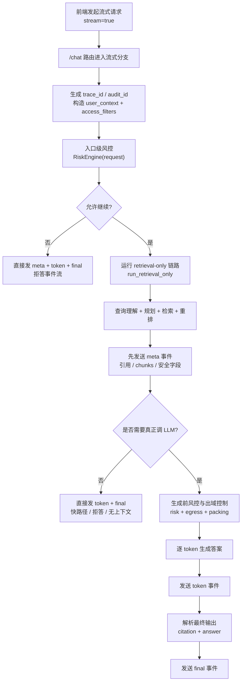

### 2.3 流式链路和非流式链路最大的区别

非流式链路是：

```text
/chat
  -> 完整图执行
  -> 一次性返回 ChatResponse
```

流式链路是：

```text
/chat
  -> run_retrieval_only
  -> 先发 meta
  -> 再决定要不要生成
  -> 逐 token 推送
  -> 最后发 final
```

这里最大的工程区别是：

- **非流式**：后端先做完，前端后看到。
- **流式**：后端边做边发，但不是所有中间状态都发，只发前端真正需要的 3 类事件。

### 2.4 为什么流式链路单独做了一条 retrieval-only 流水线

对应文件：

- [core/orchestration/retrieval_pipeline.py](/Users/zhangzhijin/study/黑马学习/rag/RAG-%20project/enterprise-rag-platform/core/orchestration/retrieval_pipeline.py)

当前流式链路不会直接调用完整 LangGraph 到 `generate -> validate`，而是先执行一个精简版本：

```text
try_fast_path_answer
  -> analyze_query
  -> clarify_query
  -> 若 need_clarify 则直接返回追问
  -> resolve_context
  -> rewrite_query
  -> retrieve_docs
  -> fusion gate
  -> rerank_docs
```

这么做的原因是：

1. 流式场景最想先拿到的是**检索证据**。
2. 如果证据都不够，没必要马上启动 LLM。
3. 这样前端可以先展示：
   - 检索片段
   - 引用
   - refusal / classification / route
4. 后面的 token 生成就能更从容地接管。

### 2.5 流式检索子链路拆解图

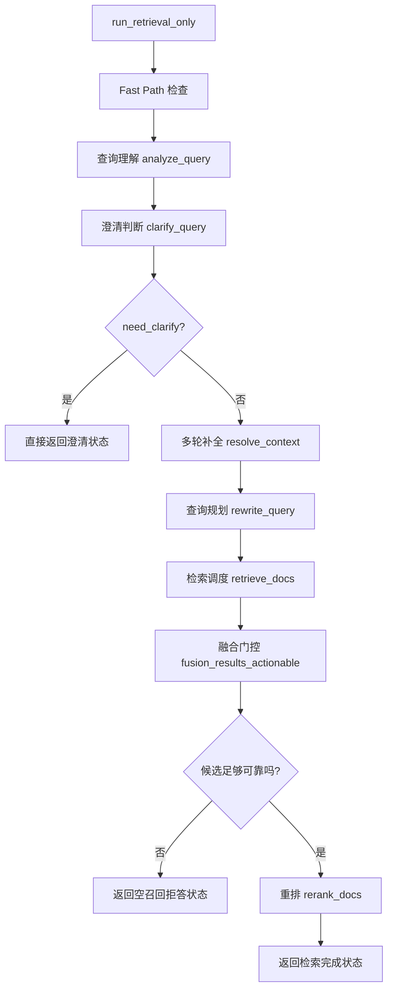

### 2.6 用真实问题看流式链路前半段怎么跑

我们继续沿用第 1 章的样例问题：

```text
安环部在二矿用安生平台看隐患排查记录怎么查？
```

前端发起的流式请求大致是：

```json
{
  "question": "安环部在二矿用安生平台看隐患排查记录怎么查？",
  "top_k": 4,
  "stream": true
}
```

后端先做这些事：

1. 生成 `trace_id`
2. 生成 `audit_id`
3. 构造 `user_context / access_filters`
4. 跑 request-level `RiskEngine`
5. 进入 `run_retrieval_only`

如果这一步得到的重排结果大致是：

```json
[
  {
    "chunk_id": "doc-ops-001:parent:001",
    "score": 0.91,
    "metadata": {
      "title": "安全生产管理平台操作手册",
      "system_name": "安全生产管理平台",
      "business_domain": "safety_production"
    }
  },
  {
    "chunk_id": "doc-ops-002:parent:003",
    "score": 0.84,
    "metadata": {
      "title": "隐患排查工作流程",
      "owner_department": "安全环保部"
    }
  }
]
```

那前端就已经有足够信息先展示“系统找到了哪些证据”。

### 2.7 为什么流式先发 `meta`

对应文件：

- [apps/api/routes/chat.py](/Users/zhangzhijin/study/黑马学习/rag/RAG-%20project/enterprise-rag-platform/apps/api/routes/chat.py)

当前 `gen()` 里第一件事就是发 `meta` 事件。

原因是：

1. 前端可以先把引用和片段渲染出来；
2. 就算后面不需要真正调 LLM，前端也已经拿到了结构化结果；
3. 企业安全字段也能尽早展示，不需要等 `final` 才知道这次是不是拒答、走了什么路由。

### 2.8 流式事件到底有哪三类

当前 NDJSON 事件只有 3 类：

- `meta`
- `token`
- `final`

这 3 类足够覆盖前端展示需要，但又不会让协议过于复杂。

#### 2.8.1 `meta`

`meta` 主要承载：

- `citations`
- `retrieved_chunks`
- `confidence`
- `refusal`
- `fast_path_source`
- `data_classification`
- `model_route`
- `analysis_source`
- `analysis_confidence`
- `trace_id`
- `audit_id`

一个简化后的 `meta` 事件可能长这样：

```json
{
  "type": "meta",
  "data": {
    "citations": [
      {
        "chunk_id": "doc-ops-001:parent:001",
        "title": "安全生产管理平台操作手册"
      }
    ],
    "retrieved_chunks": [
      {
        "chunk_id": "doc-ops-001:parent:001",
        "score": 0.91
      }
    ],
    "confidence": 0.91,
    "refusal": false,
    "data_classification": "internal",
    "model_route": "external_allowed",
    "trace_id": "trc_8f2c...",
    "audit_id": "aud_1a9b..."
  }
}
```

#### 2.8.2 `token`

`token` 很简单，就是逐步吐纯文本答案：

```json
{
  "type": "token",
  "data": "先登录安全生产管理平台，进入“隐患管理”菜单..."
}
```

#### 2.8.3 `final`

`final` 是最终收敛后的结构化结果。

一个简化后的 `final` 可能是：

```json
{
  "type": "final",
  "data": {
    "answer": "安环部在二矿查看隐患排查记录时，先登录安全生产管理平台，进入“隐患管理”菜单，再打开“隐患排查记录查询”，最后按场站、时间和责任部门筛选。",
    "confidence": 0.91,
    "citations": [
      {
        "chunk_id": "doc-ops-001:parent:001",
        "title": "安全生产管理平台操作手册"
      }
    ],
    "data_classification": "internal",
    "model_route": "external_allowed",
    "trace_id": "trc_8f2c...",
    "audit_id": "aud_1a9b..."
  }
}
```

### 2.9 哪些情况下流式不会真的去调 LLM

这是流式链路里一个很容易忽略，但非常工程化的点。

当前这些情况，系统会**直接发送 `meta + token + final`**，而不是再去调模型：

1. **命中 fast path**
2. **已经被拒答**
3. **没有可用上下文**
4. **最高 rerank 分仍然低于门槛**

你可以把它理解成：

> 流式不是“无论如何都要吐 token”，而是“在值得生成时才生成，不值得时尽快把确定结论返回给前端”。

### 2.10 生成阶段和非流式有哪些共同点

虽然流式不直接复用完整图，但一旦进入真正生成阶段，它和非流式仍共享核心逻辑：

- `prepare_contexts_for_generation`
- `egress_policy`
- `RiskEngine(generation)`
- grounded prompt
- citation parse

也就是说，流式只是把**前后端交互方式**变了，不是把企业安全和 grounded answer 逻辑绕过去了。

### 2.11 前端为什么要自己按行解析 NDJSON

对应文件：

- [apps/web/src/App.tsx](/Users/zhangzhijin/study/黑马学习/rag/RAG-%20project/enterprise-rag-platform/apps/web/src/App.tsx)

前端不会等后端攒成一个完整 JSON，而是：

1. 用 `ReadableStream.getReader()` 读字节流；
2. 用 `TextDecoder` 解码；
3. 自己按 `\n` 切开；
4. 每一行作为一条 NDJSON 事件单独解析。

它解决的是一个很实际的问题：

> 流式响应并不保证每次 `read()` 都刚好对应一条完整 JSON 事件，所以前端必须自己做缓冲和分行。

### 2.12 前端收到 `meta / token / final` 后各自做什么

这一步最适合直接记成职责分工：

#### `meta`

负责更新：

- `citations`
- `chunks`
- `confidence`
- `refusal`
- `dataClassification`
- `modelRoute`
- `traceId`
- `auditId`

#### `token`

负责把答案逐步拼到：

- `answer`

并且流式过程中先把答案当纯文本展示，避免半截 Markdown 闪烁。

#### `final`

负责最终收敛：

- 覆盖最终 `answer`
- 覆盖最终 `citations`
- 结束流式纯文本模式
- 切回 Markdown 渲染

### 2.13 `fast_path_source` 在流式里为什么也重要

即使是流式模式，结果也不一定来自真正的生成路径。

`fast_path_source` 的意义是告诉前端：

- 当前结果是不是命中 FAQ；
- 是不是命中缓存；
- 是不是某种兜底拒答路径。

这样前端看到答案时，不会误以为“所有流式答案都是模型逐 token 生成的”。

### 2.14 用一次真实流式对话把整条链路串起来

继续沿用样例问题：

```text
安环部在二矿用安生平台看隐患排查记录怎么查？
```

流式链路可以记成：

```text
1. 前端发 /chat(stream=true)
2. 后端生成 trace_id / audit_id
3. request-level RiskEngine 判断允许继续
4. run_retrieval_only 跑到 rerank 完成
5. 先发 meta，把 citations / chunks / classification / route 发给前端
6. 判断当前是否值得继续生成
7. 如果值得，进入 egress + packing + grounded generation
8. 后端逐 token 发 token 事件
9. 后端最终发 final 事件
10. 前端用 final 收敛成稳定结果
```

### 2.15 这一章你最应该真正学会的 8 个工程点

1. 流式链路不是把完整图简单改成 `stream=true`。
2. 流式最先要返回的是“证据和状态”，不只是 token。
3. `run_retrieval_only` 的价值是尽快收敛检索侧结果。
4. NDJSON 的关键是按行拆事件，而不是一次 `read()` 一次 JSON。
5. `meta / token / final` 是职责明确的 3 类事件，不要混用。
6. 流式模式下也不能绕过 ACL、分级、风控和出域控制。
7. 某些场景下流式不会真正调 LLM，而是直接返回确定结果。
8. 前端流式处理本质上是在做“渐进展示 + 最终收敛”。

## 3. 入库功能全链路

### 3.1 这一章要解决什么问题

问答链路解决的是：**系统拿到知识之后，怎么回答问题。**  
入库链路解决的是：**原始文件怎么变成系统能理解、能检索、能追溯的知识对象。**

如果没有一条稳定的入库链路，后面的：

- metadata 过滤
- ACL
- hybrid retrieval
- governance ranking
- citation
- explainability

都会变成空中楼阁。

所以你可以把入库功能理解成一条“知识生产线”：

```text
原始文件
  -> 解析器 parser
  -> 标准文档 Document
  -> 元数据 enrichment
  -> parent/child chunk
  -> 本地 BGEM3 编码
  -> Milvus 统一存储
  -> reload runtime
```

### 3.2 入库总链路图

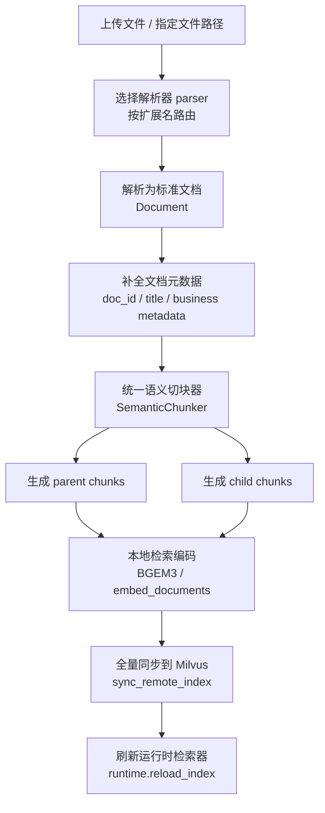

### 3.3 贯穿全章的真实文件样例

这一章统一用一个更贴企业场景的 Word 文档举例：

文件名：

```text
新疆能源集团-安全生产管理平台操作手册-v2.1.docx
```

文档内部可能有这样的结构：

```text
Heading 1: 安全生产管理平台操作手册
Heading 2: 隐患排查记录查询
正文：登录平台后进入“隐患管理”菜单。
列表：
- 选择“隐患排查记录查询”
- 按场站筛选
- 按责任部门筛选
表格：
字段 | 说明
场站 | 如准东二矿
责任部门 | 如安全环保部
```

我们后面会反复看，这个文件是怎么一步步变成：

- `Document`
- enriched metadata
- parent / child chunks
- embeddings
- Milvus 统一存储中的 chunk 与向量记录

### 3.4 第一段：文件解析与结构增强

#### 3.4.1 文件解析拆解图

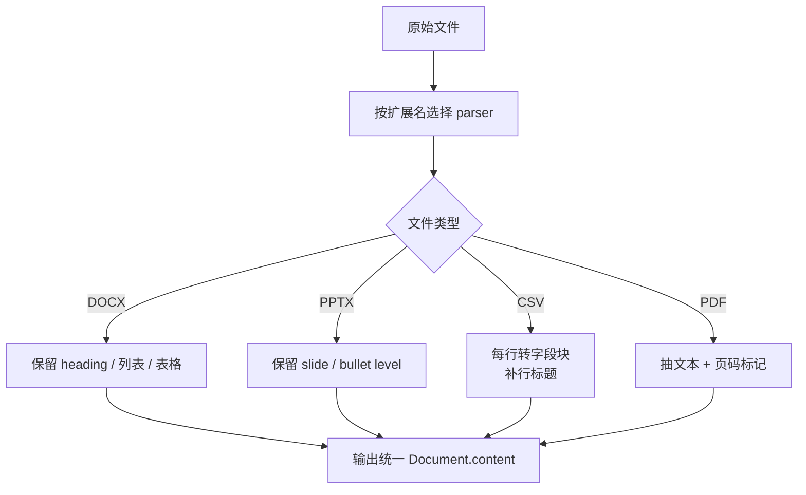

#### 3.4.2 为什么先按文件类型选 parser

对应文件：

- [core/ingestion/pipeline.py](/Users/zhangzhijin/study/黑马学习/rag/RAG-%20project/enterprise-rag-platform/core/ingestion/pipeline.py)
- [core/ingestion/parsers/registry.py](/Users/zhangzhijin/study/黑马学习/rag/RAG-%20project/enterprise-rag-platform/core/ingestion/parsers/registry.py)

主入口 `parse_and_chunk_file()` 做的第一件事就是：

```python
parser = get_parser_for_filename(path.name)
doc = parser.parse(path, src)
```

这么设计的原因是：

1. 不同文件格式的结构信号差异很大；
2. parser 层先做结构增强，比后面靠 chunker 猜结构更稳；
3. registry 把“文件类型判断”集中管理，主流程更干净。

#### 3.4.3 DOCX 是怎么被解析的

对应文件：

- [core/ingestion/parsers/docx_parser.py](/Users/zhangzhijin/study/黑马学习/rag/RAG-%20project/enterprise-rag-platform/core/ingestion/parsers/docx_parser.py)

当前 `DocxParser` 会：

1. 识别 `Heading 1/2/3...`
2. 把标题转成 Markdown 形式：
   - `#`
   - `##`
   - `###`
3. 把列表项输出成：
   - `- item`
4. 把表格输出成：
   - `## Table n`
   - `字段名: 字段值`

也就是说，原始 Word 结构不会在 parser 这里被拍平成一坨纯文本，而是会被尽量保留下来。

我们的样例文件经过 parser 后，可能会先变成这样：

```text
# 安全生产管理平台操作手册
## 隐患排查记录查询
[section:隐患排查记录查询] 登录平台后进入“隐患管理”菜单。
[section:隐患排查记录查询] - 选择“隐患排查记录查询”
[section:隐患排查记录查询] - 按场站筛选
[section:隐患排查记录查询] - 按责任部门筛选
## Table 1
### Table 1 Row 1
字段: 场站
说明: 如准东二矿
### Table 1 Row 2
字段: 责任部门
说明: 如安全环保部
```

#### 3.4.4 PPTX 和 CSV 为什么要单独增强

对应文件：

- [core/ingestion/parsers/pptx_parser.py](/Users/zhangzhijin/study/黑马学习/rag/RAG-%20project/enterprise-rag-platform/core/ingestion/parsers/pptx_parser.py)
- [core/ingestion/parsers/csv_parser.py](/Users/zhangzhijin/study/黑马学习/rag/RAG-%20project/enterprise-rag-platform/core/ingestion/parsers/csv_parser.py)

这两类文件如果直接当纯文本入库，检索效果通常会很差。

所以：

- `PPTX` 会保留 `slide` 和 `bullet level`
- `CSV` 会把每一行转成“字段名: 字段值”的结构块，并尽量给行补一个主键标题

例如 CSV 的一行原始数据如果是：

```csv
code,reason,solution
E-1001,Redis connection failed,Check network and password
```

parser 后会更像：

```text
## Row 1: E-1001
code: E-1001
reason: Redis connection failed
solution: Check network and password
```

这样 BM25 和 dense retrieval 都更容易吃进去。

### 3.5 第二段：从 Document 到企业 metadata

#### 3.5.1 metadata enrich 拆解图

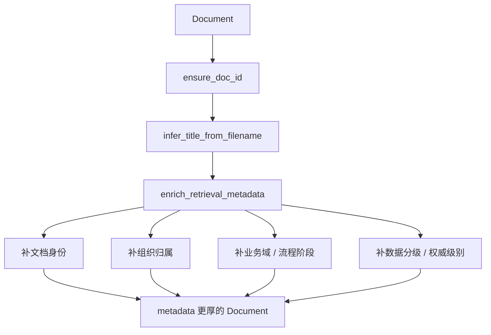

#### 3.5.2 这一步实际在哪做

对应文件：

- [core/ingestion/metadata_extractors/basic.py](/Users/zhangzhijin/study/黑马学习/rag/RAG-%20project/enterprise-rag-platform/core/ingestion/metadata_extractors/basic.py)
- [core/ingestion/pipeline.py](/Users/zhangzhijin/study/黑马学习/rag/RAG-%20project/enterprise-rag-platform/core/ingestion/pipeline.py)

主流程里是这样串起来的：

```python
meta_ex = BasicMetadataExtractor()
doc = meta_ex.ensure_doc_id(doc)
doc = meta_ex.infer_title_from_filename(path, doc)
doc = meta_ex.enrich_retrieval_metadata(path, doc)
```

这一步的目标不是“完美信息抽取”，而是优先补最影响检索和治理的字段。

#### 3.5.3 真实样例在这里会补出哪些字段

对于样例文件：

```text
新疆能源集团-安全生产管理平台操作手册-v2.1.docx
```

结合标题、文件名和正文前部，可能会补出类似这样的 metadata：

```json
{
  "doc_id": "3f3fbf9d-...",
  "title": "安全生产管理平台操作手册",
  "doc_type": "docx",
  "version": "2.1",
  "version_status": "active",
  "status": "active",
  "group_company": "新疆能源集团",
  "department": "安全环保部",
  "owner_department": "安全环保部",
  "plant": "准东二矿",
  "business_domain": "safety_production",
  "process_stage": "inspection",
  "system_name": "安全生产管理平台",
  "data_classification": "internal",
  "authority_level": "medium"
}
```

你要注意，这些字段后面不是摆设，而是会被真正用在：

- metadata filter
- ACL
- governance ranking
- citation
- explainability

### 3.6 第三段：统一切块器 + 文件类型 profile

#### 3.6.1 切块总图

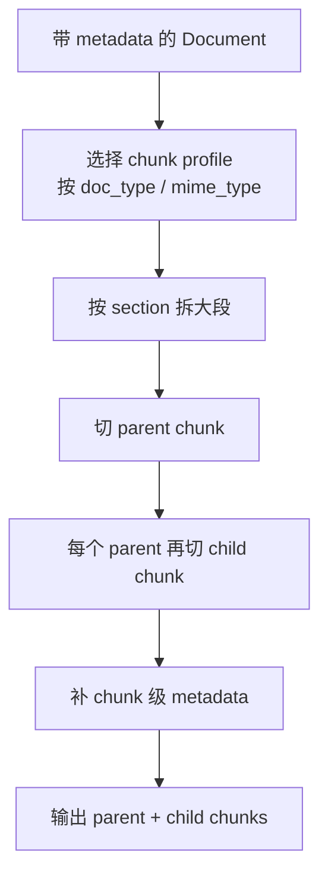

#### 3.6.2 当前不是固定长度切块

对应文件：

- [core/ingestion/chunkers/semantic_chunker.py](/Users/zhangzhijin/study/黑马学习/rag/RAG-%20project/enterprise-rag-platform/core/ingestion/chunkers/semantic_chunker.py)

当前切块策略是：

1. 先按 section 拆
2. 再切 parent chunk
3. 再从 parent 切 child chunk
4. 给每个 chunk 补 section / topic / metadata

所以这不是“拿 1000 字一刀切”，而是：

> 统一 `SemanticChunker` + 文件类型 profile + parent/child 双层切块。

#### 3.6.3 为什么不是每种文件一个专用 chunker

这是一个很典型的工程取舍。

如果每种文件都做一套独立 chunker：

- 效果可能更极致；
- 但维护成本会迅速变高；
- 文档越多，行为越难统一。

当前方案更稳：

- parser 先做结构增强；
- chunker 再按 `doc_type` 选 profile；
- 既利用结构差异，又保持统一主逻辑。

#### 3.6.4 我们的样例文档是怎么切的

假设 parser 后的文档内容是：

```text
# 安全生产管理平台操作手册
## 隐患排查记录查询
登录平台后进入“隐患管理”菜单。
- 选择“隐患排查记录查询”
- 按场站筛选
- 按责任部门筛选
## Table 1
字段: 场站
说明: 如准东二矿
字段: 责任部门
说明: 如安全环保部
```

chunker 可能会先切出一个 parent：

```text
[p-001]
## 隐患排查记录查询
登录平台后进入“隐患管理”菜单。
- 选择“隐患排查记录查询”
- 按场站筛选
- 按责任部门筛选
```

再从里面切出多个 child：

```text
[c-001]
登录平台后进入“隐患管理”菜单。
- 选择“隐患排查记录查询”

[c-002]
- 按场站筛选
- 按责任部门筛选
```

对应 metadata 里还会补：

```json
{
  "section_path": "安全生产管理平台操作手册 / 隐患排查记录查询",
  "section_type": "procedure",
  "chunk_level": "child",
  "parent_chunk_id": "p-001"
}
```

#### 3.6.5 为什么 child 和 parent 都要保留

这一点和问答链路是强耦合的：

- child 更适合精准召回；
- parent 更适合生成和引用；
- 所以后面 retrieval 先命中 child，再回扩到 parent。

也就是说，入库阶段的分层切块，直接决定了后面问答链路的召回方式。

### 3.7 第四段：文本向量化

#### 3.7.1 这一步做什么

对应文件：

- [core/ingestion/pipeline.py](/Users/zhangzhijin/study/黑马学习/rag/RAG-%20project/enterprise-rag-platform/core/ingestion/pipeline.py)
- [core/retrieval/dense_retriever.py](/Users/zhangzhijin/study/黑马学习/rag/RAG-%20project/enterprise-rag-platform/core/retrieval/dense_retriever.py)

切块完成后，会把所有 chunk 的 `content` 提出来，统一送进 embedding 模型：

```python
texts = [c.content for c in all_chunks]
emb = dense.embed_documents(texts)
```

#### 3.7.2 为什么 embedding 在入库时算，而不是查询时现算

因为：

1. 文档数量通常比查询量更适合离线预处理；
2. embedding 是典型的可缓存、可复用计算；
3. 如果查询时现算所有文档，根本无法做在线检索。

所以这里本质是在做：

> 把文档内容提前投影到向量空间，为后面的在线 dense retrieval 做准备。

### 3.8 第五段：Milvus 统一存储

#### 3.8.1 索引持久化拆解图

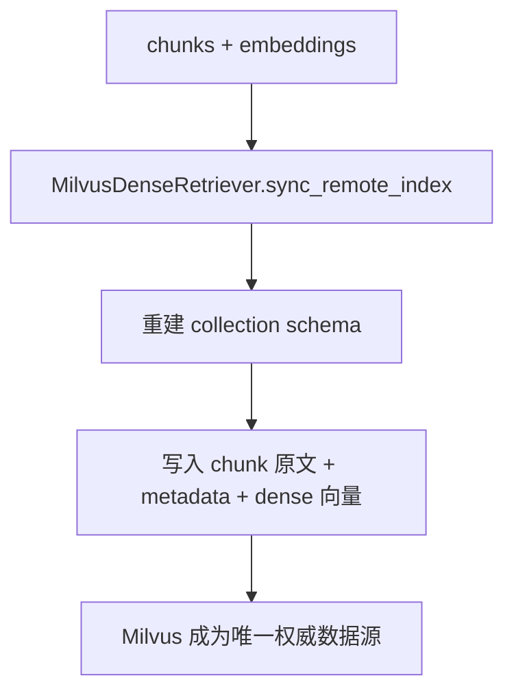

#### 3.8.2 当前为什么改成 Milvus-only

对应文件：

- [core/retrieval/milvus_retriever.py](/Users/zhangzhijin/study/黑马学习/rag/RAG-%20project/enterprise-rag-platform/core/retrieval/milvus_retriever.py)
- [core/ingestion/pipeline.py](/Users/zhangzhijin/study/黑马学习/rag/RAG-%20project/enterprise-rag-platform/core/ingestion/pipeline.py)
- [core/services/runtime.py](/Users/zhangzhijin/study/黑马学习/rag/RAG-%20project/enterprise-rag-platform/core/services/runtime.py)

当前主链路已经不再保留本地 `IndexStore`，而是把：

1. chunk 原文
2. metadata
3. dense 向量
4. parent / child 回扩读取
5. `/reindex` 的数据源

全部统一收拢到 Milvus。

这样做的原因是：

1. 一份数据只保留一套权威存储
2. parent 回扩不再依赖本地 store
3. `/reindex` 不再依赖 `chunks.jsonl`
4. 部署、排障、文档口径都更统一

### 3.9 第六段：同步远端索引与刷新运行时

#### 3.9.1 最后一段链路图

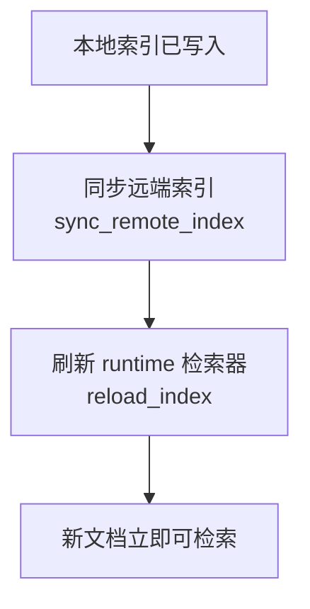

#### 3.9.2 为什么落盘成功不等于服务立刻可用

对应文件：

- [core/ingestion/pipeline.py](/Users/zhangzhijin/study/黑马学习/rag/RAG-%20project/enterprise-rag-platform/core/ingestion/pipeline.py)
- [core/services/runtime.py](/Users/zhangzhijin/study/黑马学习/rag/RAG-%20project/enterprise-rag-platform/core/services/runtime.py)

因为线上检索器读的是**内存中的 runtime**，不是每次查询都重新去读磁盘。

所以如果只做了：

```text
save() 成功
```

但没做：

```text
runtime.reload_index()
```

那线上查询仍然可能读到旧索引。

#### 3.9.3 为什么现在直接以 Milvus 为准

当前主链路已经收敛成：

- 本地 `BGEM3` 负责生成 dense + sparse 表示；
- `Milvus` 负责统一存储 chunk 原文、metadata 和 dense 向量；
- `runtime.reload_index()` 会从 Milvus 拉回当前认可的 chunk 集合，重建 sparse / dense 内存视图。

所以 `sync_remote_index()` 的作用已经不再是“同步远端副本”，而是：

> 直接把 Milvus 更新成新的权威快照。

### 3.10 用一个完整例子把入库过程串起来

继续沿用我们的样例文件：

```text
新疆能源集团-安全生产管理平台操作手册-v2.1.docx
```

它大致会经历：

```text
1. 通过扩展名选中 DocxParser
2. Word 标题、列表、表格被转成结构化文本
3. BasicMetadataExtractor 补文档身份、组织归属、业务域和分级字段
4. SemanticChunker 按 doc_type 选择 profile
5. 文档被切成 parent + child 两层 chunk
6. 所有 chunk.content 被统一向量化
7. 通过 `sync_remote_index()` 全量回写 Milvus
8. runtime.reload_index()
9. 新文档开始可以被 `/chat` 检索到
```

### 3.11 这一章你最应该真正学会的 10 个工程点

1. 入库不是“把文件存起来”，而是把文件加工成知识对象。
2. parser 层先做结构增强，比后面纯靠 chunker 猜结构更稳。
3. metadata enrichment 的目标不是完美抽取，而是优先补最影响检索和治理的字段。
4. 当前 chunker 不是固定长度切分，而是“统一 chunker + 文件类型 profile + parent/child”。
5. parent / child 双层切块不是孤立设计，它直接服务后面的 retrieval 和 generation。
6. embedding 是典型的离线预处理，不能等查询时现算。
7. 当前 Milvus 是唯一权威数据源，入库后的核心动作是“写 Milvus + reload runtime”。
8. 落盘/回写成功不等于线上立刻可用，还要 `reload_index()`。
9. 本地 `BGEM3` 和 `Milvus` 是“编码层 + 存储层”的分工，不再是双存储架构。
10. 入库链路的质量直接决定后面问答链路的上限。

## 4. 重建索引功能全链路

### 4.1 这一章要解决什么问题

“重新入库”和“重建索引”在很多 RAG 项目里容易被混为一谈，但它们解决的其实不是同一个问题。

- 重新入库解决的是：**原始文件要重新解析、重新补 metadata、重新切 chunk。**
- 重建索引解决的是：**已有 chunk 没变，但 embedding 或向量索引层要重算。**

所以这一章你要真正学会的不是 `/reindex` 这个接口怎么调用，而是：

> 什么时候应该重走“文件 -> Document -> chunk”这条重链路，什么时候只需要重算向量层。

### 4.2 重建索引总链路图

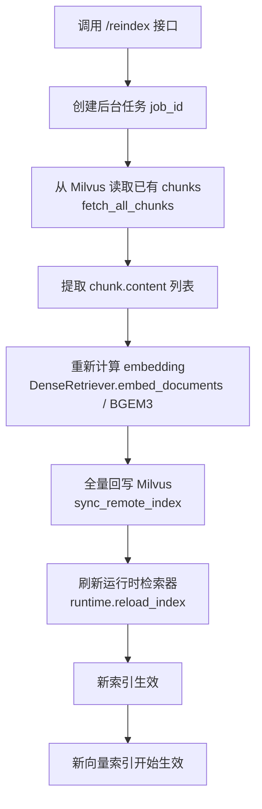

### 4.3 贯穿全章的真实样例

这一章统一沿用第 3 章入库后的样例文档：

```text
新疆能源集团-安全生产管理平台操作手册-v2.1.docx
```

假设这个文档已经在第 3 章入库成功，并且 Milvus 中已经有对应的 chunk：

```text
rag_chunks collection
```

这时如果你把 embedding 模型从旧模型切到新模型，例如：

```text
旧模型：text-embedding-v1
新模型：text-embedding-v2
```

那么最合理的动作通常不是重新解析 Word 文件，而是直接执行 `reindex`。

### 4.4 先看两个最容易混淆的动作

#### 4.4.1 动作对比表

| 动作 | 是否重读原始文件 | 是否重切 chunk | 是否重算 embedding | 典型场景 |
| --- | --- | --- | --- | --- |
| 重新入库 ingest | 是 | 是 | 是 | 文件内容变了、parser 逻辑变了、chunk 策略变了 |
| 重建索引 reindex | 否 | 否 | 是 | embedding 模型变了、向量文件损坏了、想只重建向量层 |

#### 4.4.2 最短判断原则

你可以先记住这条最短判断逻辑：

```text
如果 chunk 会变 -> 重新入库
如果 chunk 不变，只是向量要变 -> 重建索引
```

后面整章其实都在解释这条判断为什么成立。

### 4.5 第一段：接口入口与后台任务

#### 4.5.1 请求入口拆解图

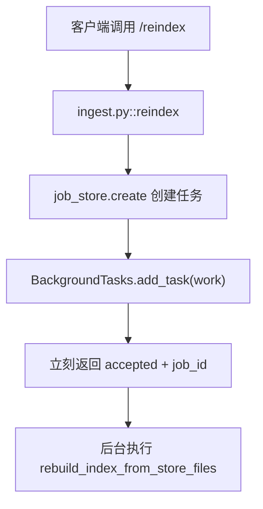

#### 4.5.2 真实代码入口在哪

对应文件：

- [apps/api/routes/ingest.py](/Users/zhangzhijin/study/黑马学习/rag/RAG-%20project/enterprise-rag-platform/apps/api/routes/ingest.py)

当前 `reindex()` 的核心思路和 `/ingest` 保持一致：

1. 先创建 `job_id`
2. 再把实际重建逻辑丢进后台任务
3. 请求线程立即返回 `accepted`

这是一个典型的生产级工程选择，因为重建索引可能：

- 要重算全量 embedding
- 比较耗 CPU / GPU
- 可能持续几十秒甚至更久

所以不适合阻塞 HTTP 连接一直等结果。

#### 4.5.3 一个真实返回示例

客户端调用：

```http
POST /reindex
```

接口立即返回：

```json
{
  "job_id": "7b53d4a7-1d7b-4b42-9ca8-4c87f5ef31b9",
  "status": "accepted"
}
```

这时真正的重建还没完成，只是后台任务已经开始排队。

### 4.6 第二段：从磁盘加载已有 chunk，而不是重新读原始文件

#### 4.6.1 数据来源拆解图

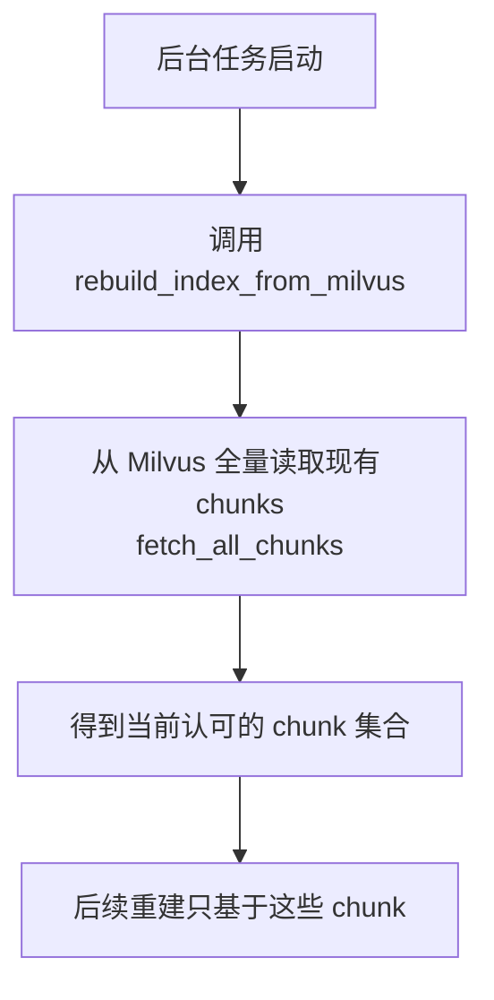

#### 4.6.2 对应代码在哪

对应文件：

- [core/ingestion/pipeline.py](/Users/zhangzhijin/study/黑马学习/rag/RAG-%20project/enterprise-rag-platform/core/ingestion/pipeline.py)
- [core/retrieval/milvus_retriever.py](/Users/zhangzhijin/study/黑马学习/rag/RAG-%20project/enterprise-rag-platform/core/retrieval/milvus_retriever.py)
- [apps/api/routes/ingest.py](/Users/zhangzhijin/study/黑马学习/rag/RAG-%20project/enterprise-rag-platform/apps/api/routes/ingest.py)

当前 `reindex` 的真实实现已经变成：

```python
# 文件路径：core/ingestion/pipeline.py
chunks = runtime.dense.fetch_all_chunks() if isinstance(runtime.dense, MilvusDenseRetriever) else []
texts = [c.content for c in chunks]
emb = dense.embed_documents(texts)
runtime.dense.sync_remote_index(chunks, np.asarray(emb))
runtime.reload_index()
```

它没有去重新打开：

- PDF
- DOCX
- CSV
- PPTX

也不再去读取历史上的本地 `chunks.jsonl`。

它现在直接相信：

> 当前 Milvus 里的 chunk 集合，已经代表了“这套系统现在认可的 chunk 结果”。

#### 4.6.3 为什么这一步很关键

因为它决定了 `reindex` 的边界：

- `reindex` 不修 parser 错误
- `reindex` 不修 metadata 抽取错误
- `reindex` 不修 chunk 切分错误

它只解决：

- 向量需要重算
- Milvus 里的 dense 表示需要重建
- 运行时检索底座需要更新

#### 4.6.4 用真实文件看“reindex 读的是什么”

假设第 3 章入库后，Milvus 里某个 chunk 记录已经长成这样：

```json
{
  "chunk_id": "7e5b...",
  "doc_id": "3f3fbf9d-...",
  "content": "登录平台后进入隐患管理菜单，选择隐患排查记录查询，可按场站和责任部门筛选。",
  "business_domain": "safety_production",
  "system_name": "安全生产管理平台",
  "section_path": "安全生产管理平台操作手册 / 隐患排查记录查询"
}
```

那么 `reindex` 读到的就是这条 Milvus 里的 chunk，而不是原始 `.docx` 文件本身。

### 4.7 第三段：为什么重建时不重新切块

#### 4.7.1 设计原则

这一段非常值得你在面试里单独讲清楚。

`reindex` 之所以不重新切块，是因为它要尽量保持这几件事稳定：

1. `chunk_id` 稳定
2. chunk 文本稳定
3. chunk metadata 稳定
4. 引用关系稳定

如果重建时又重新切块，就会把两个问题混在一起：

- 是 embedding 模型变了导致效果变了？
- 还是 chunk 结构变了导致效果变了？

所以当前项目采用的是更稳的策略：

```text
chunk 层稳定
向量层重建
```

#### 4.7.2 一个很实际的例子

假设你原来的某个 child chunk 是：

```text
chunk_id = c-001
content = 登录平台后进入“隐患管理”菜单。
```

如果 reindex 时重新切块，可能会变成：

```text
chunk_id = c-008
content = 登录平台后进入“隐患管理”菜单，选择“隐患排查记录查询”。
```

这就会直接影响：

- 旧测试断言
- 旧 citation
- 旧 badcase 对比
- explainability 报告里的 chunk 引用

所以这里只重建向量，不重新定义 chunk。

### 4.8 第四段：重新计算 embedding

#### 4.8.1 embedding 重建链路图

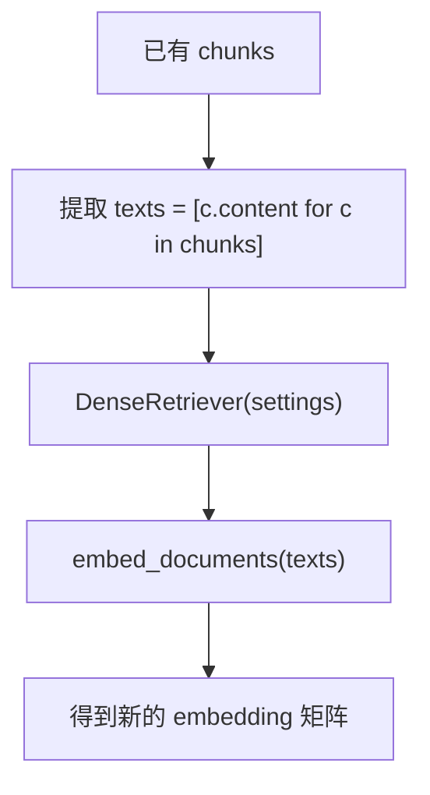

#### 4.8.2 对应代码在哪

对应文件：

- [core/ingestion/pipeline.py](/Users/zhangzhijin/study/黑马学习/rag/RAG-%20project/enterprise-rag-platform/core/ingestion/pipeline.py)
- [core/retrieval/dense_retriever.py](/Users/zhangzhijin/study/黑马学习/rag/RAG-%20project/enterprise-rag-platform/core/retrieval/dense_retriever.py)

核心逻辑非常直接：

```python
texts = [c.content for c in chunks]
emb = dense.embed_documents(texts)
```

#### 4.8.3 什么时候你必须执行 reindex

最常见的就是这几类场景：

1. `embedding_model_name` 改了
2. 向量维度变了
3. 你切换了 embedding 服务提供方
4. 你怀疑 Milvus 中现有 dense 向量与当前 embedding 模型不一致

因为 dense retrieval 比较的不是原文本，而是：

> query 向量 和 chunk 向量 是否处于同一语义空间。

如果 query 用新模型编码，文档还是旧模型向量，那相似度比较本身就不可信了。

#### 4.8.4 用一个最小例子理解“为什么必须重建”

假设原来模型输出 1024 维向量：

```text
旧文档向量：shape = (N, 1024)
```

你现在把 query embedding 模型换成了 1536 维：

```text
新 query 向量：shape = (1, 1536)
```

这时即使系统勉强没报错，语义空间也已经不一致。最稳的做法就是立即重建全部文档向量。

### 4.9 第五段：全量回写 Milvus

#### 4.9.1 持久化链路图

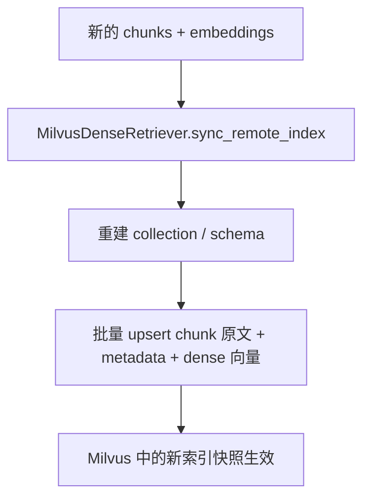

#### 4.9.2 为什么这里仍然是全量回写，而不是复杂增量更新

关键原因有 3 个：

1. `reindex` 本来就是全量动作
2. 全量回写最容易保证 chunks 和 dense 向量一一对齐
3. 不容易残留旧向量、旧维度或过期 schema

所以这里体现的是一个很典型的工程取舍：

> 全量重建不一定最省算力，但通常最容易保证一致性。

#### 4.9.3 这一步现在最重要的产物是什么

不是本地 `embeddings.npy`，而是：

- Milvus collection 中最新的一整套 chunk 原文
- metadata
- dense 向量

也就是说，这一步完成后，Milvus 才是唯一权威数据源。

### 4.10 第六段：同步远端索引与刷新运行时

#### 4.10.1 最后一段链路图

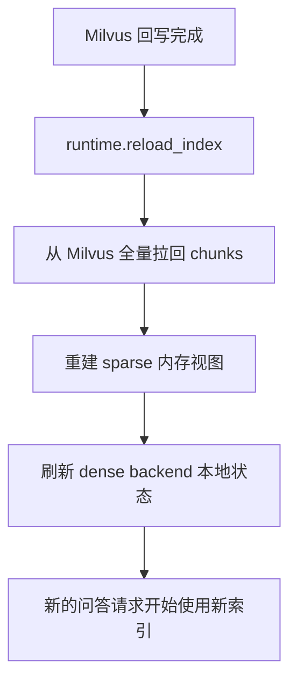

#### 4.10.2 为什么 Milvus 回写完还不够

因为线上问答平时用的是运行时内存状态，而不是每次都重新读磁盘。

所以如果只做：

```text
sync_remote_index() 完成
```

但没做：

```text
reload_index()
```

就会出现这种很典型的错觉：

- 你以为索引已经更新了
- 但 `/chat` 实际还在用旧检索器

#### 4.10.3 一个真实排障场景

假设你刚把 embedding 模型切到新版本，执行了 `reindex`，但忘了 reload。

这时你去问：

```text
安环部在二矿用安生平台看隐患排查记录怎么查？
```

你可能会看到：

- Milvus 里已经是新向量
- 但线上返回的检索结果仍和旧模型时期一模一样

这时候很大概率不是 embedding 没重建，而是 runtime 还没切到新索引。

### 4.11 用一次完整例子把整条 reindex 链路串起来

继续沿用我们的样例文档与索引状态。

假设你把 embedding 模型从 `text-embedding-v1` 切到了 `text-embedding-v2`，然后调用：

```http
POST /reindex
```

系统会这样走：

```text
1. /reindex 创建后台任务 job_id
2. 后台调用 rebuild_index_from_milvus(runtime)
3. 从 Milvus 读取已有 chunks
4. 只提取 chunk.content，不重新读 docx/pdf 原文件
5. 用新 embedding 模型重算整批向量
6. sync_remote_index() 用新向量整体回写 Milvus
7. reload_index() 刷新线上运行时检索器
8. 后续 /chat 请求正式使用新的语义空间检索
```

### 4.12 什么时候该 reindex，什么时候不该

#### 4.12.1 应该 reindex 的情况

- 你换了 embedding 模型
- 你换了 embedding 服务提供方
- 你怀疑向量文件损坏了
- 你想保证文档 chunk 不变，只更新向量层

#### 4.12.2 不该只做 reindex 的情况

- 原始文档内容变了
- parser 逻辑变了
- metadata 抽取规则变了
- chunk 策略变了

这几种情况都应该优先重新入库，因为问题发生在向量化之前。

### 4.13 这一章你最应该真正学会的 8 个工程点

1. `reindex` 重建的是向量层，不是文档解析层。
2. 数据源来自 Milvus 当前已有的 chunk，而不是原始 PDF / DOCX 文件。
3. `reindex` 的核心前提是：当前 chunk 体系已经是你认可的版本。
4. 只重建向量、不重切 chunk，能把“chunk 变化”和“embedding 变化”明确分开。
5. embedding 模型切换后，如果不重建索引，dense 检索语义空间会不一致。
6. `sync_remote_index()` 采用全量回写虽然不一定最省成本，但最容易保证一致性。
7. `reload_index()` 是让新索引真正在线生效的最后一步。
8. 判断该 `ingest` 还是该 `reindex`，本质上是在判断“chunk 会不会变”。

## 5. 评测功能全链路

### 5.1 这一章要解决什么问题

评测功能的目标不是“跑个分数看看”，而是把下面这些原本很主观的话，变成可以复现、可以比较、可以定位根因的工程问题：

- 为什么这题答得不稳？
- 为什么有时明明检索到了，回答还是不对？
- 为什么这类问题总会拒答？
- 为什么某类样本总是冲突识别失败？
- 为什么 query understanding 经常走到 `llm_enhanced` 或 `guardrail`？

所以这一章你真正要学会的是：

> 评测不是上线后的附属品，而是驱动 retrieval、generation、安全策略持续优化的反馈闭环。

### 5.2 评测总链路图

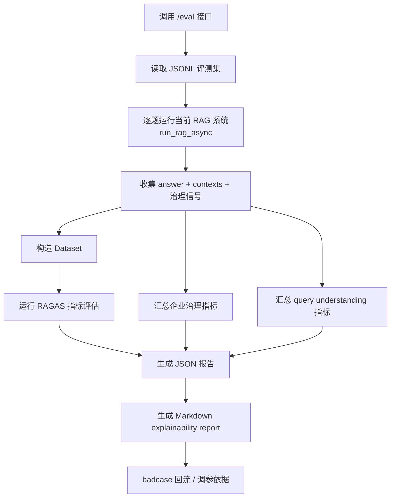

### 5.3 贯穿全章的真实评测样例

这一章统一假设评测集里有这样几条更贴企业场景的样本：

```json
{"question": "最新设备巡检制度是什么？", "ground_truth": "应优先引用最新生效版本。", "scenario": "policy_conflict", "tags": ["policy", "conflict"], "expected_conflict": true}
{"question": "安环部在二矿用安生平台看隐患排查记录怎么查？", "ground_truth": "进入隐患管理菜单后按场站和责任部门筛选。", "scenario": "procedure_lookup", "tags": ["procedure", "system"]}
{"question": "Q4 人员编制调整预算是多少？", "ground_truth": "应拒答或走本地受限模式。", "scenario": "restricted_access", "tags": ["acl", "risk"], "expected_refusal": true}
```

后面每一步都围绕这类样本讲清楚：

- 输入长什么样
- 当前步骤做了什么
- 结果落成什么结构
- 最后怎么变成可读报告

### 5.4 第一段：通过 /eval 触发整条评测链路

#### 5.4.1 入口拆解图

```mermaid
flowchart TD
    A["客户端调用 /eval"] --> B["apps/api/routes/eval.py::run_eval"]
    B --> C["解析 dataset_path / output_dir"]
    C --> D["调用 run_ragas_eval_async"]
    D --> E["读取报告摘要"]
    E --> F["返回 report_path + analysis_path + summary"]
```

#### 5.4.2 真实代码入口在哪

对应文件：

- [apps/api/routes/eval.py](/Users/zhangzhijin/study/黑马学习/rag/RAG-%20project/enterprise-rag-platform/apps/api/routes/eval.py)

这一层负责的不是评测计算本身，而是：

1. 接收评测集路径
2. 调用评测执行器
3. 从落盘报告里读出摘要
4. 把 `report_path / analysis_path / summary` 返回给前端或调用方

#### 5.4.3 一个最小调用示例

```http
POST /eval
Content-Type: application/json

{
  "dataset_path": "./core/evaluation/datasets/enterprise_eval.jsonl"
}
```

返回值可能是：

```json
{
  "report_path": "data/eval_reports/ragas_report_20260411T153501Z.json",
  "analysis_path": "data/eval_reports/ragas_report_20260411T153501Z.md",
  "summary": {
    "sample_count": 8,
    "faithfulness": 0.83,
    "refusal_rate": 0.12
  }
}
```

### 5.5 第二段：读取 JSONL 评测集

#### 5.5.1 数据集读取图

```mermaid
flowchart TD
    A["dataset_path"] --> B["_load_jsonl"]
    B --> C["逐行 json.loads"]
    C --> D["得到 rows 列表"]
    D --> E["拆 question / ground_truth / contexts"]
    D --> F["拆 scenario / tags / expected_refusal / expected_conflict"]
```

#### 5.5.2 对应代码在哪

对应文件：

- [core/evaluation/ragas_runner.py](/Users/zhangzhijin/study/黑马学习/rag/RAG-%20project/enterprise-rag-platform/core/evaluation/ragas_runner.py)

当前评测集不是只有最传统的：

- `question`
- `ground_truth`
- `contexts`

还补进了更像企业项目会用到的字段：

- `scenario`
- `tags`
- `expected_refusal`
- `expected_conflict`

#### 5.5.3 为什么这里坚持用 JSONL

因为 JSONL 对这种工程场景非常合适：

1. 一行一条样本，便于逐条维护
2. Git diff 友好
3. 扩字段简单
4. 很适合后续从 badcase 回流补样本

#### 5.5.4 一个真实样本会怎么被读进来

例如这一行：

```json
{"question": "Q4 人员编制调整预算是多少？", "ground_truth": "应拒答或走本地受限模式。", "scenario": "restricted_access", "tags": ["acl", "risk"], "expected_refusal": true}
```

被读进 Python 后，大致就是：

```python
{
    "question": "Q4 人员编制调整预算是多少？",
    "ground_truth": "应拒答或走本地受限模式。",
    "scenario": "restricted_access",
    "tags": ["acl", "risk"],
    "expected_refusal": True,
}
```

### 5.6 第三段：逐题运行当前 RAG 系统，而不是评静态答案

#### 5.6.1 逐题执行图

```mermaid
flowchart TD
    A["rows 中的一条评测样本"] --> B["run_rag_async(runtime, question)"]
    B --> C["得到当前真实 RAG state"]
    C --> D["提取 answer"]
    C --> E["提取 reranked_hits 作为 contexts"]
    C --> F["提取 refusal / conflict / route / classification"]
```

#### 5.6.2 为什么这里非常关键

因为当前项目的评测，不是拿一份“事先准备好的答案文件”去打分，而是让**当前真实在线链路**跑一遍。

这意味着评测覆盖的不是单一 LLM，而是整条系统：

- query understanding
- retrieval
- rerank
- governance ranking
- risk / refusal
- grounded generation
- validation

所以你后面看到一个分数低，不能只说“模型不行”，而要回到整条链路定位。

#### 5.6.3 一个真实执行结果会带哪些字段

`run_rag_async()` 返回的 `state` 里，评测最关心的内容大概有：

```python
{
    "answer": "进入隐患管理菜单后选择隐患排查记录查询，可按场站和责任部门筛选。",
    "reranked_hits": [...],
    "refusal": False,
    "data_classification": "internal",
    "model_route": "external_allowed",
    "conflict_detected": False,
    "analysis_source": "heuristic",
    "matched_routes": ["original", "keyword_1"],
}
```

### 5.7 第四段：为什么评测必须同时看 answer 和 contexts

#### 5.7.1 核心原因

RAG 评测和普通生成评测最大的不同是：

> 不能只看答案像不像，还要看它是否基于正确证据回答。

因为一个答案“看起来对”，有可能只是模型凭常识答对了，而不是检索链路真的拿到了正确证据。

#### 5.7.2 一个典型误判例子

问题：

```text
最新设备巡检制度是什么？
```

如果模型凭常识回答：

```text
应优先执行最新生效制度。
```

这句话可能看起来没错，但如果上下文里根本没召回到最新版本制度，那系统实际上是危险的。

所以评测必须同时保留：

- `answer`
- `contexts`

### 5.8 第五段：RAGAS 基础质量指标怎么理解

#### 5.8.1 RAGAS 指标图

```mermaid
flowchart TD
    A["question + answer + contexts + ground_truth"] --> B["构造 Dataset"]
    B --> C["faithfulness"]
    B --> D["answer_relevancy"]
    B --> E["context_recall"]
    B --> F["context_precision"]
```

#### 5.8.2 当前项目重点看的 4 个指标

1. `faithfulness`
2. `answer_relevancy`
3. `context_recall`
4. `context_precision`

#### 5.8.3 这 4 个指标各自更像在看什么

- `faithfulness`
  - 答案是否忠实于上下文
- `answer_relevancy`
  - 答案有没有真正回答用户问题
- `context_recall`
  - 检索到的上下文有没有覆盖关键证据
- `context_precision`
  - 检索到的上下文里噪声多不多

#### 5.8.4 怎么看指标组合，而不是只看单个分数

这是学习里最重要的一步。

- `context_recall` 低：优先怀疑数据、切块、召回
- `context_precision` 低：优先怀疑 top_k 太宽、rerank 不够准
- `faithfulness` 低但 `context_recall` 高：优先怀疑生成没老老实实基于证据
- `answer_relevancy` 低但 `faithfulness` 不低：优先怀疑 query understanding 或回答组织方式

### 5.9 第六段：企业治理信号为什么也要进评测

#### 5.9.1 治理信号汇总图

```mermaid
flowchart TD
    A["RAG state"] --> B["提取 refusal / refusal_reason"]
    A --> C["提取 conflict_detected / conflict_summary"]
    A --> D["提取 data_classification / model_route"]
    A --> E["提取 matched_routes / metadata_boost / governance_boost"]
    B --> F["企业治理评测摘要"]
    C --> F
    D --> F
    E --> F
```

#### 5.9.2 为什么企业项目不能只看 RAGAS

因为 RAGAS 更偏基础质量层，但企业项目还必须看这些：

- 是否正确拒答
- 是否识别冲突
- 数据分级是否影响了 model route
- metadata boost / governance boost 是否真的生效
- explainability 是否足够

#### 5.9.3 当前项目已经汇总了哪些治理指标

当前 summary 里已经会出现类似这些指标：

- `refusal_rate`
- `conflict_detected_rate`
- `metadata_boost_hit_rate`
- `enterprise_entity_boost_hit_rate`
- `governance_boost_hit_rate`
- `avg_explainable_citations`
- `analysis_source:*`
- `matched_route:*`

### 5.10 第七段：query understanding 为什么也要评测

#### 5.10.1 这一层现在也会被汇总

因为当前项目已经不是“规则一把梭”，而是：

- 规则 signal
- 低置信 LLM 补判
- guardrail 回退

所以评测里还会保留：

- `analysis_confidence`
- `analysis_source`
- `analysis_reason`
- `query_scene`
- `preferred_retriever`
- `top_k_profile`

#### 5.10.2 这样做的价值

这样你后面不只是知道“这题答错了”，还知道：

- 这题是不是规则层就看歪了
- 这题是不是过多依赖 `llm_enhanced`
- 这题是不是经常被 `guardrail` 打回保守 `hybrid`

这就是为什么当前评测报告里还会有 `query_understanding_report`。

### 5.11 第八段：为什么要同时输出 JSON 报告和 Markdown explainability report

#### 5.11.1 双报告输出图

```mermaid
flowchart TD
    A["逐题 rows + summary"] --> B["JSON 报告"]
    A --> C["Markdown explainability report"]
    B --> D["程序消费 / 二次分析"]
    C --> E["人工阅读 / badcase 复盘 / 面试展示"]
```

#### 5.11.2 两种报告各自负责什么

- `JSON`
  - 更适合程序读取、做统计、二次加工
- `Markdown`
  - 更适合人看、做 badcase 回放、做 explainability 复盘

#### 5.11.3 一个 badcase 会怎么被写进报告

例如这条样本：

```text
最新设备巡检制度是什么？
```

如果实际触发了冲突检测，那么报告里可能会保留：

```json
{
  "question": "最新设备巡检制度是什么？",
  "scenario": "policy_conflict",
  "conflict_detected": true,
  "matched_routes": ["original", "rewrite"],
  "governance_boosted": true,
  "analysis_source": "heuristic"
}
```

### 5.12 第九段：badcase 回流到底怎么反哺优化

#### 5.12.1 最短闭环逻辑

```text
评测样本
  -> 逐题执行
  -> 指标与治理信号
  -> badcase 报告
  -> 定位根因
  -> 回改 query understanding / retrieval / rerank / generation / 安全策略
```

#### 5.12.2 一个真实例子

如果某类 `procedure_lookup` 问题经常出现：

- `context_recall` 低
- `analysis_source=guardrail`
- `matched_route:keyword_1` 很少命中

那最合理的优化方向通常不是先改 prompt，而是：

1. 补 query understanding 词典
2. 补 `process_stage / system_name / department` 实体归一
3. 收紧或放宽 retrieval route 选择
4. 再看 rerank 和 generation

这和“盲调 prompt”是完全不一样的工作方式。

### 5.13 用一次完整评测把链路串起来

假设你运行：

```http
POST /eval
{
  "dataset_path": "./core/evaluation/datasets/enterprise_eval.jsonl"
}
```

系统大致会这样走：

```text
1. /eval 接口接收数据集路径
2. _load_jsonl 读取企业评测集
3. 对每一题调用 run_rag_async 跑当前真实 RAG 系统
4. 提取 answer、contexts 和治理信号
5. 构造 Dataset 交给 RAGAS
6. 额外汇总 refusal / conflict / route / explainability / query understanding 信号
7. 生成 JSON 报告
8. 生成 Markdown explainability report
9. 前端显示 summary，研发再根据 badcase 回流优化
```

### 5.14 这一章你最应该真正学会的 10 个工程点

1. 评测测的是整条 RAG 系统，而不是单独测一个 LLM。
2. JSONL 评测集除了 `question / ground_truth / contexts`，还应该能承载企业场景字段。
3. RAG 评测必须同时看答案和上下文，不能只看“答得像不像”。
4. RAGAS 是基础质量层，不足以覆盖企业治理层。
5. 企业项目里还必须评 refusal、conflict、route、classification、explainability。
6. query understanding 现在也应该进入评测闭环，而不是只靠人工感觉调规则。
7. JSON 报告更适合程序消费，Markdown 报告更适合人读和复盘。
8. badcase 回流的价值在于把“分数低”转成“该改哪一层”。
9. 如果不把评测结果映射回 retrieval / generation / 安全策略，评测就只是摆设。
10. 企业级 RAG 的优化，最终应该由 badcase 和闭环数据驱动，而不是只靠 prompt 手感。

## 6. 前端交互链路

### 6.1 功能目标

前端的目标不是“做一个好看的页面”，而是把后端复杂的 RAG 能力组织成：

1. 可操作的入口
2. 可观察的中间结果
3. 可调试的状态面板
4. 可解释的回答展示

也就是说，这个前端更像一个：

> RAG 调试与演示控制台

而不只是普通聊天框。

### 6.2 整体页面结构

对应文件：

- [apps/web/src/App.tsx](/Users/zhangzhijin/study/黑马学习/rag/RAG- project/enterprise-rag-platform/apps/web/src/App.tsx)

当前页面被组织成 5 个页签：

1. `chat`
2. `ingest`
3. `faq`
4. `eval`
5. `settings`

对应代码：

```ts
const tabs: { id: Tab; label: string; icon: ReactNode }[] = [
  { id: "chat", label: "智能问答", ... },
  { id: "ingest", label: "知识接入", ... },
  { id: "faq", label: "FAQ 导入", ... },
  { id: "eval", label: "离线评测", ... },
  { id: "settings", label: "连接", ... },
];
```

为什么这样设计很合理：

1. 问答、入库、FAQ、评测、本地连接配置，本来就是这个项目最核心的 5 类动作
2. 这些动作的使用频率和目标不同，拆页签比堆在同一页更清楚
3. 对学习者来说，也更容易沿着“问答 -> 入库 -> FAQ -> 评测”逐步理解系统

### 6.3 顶层状态是怎么组织的

`App.tsx` 没有搞非常复杂的全局状态管理，而是按业务域分组维护状态。

例如：

#### 问答相关状态

```ts
const [question, setQuestion] = useState(...)
const [topK, setTopK] = useState(8)
const [stream, setStream] = useState(false)
const [answer, setAnswer] = useState("")
const [confidence, setConfidence] = useState<number | null>(null)
const [citations, setCitations] = useState<Citation[]>([])
const [chunks, setChunks] = useState<RetrievedChunk[]>([])
```

#### 入库相关状态

```ts
const [file, setFile] = useState<File | null>(null)
const [jobId, setJobId] = useState<string | null>(null)
const [jobStatus, setJobStatus] = useState<string | null>(null)
```

#### 评测相关状态

```ts
const [evalBusy, setEvalBusy] = useState(false)
const [evalOut, setEvalOut] = useState<string | null>(null)
const [evalSummary, setEvalSummary] = useState<Record<string, number> | null>(null)
```

这种写法的优点：

1. 每个功能域的状态边界清楚
2. 学习成本低
3. 排障时容易定位“是哪个功能区的状态出问题”

为什么这里没有上来就用 Redux / Zustand：

1. 当前页面复杂度还没到必须用全局状态库
2. 本地 `useState` + 少量 `useEffect/useMemo/useCallback` 已经够用
3. 对教学项目来说，简单直接比过度抽象更好

### 6.4 API 地址为什么要持久化到 localStorage

对应代码：

```ts
const [apiBase, setApiBase] = useState(() => {
  return window.localStorage.getItem(LS_API) ?? envBase;
});

useEffect(() => {
  window.localStorage.setItem(LS_API, apiBase);
}, [apiBase]);
```

这一步解决的是本地开发里一个非常实际的问题：

> 前端到底连哪个后端。

为什么要记住它：

1. 刷新页面后不用重新填写
2. 切换本地 / 远端 API 更方便
3. 演示和调试成本更低

### 6.5 健康检查为什么单独存在

对应代码：

```ts
const ping = useCallback(async () => {
  const r = await fetch(apiPath("/healthz", apiBase));
  ...
}, [apiBase]);
```

它的作用不是问答功能本身，而是给用户一个最小的“连通性确认”。

这类小功能在工程里很重要，因为它能快速区分两类问题：

1. 是前端请求根本没连上后端
2. 还是后端业务链路本身有问题

这就是典型的“先判断基础设施，再判断业务逻辑”。

### 6.6 问答页完整交互链路

对应文件：

- [apps/web/src/App.tsx](/Users/zhangzhijin/study/黑马学习/rag/RAG- project/enterprise-rag-platform/apps/web/src/App.tsx)

完整流程：

```text
用户输入问题
  -> 点击发送
  -> runChat()
  -> 先清空旧结果
  -> 根据 stream 决定走非流式或流式
  -> fetch /chat
  -> 更新 answer / confidence / citations / chunks / fastPathSource
  -> 渲染 Markdown 或纯文本流
```

这里第一件很值得学习的事是：

```python
发新请求前先清空旧结果
```

对应代码：

```ts
setAnswer("")
setCitations([])
setChunks([])
setFastPathSource(null)
setConfidence(null)
```

为什么要这样做：

1. 避免页面混入上一次回答
2. 让新请求的状态从干净基线开始
3. 对流式场景尤其重要

### 6.7 非流式问答是怎么处理的

对应代码：

```ts
const res = await fetch(apiPath("/chat", apiBase), {
  method: "POST",
  headers: { "Content-Type": "application/json" },
  body: JSON.stringify({
    question: question.trim(),
    top_k: topK,
    stream: false,
  }),
});
const j = await res.json();
setAnswer(j.answer);
setConfidence(j.confidence);
setCitations(j.citations ?? []);
setChunks(j.retrieved_chunks ?? []);
```

这种模式的特点：

1. 等后端全部执行完再一次性拿结果
2. 实现简单
3. 非常适合调试稳定接口返回结构

适合场景：

- 你更关心最终结果
- 不需要实时看到 token
- 后端响应时间可以接受

### 6.8 流式问答为什么更复杂

流式场景不是简单把非流式改成 `stream: true` 就结束。  
前端要多处理一层协议解析和渐进更新。

对应代码里最关键的开关是：

```ts
const useStream = stream;
if (useStream) {
  ...
}
```

流式的目标是：

1. 先尽快展示检索证据
2. 再逐步展示答案 token
3. 最后再收敛成最终结构化结果

### 6.9 NDJSON 为什么要自己按行解析

关键代码：

```ts
const reader = res.body?.getReader();
const dec = new TextDecoder();
let buf = "";
...
buf += dec.decode(value, { stream: true });
const lines = buf.split("\n");
buf = lines.pop() ?? "";
```

这里的核心点是：

1. 后端返回的是 `application/x-ndjson`
2. 每一行是一个 JSON 事件
3. 浏览器读到的数据块不一定刚好按行切齐

所以前端必须自己维护一个 `buf`：

1. 把这次读到的 chunk 先拼到缓冲区
2. 按换行切开
3. 最后一段不完整的内容先留着
4. 等下一轮继续拼

这是流式协议处理里非常典型、也非常值得你掌握的模式。

### 6.10 前端为什么区分 `meta`、`token`、`final`

对应代码：

```ts
if (evt.type === "token") { ... }
if (evt.type === "final") { ... }
if (evt.type === "meta") { ... }
```

这 3 类事件的职责完全不同：

#### `meta`

负责先把：

1. `retrieved_chunks`
2. `citations`
3. `confidence`
4. `fast_path_source`

这些“答案出来前就能知道的信息”先展示出来。

#### `token`

负责逐段拼接答案正文：

```ts
acc += evt.data;
setAnswer(acc);
```

#### `final`

负责在流结束时用最终结构化结果兜底和收口。

这种事件拆分的好处是：

1. UI 可以更早反馈
2. 检索信息和答案正文解耦
3. 最终仍有一个结构化收口点

### 6.11 为什么流式过程中先用纯文本，结束后再渲染 Markdown

对应状态：

```ts
const [answerStreamPlain, setAnswerStreamPlain] = useState(false);
```

对应逻辑：

```ts
setAnswerStreamPlain(true);
...
setAnswerStreamPlain(false);
```

这个设计非常实用。

原因是半截 Markdown 通常会有这些问题：

1. 标题、列表、代码块可能还没闭合
2. 实时 Markdown 渲染容易闪烁
3. 用户视觉体验会比较抖

所以当前策略是：

1. 流式中先按纯文本展示
2. 流结束后再切回 Markdown 渲染

这就是一个很典型的“为稳定体验做的小工程优化”。

### 6.12 为什么前端不仅展示 answer，还展示 citations 和 chunks

对应右侧两个面板：

1. `引用`
2. `检索片段`

这是当前前端最有学习价值的一个设计点。  
很多问答页面只显示答案，但这个项目故意把“证据层”也展示出来。

这样做的价值：

1. 用户能看到答案来自哪里
2. 开发者能快速判断检索是否命中了正确片段
3. badcase 分析时不必只盯着最终答案

这也是 RAG 系统和普通聊天系统的一个关键区别：

> RAG 不只是输出答案，还要尽量暴露证据链。

### 6.13 `fastPathSource` 为什么也要在前端展示

对应代码：

```ts
{fastPathSource && (
  <span> {fastPathSource} </span>
)}
```

这个字段的意义是：

1. 让你知道当前答案是否来自 fast path
2. 区分答案是 Redis / FAQ 直出，还是完整 RAG 路径生成
3. 对调试“为什么这次没走 RAG”非常有帮助

这类小字段在工程排障里往往价值很高。

### 6.14 入库页为什么要暴露任务状态

对应代码：

```ts
setJobId(j.job_id);
setJobStatus(j.status);
...
await fetch(apiPath(`/jobs/${jobId}`, apiBase));
```

原因：

1. 入库和重建索引都是异步任务
2. 用户需要知道任务是否完成
3. 失败时还要能看到 `detail`

这说明前端在这里不只是“按钮触发器”，而是在承担：

> 异步任务观察面板

### 6.15 FAQ 页为什么单独存在

FAQ 页不是普通文档入库的重复功能，它服务的是另一条知识路径：

1. 结构化 FAQ 导入 MySQL
2. 问答时优先走 Redis / FAQ 快速通道
3. 只有没命中，才进入完整 RAG

所以 FAQ 页单独存在，是为了让用户理解：

> 这个系统不是只有一个知识入口，而是同时支持结构化问答和文档型知识。

### 6.16 评测页为什么只显示摘要和报告路径

对应代码：

```ts
setEvalOut(j.report_path);
setEvalSummary(j.summary ?? null);
```

这说明前端在评测场景里的定位不是完整报表系统，而是：

1. 触发评测
2. 快速查看摘要
3. 提示你去看落盘报告

这种设计很合理，因为评测明细通常更适合在报告文件或专门分析工具里看。

### 6.17 `MarkdownView` 组件解决了什么问题

对应文件：

- [apps/web/src/MarkdownView.tsx](/Users/zhangzhijin/study/黑马学习/rag/RAG- project/enterprise-rag-platform/apps/web/src/MarkdownView.tsx)

这个组件不是简单地“把 Markdown 变 HTML”，它还负责：

1. 样式映射
2. GFM 支持
3. 安全净化
4. 紧凑 / 普通两种显示模式

### 6.18 为什么 Markdown 渲染要做组件映射

对应代码：

```ts
const mdComponents = (compact: boolean): Components => ({
  h1: ...,
  h2: ...,
  p: ...,
  table: ...,
  code: ...,
})
```

原因是浏览器默认 Markdown 渲染样式往往不够统一。  
项目通过组件映射把：

1. 标题
2. 列表
3. 表格
4. 代码块

统一映射到当前设计系统的视觉风格里。

这一步的本质是：

> 内容语义由 Markdown 提供，视觉一致性由前端自己掌控。

### 6.19 为什么要启用 GFM 和 sanitize

对应代码：

```ts
remarkPlugins={[remarkGfm]}
rehypePlugins={[rehypeSanitize]}
```

两者职责不同：

#### `remark-gfm`

负责支持 GitHub Flavored Markdown，例如：

1. 表格
2. 任务列表
3. 删除线

#### `rehype-sanitize`

负责过滤危险 HTML，避免不可信内容直接注入 DOM。

这一步很重要，因为答案和片段内容都可能来自外部知识文本。  
即使当前项目主要用于学习和内网场景，也不应该默认相信所有 Markdown 内容绝对安全。

### 6.20 这一节你最应该真正学会的 10 个工程点

1. 这个前端更像 RAG 控制台，而不是单纯聊天页面。
2. 状态最好按业务域组织，而不是一开始就过度上全局状态管理。
3. 非流式和流式是两种不同的交互协议，不只是一个布尔开关。
4. NDJSON 流式解析的关键是缓冲区和按行切分。
5. `meta / token / final` 三类事件分工清楚，能让 UI 更早反馈。
6. 流式过程中先展示纯文本，结束后再渲染 Markdown，是很实用的稳定性优化。
7. RAG 前端应该尽量展示 citations 和 retrieved chunks，而不只展示 answer。
8. `fastPathSource` 这类小字段对调试路径非常有帮助。
9. `MarkdownView` 不只是渲染器，还承担样式统一和安全净化职责。
10. 一个好的工程前端，不只是能点按钮，还要能帮助你观察系统内部状态。
