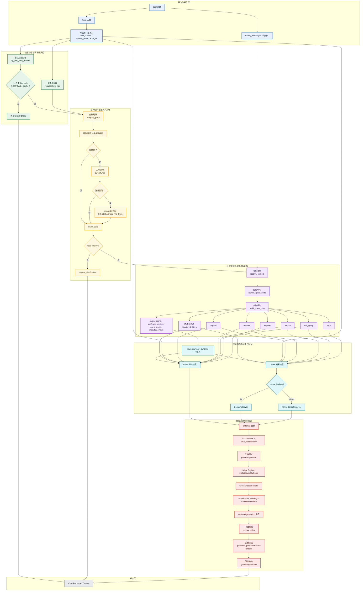
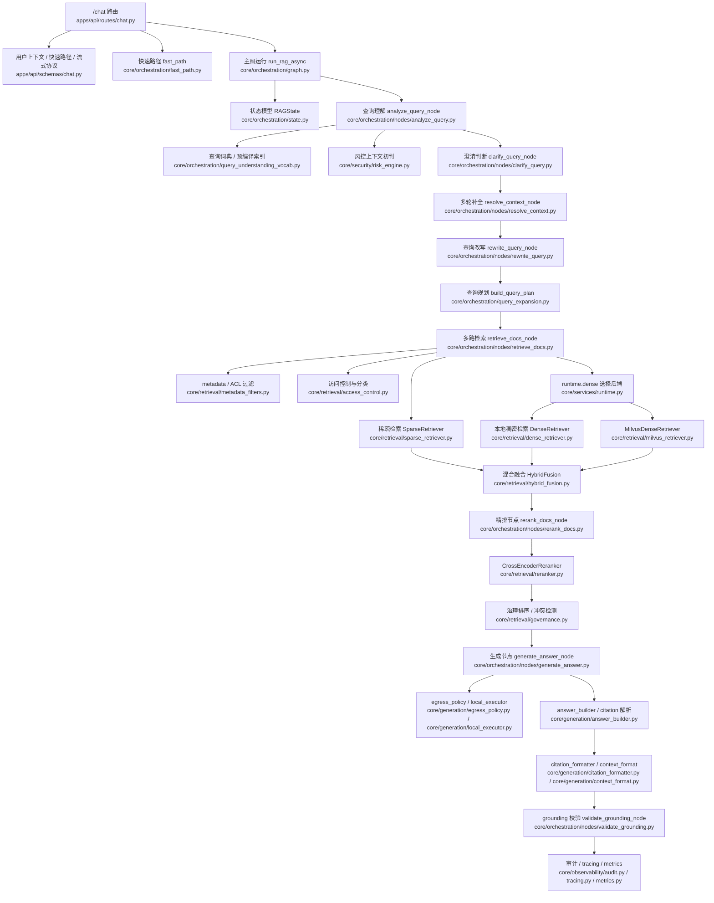
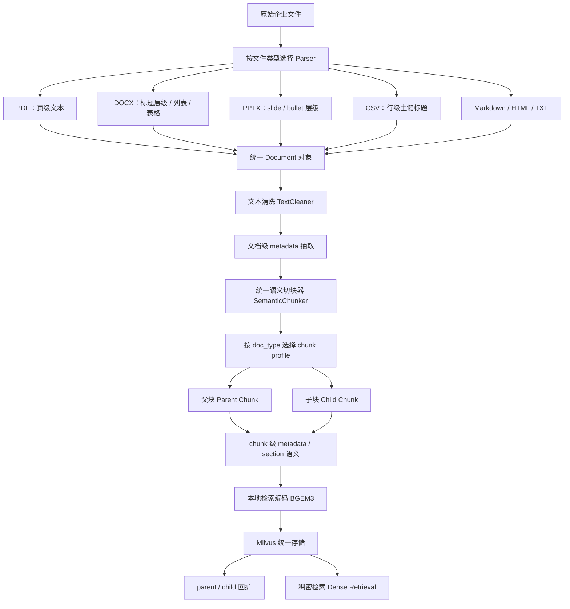
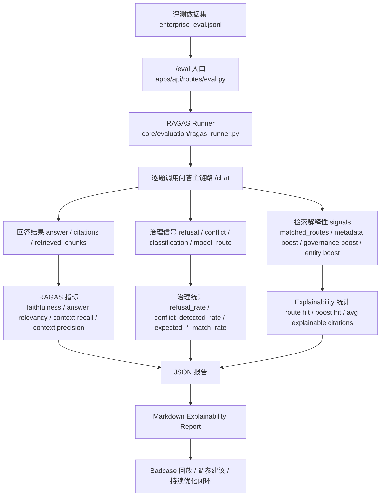
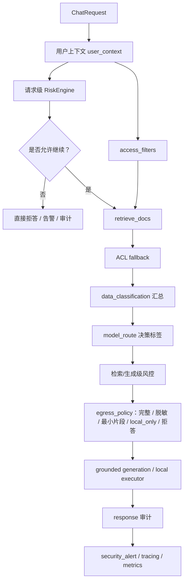

# 新疆能源企业知识智能副驾 - 项目架构文档

## 目录

1. [项目定位](#1-项目定位)
2. [要解决的核心问题](#2-要解决的核心问题)
3. [架构设计原则](#3-架构设计原则)
4. [总体架构](#4-总体架构)
5. [离线知识构建链路](#5-离线知识构建链路)
6. [在线问答链路](#6-在线问答链路)
7. [企业级关键能力](#7-企业级关键能力)
8. [技术选型与取舍](#8-技术选型与取舍)
9. [当前边界与后续演进](#9-当前边界与后续演进)
10. [面试表达建议](#10-面试表达建议)
11. [源码入口映射](#11-源码入口映射)

---

## 1. 项目定位

这个项目当前的正式定位是：

> 新疆能源（集团）有限责任公司 企业知识智能副驾

它不是一个“通用文档问答 Demo”，而是一个面向企业内部制度、技术文档、运维 SOP、项目资料、会议纪要等多源知识场景的企业级 RAG 系统。

如果按面试语境来概括，这个项目要体现的不是“模型会不会答”，而是下面 4 件事：

1. **检索是否足够准**
2. **回答是否可追溯**
3. **权限和数据分级是否可控**
4. **系统是否可评测、可审计、可持续优化**

所以这份架构文档的重点，不是罗列所有模块，而是把下面这条主线讲清楚：

```text
企业知识场景
-> 多源文档入库与结构化切块
-> 查询理解与多路检索
-> ACL / 数据分级 / 风控
-> grounded generation + citation
-> 评测闭环与 badcase 回流
```

---

## 2. 要解决的核心问题

### 2.1 业务问题

新疆能源这类企业知识场景，最常见的问题不是“知识没有”，而是：

1. 文档多源分散，员工不知道去哪里找
2. 传统搜索依赖关键词，召回不稳定
3. 找到文档后还要自己翻，效率很低
4. 不同版本文档可能冲突，系统必须提示而不是混答
5. 不同部门、角色、项目组存在访问边界
6. 高敏知识不能直接出域到外部模型

### 2.2 系统目标

因此系统目标不是单纯做一个聊天机器人，而是：

1. 支持多源企业文档统一接入和结构化切块
2. 支持混合检索、重排和企业 metadata 驱动召回
3. 支持基于证据回答，并返回 citation
4. 支持 ACL 前置过滤、数据分级、模型路由和风控
5. 支持拒答、冲突提示、审计日志和评测闭环

---

## 3. 架构设计原则

这个项目当前采用的是比较稳的生产级工程思路，而不是“为了炫技堆很多 agent”。

### 3.1 先保证系统可控，再追求系统更聪明

- 查询理解先走规则信号和词典层
- 低置信场景才让 LLM 补判
- 很低置信问题回退到保守 hybrid 策略

### 3.2 先在检索侧解决问题，不把问题都推给 prompt

- 文档清洗
- 文件类型感知切块
- metadata 增强
- hybrid retrieval
- rerank
- governance ranking

### 3.3 安全必须前置

- 权限过滤在检索前/检索中执行
- 数据分级在生成前执行出域控制
- 高风险问题进入风控链路
- 审计事件贯穿 request / retrieval / generation / response

### 3.4 最小侵入式演进

- 保留 `FastAPI + LangGraph + hybrid retrieval` 主骨架
- 不推倒重来
- 通过新增 metadata、risk engine、governance、query vocab 等模块逐步增强

---

## 4. 总体架构

### 4.1 架构总览

```mermaid
flowchart LR

    %% =========================
    %% 用户与统一接入
    %% =========================
    User["用户 / Web 控制台 / API 调用方"] --> API["FastAPI 接入层"]

    %% =========================
    %% 在线服务接口层
    %% =========================
    subgraph InterfaceLayer["在线服务接口层"]
        Chat["问答接口 /chat"]
        FAQ["FAQ 接口 /faq/*"]
        Eval["评测接口 /eval"]
        Ingest["入库接口 /ingest"]
    end

    API --> Chat
    API --> FAQ
    API --> Eval
    API --> Ingest

    %% =========================
    %% 离线数据构建链路
    %% =========================
    subgraph OfflinePipeline["离线数据构建链路（Ingestion / Indexing）"]
        direction LR
        Parse["文件解析 Parser"]
        Clean["文本清洗 + 文档级元数据抽取"]
        Chunk["统一语义切块器 SemanticChunker + 文件类型切块策略"]
        Embed["本地检索编码 BGEM3"]
        VectorDB["Milvus / Milvus Lite 统一存储与向量索引"]
    end

    Ingest --> Parse
    Parse --> Clean
    Clean --> Chunk
    Chunk --> Embed
    Embed --> VectorDB

    %% =========================
    %% FAQ / 结构化知识
    %% =========================
    subgraph StructuredKnowledge["结构化知识与快速命中层"]
        FAQStore["MySQL FAQ 存储"]
        FastPath["快速路径 Fast Path：Redis 热点答案 / MySQL FAQ"]
    end

    FAQ --> FAQStore

    %% =========================
    %% 在线问答主链路
    %% =========================
    subgraph OnlinePipeline["在线问答主链路（Query -> Retrieve -> Generate）"]
        direction LR

        Entry["入口层：用户上下文 / 权限过滤 / 审计ID"]
        RiskReq["请求级风控 RiskEngine"]

        subgraph QueryOrchestration["编排与查询理解"]
            Graph["LangGraph 编排主图"]
            Analyze["查询理解 analyze_query"]
            Clarify["澄清判断 clarify"]
            Resolve["多轮补全 resolve_context"]
            Plan["查询规划 query_plan"]
        end

        subgraph RetrievalLayer["多路检索与证据治理"]
            Retrieve["多路检索 retrieve_docs"]
            Sparse["稀疏检索 BM25"]
            Dense["稠密检索 Dense / Milvus"]
            ACL["ACL fallback + 数据分级汇总"]
            Fusion["混合融合 Hybrid Fusion + metadata/entity boost"]
            Rerank["CrossEncoder 精排"]
            Gov["治理排序 Governance + 冲突检测"]
        end

        subgraph GenerationLayer["生成与结果校验"]
            RiskGen["检索/生成级风控"]
            Egress["出域策略 egress_policy"]
            Generate["证据生成 Grounded Generation / Local Fallback"]
            Validate["落地校验 Grounding Validate"]
            Response["ChatResponse / NDJSON 流式结果"]
        end
    end

    Chat --> Entry
    Entry --> FastPath
    Entry --> RiskReq

    RiskReq --> Graph
    Graph --> Analyze
    Analyze --> Clarify
    Clarify --> Resolve
    Resolve --> Plan

    Plan --> Retrieve
    Retrieve --> Sparse
    Retrieve --> Dense
    Sparse --> ACL
    Dense --> ACL
    ACL --> Fusion
    Fusion --> Rerank
    Rerank --> Gov

    Gov --> RiskGen
    RiskGen --> Egress
    Egress --> Generate
    Generate --> Validate
    Validate --> Response

    %% =========================
    %% 共享存储 / 检索依赖
    %% =========================
    FastPath -. 命中 FAQ / 热点缓存 .-> FAQStore
    Dense -. 向量召回 .-> VectorDB
    Sparse -. 本地倒排/索引镜像 .-> LocalIndex

    %% =========================
    %% 观测与评测
    %% =========================
    subgraph Observability["观测 / 评测 / 安全"]
        Audit["审计 / Metrics / Tracing / Security Alert"]
        Ragas["RAGAS + 可解释性报告 Explainability Report + Badcase 报告"]
    end

    Response --> Audit
    Eval --> Ragas

    %% =========================
    %% 样式定义
    %% =========================
    classDef entry fill:#dbeafe,stroke:#2563eb,color:#111827,stroke-width:1.5px;
    classDef offline fill:#dcfce7,stroke:#16a34a,color:#111827,stroke-width:1.5px;
    classDef online fill:#fef3c7,stroke:#d97706,color:#111827,stroke-width:1.5px;
    classDef store fill:#ede9fe,stroke:#7c3aed,color:#111827,stroke-width:1.5px;
    classDef guard fill:#fee2e2,stroke:#dc2626,color:#111827,stroke-width:1.5px;
    classDef obs fill:#e0f2fe,stroke:#0284c7,color:#111827,stroke-width:1.5px;

    class User,API,Chat,FAQ,Eval,Ingest,Entry entry;
    class Parse,Clean,Chunk,Embed,LocalIndex,VectorDB offline;
    class Graph,Analyze,Clarify,Resolve,Plan,Retrieve,Sparse,Dense,Fusion,Rerank,Generate,Validate,Response,FastPath online;
    class FAQStore,LocalIndex,VectorDB store;
    class RiskReq,ACL,Gov,RiskGen,Egress guard;
    class Audit,Ragas obs;
```



### 4.2 问答链路专属架构图

这张图适合你在面试时讲“系统是怎么从用户问题一路走到答案”的。

它重点体现 6 件事：

1. 澄清是前置闸门，不是检索 route
2. query planning 不是一句 rewrite，而是多路 query 生成
3. `structured_filters` 会和 query routes 一起进入检索层
4. `access_filters`、`risk engine`、`data_classification` 会真正影响主链路
5. Dense 检索后端可以落到本地或 Milvus
6. 最终回答前还有 `governance / egress / validate` 三层约束



### 4.3 问答链路与源码文件映射图

这张图更适合你自己读源码时用，回答的是：

> 每个关键节点到底落在哪个文件里？



### 4.4 架构拆分

可以把系统拆成两条主链：

1. **离线知识构建链路**
   文档进入系统后，先解析、清洗、切块、补 metadata、embedding，再写入本地索引镜像和 Milvus。

2. **在线问答链路**
   用户问题进入后，先做 query understanding、query planning、多路检索、ACL/分级/风控，再进入 grounded generation 和 citation 输出。

---

## 5. 离线知识构建链路

离线侧的目标是把“原始文件”变成“可被企业级问答系统消费的知识对象”。

### 5.1 文件接入

当前支持：

- PDF
- DOCX
- PPTX
- CSV
- Markdown
- HTML
- TXT

### 5.2 Parser 结构增强

当前不是简单把文件抽成纯文本，而是先尽量保留结构信号：

- `DOCX`：保留 `heading level`、列表、基础表格
- `PPTX`：保留 `slide` 和 `bullet level`
- `CSV`：每行补主键标题，增强行级检索锚点
- `PDF`：保留页级信息

### 5.3 文件类型感知切块

当前采用的是：

> 统一 `SemanticChunker` + 文件类型 `chunk profile`

而不是给每种文件单独造一套 chunker。

这样做的好处是：

1. 统一架构，维护成本低
2. 不同文件又能按自身特性调切块参数
3. 便于后续继续演进 parser 和 chunk profile

当前已实现：

- `PDF`：优先按页切分，减少跨页混块
- `PPTX`：slide 类内容使用更紧凑的参数
- `CSV`：行级内容走更小、更精确的 chunk 参数
- `TXT`：保守参数
- `DOCX / Markdown / HTML`：继续使用标题结构感知切分

### 5.4 Parent / Child 双层切块

当前 chunk 不是单层结构，而是：

- `child chunk`：更小，主要用于召回
- `parent chunk`：更大，主要用于回扩和 generation

这能平衡：

1. 召回精度
2. 上下文完整性
3. rerank 和 generation 的可用性

### 5.5 企业 metadata 增强

当前入库侧已经开始补充企业语义，而不是只存文本。

文档/块级 metadata 包括：

- 文档身份：`doc_type / doc_number / version / version_status / effective_date / status`
- 组织责任：`owner_department / issued_by / approved_by / plant`
- 业务语义：`business_domain / process_stage / system_name / equipment_type / project_name`
- 安全治理：`data_classification / authority_level / allowed_departments / allowed_roles / project_ids`
- chunk 语义：`section_path / section_type / topic_keywords / chunk_summary`

这一步是后续企业检索效果和安全治理的基础。

### 5.6 离线知识构建链路图

这张图更适合你讲“文档是怎么从原始文件变成可检索知识对象”的。



---

## 6. 在线问答链路

在线链路是这个项目最核心的部分。

### 6.1 入口层

`/chat` 不只是接收问题，还会接收企业上下文，例如：

- `department`
- `role`
- `project_ids`
- `clearance_level`
- `allow_external_llm`

入口层会构造：

- `user_context`
- `access_filters`
- `audit_id`

### 6.2 Query Understanding

当前查询理解已经从“纯规则分流”升级成：

```text
规则信号抽取
-> 规则置信度评估
-> 低置信 LLM 补判
-> 很低置信 guardrail 回退
```

它不是直接让 LLM 决定走哪条 route，而是：

1. 先用规则和词典抽取高价值信号
2. 再按置信度决定是否需要 `qwen-turbo` 补判
3. 最后再生成 query plan

当前会产出：

- `query_scene`
- `preferred_retriever`
- `top_k_profile`
- `metadata_intent`
- `analysis_confidence`
- `analysis_source`

### 6.3 Query Planning

系统不会只保留一个 query，而是会生成多路检索路线：

- `original`
- `resolved`
- `rewrite`
- `sub_query`
- `keyword`
- `hyde`

同时会附带：

- `structured_filters`

这样做的意义是：

- 让 sparse 吃到更适合关键词的 query
- 让 dense 吃到更适合语义召回的 query
- 让多轮问题和复杂问题有更完整的检索表达

### 6.4 检索层

当前 retrieval 的关键特点是：

1. **多路 query route**
2. **sparse + dense hybrid**
3. **metadata 过滤**
4. **ACL fallback**
5. **classification / model_route**

具体流程可以概括成：

```text
query routes
-> metadata_intent + structured_filters + access_filters
-> sparse / dense retrieval
-> child-hit ACL fallback
-> parent expansion
-> fusion
-> rerank
-> governance ranking
```

### 6.5 动态检索优化

当前 retrieval 已经做了几类比较像生产系统的优化：

- `route pruning`
  - 精确问题裁掉低价值 route
- `dynamic top_k`
  - 不同问题类型使用不同召回规模
- `metadata boost`
  - 命中企业 metadata 的候选会获得额外提权
- `enterprise entity boost`
  - 归一后的企业实体如部门、场站、系统名会进一步影响排序
- `rerank candidate clipping`
  - 精排前先裁候选，减少无效 cross-encoder 计算

### 6.6 生成层

生成不是把检索结果直接拼给模型，而是：

1. 先做 `context packing`
2. 再做 `egress policy`
3. 再走 grounded prompt
4. 最后解析 citation，并做 grounding validate

当前 generation 已支持：

- grounded answer
- citation 输出
- conflict notice
- local fallback
- refusal

### 6.7 在线问答链路图

这张图更适合你在面试里讲“一个真实请求在系统内部的决策过程”。

```mermaid
flowchart LR
    A["用户问题 + 企业上下文"] --> B["入口层：/chat"]
    B --> C["请求级风控 request-level risk"]
    B --> D["快速路径 fast path（可被安全策略绕过）"]
    C --> E["查询理解 analyze_query"]
    E --> F["澄清 / 多轮补全"]
    F --> G["查询规划 build_query_plan"]
    G --> H["query routes + structured_filters"]
    B --> I["access_filters"]
    H --> J["retrieve_docs"]
    I --> J
    J --> K["SparseRetriever"]
    J --> L["DenseRetriever / MilvusDenseRetriever"]
    K --> M["ACL fallback + classification"]
    L --> M
    M --> N["HybridFusion + metadata/entity boost"]
    N --> O["CrossEncoderRerank"]
    O --> P["Governance Ranking + Conflict Detection"]
    P --> Q["检索/生成级风控"]
    Q --> R["出域策略 egress_policy"]
    R --> S["grounded generation / local fallback"]
    S --> T["grounding validate"]
    T --> U["ChatResponse / Stream"]
    U --> V["审计 / metrics / tracing"]
```



---

## 7. 企业级关键能力

这部分是你面试时最值得单独拎出来讲的。

### 7.1 ACL 前置过滤

当前权限控制不是“回答后裁剪”，而是：

- 检索前/检索中做 `access_filters`
- 检索后再做一次 child-hit ACL fallback

这能避免：

- 命中越权内容
- 生成阶段才发现不能看

### 7.2 数据分级与模型路由

当前系统支持：

- `data_classification`
- `model_route`

分级的意义不是只展示标签，而是决定：

- 是否允许外部模型
- 是否需要脱敏
- 是否只能最小必要片段出域
- 是否必须 local only

### 7.3 风控引擎

当前系统已经抽出统一风控接口：

- `RiskContext`
- `RiskDecision`
- `RiskEngine`

默认实现是：

- `RuleBasedRiskEngine`

并在 3 个阶段执行：

- request-level
- retrieval-level
- generation-level

### 7.4 审计与告警

当前系统已经有统一审计事件：

- 请求审计
- prompt 审计
- output 审计
- response 审计

同时支持：

- 请求级 `trace_id`
- 本地 `logs/app.log` 关键步骤链路日志
- 本地 `logs/audit.log` 审计 / 安全事件日志
- 脱敏 preview
- hash 摘要
- `security_alert`

### 7.5 冲突检测与治理排序

当前系统不会只按 semantic score 排最终证据，而是会结合：

- `authority_level`
- `effective_date`
- `version`

做轻量治理排序，并输出：

- `conflict_detected`
- `conflict_summary`

这一步很适合企业制度、SOP、纪要、新旧版本并存的场景。

### 7.6 Explainability

当前系统已经可以解释：

- 哪些 route 命中了最终证据
- metadata boost 是否生效
- governance boost 是否生效
- 每条 citation 为什么被选中

### 7.7 评测与可解释性闭环

当前项目里的评测不是“最后临时跑一下 RAGAS”，而是一个独立模块，目标是把：

- 检索是否命中
- rerank 是否有效
- citation 是否可信
- refusal / conflict / route / boost 这些治理行为是否合理

都收进统一报告里。

当前评测模块已经覆盖：

1. **评测入口**
   - `POST /eval`
   - 统一触发离线评测任务

2. **评测执行器**
   - `core/evaluation/ragas_runner.py`
   - 负责加载数据集、调用问答链路、收集指标、写报告

3. **评测数据集**
   - `core/evaluation/datasets/enterprise_eval.jsonl`
   - 当前已覆盖 FAQ、制度冲突、权限拒答、无答案拒答、多文档综合等企业场景

4. **报告产物**
   - JSON 报告：结构化指标与逐题结果
   - Markdown explainability report：更适合人工复盘和面试展示

5. **治理信号评测**
   当前不只记录 RAGAS，还会记录：
   - `refusal / refusal_reason`
   - `conflict_detected / conflict_summary`
   - `data_classification`
   - `model_route`
   - `analysis_source / analysis_confidence`
   - `matched_routes`
   - `metadata_boost / governance_boost / enterprise_entity_boost`

这样后面做 badcase 回流时，不是只知道“这题答错了”，而是能继续定位：

- 是 query understanding 问题
- 是 retrieval / rerank 问题
- 是治理策略问题
- 还是生成阶段的问题

### 7.8 评测与可解释性闭环图

这张图适合你单独讲“这个项目为什么不是跑通 demo，而是已经有持续优化闭环”。



### 7.9 企业安全与治理链路图

这张图适合你单独讲“为什么这是企业级系统，而不是普通 RAG Demo”。



这比“只给答案”更像企业级知识系统。

---

## 8. 技术选型与取舍

### 8.1 为什么保留 LangGraph

因为当前流程已经不只是：

```text
retrieve -> generate
```

而是：

```text
analyze -> clarify -> resolve -> plan -> retrieve -> rerank -> generate -> validate
```

用显式状态图更适合：

- 表达分支
- 插入风控
- 插入 fallback
- 调试每一步状态

### 8.2 为什么不是所有逻辑都交给 LLM

因为企业场景更看重：

- 可控
- 可解释
- 成本
- 稳定性

所以当前方案保留了：

- 规则层
- 词典层
- 低置信 LLM 补判

这是一个比较稳的工程折中。

### 8.3 为什么现在收敛成 Milvus 统一存储

因为当前项目已经不再停留在“教学型双存储”阶段，而是更强调：

- 存储单一
- 检索链路一致
- parent / child 回扩一致
- `/reindex` 数据源唯一

所以这一轮把历史上的本地 `IndexStore` 从主链路移除了，当前口径是：

- 本地 `BGEM3` 负责生成 dense + sparse 表示
- `Milvus` 负责统一存储 chunk 原文、metadata、dense 向量，并承担 parent 回扩和 `/reindex` 数据源

这样更接近真实企业项目，也更容易长期维护。

### 8.4 为什么不是每种文件一个专用 chunker

因为那样维护成本太高。  
当前更稳的策略是：

- parser 先增强结构
- chunker 再根据文件类型 profile 调参数

这能在效果和维护成本之间取得更好的平衡。

### 8.5 为什么模型要分层

当前默认模型分层是：

- 查询理解 / query planning：`qwen-turbo`
- 最终回答：`qwen-plus`

这样做的原因是：

- 高并发低成本问题用轻模型
- 真正复杂回答才用更强模型
- 后续高敏场景还能平滑接入本地模型

---

## 9. 当前边界与后续演进

这部分建议你面试时主动讲，显得更真实。

### 9.1 当前已经做到的

- 企业上下文接入
- ACL 基础过滤
- 数据分级语义
- model route 语义
- risk engine
- 审计和告警基础能力
- query understanding 升级
- 文件类型感知切块
- explainability report

### 9.2 当前还没完全做透的

1. `model_route` 已经有语义，但还不是完整多执行器调度平台
2. `RuleBasedRiskEngine` 还没接外部 PDP / OPA / 企业风控中心
3. `local_only` 已有本地占位执行，但还不是完整本地模型生产服务
4. parser 和 chunker 已经文件类型感知，但还不是每种格式高度专用的知识解析器
5. 冲突检测目前是结构化冲突提示，还不是通用语义矛盾识别

### 9.3 后续最自然的演进方向

1. 接真实本地模型执行层
2. 接远程策略引擎 / 风控平台
3. 继续增强企业词典和实体归一
4. 做更细的 parser 结构化抽取
5. 让 explainability 进一步进入 badcase 回流和自动调参

---

## 10. 面试表达建议

如果你要用这份项目去面试高级 AI 工程师，我建议按下面顺序讲。

### 10.1 先讲业务问题

> 企业内部知识分散在制度、SOP、项目文档、会议纪要和技术资料里，传统搜索找得到但看不完，LLM 直接回答又有幻觉和越权风险。

### 10.2 再讲项目目标

> 所以我做的不是通用聊天机器人，而是一个企业知识智能副驾，目标是让系统答得准、答得稳、能引用、可控权限、可评测、可审计。

### 10.3 再讲架构主线

> 离线侧做多源文档解析、企业 metadata 增强、文件类型感知切块和向量/关键词双索引；在线侧做 query understanding、multi-route retrieval、ACL/分级/风控、grounded generation 和 citation 输出。

### 10.4 最后讲工程取舍

> 我没有把所有问题都交给 prompt，而是优先在文档、检索、召回、排序和风险控制层解决问题；同时保留规则、词典和轻量模型分层，兼顾效果、成本和企业可控性。

### 10.5 讲图话术

这一节是专门给面试时“顺着架构图讲项目”准备的。

建议原则：

1. 不要逐个节点念图
2. 先讲这张图想表达什么
3. 再讲 2 到 4 个关键取舍
4. 最后补一句当前边界

#### 图一：总体架构图怎么讲

对应图：

- [4.1 架构总览](/Users/zhangzhijin/study/黑马学习/rag/RAG-%20project/enterprise-rag-platform/项目架构文档.md)

推荐讲法：

> 这张图讲的是系统的全貌。整体上我把它拆成两条主链：离线知识构建链路和在线问答链路。离线侧负责把原始企业文档转成可检索、可治理的知识对象；在线侧负责把用户问题经过查询理解、多路检索、权限过滤、风控和 grounded generation，最终输出带引用的答案。  
> 这张图里最关键的不是模块多，而是我把企业级能力前置到了主链路里，比如 `user_context`、`access_filters`、`risk engine`、`data_classification`、`egress_policy` 和审计，这样系统不是“先答了再补救”，而是从一开始就按企业要求执行。

面试时建议强调的 3 个点：

1. 这是“双链路架构”，不是单纯 `retrieve -> generate`
2. 安全、权限、审计不是外挂，而是在主链路里
3. 评测和 explainability 是架构的一部分，不是最后补的脚本

#### 图二：问答链路专属架构图怎么讲

对应图：

- [4.2 问答链路专属架构图](/Users/zhangzhijin/study/黑马学习/rag/RAG-%20project/enterprise-rag-platform/项目架构文档.md)

推荐讲法：

> 这张图讲的是一个真实问答请求是怎么走完的。入口层先构造企业上下文和审计信息，再判断是否允许走 fast path；如果不能直接命中，就进入 query understanding。查询理解不是一句 rewrite，而是规则、词典、低置信 LLM 补判和 guardrail 回退的组合。  
> 后面系统会基于 query plan 生成多路 route，再结合 `structured_filters` 和 `access_filters` 做 sparse/dense 检索，经过 ACL fallback、fusion、rerank、governance、risk 和 egress policy，最后才进入 grounded generation 和 grounding validate。

面试时建议强调的 4 个点：

1. query understanding 是分层决策，不是全交给 LLM
2. retrieval 是多路 query 驱动，不是单 query 检索
3. ACL 和数据分级在生成前已经开始发挥作用
4. 最终回答前还有 validate，不是模型说什么就返回什么

#### 图三：源码文件映射图怎么讲

对应图：

- [4.3 问答链路与源码文件映射图](/Users/zhangzhijin/study/黑马学习/rag/RAG-%20project/enterprise-rag-platform/项目架构文档.md)

推荐讲法：

> 这张图主要不是给业务方看的，而是给工程面试或者源码讲解用的。它把问答主链路映射到了真实文件上，回答的是“每个节点的职责在哪里落地”。  
> 我这样设计的目的是让系统可维护：入口层、编排层、检索层、生成层、风控层各自边界清晰，后面要替换 dense backend、risk engine 或本地执行器时，不需要把整条链路推翻。

面试时建议强调的 3 个点：

1. runtime 负责解耦底层依赖
2. orchestration 负责状态流转，不和底层检索细节耦死
3. generation / audit / risk 都是独立层，不直接塞进 route 层

#### 图四：离线知识构建链路图怎么讲

对应图：

- [5.6 离线知识构建链路图](/Users/zhangzhijin/study/黑马学习/rag/RAG-%20project/enterprise-rag-platform/项目架构文档.md)

推荐讲法：

> 这张图讲的是文档如何从“原始文件”变成“知识对象”。重点不在于支持多少格式，而在于 parser 先做结构增强，chunker 再按文件类型 profile 做动态切分，最后再补企业 metadata 和 chunk 级语义。  
> 我没有做成每种文件一个完全独立 chunker，而是做成统一 `SemanticChunker + 文件类型 profile`，因为这样在效果和维护成本之间更平衡。

面试时建议强调的 4 个点：

1. parser 先增强结构，不是直接抽纯文本
2. chunk 不是固定长度，而是结构感知 + 文件类型感知
3. parent / child 双层切块是为了同时兼顾召回和生成
4. metadata 在入库阶段补齐，后续 retrieval 才能更像企业知识系统

#### 图五：在线问答链路图怎么讲

对应图：

- [6.7 在线问答链路图](/Users/zhangzhijin/study/黑马学习/rag/RAG-%20project/enterprise-rag-platform/项目架构文档.md)

推荐讲法：

> 这张图比“问答链路专属架构图”更强调运行时决策。它的重点是：同一个请求在进入系统后，不只是经历 query understanding 和 retrieval，还会持续受到 `access_filters`、`risk`、`classification`、`egress` 的影响。  
> 所以这个系统不是一个简单 QA，而是一个带安全决策和治理语义的问答系统。

面试时建议强调的 3 个点：

1. fast path 不是无条件启用，要受安全策略约束
2. retrieval 和 generation 之间还有风险控制与出域控制
3. response 输出后仍然会进入 audit / tracing / metrics

#### 图六：评测与可解释性闭环图怎么讲

对应图：

- [7.8 评测与可解释性闭环图](/Users/zhangzhijin/study/黑马学习/rag/RAG-%20project/enterprise-rag-platform/项目架构文档.md)

推荐讲法：

> 这张图专门回答“系统上线后怎么持续优化”这个问题。我的做法不是只看一个 RAGAS 总分，而是把问答结果、引用、拒答、冲突、路由、metadata boost、governance boost 和 explainability 一起收进评测链路。  
> 这样评测就不只是验收工具，而是后续调 chunk、调 query understanding、调 retrieval 和调安全策略的依据。

面试时建议强调的 4 个点：

1. 评测不是只看答案文本，还要看拒答、冲突、路由和证据解释
2. `/eval` 会同时产出 JSON 报告和 Markdown explainability report
3. badcase 不只是“答错了”，还要知道错在 query understanding、retrieval 还是 generation
4. 这套闭环让系统可以持续迭代，而不是停留在 demo 阶段

#### 图七：企业安全与治理链路图怎么讲

对应图：

- [7.9 企业安全与治理链路图](/Users/zhangzhijin/study/黑马学习/rag/RAG-%20project/enterprise-rag-platform/项目架构文档.md)

推荐讲法：

> 这张图专门说明为什么这是企业级系统。我的处理方式不是“先让模型回答，再做安全裁剪”，而是从 `ChatRequest` 一进入系统就开始构造 `user_context` 和 `access_filters`，然后在 request、retrieval、generation 三个阶段都做风险判断。  
> 检索后系统会汇总 `data_classification`，再给出 `model_route`，接着通过 `egress_policy` 决定是完整出域、脱敏出域、最小片段出域、local_only 还是直接拒答。最后整个过程都有审计和告警留痕。

面试时建议强调的 4 个点：

1. ACL 是前置的，不是后裁剪
2. 数据分级会真实影响生成前的上下文出域
3. 风控是统一接口，不是各模块各写一套规则
4. 审计的目标不是“留日志”，而是可追责、可定位、可复盘

#### 讲图时的收尾模板

每张图讲完后，你都可以用一句类似的话收尾：

> 这张图想表达的核心不是模块多，而是我把企业知识问答拆成了可控、可解释、可治理的工程链路；这样后面不管是优化检索、接本地模型、接风控平台还是补 badcase 闭环，都有清晰的落点。

### 10.6 3 分钟版讲稿

这版适合：

- 面试官说“你先整体介绍一下这个项目”
- 你需要在很短时间里讲出业务价值、架构亮点和工程深度

推荐讲法：

> 我做的是一个面向新疆能源（集团）有限责任公司的企业知识智能副驾，目标不是做一个通用聊天机器人，而是解决企业内部制度、技术文档、运维 SOP、项目资料和会议纪要这类多源知识场景里的真实问题。  
> 这类场景的核心难点不是只有“能不能答”，而是检索是否稳定、回答是否有证据、权限是否前置控制，以及高敏数据能不能被安全治理。  
> 所以我把系统拆成两条主链。离线侧负责文档解析、结构增强、文件类型感知切块、企业 metadata 抽取、embedding 和索引构建；在线侧负责 query understanding、多路 query planning、hybrid retrieval、ACL fallback、数据分级、风控、grounded generation 和 citation 输出。  
> 在查询理解上，我没有把所有决策都交给 LLM，而是先用规则和企业词典抽信号，再按置信度决定是否调用轻量模型补判，低置信场景还会回退到保守 hybrid 策略。这样做是为了兼顾可控性、成本和解释性。  
> 在检索上，我做的是 sparse + dense 的混合检索，不同 route 会按 query 类型动态裁剪；检索后还会经过 cross-encoder rerank 和治理排序，结合 authority、版本、生效时间做更像企业知识系统的证据排序。  
> 在企业安全上，我把 user_context、access_filters、risk engine、data_classification、model_route 和 egress policy 都前置进主链路，而不是等模型回答完再裁剪。  
> 最后系统输出的不只是答案，还会返回 citation、conflict 信息、refusal 原因和 explainability 信号；离线评测里也不仅看 RAGAS 分数，还会看 route、boost、拒答、冲突检测这些治理行为。  
> 我觉得这个项目最能体现高级 AI 工程师能力的地方，就是它不是只调 prompt，而是把数据、检索、权限、安全、评测和工程化串成了一条可持续优化的链路。

这版讲稿里最建议你重读强调的关键词：

- 多源企业知识
- 文件类型感知切块
- query understanding 分层
- hybrid retrieval + rerank + governance
- ACL / 数据分级 / 风控
- grounded generation + citation
- explainability + eval

### 10.7 10 分钟版讲稿

这版适合：

- 面试官让你详细讲一个代表项目
- 面试进入深挖环节，你需要按“业务 -> 架构 -> 关键设计 -> 当前边界”展开

推荐讲法：

> 这个项目的业务背景是，企业内部知识不是集中在一个系统里，而是分散在制度、SOP、运维手册、项目资料、会议纪要、FAQ 和技术文档中。传统搜索的问题是找得到但看不完，而直接用大模型回答又会面临幻觉、越权和高敏数据出域的问题。  
> 所以我把项目定位成“企业知识智能副驾”，而不是通用聊天机器人。它的目标是让系统在企业环境里答得准、答得稳、能引用、可控权限、可评测、可审计。

> 从架构上看，我把系统拆成两条链。  
> 第一条是离线知识构建链路。文件进入后不会直接做 embedding，而是先按文件类型进入 parser。比如 DOCX 会保留 heading、列表和表格，PPTX 保留 slide 和 bullet level，CSV 会给每行补主键标题。之后统一进入 `SemanticChunker`，但 chunker 不是固定长度切分，而是“统一 chunker + 文件类型 profile + parent/child 双层切块”。再往后补企业 metadata，包括文档身份、组织责任、业务语义和安全治理字段，最后写入本地索引镜像和 Milvus。  
> 这一层的关键取舍是：我没有给每种文件单独做一套完全独立的 chunker，因为维护成本太高；我选择了统一 chunker 但按文件类型做动态 profile，这样更稳也更容易持续迭代。

> 第二条是在线问答链路。用户请求进入 `/chat` 后，入口层会先构造企业上下文，包括 `user_context`、`access_filters` 和 `audit_id`。然后不是立刻检索，而是先做 query understanding。  
> query understanding 我采用的是“规则 + 词典 + 低置信 LLM 补判 + guardrail 回退”。也就是说，高置信问题不浪费模型成本；低置信问题再用轻量模型补判；如果还是不稳，就强制回到保守 hybrid 策略。  
> 这样做的原因是企业场景里很多 query 是结构化、可模式化的，比如制度编号、错误码、设备名、部门、班次、时间这些，用规则和词典就能很高效地抓住；但对于更长尾、更隐式的问题，又需要模型补充理解。

> 在检索侧，我没有做单 query 检索，而是会生成多路 query plan，比如 `original`、`resolved`、`rewrite`、`sub_query`、`keyword`、`hyde`。不同 route 会走 sparse 或 dense，不是所有 route 都一股脑执行。系统会根据 `query_scene`、`preferred_retriever` 和 `top_k_profile` 做 route pruning 和 dynamic top_k，尽量减少无效检索和无效 rerank。  
> 检索结果也不是直接用，而是先经过 ACL fallback 和数据分级，再做 hybrid fusion、cross-encoder rerank，最后再叠加 governance ranking。governance ranking 会结合 authority、effective_date、version 这些企业字段，把“相关且更权威/更新”的文档排前面。  
> 对于新旧版本制度、SOP 和纪要冲突，我还加了 conflict detection，不会让系统把冲突文档强行混成一个看起来流畅但不可靠的答案。

> 在企业安全这块，我比较强调前置控制。权限不是在回答后裁剪，而是在检索前/检索中就通过 `access_filters` 和 ACL fallback 介入。数据分级也不是只打标签，而是会影响后面的 `model_route` 和 `egress_policy`。  
> 比如内部一般数据可以脱敏后出域，敏感数据只允许最小片段，高敏数据走 `local_only`。另外系统还有统一的 `RiskEngine`，会在 request、retrieval、generation 三个阶段做风险判断，并把请求、prompt、output、response 的脱敏信息写入 audit event，必要时触发 `security_alert`。

> 生成阶段我做的是 grounded generation，而不是把检索结果直接拼给模型。生成前先做 context packing，限制文档数、单文档 chunk 数和总字符数，再经过 egress policy 决定给模型多少上下文。模型输出后还要经过 citation parse 和 grounding validate，确保引用的 chunk_id 合法、回答与证据一致。  
> 所以这个系统最终返回的不只是答案，还会返回 citation、冲突信息、拒答原因、模型路由和审计语义，这一点会让它更像企业知识系统，而不是普通聊天机器人。

> 在评测和可持续优化上，我没有只看 RAGAS 分数，还把 explainability 和治理信号接到了 `/eval` 报告里。现在离线评测除了 faithfulness、answer relevancy 这些指标，还会记录 route、metadata boost、governance boost、refusal、conflict_detected、data_classification 和 model_route。  
> 这样后面优化不是凭感觉，而是能从 badcase 报告里看到到底是 query understanding 误判、检索没命中、rerank 没排好，还是治理策略过强/过弱。

> 如果说这个项目有什么边界，我会主动讲三点。第一，当前 `model_route` 已经有语义，但还不是完整的多执行器调度平台；第二，风控现在默认还是本地规则引擎，还没接企业 PDP/OPA；第三，`local_only` 已有本地占位执行，但还不是完整本地模型生产服务。  
> 但我觉得这恰恰说明这套架构是可演进的，因为入口、检索、生成、风控、审计和评测的边界已经清楚，后面替换单点能力不需要推倒整条链路。

> 所以如果总结这个项目的价值，我会说它不是“让模型会说”，而是“让系统在企业环境里说得对、说得稳、说得可追溯、说得不越权，而且还能持续优化”。

### 10.8 讲稿使用建议

最稳的用法是：

1. **先背 3 分钟版**
   用来打头阵，建立整体印象。

2. **再拆 10 分钟版**
   不要整段背，而是拆成 6 个模块：
   - 业务背景
   - 离线链路
   - 在线链路
   - 企业安全
   - 评测闭环
   - 当前边界

3. **遇到深挖就切图**
   最推荐搭配：
   - [4.2 问答链路专属架构图](/Users/zhangzhijin/study/黑马学习/rag/RAG-%20project/enterprise-rag-platform/项目架构文档.md)
   - [5.6 离线知识构建链路图](/Users/zhangzhijin/study/黑马学习/rag/RAG-%20project/enterprise-rag-platform/项目架构文档.md)
   - [7.8 评测与可解释性闭环图](/Users/zhangzhijin/study/黑马学习/rag/RAG-%20project/enterprise-rag-platform/项目架构文档.md)
   - [7.9 企业安全与治理链路图](/Users/zhangzhijin/study/黑马学习/rag/RAG-%20project/enterprise-rag-platform/项目架构文档.md)

### 10.9 问答式面试题库

这一节不是标准答案大全，而是给你一套更稳的答题框架。

建议使用方式：

1. 先回答结论
2. 再讲你为什么这么设计
3. 最后补当前边界

这样会比“上来先讲很多细节”更像高级工程师。

#### Q1：这个项目和普通 RAG Demo 最大的区别是什么？

推荐回答：

> 最大区别不是模块更多，而是我把企业落地真正关心的能力前置进了主链路。普通 RAG Demo 更关注“能不能答”，而这个项目更关注“检索是否稳定、回答是否有证据、权限是否前置控制、数据能不能安全出域、系统能不能评测和审计”。  
> 所以我在架构上加入了 `user_context`、`access_filters`、`risk engine`、`data_classification`、`model_route`、`egress_policy` 和 explainability / eval 闭环。

面试风险点：

- 不要只回答“我功能更多”
- 要强调“企业级约束进入主链路”

#### Q2：为什么不直接把问题丢给 LLM，让它自己决定怎么检索？

推荐回答：

> 我没有这么做，主要是因为企业场景更看重可控性、成本和稳定性。  
> 当前做法是规则和词典先抽高价值 signal，低置信场景再用轻量模型补判，仍低置信时再回退到保守 hybrid 策略。  
> 这样高频结构化问题不会浪费模型成本，长尾问题也有补判能力，而且整个 query understanding 过程可解释、可调 badcase。

面试风险点：

- 不要把规则说成万能
- 要主动承认长尾 query 需要模型补判和 badcase 回流

#### Q3：为什么你要做多路 query planning，而不是只做 rewrite？

推荐回答：

> 因为企业问题里同时存在精确实体查询、流程类查询、多轮承接、对比分析和多跳问题，一条 rewrite 很难兼顾所有检索器。  
> 我把问题展开成 `original / resolved / rewrite / sub_query / keyword / hyde`，让 sparse 和 dense 都能吃到更适合自己的 query，再通过 route pruning 和 dynamic top_k 控制成本。

现场口语版：

> 我没有只做一条 rewrite，主要是因为企业里的问题类型差异特别大。  
> 有的问题像制度编号、错误码，更适合 sparse；有的问题像流程解释、经验总结，更适合 dense；还有一些多轮承接、对比分析类问题，单改写一条 query 往往不够。  
> 所以我做了多路 query planning，让系统按问题类型生成 `original / resolved / keyword / sub_query` 这些不同 query，再通过 route pruning 和动态 `top_k` 控制成本。这样不是为了把链路做复杂，而是为了让不同类型的问题都能有更合适的检索入口。

面试风险点：

- 不要说“route 越多越好”
- 要强调后面还有 pruning、top_k 控制和 rerank 候选裁剪

#### Q4：为什么要保留 BM25，不直接全向量检索？

推荐回答：

> 企业场景里有大量对 sparse 检索很友好的信息，比如制度编号、错误码、设备编号、系统名、部门名、版本号，这些只靠 dense 往往不稳。  
> 所以我采用 sparse + dense 的 hybrid retrieval，用 sparse 保证精确锚点命中，用 dense 补语义召回，再通过 rerank 和治理排序统一收口。

现场口语版：

> 我没有把 BM25 去掉，主要是因为企业文档里有很多信息本身就特别适合关键词检索。  
> 像制度编号、错误码、设备编号、系统名、部门名这些，用户往往就是按精确词来问的，这种时候只靠向量检索容易飘。  
> 所以我保留了 BM25，让它去兜这些强锚点，再用 dense 补语义召回，最后交给 rerank 和治理排序统一收口。这样比全靠一种检索方式更稳。

面试风险点：

- 不要泛泛说“混合检索更好”
- 要明确 sparse 在企业场景里的价值来自“编号、术语、结构化锚点”

#### Q5：为什么要做 parent / child 双层切块？

推荐回答：

> child chunk 更适合召回，因为粒度更细、噪声更少；parent chunk 更适合 generation，因为上下文更完整。  
> 如果直接用大块召回，precision 会差；如果直接用很小块生成，答案容易碎片化。  
> 所以我让 child 用于 retrieval，parent 用于回扩和 generation，这是兼顾效果和上下文完整性的折中。

现场口语版：

> 这个设计本质上是在平衡召回和生成。  
> 如果一开始就拿很大的 chunk 去检索，容易把很多不相关内容一起召回来；但如果全都用很小的 chunk 去生成，回答又会特别碎，缺上下文。  
> 所以我拆成两层，小的 `child chunk` 负责召回，大的 `parent chunk` 负责回扩和生成。这样检索时更准，生成时也不会因为证据太碎导致答案拼不起来。

面试风险点：

- 不要只说“参考了常见做法”
- 要说清 retrieval 和 generation 对 chunk 粒度的需求不同

#### Q6：为什么不是每种文件一个专用 chunker？

推荐回答：

> 我做的是统一 `SemanticChunker + 文件类型 profile`，而不是每种格式一套独立 chunker。  
> 这样设计是因为我希望先把 parser 做结构增强，再让 chunker 根据 `doc_type` 调整 profile。这样既能利用不同文件类型的结构差异，又不会把维护成本做得太高。  
> 目前 PDF、PPTX、CSV、TXT 已经走不同 profile，DOCX/PPTX/CSV 的 parser 输出也已经增强了结构信号。

面试风险点：

- 不要把当前方案包装成“最终最优”
- 要强调这是效果和维护成本之间的工程取舍

#### Q7：权限控制为什么要放在检索前/检索中？

推荐回答：

> 因为如果等模型生成后再裁剪，越权内容其实已经进入上下文了，风险已经发生。  
> 当前系统会在入口构造 `access_filters`，检索时把它和 `structured_filters` 一起下传，检索后再做 child-hit ACL fallback。  
> 这样做是“候选缩小 + 本地兜底”双保险，更符合企业安全要求。

现场口语版：

> 权限这件事不能等模型回答完再处理。  
> 因为如果敏感内容已经进了上下文，哪怕最后把答案裁掉，风险其实已经发生了。  
> 所以我这边是把权限控制前置到检索阶段，先用 `access_filters` 缩小候选范围，再在检索结果上做一层本地 ACL 兜底。这样模型看到的就是它本来就该看到的内容，而不是先看了再遮。

面试风险点：

- 不要只说“安全考虑”
- 要明确“后裁剪并不是真正的权限控制”

#### Q8：数据分级是怎么影响模型调用的？

推荐回答：

> 数据分级不是只打标签，而是决定生成前的出域策略。  
> 当前 retrieval 后会汇总 `data_classification`，再结合请求策略和风控结果输出 `model_route`。生成前的 `egress_policy` 会决定是完整上下文、脱敏上下文、最小片段、local_only 还是直接拒答。  
> 这样高敏数据不会和普通数据一样直接进入外部模型。

现场口语版：

> 我这里的数据分级不是挂个标签做展示，而是真的会影响模型怎么调。  
> 系统在检索完之后会先汇总当前命中文档的数据级别，再结合风险判断出一个 `model_route`。后面生成前还会过一层 `egress_policy`，决定是完整出域、脱敏出域、最小片段出域、只能本地处理，还是直接拒答。  
> 所以高敏数据不会和普通数据一样走同一条模型链路，这个是企业项目里必须做实的。

面试风险点：

- 不要把 `model_route` 说成已经是完整执行平台
- 要明确它现在先是决策语义，执行层还可以继续演进

#### Q9：风控为什么要单独抽成 RiskEngine？

推荐回答：

> 因为我不想让 request、retrieval、generation 各自写一套分散规则。  
> 抽成统一 `RiskEngine` 之后，系统可以在多个执行点共享同一套 `RiskContext / RiskDecision` 语义。当前默认实现是 `RuleBasedRiskEngine`，后续如果要接 OPA、PDP 或企业风控平台，也不需要推翻主链路。

现场口语版：

> 我把风控单独抽出来，主要是为了避免各个模块各写各的规则。  
> 如果 request、retrieval、generation 都自己判断风险，后面一定会越来越乱，也很难统一升级。  
> 所以我做了一个统一的 `RiskEngine`，让它输出标准化的 `RiskDecision`。现在默认是本地规则版，后面如果企业真要接外部 PDP、OPA 或风控平台，也不用把主链路全改一遍。

面试风险点：

- 不要把当前本地规则引擎包装成成熟风控平台
- 要强调“接口已抽象好，便于升级”

#### Q10：为什么要做治理排序和冲突检测？

推荐回答：

> 因为企业知识场景里不是只有“相关”和“不相关”两种状态，还经常存在“都相关但版本不同、权威性不同”的情况。  
> 所以我在 semantic rerank 后又叠了一层 governance ranking，把 `authority_level / effective_date / version` 纳入排序；同时在命中多份可能冲突证据时输出 `conflict_detected / conflict_summary`，避免系统把冲突信息混成一个看似流畅但不可靠的答案。

现场口语版：

> 企业知识场景里，很多时候不是检索不到，而是检索到了多份都相关的内容。  
> 问题在于这些内容可能版本不同、发布时间不同、权威级别也不同，如果不做治理排序，系统很容易把旧制度和新制度混在一起。  
> 所以我在语义重排之后又加了一层治理排序，把权威性、版本和生效时间纳进来；如果系统发现多份证据之间可能有冲突，就直接返回 `conflict_detected` 和 `conflict_summary`，而不是假装它们没有冲突。

面试风险点：

- 不要说成“已经做了通用语义矛盾识别”
- 要诚实说明当前是结构化冲突提示

#### Q11：为什么还要做 grounding validate？

推荐回答：

> 因为模型输出不等于系统认可。  
> 当前 generation 是 grounded prompt，但模型仍可能输出不合法的 citation 或引用不存在的 chunk，所以我在答案解析后又加了一层 `validate_grounding`，对 chunk_id、citation 和回答证据关系做系统侧校验。  
> 这样最终返回的是“系统认可过的答案”，而不是原始模型自由输出。

面试风险点：

- 不要只说“为了更稳”
- 要强调“模型输出不是最终真相，系统还要裁判一次”

#### Q12：你的评测为什么不只看 RAGAS？

推荐回答：

> 因为企业系统不能只评估“答得像不像”，还要评估系统决策是否符合治理要求。  
> 所以我除了 RAGAS 指标，还把 `refusal`、`conflict_detected`、`data_classification`、`model_route`、`matched_routes`、`metadata_boost`、`governance_boost` 这些信号写进评测报告和 explainability report。  
> 这样 badcase 复盘时能定位到底是 query understanding 问题、检索问题、治理问题还是生成问题。

现场口语版：

> 对，我也觉得只看 RAGAS 不够。  
> RAGAS 更像是在看这题答得像不像、引用靠不靠谱，但企业项目里我还得看很多它管不到的东西，比如权限有没有真的拦住、敏感数据是不是按分级走了正确路由、没证据的时候有没有拒答、多个版本冲突的时候有没有提示出来。  
> 所以我在项目里是把 RAGAS 当基础层，再往上补企业治理指标和 badcase 分析。这样最后不是只有一个分数，而是能看出来问题到底出在 query understanding、检索、生成，还是安全策略上。  
> 我觉得对企业级 RAG 来说，这样才够用。

面试风险点：

- 不要只说“我做了评测闭环”
- 要说清楚“评测对象不只是答案，还有系统行为”

#### Q13：如果继续演进，你下一步最想做什么？

推荐回答：

> 我会优先做三件事。  
> 第一，接真实本地模型执行层，让 `local_only` 不只是占位语义；第二，把 `RiskEngine` 接到外部 PDP / 风控平台；第三，继续增强企业词典、实体归一和 parser 结构化能力。  
> 这三件事都能直接复用当前架构，不需要推倒主链路。

面试风险点：

- 不要给出太发散的 roadmap
- 要选和当前架构自然衔接的方向

#### Q14：这个项目里最能体现你“高级 AI 工程师”能力的地方是什么？

推荐回答：

> 我觉得不是某一个模型或某一个 fancy agent，而是我把数据、检索、权限、安全、生成、评测和可解释性串成了统一工程链路。  
> 我不是只调 prompt，而是从 parser、chunk、metadata、query understanding、hybrid retrieval、governance ranking、risk engine、audit 和 eval 一层一层把系统做得更可控、更像企业能落地的产品。

面试风险点：

- 不要只强调“我模块做得很多”
- 要强调“我做了系统级取舍和链路闭环”

---

## 11. 源码入口映射

如果你后面要顺着源码讲项目，最稳的是从这些文件开始：

### 11.1 问答入口

- [apps/api/routes/chat.py](/Users/zhangzhijin/study/黑马学习/rag/RAG-%20project/enterprise-rag-platform/apps/api/routes/chat.py)
- [core/orchestration/graph.py](/Users/zhangzhijin/study/黑马学习/rag/RAG-%20project/enterprise-rag-platform/core/orchestration/graph.py)
- [core/orchestration/state.py](/Users/zhangzhijin/study/黑马学习/rag/RAG-%20project/enterprise-rag-platform/core/orchestration/state.py)

### 11.2 查询理解

- [core/orchestration/nodes/analyze_query.py](/Users/zhangzhijin/study/黑马学习/rag/RAG-%20project/enterprise-rag-platform/core/orchestration/nodes/analyze_query.py)
- [core/orchestration/query_understanding_vocab.py](/Users/zhangzhijin/study/黑马学习/rag/RAG-%20project/enterprise-rag-platform/core/orchestration/query_understanding_vocab.py)
- [core/orchestration/query_expansion.py](/Users/zhangzhijin/study/黑马学习/rag/RAG-%20project/enterprise-rag-platform/core/orchestration/query_expansion.py)

### 11.3 检索与治理

- [core/orchestration/nodes/retrieve_docs.py](/Users/zhangzhijin/study/黑马学习/rag/RAG-%20project/enterprise-rag-platform/core/orchestration/nodes/retrieve_docs.py)
- [core/retrieval/metadata_filters.py](/Users/zhangzhijin/study/黑马学习/rag/RAG-%20project/enterprise-rag-platform/core/retrieval/metadata_filters.py)
- [core/retrieval/access_control.py](/Users/zhangzhijin/study/黑马学习/rag/RAG-%20project/enterprise-rag-platform/core/retrieval/access_control.py)
- [core/retrieval/milvus_retriever.py](/Users/zhangzhijin/study/黑马学习/rag/RAG-%20project/enterprise-rag-platform/core/retrieval/milvus_retriever.py)
- [core/retrieval/governance.py](/Users/zhangzhijin/study/黑马学习/rag/RAG-%20project/enterprise-rag-platform/core/retrieval/governance.py)

### 11.4 生成与校验

- [core/orchestration/nodes/generate_answer.py](/Users/zhangzhijin/study/黑马学习/rag/RAG-%20project/enterprise-rag-platform/core/orchestration/nodes/generate_answer.py)
- [core/generation/context_format.py](/Users/zhangzhijin/study/黑马学习/rag/RAG-%20project/enterprise-rag-platform/core/generation/context_format.py)
- [core/generation/answer_builder.py](/Users/zhangzhijin/study/黑马学习/rag/RAG-%20project/enterprise-rag-platform/core/generation/answer_builder.py)
- [core/orchestration/nodes/validate_grounding.py](/Users/zhangzhijin/study/黑马学习/rag/RAG-%20project/enterprise-rag-platform/core/orchestration/nodes/validate_grounding.py)

### 11.5 风控与审计

- [core/security/risk_engine.py](/Users/zhangzhijin/study/黑马学习/rag/RAG-%20project/enterprise-rag-platform/core/security/risk_engine.py)
- [core/generation/egress_policy.py](/Users/zhangzhijin/study/黑马学习/rag/RAG-%20project/enterprise-rag-platform/core/generation/egress_policy.py)
- [core/observability/audit.py](/Users/zhangzhijin/study/黑马学习/rag/RAG-%20project/enterprise-rag-platform/core/observability/audit.py)

### 11.6 入库与切块

- [core/ingestion/pipeline.py](/Users/zhangzhijin/study/黑马学习/rag/RAG-%20project/enterprise-rag-platform/core/ingestion/pipeline.py)
- [core/ingestion/chunkers/semantic_chunker.py](/Users/zhangzhijin/study/黑马学习/rag/RAG-%20project/enterprise-rag-platform/core/ingestion/chunkers/semantic_chunker.py)
- [docs/ingestion_filetype_matrix.md](/Users/zhangzhijin/study/黑马学习/rag/RAG-%20project/enterprise-rag-platform/docs/ingestion_filetype_matrix.md)

### 11.7 评测与可解释性

- [apps/api/routes/eval.py](/Users/zhangzhijin/study/黑马学习/rag/RAG-%20project/enterprise-rag-platform/apps/api/routes/eval.py)
- [apps/api/schemas/eval_schema.py](/Users/zhangzhijin/study/黑马学习/rag/RAG-%20project/enterprise-rag-platform/apps/api/schemas/eval_schema.py)
- [core/evaluation/ragas_runner.py](/Users/zhangzhijin/study/黑马学习/rag/RAG-%20project/enterprise-rag-platform/core/evaluation/ragas_runner.py)
- [core/evaluation/datasets/enterprise_eval.jsonl](/Users/zhangzhijin/study/黑马学习/rag/RAG-%20project/enterprise-rag-platform/core/evaluation/datasets/enterprise_eval.jsonl)
- [docs/evaluation.md](/Users/zhangzhijin/study/黑马学习/rag/RAG-%20project/enterprise-rag-platform/docs/evaluation.md)

### 11.8 快速路径与运行时装配

- [core/orchestration/fast_path.py](/Users/zhangzhijin/study/黑马学习/rag/RAG-%20project/enterprise-rag-platform/core/orchestration/fast_path.py)
- [core/retrieval/faq_retriever.py](/Users/zhangzhijin/study/黑马学习/rag/RAG-%20project/enterprise-rag-platform/core/retrieval/faq_retriever.py)
- [core/retrieval/faq_store.py](/Users/zhangzhijin/study/黑马学习/rag/RAG-%20project/enterprise-rag-platform/core/retrieval/faq_store.py)
- [core/retrieval/cache.py](/Users/zhangzhijin/study/黑马学习/rag/RAG-%20project/enterprise-rag-platform/core/retrieval/cache.py)
- [core/services/runtime.py](/Users/zhangzhijin/study/黑马学习/rag/RAG-%20project/enterprise-rag-platform/core/services/runtime.py)

### 11.9 观测与链路日志

- [core/observability/logging.py](/Users/zhangzhijin/study/黑马学习/rag/RAG-%20project/enterprise-rag-platform/core/observability/logging.py)
- [core/observability/metrics.py](/Users/zhangzhijin/study/黑马学习/rag/RAG-%20project/enterprise-rag-platform/core/observability/metrics.py)
- [core/observability/tracing.py](/Users/zhangzhijin/study/黑马学习/rag/RAG-%20project/enterprise-rag-platform/core/observability/tracing.py)
- [apps/api/main.py](/Users/zhangzhijin/study/黑马学习/rag/RAG-%20project/enterprise-rag-platform/apps/api/main.py)

---

## 附：一句话架构总结

> 这个项目的核心不是“把文档喂给模型”，而是围绕企业知识场景，把文档解析、结构化切块、查询理解、混合检索、治理排序、权限控制、数据分级、风险审计和 grounded generation 串成一条可解释、可评测、可持续优化的工程链路。
