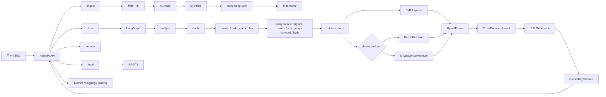
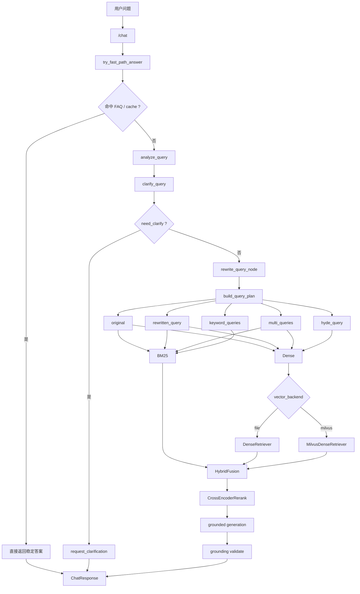
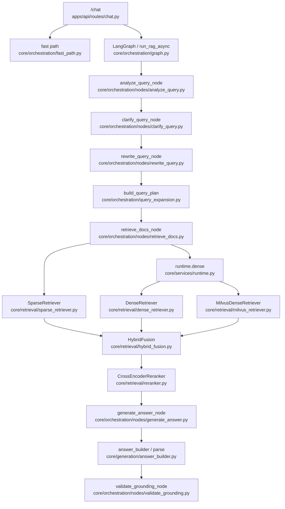

# Enterprise RAG Platform - 项目架构文档

## 目录

1. [项目概述](#1-项目概述)
2. [文档阅读说明](#2-文档阅读说明)
3. [技术栈](#3-技术栈)
4. [系统架构](#4-系统架构)
5. [模块分层说明](#5-模块分层说明)
6. [核心目录结构](#6-核心目录结构)
7. [关键数据流与运行时对象](#7-关键数据流与运行时对象)
8. [部署与运行](#8-部署与运行)
9. [当前限制与扩展方向](#9-当前限制与扩展方向)
10. [附录](#10-附录)

---

## 1. 项目概述

### 1.1 项目定位

这是一个面向企业知识库场景的工程化 RAG 平台骨架，目标不是只做一个“能问答”的最小 Demo，而是把一个可学习、可维护、可扩展的完整链路搭起来：

- 文档接入
- 文本清洗
- 语义切块
- embedding 与索引持久化
- BM25 + Dense 混合召回
- rerank
- grounded generation
- 引用校验与拒答
- RAGAS 评测
- 指标、日志、Tracing
- 前端演示控制台
- Docker / K8s 部署

### 1.2 这份文档的作用

这份文档现在只承担“**总览与架构导航**”的职责，不再把所有细节硬塞在一起。  
如果你是为了学习，请把它当成地图，而不是教材正文。

对应的学习型文档已经拆分成：

- [功能链路详解.md](/Users/zhangzhijin/study/黑马学习/rag/RAG-demo1/enterprise-rag-platform/功能链路详解.md)
- [核心技术原理.md](/Users/zhangzhijin/study/黑马学习/rag/RAG-demo1/enterprise-rag-platform/核心技术原理.md)
- [源码阅读路线图.md](/Users/zhangzhijin/study/黑马学习/rag/RAG-demo1/enterprise-rag-platform/源码阅读路线图.md)

### 1.3 适用场景

| 场景 | 适用性 | 说明 |
|------|------|------|
| 学习 RAG 工程实现 | 非常适合 | 模块分层清晰，文件型索引便于观察 |
| 本地原型验证 | 非常适合 | 无需复杂依赖即可跑通 |
| 小规模内部知识库 | 较适合 | 单机或小团队可以直接用 |
| 大规模线上生产系统 | 需要扩展 | 需升级索引层、任务层、模型服务层 |

---

## 2. 文档阅读说明

### 2.1 如果你只想先看整体

先读：

1. 本文档
2. [README.md](/Users/zhangzhijin/study/黑马学习/rag/RAG-demo1/enterprise-rag-platform/README.md)

### 2.2 如果你想学“问答链路”

优先读：

1. [功能链路详解.md](/Users/zhangzhijin/study/黑马学习/rag/RAG-demo1/enterprise-rag-platform/功能链路详解.md)
2. [apps/api/routes/chat.py](/Users/zhangzhijin/study/黑马学习/rag/RAG-demo1/enterprise-rag-platform/apps/api/routes/chat.py)
3. [core/orchestration/graph.py](/Users/zhangzhijin/study/黑马学习/rag/RAG-demo1/enterprise-rag-platform/core/orchestration/graph.py)

### 2.3 如果你想学“技术原理”

优先读：

1. [核心技术原理.md](/Users/zhangzhijin/study/黑马学习/rag/RAG-demo1/enterprise-rag-platform/核心技术原理.md)
2. [core/ingestion/chunkers/semantic_chunker.py](/Users/zhangzhijin/study/黑马学习/rag/RAG-demo1/enterprise-rag-platform/core/ingestion/chunkers/semantic_chunker.py)
3. [core/retrieval/hybrid_fusion.py](/Users/zhangzhijin/study/黑马学习/rag/RAG-demo1/enterprise-rag-platform/core/retrieval/hybrid_fusion.py)

### 2.4 如果你想按阶段学源码

直接按：

- [源码阅读路线图.md](/Users/zhangzhijin/study/黑马学习/rag/RAG-demo1/enterprise-rag-platform/源码阅读路线图.md)

### 2.5 如果你想逐文件精读

优先读：

1. [源码精读手册.md](/Users/zhangzhijin/study/黑马学习/rag/RAG-demo1/enterprise-rag-platform/源码精读手册.md)
2. [功能链路详解.md](/Users/zhangzhijin/study/黑马学习/rag/RAG-demo1/enterprise-rag-platform/功能链路详解.md)
3. [核心技术原理.md](/Users/zhangzhijin/study/黑马学习/rag/RAG-demo1/enterprise-rag-platform/核心技术原理.md)

---

## 3. 技术栈

### 3.1 后端技术

| 技术 | 用途 |
|------|------|
| Python 3.10+ | 后端主语言 |
| FastAPI | HTTP API |
| Pydantic / pydantic-settings | 数据模型与配置管理 |
| LangGraph | RAG 状态图编排 |
| OpenAI SDK | LLM 调用 |

### 3.2 检索与模型技术

| 技术 | 用途 |
|------|------|
| rank-bm25 | 稀疏检索 |
| sentence-transformers | embedding 与 rerank 模型加载 |
| NumPy | 向量矩阵存储与运算 |
| Milvus / Milvus Lite | 可选 Dense 向量检索后端 |
| Redis | 查询改写缓存 |

### 3.3 文档处理技术

| 技术 | 用途 |
|------|------|
| pypdf | PDF 解析 |
| python-docx | DOCX 解析 |
| beautifulsoup4 + lxml | HTML 解析 |

### 3.4 评测与可观测性

| 技术 | 用途 |
|------|------|
| RAGAS | RAG 质量评测 |
| datasets | 构造评测数据集 |
| prometheus-client | 指标暴露 |
| OpenTelemetry | Trace 导出 |

### 3.5 前端技术

| 技术 | 用途 |
|------|------|
| React | 控制台页面 |
| TypeScript | 前端类型系统 |
| Vite | 构建与本地开发代理 |
| Tailwind CSS | 样式系统 |
| react-markdown | Markdown 渲染 |

---

## 4. 系统架构

### 4.1 总体架构图



### 4.2 问答链路专属架构图

如果你学习这个项目的主要目标是吃透问答功能，那比起总架构图，更应该先抓住下面这张图。

它把当前项目里最关键、也最容易被忽略的部分单独拎了出来：

- 查询规划不是一句简单 rewrite，而是 `build_query_plan`
- 一个问题会展开成多路 query route
- Dense 检索不是固定实现，而是会在 runtime 中分发到 `file` 或 `milvus`



这张图最值得你记住的不是节点名字，而是 3 个工程事实：

1. 当前项目已经不是单 query 检索，而是多路 query planning。
2. `Milvus` 在这里的角色是 Dense backend，不是整个问答系统唯一的检索中心。
3. `keyword`、`hyde`、`sub_query` 这些 route 的存在，是为了让不同检索器吃到更适合自己的 query。

### 4.3 问答链路与源码文件映射图

如果你已经知道这条链路“做了什么”，下一步最自然的问题就是：

```text
每个节点到底落在哪个文件里？
```

下面这张图就是为这个目的准备的。  
它不是替代源码精读，而是帮你先建立“节点 -> 文件”的第一层映射。



你可以按下面这个顺序读，最不容易乱：

1. 先从 [apps/api/routes/chat.py](/Users/zhangzhijin/study/黑马学习/rag/RAG-demo1/enterprise-rag-platform/apps/api/routes/chat.py) 看入口参数和返回结构
2. 再看 [core/orchestration/graph.py](/Users/zhangzhijin/study/黑马学习/rag/RAG-demo1/enterprise-rag-platform/core/orchestration/graph.py) 把主链路骨架抓住
3. 然后顺着
   [core/orchestration/nodes/rewrite_query.py](/Users/zhangzhijin/study/黑马学习/rag/RAG-demo1/enterprise-rag-platform/core/orchestration/nodes/rewrite_query.py)
   ->
   [core/orchestration/query_expansion.py](/Users/zhangzhijin/study/黑马学习/rag/RAG-demo1/enterprise-rag-platform/core/orchestration/query_expansion.py)
   ->
   [core/orchestration/nodes/retrieve_docs.py](/Users/zhangzhijin/study/黑马学习/rag/RAG-demo1/enterprise-rag-platform/core/orchestration/nodes/retrieve_docs.py)
   把“策略选择模型 -> 多路查询 -> 检索调度”看懂
4. 最后再下钻
   [core/services/runtime.py](/Users/zhangzhijin/study/黑马学习/rag/RAG-demo1/enterprise-rag-platform/core/services/runtime.py)
   和
   [core/retrieval/milvus_retriever.py](/Users/zhangzhijin/study/黑马学习/rag/RAG-demo1/enterprise-rag-platform/core/retrieval/milvus_retriever.py)
   去确认 Dense backend 最终是否真的落到了 Milvus

#### 4.3.1 阅读卡片：`chat.py`

文件：

- [apps/api/routes/chat.py](/Users/zhangzhijin/study/黑马学习/rag/RAG-demo1/enterprise-rag-platform/apps/api/routes/chat.py)

先看：

1. `chat`
2. `_run_graph`
3. `gen`

真正职责：

1. 接收 `/chat` 请求
2. 把用户给的 `top_k` 扩成内部召回参数
3. 决定走非流式还是流式

读完后你应该能回答：

1. 为什么前端只传一个 `top_k`
2. 为什么流式和非流式都能共用同一套问答骨架

#### 4.3.2 阅读卡片：`graph.py`

文件：

- [core/orchestration/graph.py](/Users/zhangzhijin/study/黑马学习/rag/RAG-demo1/enterprise-rag-platform/core/orchestration/graph.py)

先看：

1. `run_rag_async`
2. `build_rag_graph`
3. `route_clarify`
4. `route_retrieve`

真正职责：

1. 定义完整问答状态图
2. 管理 `clarify` 和 `retrieve` 这两个关键分支
3. 把节点调用顺序固定下来

读完后你应该能回答：

1. fast path 在图外还是图内
2. 什么情况下会在检索前就提前结束

#### 4.3.3 阅读卡片：`rewrite_query.py + query_expansion.py`

文件：

- [core/orchestration/nodes/rewrite_query.py](/Users/zhangzhijin/study/黑马学习/rag/RAG-demo1/enterprise-rag-platform/core/orchestration/nodes/rewrite_query.py)
- [core/orchestration/query_expansion.py](/Users/zhangzhijin/study/黑马学习/rag/RAG-demo1/enterprise-rag-platform/core/orchestration/query_expansion.py)

先看：

1. `rewrite_query_node`
2. `build_query_plan`
3. `_heuristic_query_plan`

真正职责：

1. 把“一个问题”翻译成“多条可执行检索路线”
2. 生成 `rewritten_query / multi_queries / keyword_queries / hyde_query`
3. 用规则、LLM、缓存把规划做稳

读完后你应该能回答：

1. 当前代码里的“策略选择模型”到底落在哪里
2. 为什么 query planning 不是只做一句 rewrite

#### 4.3.4 阅读卡片：`retrieve_docs.py`

文件：

- [core/orchestration/nodes/retrieve_docs.py](/Users/zhangzhijin/study/黑马学习/rag/RAG-demo1/enterprise-rag-platform/core/orchestration/nodes/retrieve_docs.py)

先看：

1. `retrieve_docs_node`
2. `_merge_hits_by_chunk`
3. `_expand_hits_to_parent_chunks`

真正职责：

1. 执行多路 query route
2. 把 route 分发到 sparse / dense
3. 把 child 命中聚合后回扩到 parent

读完后你应该能回答：

1. `keyword`、`hyde`、`sub_query` 为什么走不同检索器
2. 为什么不是“谁先命中用谁”，而是统一汇总再融合

#### 4.3.5 阅读卡片：`runtime.py + milvus_retriever.py`

文件：

- [core/services/runtime.py](/Users/zhangzhijin/study/黑马学习/rag/RAG-demo1/enterprise-rag-platform/core/services/runtime.py)
- [core/retrieval/milvus_retriever.py](/Users/zhangzhijin/study/黑马学习/rag/RAG-demo1/enterprise-rag-platform/core/retrieval/milvus_retriever.py)

先看：

1. `RAGRuntime.dense`
2. `reload_index`
3. `MilvusDenseRetriever.search`
4. `MilvusDenseRetriever.ensure_remote_index`

真正职责：

1. 决定 Dense 后端到底是 `file` 还是 `milvus`
2. 把上层节点和底层向量库解耦
3. 保持“本地可读镜像 + Milvus 远端召回”的工程折中

读完后你应该能回答：

1. 为什么你在主链路里看到的是 Dense，但真正是否进入 Milvus 要到 runtime 才能确认
2. 为什么接了 Milvus 后本地 `IndexStore` 还不能删

#### 4.3.6 阅读卡片：`generate_answer.py + answer_builder.py + validate_grounding.py`

文件：

- [core/orchestration/nodes/generate_answer.py](/Users/zhangzhijin/study/黑马学习/rag/RAG-demo1/enterprise-rag-platform/core/orchestration/nodes/generate_answer.py)
- [core/generation/answer_builder.py](/Users/zhangzhijin/study/黑马学习/rag/RAG-demo1/enterprise-rag-platform/core/generation/answer_builder.py)
- [core/orchestration/nodes/validate_grounding.py](/Users/zhangzhijin/study/黑马学习/rag/RAG-demo1/enterprise-rag-platform/core/orchestration/nodes/validate_grounding.py)

先看：

1. `generate_answer_node`
2. `parse_llm_grounded_output`
3. `validate_grounding_node`

真正职责：

1. 把 rerank 后的证据变成 grounded answer
2. 把模型自由文本解析成结构化结果
3. 在真正返回给用户前做最后一道系统裁判

读完后你应该能回答：

1. 为什么“模型说了”不等于“系统认可了”
2. 为什么 grounded generation 和 grounding validate 必须分成两层

### 4.4 架构核心思想

1. **接入层只负责接请求，不负责堆业务实现**
2. **RAG 主链路通过状态图显式编排**
3. **检索层和生成层解耦**
4. **索引与运行时状态分离**
5. **可观测性默认内建，而不是事后补**

### 4.5 问答链路在总览层最该抓住的 4 个点

如果你只看这一份总览文档，关于问答主链路至少要抓住下面 4 个事实：

1. 这个项目不是“用户问题 -> 改写一下 -> 检索一下 -> 回答”。
   它在检索前还有一层查询规划，会把一个问题扩展成多路 query route。
2. 当前代码里的“策略选择模型”不是单独一个大类，而是：
   `analyze_query + clarify_query + build_query_plan`
3. 多路 query route 不会全部一股脑只走一个检索器，而是会按类型分流：
   `keyword` 更偏 sparse，`hyde` 更偏 dense，`original / rewrite / sub_query` 同时走两路。
4. `Milvus` 不是整个问答流程的总入口，而是 Dense 检索后端的一种实现。
   只有当 `vector_backend=milvus` 时，多路 query 中需要 dense 的那部分才会真正落到 Milvus。

---

## 5. 模块分层说明

### 5.1 接入层 `apps/api`

职责：

- 接收 HTTP 请求
- 做参数校验
- 调用 runtime 与 RAG 主链路
- 返回 JSON / NDJSON

### 5.2 前端层 `apps/web`

职责：

- 提供问答、入库、评测、连接配置四个交互页面
- 展示结构化引用与检索片段
- 演示流式回答

### 5.3 任务层 `apps/worker`

职责：

- 处理入库与重建索引这类耗时操作

### 5.4 入库层 `core/ingestion`

职责：

- 解析文件
- 清洗文本
- 提取元数据
- 切块
- 构建索引输入

### 5.5 检索层 `core/retrieval`

职责：

- 稀疏检索
- 稠密检索
- 多路 query route 的候选召回
- 融合
- 重排
- 缓存
- 索引持久化

### 5.6 编排层 `core/orchestration`

职责：

- 描述问答状态图
- 管理节点间状态流转
- 生成查询规划与多路 route
- 定义拒答策略

### 5.7 生成层 `core/generation`

职责：

- 查询改写 Prompt
- grounded answer Prompt
- LLM 调用
- 上下文格式化
- 模型输出解析
- 引用格式化

### 5.8 评测层 `core/evaluation`

职责：

- 读取评测集
- 调用当前 RAG 链路批量作答
- 输出评测报告

### 5.9 可观测性层 `core/observability`

职责：

- 结构化日志
- Prometheus 指标
- Trace 导出

---

## 6. 核心目录结构

```text
enterprise-rag-platform/
├── apps/
│   ├── api/
│   │   ├── dependencies/
│   │   ├── routes/
│   │   ├── schemas/
│   │   ├── job_store.py
│   │   └── main.py
│   ├── web/
│   │   ├── src/App.tsx
│   │   ├── src/MarkdownView.tsx
│   │   └── vite.config.ts
│   └── worker/jobs/ingest_job.py
├── core/
│   ├── config/settings.py
│   ├── services/runtime.py
│   ├── models/document.py
│   ├── ingestion/
│   ├── retrieval/
│   ├── orchestration/
│   ├── generation/
│   ├── evaluation/
│   └── observability/
├── infra/
├── tests/
├── data/
├── 项目架构文档.md
├── 功能链路详解.md
├── 核心技术原理.md
└── 源码阅读路线图.md
```

---

## 7. 关键数据流与运行时对象

### 7.1 问答请求的数据流

```text
前端 / 客户端
  -> /chat
  -> ChatRequest
  -> RAGRuntime
  -> LangGraph state
  -> analyze / clarify
  -> build_query_plan
  -> original / rewrite / sub_query / keyword / hyde
  -> sparse / dense route dispatch
  -> DenseRetriever 或 MilvusDenseRetriever
  -> 检索结果
  -> 重排结果
  -> LLM 输出
  -> 引用校验
  -> ChatResponse / NDJSON
```

### 7.2 入库请求的数据流

```text
上传文件
  -> 临时文件
  -> parser.parse
  -> Document
  -> SemanticChunker
  -> TextChunk[]
  -> embed_documents
  -> IndexStore.save
  -> runtime.reload_index
```

### 7.3 运行时核心对象

`core/services/runtime.py` 中的 `RAGRuntime` 是整个项目的运行时中心。

它统一装配：

- `Settings`
- `IndexStore`
- `SparseRetriever`
- `DenseRetriever / MilvusDenseRetriever`
- `HybridFusion`
- `CrossEncoderReranker`
- `LLMClient`
- `RedisCache`
- 编译后的 LangGraph

---

## 8. 部署与运行

### 8.1 本地运行

```bash
cp .env.example .env
python -m pip install -e ".[dev]"
mkdir -p data/vector_store data/eval_reports
make api
```

前端：

```bash
cd apps/web
npm install
npm run dev
```

### 8.2 Docker Compose

```bash
docker compose up --build
```

### 8.3 Kubernetes

```bash
kubectl apply -f infra/k8s/pvc.yaml
kubectl apply -f infra/k8s/redis.yaml
kubectl apply -f infra/k8s/deployment.yaml
```

### 8.4 关键环境变量

| 环境变量 | 作用 |
|------|------|
| `OPENAI_API_KEY` | 启用真实 LLM |
| `VECTOR_BACKEND` | 选择 Dense 后端，常见值为 `file` 或 `milvus` |
| `VECTOR_STORE_PATH` | 索引目录 |
| `REDIS_URL` | 改写缓存 |
| `MILVUS_URI` | Milvus / Milvus Lite 连接地址 |
| `LLM_MODEL_NAME` | 生成模型 |
| `EMBEDDING_MODEL_NAME` | embedding 模型 |
| `RERANKER_MODEL_NAME` | 重排模型 |
| `BM25_TOP_K` | 稀疏召回数量 |
| `DENSE_TOP_K` | 稠密召回数量 |
| `HYBRID_TOP_K` | 融合后候选数 |
| `RERANK_TOP_N` | 最终重排输出数 |

---

## 9. 当前限制与扩展方向

### 9.1 当前限制

1. 索引层仍是文件型实现，不适合超大规模数据
2. 任务状态仍是进程内存型，不适合多副本共享
3. 尚未支持 ACL、多租户、会话长期记忆
4. Worker 仍是轻量实现，未接入真正消息队列
5. 多路 query planning 已接入主链路，但 route 级质量监控与自适应裁剪还不够完善

### 9.2 扩展方向

1. 把 `vector_backend=milvus` 从“可选增强”继续升级到更完整的生产方案
2. 增强 route 级 query planning，支持更细粒度的 query router 和动态 route 选择
2. 引入消息队列化 Worker
4. 增加业务级 badcase 回归评测
5. 增加权限过滤和多租户隔离

---

## 10. 附录

### 10.1 推荐阅读顺序

1. [README.md](/Users/zhangzhijin/study/黑马学习/rag/RAG-demo1/enterprise-rag-platform/README.md)
2. [项目架构文档.md](/Users/zhangzhijin/study/黑马学习/rag/RAG-demo1/enterprise-rag-platform/项目架构文档.md)
3. [功能链路详解.md](/Users/zhangzhijin/study/黑马学习/rag/RAG-demo1/enterprise-rag-platform/功能链路详解.md)
4. [核心技术原理.md](/Users/zhangzhijin/study/黑马学习/rag/RAG-demo1/enterprise-rag-platform/核心技术原理.md)
5. [源码阅读路线图.md](/Users/zhangzhijin/study/黑马学习/rag/RAG-demo1/enterprise-rag-platform/源码阅读路线图.md)

### 10.2 学习建议

- 先理解架构，不要一开始就想看完所有代码
- 先抓住 `/chat` 和 `/ingest` 两条主链路
- 边读边跑接口、边看 `data/vector_store` 里的真实数据
- 学原理时，优先把 chunk、检索、rerank、grounding 搞懂
