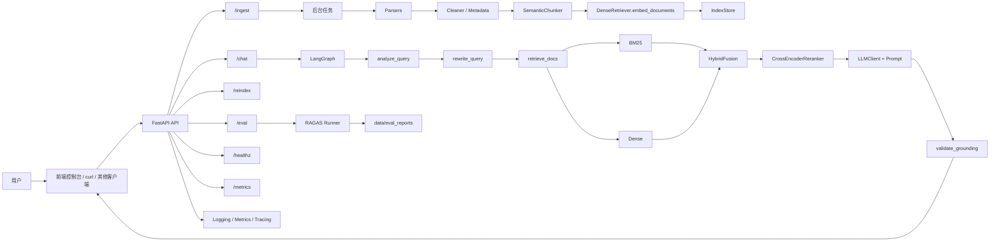
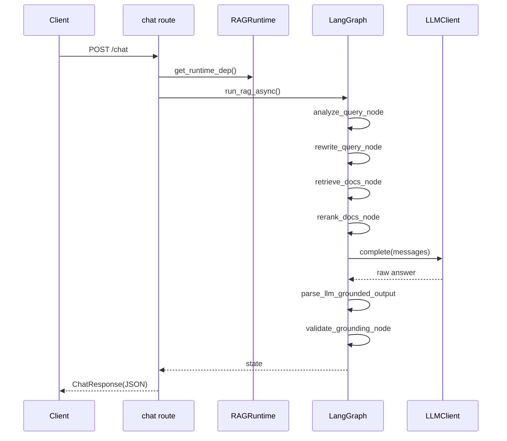
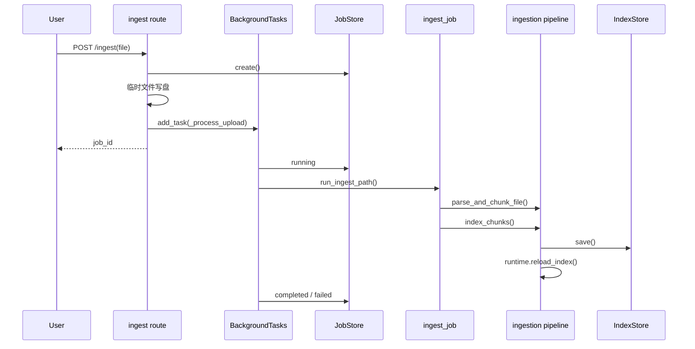
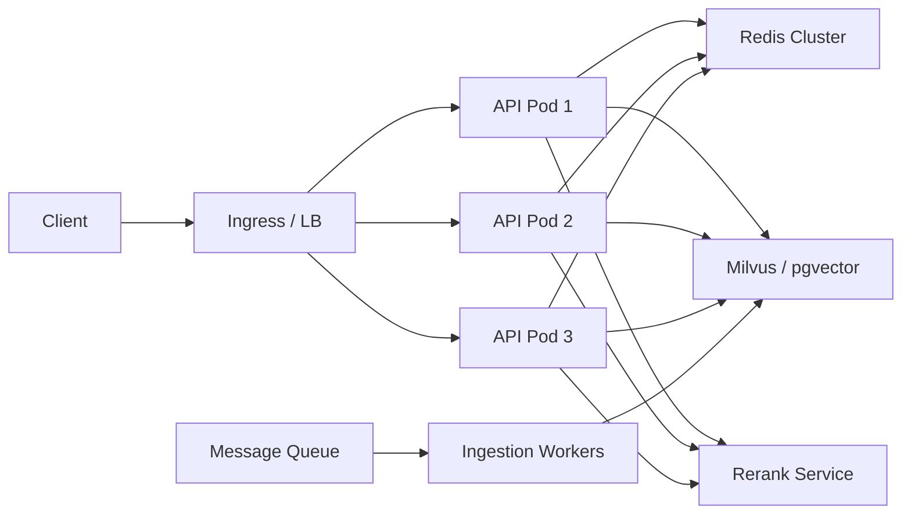

# Enterprise RAG Platform - 项目架构文档

## 目录

1. [项目概述](#1-项目概述)
2. [技术栈](#2-技术栈)
3. [系统架构](#3-系统架构)
4. [功能模块详解](#4-功能模块详解)
5. [代码实现流程](#5-代码实现流程)
6. [技术细节说明](#6-技术细节说明)
7. [性能优化](#7-性能优化)
8. [高性能与高吞吐量技术架构](#8-高性能与高吞吐量技术架构)
9. [未来优化方向](#9-未来优化方向)
10. [部署与运行](#10-部署与运行)
11. [附录](#11-附录)

---

## 1. 项目概述

### 1.1 项目背景与目标

#### 1.1.1 项目背景

RAG（Retrieval-Augmented Generation，检索增强生成）已经成为企业知识问答场景里的主流技术路线。它的核心思路不是让大模型“凭空回答”，而是先从企业知识库中检索和问题相关的内容，再基于检索到的上下文生成答案。

典型企业场景包括：

- 内部知识库问答
- SOP / 操作手册辅助查询
- 错误码排查
- 工单案例复用
- FAQ / 产品文档问答

在真实工程里，一个 RAG 系统通常不只是“调用模型 + 拼接 prompt”这么简单，而是要解决一整条链路的问题：

- 文档如何接入
- 文本如何清洗
- chunk 如何切
- embedding 如何算
- 稀疏召回和稠密召回如何融合
- rerank 是否需要
- 什么情况下要拒答
- 如何知道系统回答得好不好
- 如何把它部署成 API 服务

这个项目的意义就在于：它不是一个最小 Demo，而是一个**面向工程学习的 RAG 平台骨架**。它把接入、索引、召回、重排、生成、评测、可观测性、前端演示、Docker、K8s 都串了起来，适合拿来学习一套完整 RAG 系统应该怎么组织。

#### 1.1.2 项目目标

本项目的目标不是追求某一个单点极致，而是构建一套**可落地、可维护、可扩展、可学习**的企业级 RAG 基线架构。

技术目标：

| 目标 | 说明 | 当前实现 |
|------|------|---------|
| 支持多格式文档入库 | PDF / DOCX / HTML / Markdown | 已支持 |
| 支持混合检索 | BM25 + Dense + Fusion | 已支持 |
| 支持二次重排 | Cross-Encoder rerank | 已支持 |
| 支持 grounded answer | 基于上下文引用作答 | 已支持 |
| 支持拒答策略 | 空召回 / 低相关 / 低置信度拒答 | 已支持 |
| 支持评测 | RAGAS | 已支持 |
| 支持可观测性 | Prometheus + OTEL | 已支持 |
| 支持容器部署 | Docker / docker-compose / K8s | 已支持 |

学习目标：

1. 让你能看懂一个企业 RAG 项目的完整目录结构。
2. 让你能追踪一次 `/chat` 请求从前端进入到答案返回的全链路。
3. 让你能理解入库、召回、重排、生成、评测各阶段的职责边界。
4. 让你能基于这个骨架继续扩展成更接近生产的系统。

#### 1.1.3 项目边界

当前项目更偏向“生产风格骨架 + 教学型实现”，不是一个已经面向大规模线上业务的最终版本。

它已经解决的问题：

- 把核心链路跑通
- 把模块边界划清
- 把关键扩展点预留出来
- 把运维与观测能力接上

它暂时没有完全解决的问题：

- 专业向量数据库接入
- 多租户隔离
- 权限过滤
- 真正的消息队列型 Worker
- 在线 badcase 回流
- 灰度发布与模型版本治理

### 1.2 项目简介

本项目是一个基于 FastAPI + LangGraph + 混合检索的企业知识库 RAG 平台。

核心特性：

- 支持 `POST /chat` 问答接口
- 支持流式和非流式回答
- 支持文件上传入库
- 支持索引重建
- 支持 RAGAS 评测
- 支持前端控制台
- 支持 Prometheus 指标
- 支持 OpenTelemetry tracing

### 1.3 核心功能

#### 1.3.1 问答功能

```text
用户问题
  -> 查询分析
  -> 查询改写
  -> BM25 检索
  -> Dense 检索
  -> 检索结果融合
  -> Cross-Encoder 重排
  -> LLM grounded generation
  -> 引用解析与落地性校验
  -> 返回答案
```

#### 1.3.2 入库功能

```text
上传文件
  -> 解析器选择
  -> 文本抽取
  -> 元数据补全
  -> 语义切块
  -> 文本向量化
  -> chunks + embeddings 持久化
  -> 运行时检索器刷新
```

#### 1.3.3 评测功能

```text
读取评测集
  -> 调用当前 RAG 系统批量回答
  -> 收集 answer / contexts
  -> 交给 RAGAS 评分
  -> 输出 JSON 报告
```

#### 1.3.4 演示控制台功能

- API 连通性检测
- 单问答测试
- 流式输出观察
- 引用与检索片段展示
- 文档上传与任务状态轮询
- RAGAS 评测触发

### 1.4 适用场景

| 场景 | 适用性 | 说明 |
|------|------|------|
| 学习 RAG 工程实现 | 非常适合 | 模块边界清楚，文件型索引便于观察 |
| 做本地原型验证 | 非常适合 | 入库、召回、生成、前端都能快速跑通 |
| 小规模内部知识库 | 较适合 | 单机 / 小团队可直接使用 |
| 大规模线上生产系统 | 需要扩展 | 建议替换索引层、队列层、模型服务层 |

### 1.5 项目特色

1. **工程骨架完整**
   - 不只是问答接口，还包含入库、评测、观测、部署能力。

2. **模块边界清晰**
   - `ingestion / retrieval / orchestration / generation / evaluation` 分层明显。

3. **支持离线模式**
   - 未配置 `OPENAI_API_KEY` 也能跑通链路，便于教学和联调。

4. **透明可调试**
   - 索引文件、报告文件、日志和指标都落在可直接查看的位置。

---

## 2. 技术栈

### 2.1 编程语言与运行环境

| 技术 | 版本 | 用途 | 说明 |
|------|------|------|------|
| Python | 3.10+ | 后端主语言 | API、RAG 链路、评测、脚本 |
| TypeScript | 5.x | 前端开发 | React 控制台 |
| Node.js | 18+ / 20+ | 前端构建 | Vite 打包 |

### 2.2 Web 框架

| 技术 | 用途 | 说明 |
|------|------|------|
| FastAPI | HTTP API 框架 | 提供 `/chat`、`/ingest`、`/eval` 等接口 |
| Uvicorn | ASGI 服务器 | 启动 FastAPI |
| python-multipart | 文件上传 | 支持 `multipart/form-data` |

### 2.3 配置与数据模型

| 技术 | 用途 | 说明 |
|------|------|------|
| Pydantic | 数据模型 | API schema、领域模型 |
| pydantic-settings | 配置读取 | 从 `.env` 和环境变量加载配置 |

### 2.4 编排与模型调用

| 技术 | 用途 | 说明 |
|------|------|------|
| LangGraph | 状态图编排 | 管理 analyze / rewrite / retrieve / rerank / generate / validate 流程 |
| OpenAI SDK | LLM 调用 | 查询改写和 grounded generation |
| LangChain Core | 基础抽象依赖 | 当前用得不多，但与 LangGraph 生态一致 |

### 2.5 检索与向量计算

| 技术 | 用途 | 说明 |
|------|------|------|
| rank-bm25 | 稀疏检索 | 关键词召回 |
| sentence-transformers | embedding / rerank 模型加载 | Dense 检索与 Cross-Encoder 重排 |
| NumPy | 向量矩阵存储与计算 | embedding 矩阵、相似度计算 |
| Redis | 缓存 | 查询改写缓存 |

### 2.6 文档处理

| 技术 | 用途 | 说明 |
|------|------|------|
| pypdf | PDF 文本提取 | 支持页码标记 |
| python-docx | DOCX 解析 | 提取 Word 正文文本 |
| beautifulsoup4 | HTML 解析 | 提取主文本 |
| lxml | HTML 解析底层依赖 | 提升解析兼容性 |

### 2.7 评测与监控

| 技术 | 用途 | 说明 |
|------|------|------|
| RAGAS | RAG 质量评测 | faithfulness、context recall 等 |
| datasets | 评测数据集载体 | 构造 RAGAS 输入 |
| prometheus-client | 指标暴露 | 请求延迟、检索耗时、token 使用量 |
| OpenTelemetry | tracing | 链路追踪 |

### 2.8 前端技术

| 技术 | 用途 | 说明 |
|------|------|------|
| React | 前端 UI | 控制台页面 |
| Vite | 构建工具 | 前端开发与打包 |
| Tailwind CSS | 样式 | 控制台视觉风格 |
| react-markdown | Markdown 展示 | 展示答案与片段 |
| remark-gfm | GFM 支持 | 表格、任务列表等 |
| rehype-sanitize | HTML 净化 | 提升渲染安全性 |

### 2.9 部署与运维技术

| 技术 | 用途 | 说明 |
|------|------|------|
| Docker | 容器化 | 后端 + 前端一体化镜像 |
| docker-compose | 本地多服务编排 | API + Redis + Prometheus |
| Kubernetes | 集群部署 | Deployment / Service / PVC |
| Prometheus | 指标采集 | 监控 `/metrics` |

### 2.10 技术选型理由

#### 2.10.1 为什么选择 FastAPI

- 天然适合 Python 服务化开发
- Pydantic 类型校验体验好
- 自动生成 API 文档
- 异步接口支持自然

#### 2.10.2 为什么选择 LangGraph

- 比“写一堆函数串起来”更适合表达多阶段状态流
- 更适合后续扩展分支逻辑
- 更适合把 RAG 过程做成显式状态机

#### 2.10.3 为什么选择 BM25 + Dense

单一检索方法通常不够稳：

- BM25 对错误码、术语、路径、命令很强
- Dense 对语义相似问法更强

因此项目采用混合召回作为工程默认方案。

#### 2.10.4 为什么先用文件型索引

当前索引存储为：

- `chunks.jsonl`
- `embeddings.npy`
- `index_meta.json`

这样做的优点是：

- 结构直观，适合学习
- 无需额外数据库即可联调
- 排查问题时直接打开文件就能看

缺点是：

- 不适合海量数据
- 不适合多副本并发写入

### 2.11 技术栈架构图

```text
┌──────────────────────────────────────────────────────────┐
│                     应用与交互层                         │
│  React 控制台 / curl / HTTP Client / Swagger Docs       │
└──────────────────────────────────────────────────────────┘
                            ↓
┌──────────────────────────────────────────────────────────┐
│                     API 与任务层                         │
│  FastAPI / BackgroundTasks / JobStore / Worker Job       │
└──────────────────────────────────────────────────────────┘
                            ↓
┌──────────────────────────────────────────────────────────┐
│                     RAG 编排层                           │
│  LangGraph / analyze / rewrite / retrieve / rerank /     │
│  generate / validate                                     │
└──────────────────────────────────────────────────────────┘
                            ↓
┌──────────────────────────────────────────────────────────┐
│                     检索与生成层                         │
│  BM25 / Dense / Fusion / CrossEncoder / LLM / Citations  │
└──────────────────────────────────────────────────────────┘
                            ↓
┌──────────────────────────────────────────────────────────┐
│                     数据与索引层                         │
│  chunks.jsonl / embeddings.npy / mock corpus / eval set  │
└──────────────────────────────────────────────────────────┘
```

---

## 3. 系统架构

### 3.1 整体架构图



### 3.2 分层架构

#### 3.2.1 接入层

目录：

- `apps/api`
- `apps/web`

职责：

- 接收用户输入
- 做参数校验
- 调用运行时与 RAG 主链路
- 把结果转成 JSON / NDJSON / UI 展示

#### 3.2.2 任务层

目录：

- `apps/worker/jobs`
- `apps/api/job_store.py`

职责：

- 管理入库与重建索引的后台任务
- 把耗时操作移出主请求线程

#### 3.2.3 编排层

目录：

- `core/orchestration`

职责：

- 用显式状态图管理 RAG 流程
- 控制节点顺序和分支
- 保存中间状态

#### 3.2.4 检索层

目录：

- `core/retrieval`

职责：

- BM25 稀疏召回
- Dense 稠密召回
- HybridFusion 融合
- CrossEncoder 重排
- Redis 缓存

#### 3.2.5 生成层

目录：

- `core/generation`

职责：

- 查询改写 Prompt
- grounded answer Prompt
- LLM 调用
- 引用解析
- 置信度与回答结构提取

#### 3.2.6 数据接入层

目录：

- `core/ingestion`

职责：

- 文件解析
- 文本清洗
- 元数据补全
- chunk 切分
- 索引重建

#### 3.2.7 评测层

目录：

- `core/evaluation`

职责：

- 读取评测集
- 调用当前 RAG 链路
- 汇总评测报告

#### 3.2.8 可观测性层

目录：

- `core/observability`

职责：

- 结构化日志
- Prometheus 指标
- OpenTelemetry trace

### 3.3 目录结构详解

```text
enterprise-rag-platform/
├── apps/
│   ├── api/
│   │   ├── dependencies/     # FastAPI 依赖注入
│   │   ├── routes/           # 各 HTTP 路由
│   │   ├── schemas/          # API 请求 / 响应模型
│   │   ├── job_store.py      # 后台任务状态存储
│   │   └── main.py           # FastAPI 应用入口
│   ├── web/
│   │   ├── src/App.tsx       # 前端主界面
│   │   ├── src/MarkdownView.tsx
│   │   └── vite.config.ts
│   └── worker/
│       └── jobs/ingest_job.py
├── core/
│   ├── config/settings.py
│   ├── models/document.py
│   ├── services/runtime.py
│   ├── ingestion/
│   │   ├── parsers/          # 按格式解析文件
│   │   ├── cleaners/         # 文本清洗
│   │   ├── metadata_extractors/
│   │   ├── chunkers/semantic_chunker.py
│   │   └── pipeline.py
│   ├── retrieval/
│   │   ├── sparse_retriever.py
│   │   ├── dense_retriever.py
│   │   ├── hybrid_fusion.py
│   │   ├── reranker.py
│   │   ├── cache.py
│   │   ├── index_store.py
│   │   └── schemas.py
│   ├── orchestration/
│   │   ├── graph.py
│   │   ├── retrieval_pipeline.py
│   │   ├── fusion_gate.py
│   │   ├── state.py
│   │   ├── policies/fallback.py
│   │   └── nodes/
│   ├── generation/
│   │   ├── prompts/templates.py
│   │   ├── llm_client.py
│   │   ├── answer_builder.py
│   │   ├── context_format.py
│   │   └── citation_formatter.py
│   ├── evaluation/ragas_runner.py
│   └── observability/
├── infra/
│   ├── docker/Dockerfile
│   ├── k8s/
│   ├── prometheus/prometheus.yml
│   └── scripts/
├── tests/
│   ├── unit/
│   ├── integration/
│   ├── eval/
│   └── load/
├── data/
│   ├── mock_corpus/
│   └── vector_store/
└── 项目架构文档.md
```

### 3.4 运行时依赖关系

运行时入口是 `core/services/runtime.py` 里的 `RAGRuntime`。

它装配了以下对象：

| 属性 | 对应组件 | 作用 |
|------|---------|------|
| `settings` | `Settings` | 全局配置 |
| `store` | `IndexStore` | 索引存储 |
| `sparse` | `SparseRetriever` | BM25 检索 |
| `dense` | `DenseRetriever` | 向量检索 |
| `fusion` | `HybridFusion` | 检索结果融合 |
| `reranker` | `CrossEncoderReranker` | 二次重排 |
| `llm` | `LLMClient` | 模型调用 |
| `cache` | `RedisCache` | 查询改写缓存 |
| `_compiled_graph` | LangGraph app | 编译后的 RAG 状态图 |

这也是你阅读源码时最值得先建立的一个心智模型：

**API 不直接依赖所有底层模块，而是统一依赖一个 runtime。**

---

## 4. 功能模块详解

## 4.1 API 模块

### 4.1.1 应用入口 `apps/api/main.py`

功能：

- 创建 FastAPI app
- 挂载路由
- 配置 CORS
- 配置请求耗时中间件
- 配置 `/metrics`
- 如果前端已构建，则挂载 `/ui`

核心流程：

```python
app = FastAPI(...)
app.include_router(...)
app.middleware("http")(timing_middleware)
app.mount("/ui", ...)
```

学习重点：

- `lifespan` 怎么初始化日志与 tracing
- `timing_middleware` 怎么记录 Prometheus 延迟指标
- 根路径 `/` 为什么会在有前端构建产物时跳转到 `/ui/`

### 4.1.2 依赖注入 `apps/api/dependencies/common.py`

核心函数：

```python
def get_runtime_dep() -> RAGRuntime:
    return get_runtime()
```

作用：

- 让路由函数通过 `Depends(get_runtime_dep)` 拿到统一运行时对象
- 避免在每个路由里自己创建索引、模型和缓存对象

### 4.1.3 问答接口 `apps/api/routes/chat.py`

核心职责：

- 接收 `ChatRequest`
- 根据 `stream` 选择流式 / 非流式路径
- 在非流式模式下直接执行完整图
- 在流式模式下先执行“仅检索链路”，再流式输出 token

关键函数：

| 函数 | 作用 |
|------|------|
| `_run_graph` | 统一派生 `top_k_sparse` / `top_k_dense` / `rerank_top_n` |
| `chat` | 主问答接口 |
| `_chunks_from_state` | 状态转 API schema |
| `_citations_from_state` | 状态转引用 schema |

#### 流式模式和非流式模式的区别

非流式模式：

```text
请求 -> 完整图执行 -> 一次性 JSON 返回
```

流式模式：

```text
请求 -> 检索/重排 -> 先返回 meta -> 再按 token 输出 -> 最后返回 final
```

流式事件类型：

| 事件 | 含义 |
|------|------|
| `meta` | 提前返回引用、片段、置信度等 |
| `token` | 渐进答案文本 |
| `final` | 最终答案、引用、置信度 |

### 4.1.4 入库接口 `apps/api/routes/ingest.py`

核心接口：

- `POST /ingest`
- `GET /jobs/{job_id}`
- `POST /reindex`

#### `POST /ingest`

流程：

1. 创建 job_id
2. 把上传文件写到临时目录
3. 交给 FastAPI `BackgroundTasks`
4. 后台调用 `run_ingest_path`
5. 更新任务状态

#### `GET /jobs/{job_id}`

作用：

- 前端轮询后台任务状态
- 获取 `queued / running / completed / failed`

#### `POST /reindex`

作用：

- 基于已有 `chunks.jsonl` 重建向量
- 常见于 embedding 模型切换或索引损坏重算

### 4.1.5 评测接口 `apps/api/routes/eval.py`

作用：

- 触发 `run_ragas_eval_async`
- 读取报告摘要
- 返回 `report_path + summary`

### 4.1.6 健康检查接口 `apps/api/routes/health.py`

作用：

- 供前端测试连接
- 供 Docker / K8s 探针使用
- 供监控系统做存活检查

## 4.2 Worker 与任务模块

### 4.2.1 任务状态存储 `apps/api/job_store.py`

`JobStore` 是一个内存版任务状态存储器。

它的特点：

- 用 `uuid` 生成任务 ID
- 用线程锁保护并发访问
- 适合本地和教学环境

局限：

- 进程重启后状态丢失
- 多副本部署无法共享状态

如果后续要升级，可替换成：

- Redis
- 数据库
- 真正的任务队列系统

### 4.2.2 入库任务 `apps/worker/jobs/ingest_job.py`

核心函数：

```python
def run_ingest_path(runtime, path, source=None, replace_all=False):
    _, chunks = parse_and_chunk_file(path, source=source)
    index_chunks(runtime, chunks, replace_all=replace_all)
```

说明：

- 它本身很薄
- 真正的入库逻辑都在 `core/ingestion/pipeline.py`

## 4.3 配置模块

### 4.3.1 `core/config/settings.py`

这个文件是整个项目的配置中心。

主要配置分组：

| 分组 | 关键字段 |
|------|---------|
| 基础服务 | `APP_ENV` `API_HOST` `API_PORT` `LOG_LEVEL` |
| 基础设施 | `REDIS_URL` `VECTOR_STORE_PATH` |
| 模型配置 | `LLM_MODEL_NAME` `EMBEDDING_MODEL_NAME` `RERANKER_MODEL_NAME` |
| 检索配置 | `BM25_TOP_K` `DENSE_TOP_K` `HYBRID_TOP_K` `RERANK_TOP_N` |
| 门控配置 | `MIN_RETRIEVAL_SCORE` `MIN_RERANK_SCORE` `REFUSAL_CONFIDENCE_THRESHOLD` |
| 可观测性 | `OTEL_EXPORTER_OTLP_ENDPOINT` `OTEL_SERVICE_NAME` |
| 评测配置 | `EVAL_OUTPUT_DIR` `EVAL_DATASET_PATH` |
| 前端配置 | `CORS_ORIGINS` |

`get_settings()` 使用 `lru_cache` 做单例缓存，这一点很重要：

- 配置只解析一次
- 各模块拿到的配置是一致的
- 测试与运行时行为更稳定

## 4.4 领域模型模块

### 4.4.1 `core/models/document.py`

核心模型：

| 模型 | 含义 |
|------|------|
| `Document` | 解析后的整篇文档 |
| `ChunkMetadata` | chunk 的来源元数据 |
| `TextChunk` | 可索引的文本片段 |

为什么需要单独建模：

- 让 parser、chunker、retriever、generator 之间用统一结构通信
- 降低“某一层传 dict、另一层再猜字段”的混乱度

## 4.5 文档接入模块

### 4.5.1 总入口 `core/ingestion/pipeline.py`

关键函数：

| 函数 | 作用 |
|------|------|
| `parse_and_chunk_file` | 解析文件并切块 |
| `index_chunks` | 将 chunk 编码并入索引 |
| `rebuild_index_from_store_files` | 根据磁盘已有 chunk 重建向量 |

#### `parse_and_chunk_file` 流程

```text
path
  -> get_parser_for_filename(path.name)
  -> parser.parse(path, source)
  -> BasicMetadataExtractor.ensure_doc_id
  -> BasicMetadataExtractor.infer_title_from_filename
  -> SemanticChunker.chunk
  -> (Document, list[TextChunk])
```

#### `index_chunks` 流程

```text
chunks
  -> DenseRetriever.embed_documents
  -> IndexStore.replace_all / 合并旧 chunk
  -> store.save()
  -> runtime.reload_index()
```

### 4.5.2 解析器模块 `core/ingestion/parsers`

当前支持：

| 文件 | 用途 |
|------|------|
| `pdf_parser.py` | PDF 文本提取 |
| `docx_parser.py` | Word 文本提取 |
| `html_parser.py` | HTML 主文本抽取 |
| `markdown_parser.py` | Markdown 读取 |
| `registry.py` | 按扩展名选择解析器 |

#### 解析器统一抽象

`base.py` 里定义了解析器接口，目的是：

- 不同文件格式实现不同解析逻辑
- 对上层统一输出 `Document`

### 4.5.3 文本清洗模块 `core/ingestion/cleaners/text_cleaner.py`

职责：

- 去除多余空白
- 规范文本结构
- 降低解析噪声对后续切块的影响

### 4.5.4 元数据提取模块 `core/ingestion/metadata_extractors/basic.py`

职责：

- 补全文档 ID
- 根据文件名推断标题

作用非常实际：

- 没有 `doc_id`，chunk 不能稳定追踪来源
- 没有标题，前端引用展示效果会很差

### 4.5.5 语义切块模块 `core/ingestion/chunkers/semantic_chunker.py`

这是整个项目学习价值非常高的模块之一。

核心策略：

1. 先按 Markdown 标题拆分 section
2. 再按段落做自然切分
3. 超长段落使用滑窗切分
4. 保留 overlap
5. 继承 PDF 页码信息

关键参数：

| 参数 | 默认值 | 含义 |
|------|------|------|
| `max_chars` | 1200 | 单 chunk 最大字符数 |
| `overlap` | 150 | 滑窗重叠长度 |
| `min_chars` | 80 | 最小有效 chunk 长度 |

为什么要 overlap：

- 防止句子刚好在边界被切断
- 减少重要上下文丢失

为什么要 stable chunk_id：

- 支持增量更新
- 支持引用跟踪
- 支持测试断言稳定

## 4.6 索引与检索模块

### 4.6.1 索引存储 `core/retrieval/index_store.py`

当前采用本地文件型索引。

索引文件：

| 文件 | 作用 |
|------|------|
| `chunks.jsonl` | 保存每个 chunk 的文本与 metadata |
| `embeddings.npy` | 保存与 chunk 对齐的向量矩阵 |
| `index_meta.json` | 保存基础统计信息 |

设计优点：

- 简单透明
- 无外部依赖
- 排查问题非常直观

关键方法：

| 方法 | 作用 |
|------|------|
| `load` | 从磁盘读索引 |
| `save` | 写回磁盘 |
| `clear` | 清空索引 |
| `upsert_chunks` | 增量更新 |
| `replace_all` | 全量替换 |
| `get_all_chunks` | 返回全部 chunk |
| `get_embeddings` | 返回 embedding 矩阵 |

### 4.6.2 稀疏检索 `core/retrieval/sparse_retriever.py`

核心思想：

- 用 BM25 做关键词召回
- 对错误码、术语、路径、命令、产品名更敏感

关键函数：

- `tokenize`
- `rebuild`
- `search`

#### `tokenize` 为什么要支持中文和英文

因为企业知识问答里常见输入往往是混合的：

- 中文句子
- 英文缩写
- 错误码
- 路径
- 数字

### 4.6.3 稠密检索 `core/retrieval/dense_retriever.py`

核心思想：

- 把 query 和文档映射到向量空间
- 使用向量相似度做语义召回

关键方法：

| 方法 | 作用 |
|------|------|
| `_get_model` | 懒加载 embedding 模型 |
| `rebuild` | 重建向量矩阵 |
| `embed_query` | 查询编码 |
| `embed_documents` | 文档编码 |
| `search` | 向量检索 |

实现要点：

- 使用 `normalize_embeddings=True`
- 因此后续矩阵乘法可直接看作余弦相似度

### 4.6.4 融合模块 `core/retrieval/hybrid_fusion.py`

支持两种融合策略：

#### RRF（Reciprocal Rank Fusion）

优点：

- 不依赖不同检索器的分数尺度一致
- 对混合召回更稳

适合：

- BM25 分数和向量分数难直接比较的情况

#### Weighted Fusion

优点：

- 可以明确控制 BM25 和 Dense 的权重

适合：

- 你已经知道某一路召回的重要性更高

### 4.6.5 重排模块 `core/retrieval/reranker.py`

`CrossEncoderReranker` 的作用是：

- 不再只看 query 和文档各自的独立向量
- 而是把 query + 文档拼成 pair 输入交叉编码器
- 得到更细粒度的相关性分数

这一步通常是“召回之后、生成之前”的关键提质步骤。

### 4.6.6 缓存模块 `core/retrieval/cache.py`

当前缓存的核心对象是“查询改写结果”。

原因：

- 同一个问题会重复出现
- 查询改写需要调用 LLM
- 缓存可以减少重复调用成本

设计特点：

- Redis 可用时启用
- Redis 不可用时自动降级
- 不影响主链路可用性

## 4.7 编排模块

### 4.7.1 状态定义 `core/orchestration/state.py`

`RAGState` 是 LangGraph 在各节点之间传递的数据容器。

典型字段包括：

- `question`
- `conversation_id`
- `query_type`
- `rewritten_query`
- `sparse_hits`
- `dense_hits`
- `fused_hits`
- `reranked_hits`
- `answer`
- `confidence`
- `citations`
- `refusal`
- `refusal_reason`

### 4.7.2 查询分析节点 `core/orchestration/nodes/analyze_query.py`

当前实现比较轻量：

- 判断是否像错误码问题
- 判断是否像流程 / SOP 问题
- 否则归类为 general

为什么它重要：

- 未来可以把它扩展成更复杂的 query routing
- 例如错误码问题走错误码索引、流程问题走 SOP 优先召回

### 4.7.3 查询改写节点 `core/orchestration/nodes/rewrite_query.py`

职责：

- 用 LLM 把用户原问题改写成更适合检索的表达
- 命中缓存则直接返回
- 离线模式下退化为原问题

典型收益：

- 保留实体名与错误码
- 去掉口语化噪声
- 把问题改写得更适合文档检索

### 4.7.4 检索节点 `core/orchestration/nodes/retrieve_docs.py`

职责：

1. 执行 BM25
2. 执行 Dense
3. 融合两路结果
4. 记录检索延迟指标

### 4.7.5 门控模块 `core/orchestration/fusion_gate.py`

用途：

- 判断当前融合结果是否“值得继续生成”

特殊点：

- 当使用 `weighted` 融合时，会参考 `MIN_RETRIEVAL_SCORE`
- 当使用 `rrf` 融合时，不直接套用同一个阈值

原因：

- RRF 的分数尺度天然更小，直接和 weighted 的阈值对比会失真

### 4.7.6 重排节点 `core/orchestration/nodes/rerank_docs.py`

职责：

- 调用 `CrossEncoderReranker`
- 把候选片段压缩为最终生成使用的 top_n

### 4.7.7 生成节点 `core/orchestration/nodes/generate_answer.py`

职责：

- 在生成前再做一次相关性门控
- 构造 grounded prompt
- 调用 LLM
- 解析 answer / confidence / citations

拒答场景：

- 没有上下文
- 最高重排分低于阈值

### 4.7.8 落地性校验节点 `core/orchestration/nodes/validate_grounding.py`

这是另一个非常关键的模块。

它会检查：

1. 是否有 citations
2. citation 是否都来自当前检索上下文
3. confidence 是否低于拒答阈值
4. 引用覆盖率如何

如果不满足条件，会把：

- `grounding_ok=False`
- `refusal=True`
- `confidence` 下调

这样做的目的，是把“模型已经生成了文本”和“系统认为答案可靠”这两件事分开。

### 4.7.9 兜底策略 `core/orchestration/policies/fallback.py`

职责：

- 在空召回等场景下统一生成拒答结果

### 4.7.10 精简检索链路 `core/orchestration/retrieval_pipeline.py`

用途：

- 服务流式回答模式

它只执行：

```text
analyze -> rewrite -> retrieve -> rerank
```

然后把上下文先交给前端和流式生成器。

## 4.8 生成模块

### 4.8.1 Prompt 模板 `core/generation/prompts/templates.py`

当前维护两类核心 Prompt：

| Prompt | 用途 |
|------|------|
| `QUERY_REWRITE_SYSTEM` | 查询改写 |
| `GROUNDED_ANSWER_SYSTEM` | 基于上下文作答 |

`GROUNDED_ANSWER_SYSTEM` 约束了几个关键输出规则：

- 只能基于上下文回答
- 事实必须引用 `CHUNK_ID`
- 输出 `ANSWER / CONFIDENCE / REASONING_SUMMARY / CITATIONS_JSON`

### 4.8.2 LLM 客户端 `core/generation/llm_client.py`

职责：

- 封装 OpenAI 兼容调用
- 提供非流式 `complete`
- 提供流式 `stream`
- 记录 token 使用量指标
- 在无 Key 时提供离线 mock 响应

### 4.8.3 上下文格式化 `core/generation/context_format.py`

职责：

- 把重排后的片段拼成 prompt 上下文块

格式示意：

```text
[CHUNK_ID:xxx] title=... source=... page=... section=...
chunk 内容
```

这样设计的好处：

- 模型能看到来源信息
- 模型能在答案中显式引用
- 后处理能校验引用是否合法

### 4.8.4 答案解析 `core/generation/answer_builder.py`

职责：

- 解析模型输出中的 answer / confidence / reasoning
- 优先读取 `CITATIONS_JSON`
- 如果 JSON 失败，再回退到正则抓 `[CHUNK_ID:...]`
- 只接受当前上下文中真实存在的 chunk_id

### 4.8.5 引用格式化 `core/generation/citation_formatter.py`

职责：

- 把内部 `ChunkMetadata` 转成前端可消费的 `Citation`
- 计算 citation coverage
- 做引用去重

## 4.9 评测模块

### 4.9.1 `core/evaluation/ragas_runner.py`

整体流程：

```text
读取 JSONL 评测集
  -> 对每个 question 调用 run_rag_async
  -> 收集 answer / contexts
  -> 构造 HuggingFace Dataset
  -> 调用 RAGAS evaluate
  -> 输出 JSON 报告
```

当前使用的指标：

- `faithfulness`
- `answer_relevancy`
- `context_recall`
- `context_precision`

输出文件位置：

- `data/eval_reports/ragas_report_*.json`

## 4.10 可观测性模块

### 4.10.1 日志模块 `core/observability/logging.py`

职责：

- 配置统一日志格式
- 支持结构化输出

### 4.10.2 指标模块 `core/observability/metrics.py`

当前重点指标包括：

| 指标 | 含义 |
|------|------|
| `REQUEST_LATENCY` | HTTP 请求延迟 |
| `RETRIEVAL_LATENCY` | 稀疏 / 稠密 / 融合阶段耗时 |
| `EMPTY_RETRIEVAL` | 空召回次数 |
| `TOKENS_USED` | prompt / completion token 用量 |
| `CITATION_COVERAGE` | 引用覆盖率 |
| `FAITHFULNESS_SCORE` | RAGAS faithfulness 摘要指标 |

### 4.10.3 tracing 模块 `core/observability/tracing.py`

职责：

- 初始化 OpenTelemetry
- 按配置把 trace 导出到 OTLP 收集器

## 4.11 前端模块

### 4.11.1 主页面 `apps/web/src/App.tsx`

这个文件基本就是前端主控制台的全部核心逻辑。

页面分四个 tab：

- `chat`
- `ingest`
- `eval`
- `settings`

关键状态：

| 状态 | 作用 |
|------|------|
| `question` | 输入问题 |
| `topK` | 前端控制最终 rerank top_n |
| `stream` | 是否启用流式模式 |
| `answer` | 回答正文 |
| `citations` | 结构化引用 |
| `chunks` | 检索片段 |
| `file` | 待上传文件 |
| `jobId/jobStatus` | 入库任务状态 |
| `evalOut/evalSummary` | 评测结果 |

### 4.11.2 Markdown 渲染 `apps/web/src/MarkdownView.tsx`

职责：

- 对答案和片段进行 Markdown 展示
- 提供 GFM 支持
- 进行 HTML 净化
- 对标题、表格、代码块做统一样式映射

---

## 5. 代码实现流程

## 5.1 `/chat` 非流式问答流程



### 5.1.1 关键代码入口

1. `apps/api/routes/chat.py::chat`
2. `core/orchestration/graph.py::run_rag_async`
3. `core/services/runtime.py::get_compiled_graph`

## 5.2 `/chat` 流式问答流程

流式路径不是直接走完整图，而是分两段：

第一段：

```text
analyze -> rewrite -> retrieve -> rerank
```

第二段：

```text
使用当前上下文构造 grounded prompt -> LLM stream -> 前端逐 token 渲染
```

这样做的好处：

- 前端更早拿到片段和引用信息
- 用户更早看到系统正在工作
- 更适合做过程观察和调试

## 5.3 `/ingest` 入库流程



## 5.4 `/reindex` 流程

```text
POST /reindex
  -> BackgroundTasks
  -> rebuild_index_from_store_files
  -> 读取 chunks.jsonl
  -> 重算 embeddings
  -> 保存 embeddings.npy
  -> reload_index
```

## 5.5 `/eval` 评测流程

```text
POST /eval
  -> run_ragas_eval_async
  -> run_ragas_eval
  -> _load_jsonl
  -> 对每个问题调用 run_rag_async
  -> 构造 Dataset
  -> 调用 ragas.evaluate
  -> 输出报告
```

## 5.6 前端交互流程

### 5.6.1 问答页

```text
输入问题 -> 点击发送 -> fetch /chat
  -> 更新 answer / confidence / citations / chunks
  -> 页面展示结果
```

### 5.6.2 入库页

```text
选择文件 -> 上传并入库 -> 获取 job_id
  -> 点击刷新状态 -> fetch /jobs/{job_id}
```

### 5.6.3 评测页

```text
点击运行评测 -> fetch /eval
  -> 返回 report_path + summary
  -> 页面展示评测摘要
```

---

## 6. 技术细节说明

## 6.1 为什么 RAG 不能只调 Prompt

很多初学者会误以为：RAG 效果不好，首先应该改 prompt。

但从工程角度看，最常见的根因往往在前面：

1. 文档解析有噪声
2. chunk 切得不好
3. embedding 模型不合适
4. 召回没召回到真正有用的 chunk
5. rerank 不够稳
6. 上下文拼接格式不清晰

所以本项目的设计也体现了这个思路：

- prompt 只是最后一环
- 真正的问题定位应该沿着“数据 -> 检索 -> 重排 -> 生成 -> 评测”往前追

## 6.2 语义切块设计原理

### 6.2.1 为什么不是固定长度硬切

如果直接每 1000 字符一刀切，会有两个明显问题：

- 标题和正文容易被拆散
- 句子和语义单元会在边界断裂

因此本项目采用分层切块：

1. 标题切 section
2. section 内按段落拼接
3. 超长段再滑窗切

### 6.2.2 overlap 的作用

示例：

- chunk1 结尾：`...请先登录控制台，然后点击“重建索引”按钮`
- chunk2 开头：`点击“重建索引”按钮后，系统会重新计算所有 chunk 的 embedding`

如果没有 overlap，这句话可能刚好被切开，检索时只命中其中一半，相关性会下降。

## 6.3 Stable Chunk ID 的作用

chunk_id 不是随机数，而是基于：

- `doc_id`
- chunk 序号
- 内容前缀

这样做的收益：

- 文档小改动时，未变化的 chunk 更容易保持稳定
- 引用可以持续追踪
- 测试不容易因为 ID 漂移而频繁失效

## 6.4 BM25 原理与作用

BM25 本质上是关键词相关性打分算法。

它擅长的问题类型：

- “错误码 E-1001 是什么”
- “退款流程”
- “重建索引命令”
- “redis 连接失败”

因为这些问题里有比较明确的关键词或短语。

## 6.5 Dense 检索原理与作用

Dense 检索适合处理语义近似表达。

例如：

- 用户问：“密码忘了怎么办？”
- 文档写的是：“账号密码重置流程如下”

这两个文本关键词不完全一致，但语义接近，Dense 检索更容易召回。

## 6.6 混合召回为什么更稳

如果只用 BM25：

- 语义近似问题可能召回不到

如果只用 Dense：

- 错误码、命令、路径等精确术语问题可能召回不够稳

因此混合召回通常是企业场景的更稳妥默认方案。

## 6.7 RRF 与 Weighted Fusion 的差异

### RRF

看排名，不太看原始分数值。

更稳：

- 不要求不同检索器分数尺度一致
- 适合作为默认策略

### Weighted

看归一化后的分数加权和。

更可控：

- 可以显式调 `fusion_sparse_weight`
- 但调参成本更高

## 6.8 Cross-Encoder Rerank 的意义

为什么召回后还要再 rerank？

因为召回阶段强调“不要漏掉候选”，往往会召回一批有点相关但不一定最优的片段。

Cross-Encoder 的价值在于：

- query 和文档对一起输入
- 重新判断二者细粒度匹配程度
- 帮你把最终喂给模型的上下文质量抬高

## 6.9 Grounded Prompt 设计

项目当前 grounded answer prompt 的核心规则有：

1. 只能基于提供的 CONTEXT 回答
2. 每个事实都要引用 `CHUNK_ID`
3. 如果上下文不足，就拒答
4. 输出结构化 `CITATIONS_JSON`

这背后的工程目的非常明确：

- 不是为了“让 prompt 看起来高级”
- 而是为了给后处理和评测创造可校验结构

## 6.10 为什么还需要 `validate_grounding`

因为模型即使被 prompt 约束，也仍可能：

- 漏引用
- 引错 chunk
- 给出低置信度答案

因此系统在 LLM 之后还要做一层“程序化校验”。

这也是企业系统和简单 Demo 的一个典型区别：

**不把模型输出直接视为最终可信结果。**

## 6.11 离线模式设计

当前没有 `OPENAI_API_KEY` 时：

- 查询改写直接返回原问题
- 生成阶段返回 mock 文本

这样做虽然不能得到真实高质量答案，但可以保证：

- 前后端链路联调不被外部模型服务卡死
- 测试环境可以跑通
- 你能先学习系统架构，再接入真实模型

## 6.12 索引文件格式说明

### 6.12.1 `chunks.jsonl`

每一行是一个 chunk 的 JSON。

典型字段：

- `content`
- `metadata.doc_id`
- `metadata.chunk_id`
- `metadata.source`
- `metadata.title`
- `metadata.page`
- `metadata.section`

### 6.12.2 `embeddings.npy`

NumPy 二维矩阵：

- 行数 = chunk 数
- 每一行对应一个 chunk 向量

### 6.12.3 `index_meta.json`

当前只记录：

- `num_chunks`

## 6.13 指标设计说明

为什么要记录检索分阶段耗时：

- 你才能知道瓶颈在 BM25、Dense、Fusion 还是 Rerank

为什么要记录 token 使用量：

- 你才能评估模型成本

为什么要记录 citation coverage：

- 你才能知道回答有没有真正建立在上下文之上

为什么要记录 faithfulness：

- 这是最接近“有没有胡说八道”的 RAG 高层质量指标之一

---

## 7. 性能优化

## 7.1 当前已经实现的优化

### 7.1.1 配置单例缓存

`get_settings()` 使用 `lru_cache`。

收益：

- 减少重复解析环境变量开销

### 7.1.2 运行时单例

`get_runtime()` 通过全局单例复用：

- 检索器
- 索引
- 缓存连接
- 编译后的图

收益：

- 避免每个请求都重新初始化模型和索引

### 7.1.3 LangGraph 编译结果缓存

图结构通常不会频繁变化，所以 compile 后缓存非常合理。

### 7.1.4 改写缓存

相同 query 不重复调用 LLM 改写。

### 7.1.5 embedding 持久化

向量提前落成 `embeddings.npy`，避免每次启动都全量重算。

### 7.1.6 流式返回

虽然流式不一定让总耗时更短，但会显著改善用户体感延迟。

## 7.2 当前主要性能瓶颈

潜在瓶颈通常在：

1. Dense embedding 模型编码
2. Cross-Encoder rerank
3. LLM 生成

尤其当：

- chunk 数量变多
- top_k 提高
- 文档规模扩大

## 7.3 优化建议

### 检索层

- embedding 预计算
- 换 ANN 向量库
- top_k 分层控制

### 重排层

- 缩小 rerank 候选数量
- 使用更轻量 reranker
- 将 reranker 服务化

### 生成层

- 限制上下文长度
- 减少无效 chunk
- 调整输出 token 数

---

## 8. 高性能与高吞吐量技术架构

## 8.1 当前架构适合的规模

当前实现更适合：

- 单机开发
- 小规模团队知识库
- 教学 / 演示 / 原型验证

## 8.2 如果要上更大规模，需要改什么

### 8.2.1 索引层升级

从当前文件型索引升级为：

- Milvus
- pgvector
- Elasticsearch / OpenSearch

### 8.2.2 任务层升级

从当前 BackgroundTasks / 内存 JobStore 升级为：

- Celery + Redis
- RQ
- Kafka / RabbitMQ / Redis Stream

### 8.2.3 模型层升级

- embedding 服务独立化
- reranker 服务独立化
- LLM 代理层统一化

### 8.2.4 API 层升级

- 多副本 FastAPI
- Ingress / 负载均衡
- 水平扩缩容

## 8.3 高吞吐参考架构图



## 8.4 高吞吐下需要关注的指标

- 请求 QPS
- P50 / P95 / P99 延迟
- embedding 耗时
- rerank 耗时
- token 成本
- Redis 命中率
- 向量库查询耗时

---

## 9. 未来优化方向

## 9.1 检索质量优化

优先建议：

1. query expansion
2. 多 query 并行召回
3. 更细的 chunk 策略
4. badcase 数据集建设

## 9.2 数据工程优化

- 更强的 HTML 主体抽取
- OCR 支持
- 表格结构解析
- FAQ / SOP 专用切块

## 9.3 架构工程优化

- 真正的消息队列
- 多租户隔离
- ACL 权限过滤
- 向量库替换
- 对话历史存储

## 9.4 评测体系优化

- 构建业务级评测集
- 引入 regression benchmark
- 针对 badcase 分类统计
- 建立版本间对比机制

## 9.5 运维体系优化

- Grafana 仪表盘
- trace 采样策略
- 模型成本监控
- 灰度发布与回滚

---

## 10. 部署与运行

## 10.1 本地运行

### 10.1.1 Python 依赖安装

```bash
cp .env.example .env
python -m pip install -e ".[dev]"
mkdir -p data/vector_store data/eval_reports
```

### 10.1.2 启动 API

```bash
make api
```

### 10.1.3 启动前端

```bash
cd apps/web
npm install
npm run dev
```

### 10.1.4 初始化脚本

也可以使用：

```bash
bash infra/scripts/init_local.sh
```

## 10.2 Docker Compose

```bash
docker compose up --build
```

compose 当前包含：

- API
- Redis
- Prometheus

## 10.3 Kubernetes

```bash
kubectl apply -f infra/k8s/pvc.yaml
kubectl apply -f infra/k8s/redis.yaml
kubectl apply -f infra/k8s/deployment.yaml
```

## 10.4 关键环境变量说明

| 环境变量 | 作用 |
|------|------|
| `OPENAI_API_KEY` | 启用真实 LLM |
| `OPENAI_BASE_URL` | 自定义模型服务地址 |
| `VECTOR_STORE_PATH` | 索引目录 |
| `REDIS_URL` | 查询改写缓存 |
| `LLM_MODEL_NAME` | 生成模型 |
| `EMBEDDING_MODEL_NAME` | embedding 模型 |
| `RERANKER_MODEL_NAME` | 重排模型 |
| `BM25_TOP_K` | 稀疏召回数量 |
| `DENSE_TOP_K` | 稠密召回数量 |
| `HYBRID_TOP_K` | 融合后保留数量 |
| `RERANK_TOP_N` | 最终生成使用的片段数 |
| `MIN_RETRIEVAL_SCORE` | 召回最低阈值 |
| `MIN_RERANK_SCORE` | 重排最低阈值 |
| `REFUSAL_CONFIDENCE_THRESHOLD` | 拒答置信度阈值 |
| `CORS_ORIGINS` | 前端来源白名单 |

## 10.5 运行时产物

启动与运行过程中常见产物：

- `data/vector_store/chunks.jsonl`
- `data/vector_store/embeddings.npy`
- `data/vector_store/index_meta.json`
- `data/eval_reports/*.json`

---

## 11. 附录

## 11.1 主要 API 摘要

| 方法 | 路径 | 说明 |
|------|------|------|
| POST | `/chat` | 问答接口 |
| POST | `/ingest` | 上传文档入库 |
| GET | `/jobs/{job_id}` | 查询任务状态 |
| POST | `/reindex` | 重建向量索引 |
| POST | `/eval` | 运行 RAGAS |
| GET | `/healthz` | 健康检查 |
| GET | `/metrics` | 指标接口 |

## 11.2 推荐源码阅读顺序

如果你是为了学习，建议按下面顺序读：

1. `apps/api/main.py`
2. `apps/api/routes/chat.py`
3. `apps/api/routes/ingest.py`
4. `core/services/runtime.py`
5. `core/orchestration/graph.py`
6. `core/orchestration/nodes/*`
7. `core/retrieval/*`
8. `core/ingestion/*`
9. `core/generation/*`
10. `core/evaluation/ragas_runner.py`
11. `apps/web/src/App.tsx`

## 11.3 学习路线建议

### 第一阶段：先看系统怎么跑起来

- API 入口
- 前端页面
- 配置文件

### 第二阶段：再看问答链路

- analyze
- rewrite
- retrieve
- rerank
- generate
- validate

### 第三阶段：再看入库链路

- parser
- cleaner
- metadata
- chunker
- index

### 第四阶段：最后看评测与运维

- ragas_runner
- metrics
- tracing
- docker / k8s

## 11.4 当前实现限制

1. 向量存储仍是本地文件型实现
2. 任务状态仍是进程内存型
3. 对话历史没有持久化
4. ACL 与多租户能力未接入
5. 真实业务级评测集需要你自己补充

## 11.5 你读这个项目时最该关注的几个文件

如果只读 8 个文件，优先看：

1. `core/services/runtime.py`
2. `core/orchestration/graph.py`
3. `apps/api/routes/chat.py`
4. `core/ingestion/pipeline.py`
5. `core/ingestion/chunkers/semantic_chunker.py`
6. `core/retrieval/hybrid_fusion.py`
7. `core/generation/answer_builder.py`
8. `core/evaluation/ragas_runner.py`

这 8 个文件基本就能帮你建立对整个项目的主体理解。

## 11.6 逐文件职责总览

这一节不是按“模块”讲，而是按“文件”讲。你在读代码时可以直接按文件名跳转。

### 11.6.1 API 接入层文件

| 文件 | 主要职责 | 你读它时要关注什么 |
|------|---------|------------------|
| `apps/api/main.py` | 创建 FastAPI 应用，挂载路由、中间件、静态前端 | 服务是怎么启动的、请求延迟指标在哪打、前端为什么能挂到 `/ui/` |
| `apps/api/dependencies/common.py` | 提供 `get_runtime_dep()` | FastAPI 如何把全局 runtime 注入到路由 |
| `apps/api/routes/chat.py` | 问答接口，区分流式与非流式 | `/chat` 为什么会分成两条执行路径 |
| `apps/api/routes/ingest.py` | 上传文件、任务状态查询、重建索引 | BackgroundTasks 怎么把耗时操作移到后台 |
| `apps/api/routes/eval.py` | 触发 RAGAS 评测 | 报告是怎么生成并回传摘要的 |
| `apps/api/routes/health.py` | 健康检查 | 为什么 K8s / 前端都依赖这个接口 |
| `apps/api/job_store.py` | 内存版任务状态管理 | 为什么它适合教学，但不适合多副本生产 |
| `apps/api/schemas/chat.py` | 问答请求响应结构 | 前端拿到的数据长什么样 |
| `apps/api/schemas/common.py` | 通用响应模型 | `HealthResponse / IngestResponse / JobStatusResponse` 的语义 |
| `apps/api/schemas/eval_schema.py` | 评测接口模型 | `dataset_path` 如何覆盖默认评测集 |

### 11.6.2 运行时与配置文件

| 文件 | 主要职责 | 你读它时要关注什么 |
|------|---------|------------------|
| `settings.py` | 配置兼容导出入口 | 为什么项目根目录还保留一层 `Settings` 转发 |
| `core/config/settings.py` | 全局配置中心 | 环境变量如何映射到代码行为 |
| `core/services/runtime.py` | 装配全局运行时对象 | 为什么这是理解整个项目的第一关键文件 |
| `core/models/document.py` | 定义 `Document / TextChunk / ChunkMetadata` | 为什么 RAG 需要统一领域模型 |

### 11.6.3 文档接入层文件

| 文件 | 主要职责 | 你读它时要关注什么 |
|------|---------|------------------|
| `core/ingestion/pipeline.py` | 入库主流水线 | 文件是怎么一步步变成 chunk 的 |
| `core/ingestion/parsers/registry.py` | 选择解析器 | 扩展新文件类型时从哪入手 |
| `core/ingestion/parsers/base.py` | 解析器抽象接口 | 为什么所有解析器最终都返回 `Document` |
| `core/ingestion/parsers/pdf_parser.py` | PDF 解析 | 页码标记是怎么进入后续切块流程的 |
| `core/ingestion/parsers/docx_parser.py` | DOCX 解析 | Word 文档怎么转纯文本 |
| `core/ingestion/parsers/html_parser.py` | HTML 解析 | 网页噪声如何清理 |
| `core/ingestion/parsers/markdown_parser.py` | Markdown 解析 | 标题结构如何被后续切块利用 |
| `core/ingestion/cleaners/text_cleaner.py` | 文本清洗 | 为什么清洗质量会直接影响召回质量 |
| `core/ingestion/metadata_extractors/basic.py` | 基础元数据补全 | `doc_id` 和 `title` 为什么必须稳定 |
| `core/ingestion/chunkers/semantic_chunker.py` | 语义切块 | 为什么它是 RAG 数据质量的关键文件 |

### 11.6.4 检索层文件

| 文件 | 主要职责 | 你读它时要关注什么 |
|------|---------|------------------|
| `core/retrieval/index_store.py` | chunks 和 embeddings 持久化 | 文件型索引的优点和局限 |
| `core/retrieval/sparse_retriever.py` | BM25 检索 | 为什么它对错误码和术语特别重要 |
| `core/retrieval/dense_retriever.py` | 向量检索 | 归一化向量与矩阵乘法的关系 |
| `core/retrieval/hybrid_fusion.py` | 融合检索结果 | `rrf` 和 `weighted` 的区别 |
| `core/retrieval/reranker.py` | Cross-Encoder 重排 | 为什么召回后还要 rerank |
| `core/retrieval/cache.py` | Redis 缓存 | 为什么当前先缓存查询改写结果 |
| `core/retrieval/schemas.py` | 检索结果数据结构 | `trace` 字段为什么有助于 badcase 排查 |

### 11.6.5 编排层文件

| 文件 | 主要职责 | 你读它时要关注什么 |
|------|---------|------------------|
| `core/orchestration/state.py` | LangGraph 状态结构 | 一个请求在图里会携带哪些字段 |
| `core/orchestration/graph.py` | 构建完整 RAG 状态图 | 主流程和分支是如何连接的 |
| `core/orchestration/retrieval_pipeline.py` | 精简检索链路 | 为什么流式回答不直接复用完整图 |
| `core/orchestration/fusion_gate.py` | 判断是否继续生成 | 为什么 `rrf` 和 `weighted` 的阈值逻辑不同 |
| `core/orchestration/policies/fallback.py` | 统一拒答策略 | 空召回时系统返回什么 |
| `core/orchestration/query_expansion.py` | 查询扩展预留位 | 以后从哪里接多 query 检索 |
| `core/orchestration/nodes/analyze_query.py` | 查询分析节点 | 当前 query_type 是怎么判的 |
| `core/orchestration/nodes/rewrite_query.py` | 查询改写节点 | 缓存、离线模式和 LLM 调用的关系 |
| `core/orchestration/nodes/retrieve_docs.py` | 检索节点 | 稀疏、稠密、融合是如何串起来的 |
| `core/orchestration/nodes/rerank_docs.py` | 重排节点 | 最终 top_n 是在哪里收敛的 |
| `core/orchestration/nodes/generate_answer.py` | 生成节点 | 生成前的最后一道质量门在哪里 |
| `core/orchestration/nodes/validate_grounding.py` | 落地性校验 | 为什么“有答案”不等于“答案可信” |

### 11.6.6 生成层文件

| 文件 | 主要职责 | 你读它时要关注什么 |
|------|---------|------------------|
| `core/generation/prompts/templates.py` | Prompt 模板 | 生成格式为什么要结构化 |
| `core/generation/llm_client.py` | LLM 调用封装 | 在线模式和离线模式如何共存 |
| `core/generation/context_format.py` | 上下文格式化 | `CHUNK_ID` 为什么一定要进入 prompt |
| `core/generation/answer_builder.py` | 解析模型输出 | `CITATIONS_JSON` 和正则回退逻辑 |
| `core/generation/citation_formatter.py` | 引用结构整理 | 引用为什么要单独建模 |

### 11.6.7 评测与可观测性文件

| 文件 | 主要职责 | 你读它时要关注什么 |
|------|---------|------------------|
| `core/evaluation/ragas_runner.py` | 运行 RAGAS 评测 | 问答系统如何接入离线质量评测 |
| `core/observability/logging.py` | 日志配置 | 结构化日志怎么初始化 |
| `core/observability/metrics.py` | Prometheus 指标 | 哪些指标最适合定位 RAG 问题 |
| `core/observability/tracing.py` | OTEL tracing | 什么时候启用 trace 导出 |

### 11.6.8 前端文件

| 文件 | 主要职责 | 你读它时要关注什么 |
|------|---------|------------------|
| `apps/web/src/App.tsx` | 前端主页面 | 四个页签如何共享状态与调用 API |
| `apps/web/src/MarkdownView.tsx` | Markdown 渲染 | 为什么答案和片段都要统一走这个组件 |
| `apps/web/src/main.tsx` | 前端挂载入口 | React 是怎么启动的 |
| `apps/web/src/index.css` | 全局样式 | 控制台风格是怎么搭起来的 |
| `apps/web/vite.config.ts` | 开发代理和构建配置 | 前端为什么能直接代理到后端 |

## 11.7 主链路源码精读

这一节更像“带着你从代码入口一路走到出口”。

### 11.7.1 从一次 `/chat` 请求开始

入口：

```python
@router.post("")
async def chat(body: ChatRequest, runtime: RAGRuntime = Depends(get_runtime_dep)):
```

你要关注的第一个事实：

- `body` 只是请求参数
- 真正承载系统能力的是 `runtime`

也就是说，理解 `chat()` 的关键不是先看 schema，而是先知道 `runtime` 里面装了什么。

### 11.7.2 为什么先去看 `RAGRuntime`

`core/services/runtime.py` 里最值得你记住的是这段装配关系：

```python
self.store = IndexStore(self.settings)
self.sparse = SparseRetriever(self.settings)
self.fusion = HybridFusion(self.settings)
self.llm = LLMClient(self.settings)
self.cache = RedisCache()
```

这说明问答链路的底层依赖已经全部在启动期装配好了。

从工程角度看，这有三个好处：

1. 路由层不需要关心底层初始化细节
2. 不同请求复用同一个索引与模型对象
3. 后续扩展时只需在 runtime 增加新组件

### 11.7.3 完整图是怎么跑起来的

非流式模式下，`chat()` 最终会调用：

```python
state = await _run_graph(runtime, body)
```

而 `_run_graph()` 又会调用：

```python
return await run_rag_async(...)
```

然后进入 `core/orchestration/graph.py`：

```python
graph.add_edge(START, "analyze")
graph.add_edge("analyze", "rewrite")
graph.add_edge("rewrite", "retrieve")
```

这里你要建立一个重要认知：

**LangGraph 不是魔法，它只是把你原本要串起来的步骤显式画成了一张状态图。**

### 11.7.4 `analyze_query_node` 在干什么

当前实现非常轻，但意义不轻。

它主要做：

- 如果像错误码问题，打上 `query_type=error_code`
- 如果像 SOP / 流程问题，打上 `query_type=procedure`
- 否则打上 `general`

为什么这一步值得保留：

- 当前虽然只做轻量分类
- 但以后很容易扩成 query routing
- 例如错误码问题优先查错误码知识库，流程问题优先查 SOP

### 11.7.5 `rewrite_query_node` 在干什么

它的逻辑顺序是：

1. 取原问题
2. 先查 Redis 缓存
3. 如果没启用 LLM，就原样返回
4. 否则调用改写 Prompt
5. 把结果写回缓存

这一步的学习重点不是“Prompt 写得多优雅”，而是：

- 改写属于检索前的预处理
- 改写结果适合缓存
- 离线模式应该优雅降级

### 11.7.6 `retrieve_docs_node` 在干什么

这里是典型的混合召回实现：

```python
sparse = runtime.sparse.search(...)
dense = runtime.dense.search(...)
fused = runtime.fusion.fuse(sparse, dense)
```

这段逻辑表达了一个非常重要的工程策略：

- 稀疏检索负责“精准关键词”
- 稠密检索负责“语义近似”
- 融合层负责“兼顾两者”

如果你以后排查 badcase，这一层通常要先看：

1. BM25 有没有召回到
2. Dense 有没有召回到
3. 融合后是不是把真正有用的片段挤掉了

### 11.7.7 `rerank_docs_node` 在干什么

召回结果到了这里，不再追求 recall，而是追求 precision。

关键代码：

```python
reranked = runtime.reranker.rerank(rq, fused, top_n=topn)
```

你应该把它理解为：

- 召回阶段解决“别漏”
- 重排阶段解决“别混”

这也是为什么前端 `top_k` 最终会映射到 rerank top_n，而不是直接映射到最初召回数。

### 11.7.8 `generate_answer_node` 在干什么

这里不是“有上下文就一定生成”。

它在真正调用 LLM 之前还做了两次约束：

1. 没有上下文时直接拒答
2. `max_score < min_rerank_score` 时直接拒答

然后才会：

```python
ctx_text = format_context_blocks(contexts)
raw, _ = await runtime.llm.complete(messages, ...)
answer, conf, reasoning, citations = parse_llm_grounded_output(raw, contexts)
```

这说明一个成熟的 RAG 系统设计思路是：

- 生成不是默认动作
- 生成是“通过门控后才能发生”的动作

### 11.7.9 `validate_grounding_node` 为什么这么关键

这一步是很多 Demo 没有、但工程里非常重要的一层。

它会继续检查：

- 有没有引用
- 引用是否合法
- 置信度是否过低
- 引用覆盖率如何

所以一次完整问答链路里，至少有三道“不要乱答”的保护：

1. 融合结果门控
2. 生成前 rerank score 门控
3. 生成后 grounding 校验

### 11.7.10 流式模式为什么不直接复用完整图

因为流式模式更关心“尽快把中间结果给前端”。

所以项目单独实现了：

```python
run_retrieval_only(...)
```

它只跑到重排为止，然后：

- 先给前端 `meta`
- 再用 `LLMClient.stream()` 按 token 输出

从交互设计角度，这样的用户体验明显更好。

## 11.8 入库链路源码精读

### 11.8.1 入口为什么在 `ingest.py`

HTTP 入口：

```python
@router.post("/ingest")
async def ingest(...)
```

但这个函数本身不真正做解析，它只是：

1. 收文件
2. 生成 job_id
3. 写临时文件
4. 交后台任务处理

也就是说，**路由层负责接入，不负责实现业务细节。**

### 11.8.2 真正的入库入口在 `run_ingest_path`

`apps/worker/jobs/ingest_job.py` 很薄：

```python
_, chunks = parse_and_chunk_file(path, source=source)
index_chunks(runtime, chunks, replace_all=replace_all)
```

它的价值在于“把路由层和入库实现解耦”。

### 11.8.3 `parse_and_chunk_file` 是怎么工作的

顺序是：

1. 根据扩展名找 parser
2. `parser.parse()` 输出 `Document`
3. 元数据提取器补 `doc_id` 和 `title`
4. `SemanticChunker.chunk(doc)` 输出 chunk 列表

这个函数非常适合作为你第一次真正跟读 RAG 入库代码的入口。

### 11.8.4 为什么切块器值得重点读

`core/ingestion/chunkers/semantic_chunker.py` 是整个数据质量链路的核心。

你读它时重点看四件事：

1. `_split_sections`
2. `_split_length`
3. `_window_split`
4. `_stable_chunk_id`

如果你把这四个函数读明白了，你对“RAG 的 chunk 到底该怎么切”就会比只看概念强很多。

### 11.8.5 `index_chunks` 真正做了什么

它不是简单保存文本，而是做了这几步：

1. 合并新旧 chunk
2. 提取所有 chunk 文本
3. 批量算 embedding
4. 覆盖写索引
5. `runtime.reload_index()`

最后这一步非常关键：

**不 reload，磁盘写成功了，线上检索器也还是旧数据。**

## 11.9 你可以怎么边读边验证

如果你是为了彻底学懂这个项目，我建议你不是只看文档，而是边看边做下面这些小实验。

### 11.9.1 验证一次问答链路

你可以从前端或 curl 发起：

```bash
curl -X POST http://127.0.0.1:8000/chat \
  -H 'Content-Type: application/json' \
  -d '{
    "question": "错误码 E-1001 是什么？应如何处理？",
    "top_k": 8,
    "stream": false
  }'
```

然后对照：

1. `apps/api/routes/chat.py`
2. `core/orchestration/graph.py`
3. `core/orchestration/nodes/*`

### 11.9.2 验证一次入库链路

上传一个 Markdown 文件：

```bash
curl -X POST http://127.0.0.1:8000/ingest \
  -F "file=@data/mock_corpus/sop_password_reset.md"
```

然后观察：

- `data/vector_store/chunks.jsonl`
- `data/vector_store/embeddings.npy`
- 前端任务状态变化

### 11.9.3 直接观察 chunk 切分效果

重点看：

- 有没有把标题和正文切散
- 页码有没有正确保留
- chunk 长度是否过大或过碎

### 11.9.4 直接观察引用是否可信

看 `/chat` 返回里的：

- `citations`
- `retrieved_chunks`

重点判断：

- answer 中引用的 chunk_id 是否确实存在
- 引用对应内容是否真的支持结论

### 11.9.5 跑一次评测

调用：

```bash
curl -X POST http://127.0.0.1:8000/eval \
  -H 'Content-Type: application/json' \
  -d '{}'
```

然后观察报告文件：

- `summary`
- `rows`
- 哪些问题 faithfulness 低

## 11.10 如果你继续深入，下一步该学什么

### 第一层：先看懂骨架

- 请求从哪里进来
- runtime 怎么装配
- graph 怎么串起来

### 第二层：看懂数据质量

- parser
- cleaner
- chunker
- index_store

### 第三层：看懂检索质量

- sparse
- dense
- fusion
- rerank

### 第四层：看懂生成质量

- prompt
- context_format
- answer_builder
- validate_grounding

### 第五层：看懂评测与工程化

- ragas_runner
- metrics
- tracing
- docker / k8s

如果你愿意，下一步我还可以继续帮你做两种增强版本中的任意一种：

1. 把这份文档继续扩成“按文件逐段讲解”的超细版。
2. 直接给你做一份“源码阅读路线图.md”，按每天阅读顺序拆成学习任务。

## 11.11 按文件逐段讲解

这一节是“源码精读版”。阅读方法不是从上到下机械扫文件，而是先建立问题意识：

- 这个文件解决什么问题？
- 输入是什么？
- 输出是什么？
- 它依赖谁？
- 谁会调用它？

### 11.11.1 `apps/api/main.py` 应该怎么读

#### 先看什么

先看这几个对象：

1. `WEB_DIST`
2. `lifespan`
3. `app = FastAPI(...)`
4. `timing_middleware`
5. `/metrics`
6. `/`
7. `app.mount("/ui", ...)`

#### 为什么这样看

因为这个文件本质上只解决三件事：

1. 服务怎么启动
2. 路由怎么挂上去
3. 前端和监控怎么接进来

#### 每一段在做什么

`WEB_DIST`

- 判断前端构建产物是否存在
- 存在时用于挂载 `/ui`

`lifespan`

- 读取配置
- 初始化日志
- 初始化 tracing
- 尝试给 FastAPI 自动打 OTEL 埋点

这里你要注意一个工程思路：

> tracing 是增强能力，不是核心能力，所以初始化失败时项目不会直接崩。

`_origins`

- 从 `CORS_ORIGINS` 拆分出前端来源列表
- 只有配置了来源才挂 CORS 中间件

`timing_middleware`

- 记录每个请求的处理耗时
- 写入 `REQUEST_LATENCY`

这是你理解 Prometheus 指标是“在哪打进去”的第一入口。

#### 读完这个文件后你应该回答的问题

1. FastAPI 服务是怎么创建的？
2. tracing 和 logging 在哪里初始化？
3. 为什么这个项目既能做 API，又能顺带托管前端？
4. `/metrics` 为什么不是普通 JSON？

### 11.11.2 `apps/api/routes/chat.py` 应该怎么读

这是问答主入口文件，建议你分四轮读。

#### 第一轮：只看接口外壳

先看：

- `router = APIRouter(prefix="/chat", tags=["chat"])`
- `async def chat(...)`

先别急着看内部实现，先知道它的功能边界：

- 输入：`ChatRequest`
- 输出：`ChatResponse` 或 NDJSON 流

#### 第二轮：只看非流式路径

顺序：

1. `_run_graph`
2. `state = await _run_graph(runtime, body)`
3. `ChatResponse(...)`

你要理解的核心点：

- 前端的 `top_k` 并不等于最开始召回的数量
- 后端会把它放大成 `top_k_sparse` 和 `top_k_dense`
- 最后再收敛成 rerank top_n

这体现了一个典型工程经验：

> 召回要宽一点，最终生成上下文要窄一点。

#### 第三轮：只看流式路径

流式路径你要特别看：

1. `run_retrieval_only(...)`
2. `gen()`
3. `evt.type == "meta" / "token" / "final"`

你要回答的问题：

- 为什么流式模式不直接复用完整图？
- 为什么先发 `meta`，再发 `token`？
- 为什么最后还要重新 `parse_llm_grounded_output`？

#### 第四轮：看辅助函数

辅助函数虽然短，但很重要：

- `_chunks_from_state`
- `_citations_from_state`

意义：

- LangGraph state 里是内部结构
- 对外接口要转成稳定 schema

#### 读完这个文件后你应该回答的问题

1. 为什么流式与非流式要分开实现？
2. 为什么 `retrieved_chunks` 和 `citations` 会同时返回？
3. 为什么系统不把 LLM 原始输出直接原样返回给前端？

### 11.11.3 `core/services/runtime.py` 应该怎么读

这是整个项目最值得反复读的文件之一。

#### 第一轮：只看 `__init__`

先盯着这几行：

```python
self.store = IndexStore(self.settings)
self.sparse = SparseRetriever(self.settings)
self.fusion = HybridFusion(self.settings)
self.llm = LLMClient(self.settings)
self.cache = RedisCache()
```

这几行本质上在回答：

> 一个 RAG 服务启动后，到底需要常驻哪些核心依赖？

#### 第二轮：看懒加载属性

看：

- `dense`
- `reranker`

这两个为什么不用 `__init__` 里直接初始化？

因为：

- embedding 模型和 reranker 通常比较重
- 并不是每次启动都必须立刻用到
- 懒加载能降低冷启动压力

#### 第三轮：看 `get_compiled_graph`

这里你要理解：

- LangGraph 的 compile 不是每次请求都该做
- compile 结果缓存下来更合理

#### 第四轮：看 `reload_index`

这是理解“索引变更如何传播到线上查询”的关键函数。

它做了四件事：

1. 从磁盘加载 chunks / embeddings
2. 重建 BM25
3. 重建 dense 检索器
4. 清空已编译 graph 缓存

最后一步很多人第一次看会忽略。

为什么要清空 graph 缓存？

因为图节点里依赖的是当前 runtime，如果 runtime 的底层索引状态变了，就应该让后续运行拿到最新状态。

#### 读完这个文件后你应该回答的问题

1. 为什么 runtime 要做全局单例？
2. 为什么 dense 和 reranker 用懒加载？
3. 索引变了以后，为什么不只是 `store.save()` 就结束？

### 11.11.4 `core/ingestion/pipeline.py` 应该怎么读

这个文件建议你按“入库视角”阅读。

#### 先看 `parse_and_chunk_file`

这段代码在回答：

> 一个文件怎样变成可检索的 chunk 列表？

顺序是：

1. 选 parser
2. 解析成 `Document`
3. 补 metadata
4. 切成 `TextChunk`

你要注意一个关键事实：

> 切块之前的对象是 `Document`，切块之后的对象才是 `TextChunk`。

#### 再看 `index_chunks`

这段代码在回答：

> chunk 怎样真正进入索引？

关键步骤：

1. 决定是增量还是全量
2. 准备所有 chunk 文本
3. 批量算 embedding
4. `replace_all`
5. `save`
6. `reload_index`

#### 最后看 `rebuild_index_from_store_files`

这个函数适合理解“重建索引”和“重新入库”不是一回事。

它不重新解析文件，而是：

- 直接读取已有 chunk
- 重新计算向量

适用场景：

- 更换 embedding 模型
- 向量文件损坏修复

#### 读完这个文件后你应该回答的问题

1. 文件解析和向量重建有什么区别？
2. 为什么索引保存后一定要 reload？
3. 为什么 `index_chunks` 里要先做 chunk 合并？

### 11.11.5 `core/ingestion/chunkers/semantic_chunker.py` 应该怎么读

这个文件建议分“参数 -> 主流程 -> 子函数”三层看。

#### 第一层：先看参数

- `max_chars`
- `overlap`
- `min_chars`

你要先把它们理解成：

- 多长算一个 chunk
- 邻接 chunk 重叠多少
- 多短的片段直接丢弃

#### 第二层：再看 `chunk()`

这是主流程函数。

重点看这些变量：

- `doc_id`
- `sections`
- `current_page`
- `ChunkMetadata`

你会发现这个函数不是单纯切文本，而是在做三件事：

1. 切文本
2. 维护 chunk 序号
3. 维护来源元数据

#### 第三层：看 3 个子函数

`_split_sections`

- 解决“按标题切”

`_split_length`

- 解决“按段落优先切”

`_window_split`

- 解决“超长段落不得不滑窗切”

#### 最后看 `_stable_chunk_id`

这是理解“为什么 chunk_id 不是随机数”的关键。

#### 读完这个文件后你应该回答的问题

1. 为什么切块不是直接按固定长度切？
2. overlap 会带来什么收益？
3. 为什么 chunk metadata 对后续引用展示很重要？

### 11.11.6 `core/retrieval/index_store.py` 应该怎么读

先记住一个核心事实：

> 这个项目的索引不是数据库，而是三个本地文件。

#### 第一轮：看路径定义

- `_chunks_path`
- `_emb_path`
- `_meta_path`

这会帮助你快速理解索引到底落在哪里。

#### 第二轮：看 `load` 和 `save`

这是最核心的两个函数。

`load`

- 从 JSONL 恢复 chunk
- 从 NPY 恢复向量矩阵
- 检查行数一致性

`save`

- 把 chunk 写回 JSONL
- 把向量矩阵写回 NPY
- 更新 metadata

#### 第三轮：看 `upsert_chunks` 和 `replace_all`

两者区别：

- `upsert_chunks`：按 chunk_id 增量更新
- `replace_all`：整批替换

#### 读完这个文件后你应该回答的问题

1. 为什么这个项目适合学习但不适合大规模线上？
2. 为什么要检查 embedding 行数和 chunk 数一致？
3. `replace_all` 和 `upsert_chunks` 分别适合什么场景？

### 11.11.7 `core/retrieval/hybrid_fusion.py` 应该怎么读

先不要纠结公式，先理解问题背景：

> 为什么检索完了还要 fusion？

因为现在我们有两路结果：

- BM25
- Dense

但最终生成只能消费一份候选列表，所以必须融合。

#### 先看 `reciprocal_rank_fusion`

重点不在数学推导，而在它的工程意义：

- 看排名，不强依赖原始分数
- 更稳

#### 再看 `weighted_fusion`

它的重点是：

- 先归一化
- 再按权重线性组合

适合你已经知道：

- 稀疏更重要，还是稠密更重要

#### 最后看 `HybridFusion.fuse`

这里真正决定了：

- 当前项目到底用哪种策略

#### 读完这个文件后你应该回答的问题

1. 为什么 RRF 更适合做默认方案？
2. 为什么 weighted fusion 需要调权重？
3. 为什么融合层本身就会影响后续 rerank 质量？

### 11.11.8 `core/orchestration/graph.py` 应该怎么读

这个文件建议你直接当成“RAG 状态机图纸”来看。

#### 先看节点注册

```python
graph.add_node("analyze", analyze)
graph.add_node("rewrite", rewrite)
...
```

这一步解决的是：

- 图里有哪些处理阶段

#### 再看边

```python
graph.add_edge(START, "analyze")
graph.add_edge("analyze", "rewrite")
graph.add_edge("rewrite", "retrieve")
```

这一步解决的是：

- 正常路径怎么流转

#### 然后看条件分支

```python
graph.add_conditional_edges(
    "retrieve",
    route_retrieve,
    {"empty": "refuse_empty", "ok": "rerank"},
)
```

这一步解决的是：

- 空召回为什么直接拒答，而不是硬着头皮生成

#### 最后看 `run_rag_async`

这里是图的真正执行入口。

#### 读完这个文件后你应该回答的问题

1. 图里有哪些节点？
2. 正常路径和拒答路径怎么分叉？
3. 为什么用显式图比写一串函数更利于扩展？

### 11.11.9 `core/generation/answer_builder.py` 应该怎么读

这个文件核心就一句话：

> LLM 输出是半结构化文本，系统需要把它重新解析成程序能用的结果。

#### 先看默认值

- `answer = raw.strip()`
- `confidence = 0.5`

这说明作者在做“容错保底”：

- 即使模型不完全按格式输出，也尽量给出一个可用结果

#### 再看 4 段解析

1. `CONFIDENCE`
2. `REASONING_SUMMARY`
3. `ANSWER`
4. `CITATIONS_JSON`

#### 最后看“引用合法性校验”

```python
id_set = {c.chunk_id for c in contexts}
```

核心目的：

- 模型可以生成文本
- 但模型不能决定“什么引用是合法的”
- 合法性必须由程序判定

#### 读完这个文件后你应该回答的问题

1. 为什么模型输出还要二次解析？
2. 为什么引用必须和当前上下文做交叉校验？
3. 为什么先解析 JSON，再回退到正则？

### 11.11.10 `core/evaluation/ragas_runner.py` 应该怎么读

这是你理解“RAG 如何做离线评测”的关键文件。

#### 第一轮：只看主函数

看：

- `run_ragas_eval`
- `run_ragas_eval_async`

#### 第二轮：看数据是怎么组织的

流程：

1. `_load_jsonl`
2. `_answer_one`
3. `Dataset.from_dict(...)`

你会发现：

- 评测不是直接对模型打分
- 而是先把系统输出组织成标准数据集格式

#### 第三轮：看 `evaluate(...)`

```python
result = evaluate(
    ds,
    metrics=[faithfulness, answer_relevancy, context_recall, context_precision],
)
```

这里你要理解：

- RAG 评测是多指标的
- 不能只看一个数字

#### 最后看报告输出

输出文件里既有：

- `summary`
- 也有 `rows`

这是非常好的工程习惯，因为：

- summary 看整体
- rows 看 badcase

#### 读完这个文件后你应该回答的问题

1. RAGAS 的输入数据长什么样？
2. 为什么评测要保留逐条结果？
3. 为什么 faithfulness 很适合作为核心指标之一？
